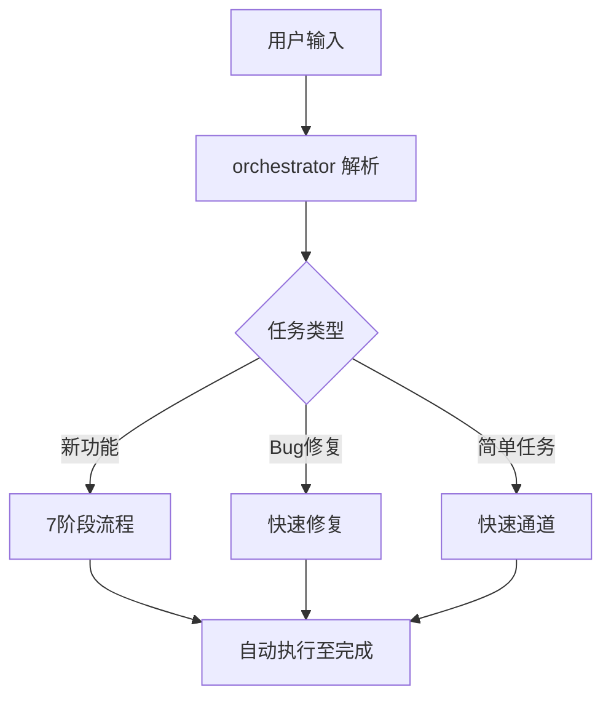

# 项目初始化指南

## 快速开始

### 方式一：一句话启动

直接向 Trae CN 输入：

```
开始项目：{项目描述}
```

示例：

- `开始项目：开发一个用户登录系统，支持邮箱注册和第三方登录`
- `开始项目：创建电商购物车功能，包含商品管理和结算`
- `开始项目：实现数据导出功能，支持Excel和PDF格式`

### 方式二：详细需求

```
开始项目：
- 项目名称：{名称}
- 核心功能：{功能列表}
- 技术栈：{可选，不填则自动选择}
- 目标用户：{可选}
```

---

## 自动化流程



---

## 命令参考

| 命令            | 说明             | 示例                     |
| --------------- | ---------------- | ------------------------ |
| `开始项目：...` | 启动完整开发流程 | `开始项目：用户管理系统` |
| `修复Bug：...`  | 启动快速修复流程 | `修复Bug：登录页面报错`  |
| `简单任务：...` | 启动快速通道     | `简单任务：更新README`   |
| `紧急修复：...` | 启动紧急流程     | `紧急修复：支付接口异常` |

---

## 自动执行阶段

### 完整7阶段（新功能）

| 阶段        | 专家                             | 自动执行 | 产出        |
| ----------- | -------------------------------- | -------- | ----------- |
| 1. 需求解析 | orchestrator                     | ✅       | 任务工单    |
| 2. 产品定义 | product-strategist → ux-engineer | ✅       | PRD、设计稿 |
| 3. 架构设计 | tech-architect                   | ✅       | 技术方案    |
| 4. 并行开发 | frontend + backend               | ✅       | 源代码      |
| 5. 质量保障 | quality-engineer                 | ✅       | 测试报告    |
| 6. 部署上线 | devops-engineer                  | ✅       | 线上服务    |
| 7. 闭环迭代 | retro-facilitator                | ✅       | 改进建议    |

### 质量门禁

| 检查项     | 阈值     | 自动处理 |
| ---------- | -------- | -------- |
| Lint检查   | 0 errors | 自动修复 |
| 类型检查   | 0 errors | 阻止提交 |
| 测试覆盖率 | ≥ 80%    | 返回开发 |
| 安全漏洞   | 0 高危   | 返回开发 |

---

## 项目结构

```
project/
├── .ai-team/              # AI团队工作区
│   ├── orchestrator/
│   │   └── task-board.json
│   └── shared-context/
├── docs/                  # 项目文档
│   ├── 01-requirements/
│   ├── 02-design/
│   └── 03-implementation/
├── src/                   # 源代码
│   ├── frontend/
│   └── backend/
└── tests/                 # 测试代码
```

---

## 示例：开发登录系统

**用户输入**：

```
开始项目：开发用户登录系统，支持邮箱注册、登录、找回密码
```

**自动执行**：

1. **orchestrator** 解析需求 → 创建任务工单
2. **product-strategist** 生成 PRD
3. **ux-engineer** 设计登录界面
4. **tech-architect** 设计技术方案
5. **frontend-specialist** 开发登录页面
6. **backend-specialist** 开发认证API
7. **quality-engineer** 执行测试
8. **devops-engineer** 部署服务
9. **retro-facilitator** 总结经验

**输出**：

- 完整的登录系统代码
- 测试用例和测试报告
- 部署的线上服务
- 项目文档

---

## 注意事项

1. **复杂项目**：建议分阶段执行，每阶段确认后再继续
2. **技术栈**：如无特殊要求，将自动选择最佳技术栈
3. **人工确认**：关键决策点会请求用户确认
4. **回滚机制**：部署失败自动回滚
