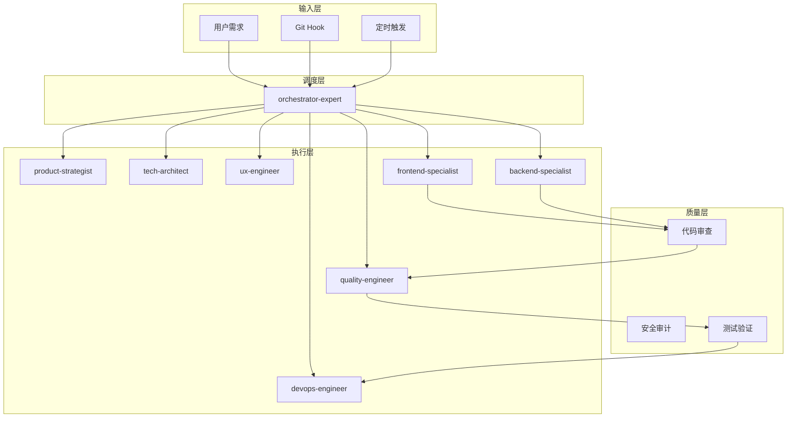
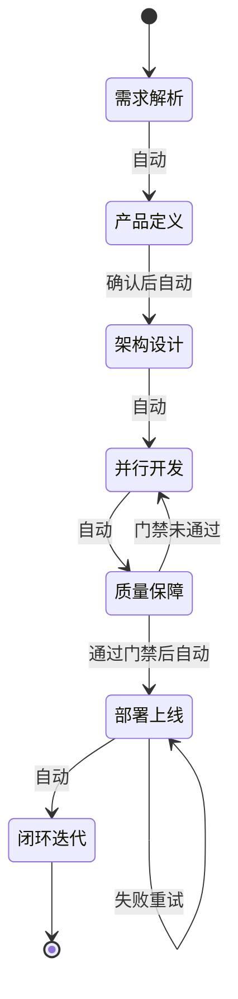
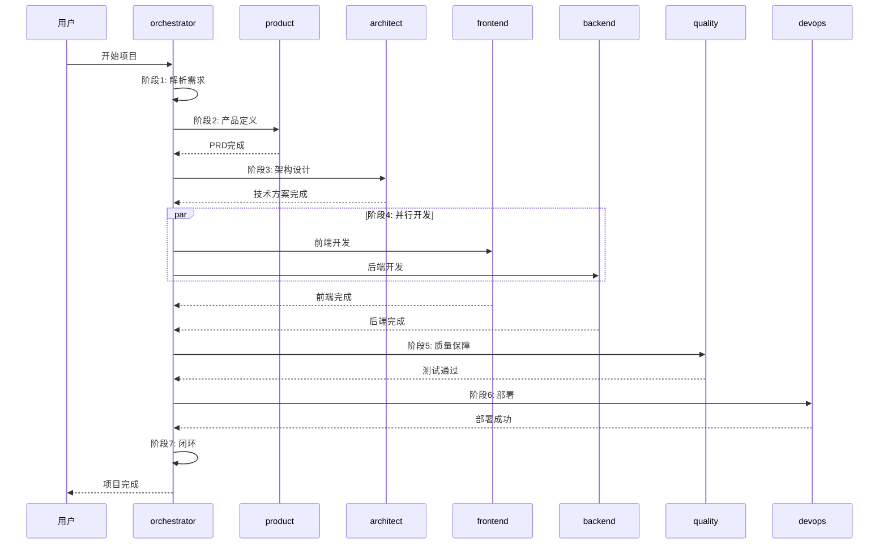

# Skills 驱动开发流程

## 核心理念

通过 Skills 本身驱动整个开发流程，无需额外自动化脚本。

---

## 驱动架构



---

## 自动触发机制

### 1. 用户需求触发

```
用户输入 → orchestrator-expert 自动激活 → 解析并调度
```

**触发关键词**：
- `开始项目` / `开发` / `实现` → 完整流程
- `修复` / `Bug` → 快速修复流程
- `更新` / `修改` → 快速通道
- `紧急` / `生产问题` → 紧急流程

### 2. Git Hook 触发

在 `.git/hooks/` 配置：

```bash
#!/bin/bash
# pre-push hook
# 推送前自动触发质量检查

echo "触发 AI 团队质量检查..."
# 通过 Trae CN API 触发 quality-engineer
```

### 3. 定时触发

在项目配置中设置：

```yaml
# .ai-team/config.yaml
automation:
  schedule:
    - cron: "0 9 * * *"    # 每天早上9点
      task: "daily-review"
      expert: "quality-engineer"
    - cron: "0 0 * * 0"    # 每周日
      task: "weekly-retro"
      expert: "retro-facilitator"
```

---

## 自动执行流程

### 阶段自动流转



### 质量门禁自动检查

| 门禁 | 检查命令 | 失败处理 |
|------|----------|----------|
| Lint | `npm run lint` | 自动修复后重试 |
| 类型 | `npm run typecheck` | 返回开发阶段 |
| 测试 | `npm run test` | 返回开发阶段 |
| 安全 | `npm audit` | 返回开发阶段 |
| 覆盖率 | `npm run coverage` | 返回开发阶段 |

---

## Skills 协作协议

### 输入输出规范

每个 Skill 遵循统一接口：

```typescript
interface SkillIO {
  input: {
    taskBoard: TaskBoard;      // 从 task-board.json 读取
    context: SharedContext;    // 从 shared-context/ 读取
    previousOutput?: any;      // 上一阶段输出
  };
  output: {
    artifacts: File[];         // 产出文件
    taskBoard: Partial<TaskBoard>;  // 状态更新
    nextSkill?: string;        // 建议下一专家
  };
}
```

### 状态同步

每个 Skill 完成后：

1. 更新 `task-board.json` 状态
2. 写入产出文件到对应目录
3. 通知 orchestrator-expert 进入下一阶段

---

## 完整示例

### 场景：开发用户管理模块

**Step 1: 用户输入**
```
开始项目：开发用户管理模块，包含用户CRUD、角色权限、操作日志
```

**Step 2: orchestrator-expert 自动执行**



**Step 3: 自动产出**

```
docs/
├── 01-requirements/
│   └── user-management-prd.md
├── 02-design/
│   ├── architecture.md
│   ├── api-design.md
│   └── database-schema.md
└── 03-implementation/
    ├── frontend-spec.md
    └── backend-spec.md

src/
├── frontend/
│   ├── components/UserManagement/
│   └── pages/users/
└── backend/
    ├── routes/users.ts
    ├── models/User.ts
    └── services/userService.ts

tests/
├── unit/
├── integration/
└── e2e/
```

---

## 配置文件

### 项目配置 `.ai-team/config.yaml`

```yaml
project:
  name: "user-management"
  version: "1.0.0"

automation:
  autoDeploy: true
  qualityGates:
    lint: true
    typeCheck: true
    testCoverage: 80
    securityAudit: true

  notifications:
    onComplete: true
    onFailure: true
    onBlocked: true

experts:
  product-strategist:
    autoConfirm: false  # 需要用户确认PRD
  tech-architect:
    autoConfirm: false  # 需要用户确认技术方案
  frontend-specialist:
    framework: "react"
  backend-specialist:
    framework: "express"
```

---

## 无人值守模式

### 启用条件

1. 所有质量门禁配置完成
2. 部署环境配置完成
3. 测试覆盖率达到要求
4. 安全审计通过

### 执行流程

```
需求输入 → 自动解析 → 自动开发 → 自动测试 → 自动部署 → 自动反馈
```

### 人工介入点

| 阶段 | 介入点 | 说明 |
|------|--------|------|
| 产品定义 | PRD确认 | 可配置跳过 |
| 架构设计 | 技术方案确认 | 可配置跳过 |
| 质量保障 | 测试失败 | 自动返回开发 |
| 部署上线 | 部署失败 | 自动回滚重试 |

---

## 最佳实践

1. **渐进式自动化**：从简单任务开始，逐步启用更多自动化
2. **门禁前置**：开发前配置好质量门禁
3. **文档同步**：每个阶段自动更新文档
4. **回滚机制**：部署失败自动回滚
5. **监控告警**：异常情况及时通知
