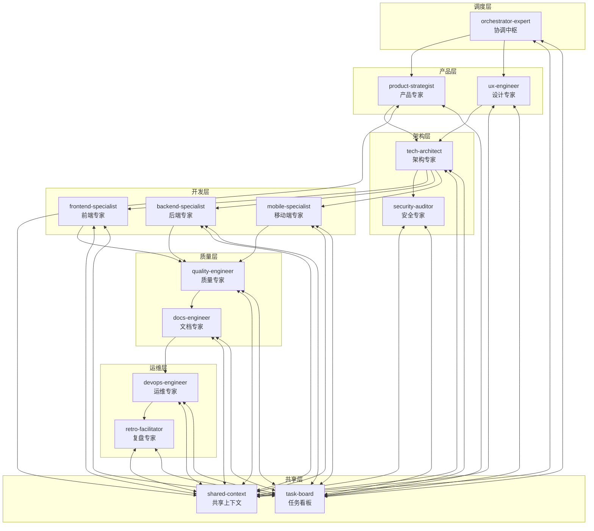
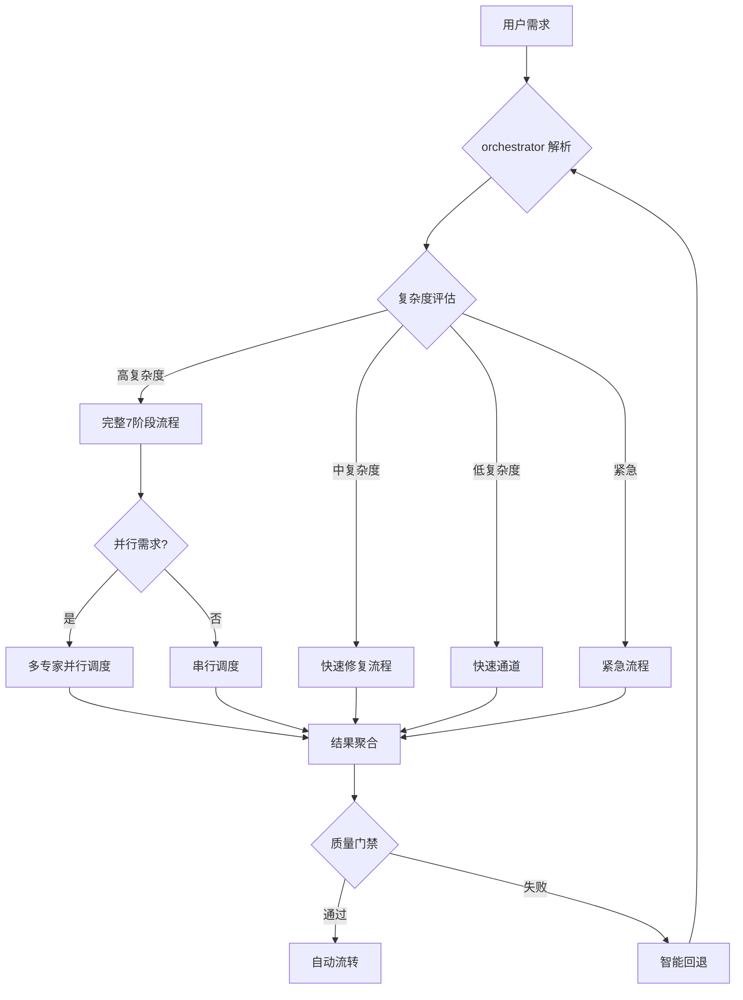
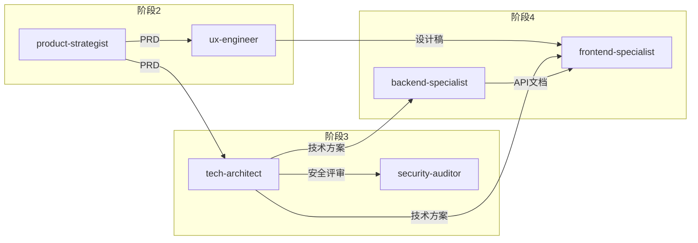
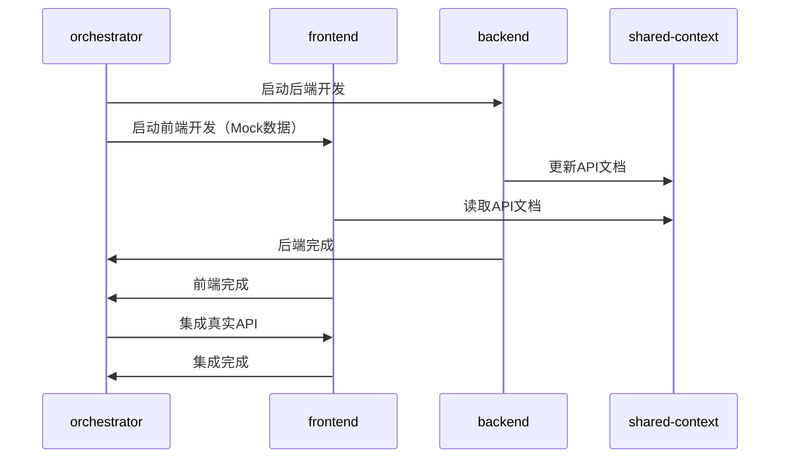
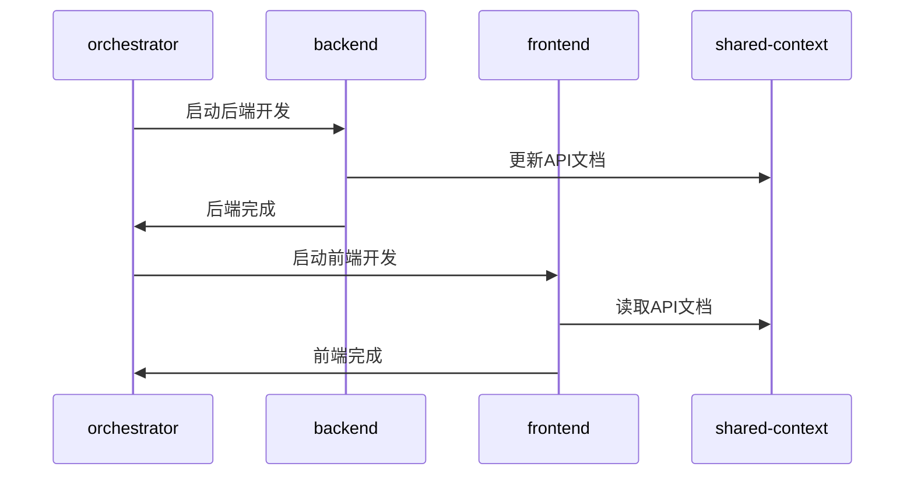
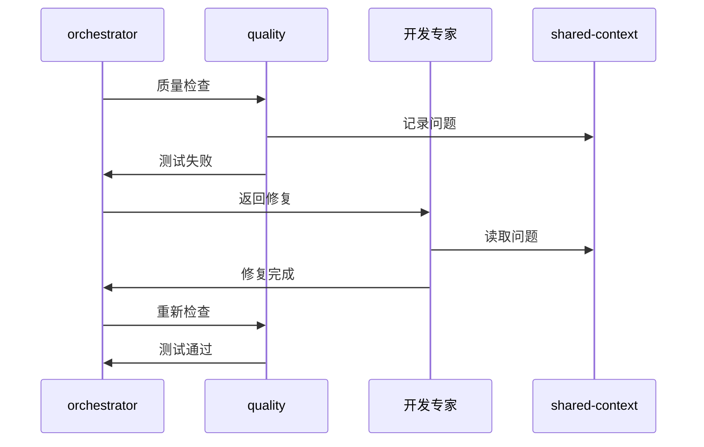
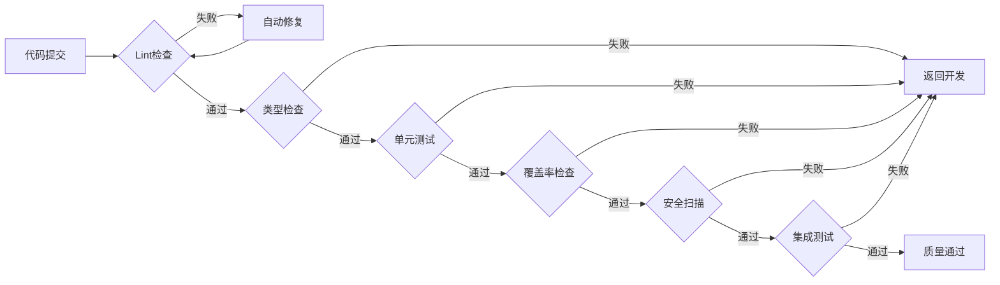
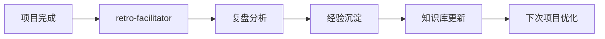

# AI专家团队智能协作指南

## 协作架构



---

## 智能调度机制

### 任务智能路由



### 智能决策引擎

| 决策点 | 条件 | 动作 |
|--------|------|------|
| 任务类型 | 包含"开发"/"实现" | 完整流程 |
| 任务类型 | 包含"修复"/"Bug" | 快速修复 |
| 任务类型 | 包含"更新"/"修改" | 快速通道 |
| 任务类型 | 包含"紧急"/"生产" | 紧急流程 |
| 并行需求 | 前后端都有 | 并行调度 |
| 质量门禁 | 测试覆盖率 < 80% | 返回开发 |
| 质量门禁 | 安全漏洞 > 0 | 返回开发 |
| 部署失败 | 重试次数 < 3 | 自动重试 |
| 部署失败 | 重试次数 >= 3 | 人工介入 |

---

## 专家协作协议

### 消息传递

```typescript
interface ExpertMessage {
  id: string;
  timestamp: string;
  type: 'request' | 'response' | 'notification' | 'error';
  priority: 'critical' | 'high' | 'medium' | 'low';
  
  sender: {
    expert: string;
    phase: string;
    status: 'available' | 'busy' | 'blocked' | 'completed';
  };
  
  receiver: {
    expert: string;
    action: 'start' | 'continue' | 'pause' | 'complete' | 'error';
  };
  
  payload: {
    taskId: string;
    input: ExpertInput;
    output: ExpertOutput;
    context: ProjectContext;
  };
}
```

### 状态同步

每个专家完成后必须：

1. **更新任务看板** → `task-board.json`
2. **同步共享上下文** → `shared-context/project-context.json`
3. **通知协调中枢** → 发送消息给 `orchestrator-expert`

### 依赖管理



---

## 智能协作模式

### 模式1：并行开发

**触发条件**：前后端都需要开发



### 模式2：串行依赖

**触发条件**：后端API需要先完成



### 模式3：迭代反馈

**触发条件**：质量门禁未通过



---

## 质量门禁链



### 门禁配置

| 门禁 | 命令 | 阈值 | 自动处理 |
|------|------|------|----------|
| Lint | `npm run lint` | 0 errors | 自动修复 |
| 类型 | `npm run typecheck` | 0 errors | 返回开发 |
| 单元测试 | `npm run test` | 100% pass | 返回开发 |
| 覆盖率 | `npm run coverage` | ≥ 80% | 返回开发 |
| 安全 | `npm audit` | 0 high | 返回开发 |
| 集成测试 | `npm run test:integration` | 100% pass | 返回开发 |

---

## 异常处理

### 自动恢复

| 异常 | 检测方式 | 自动恢复 |
|------|----------|----------|
| Lint错误 | 构建失败 | 自动修复后重试 |
| 测试失败 | 测试报告 | 返回开发阶段 |
| 部署失败 | 健康检查 | 自动回滚 |
| 依赖缺失 | 启动错误 | 自动安装 |

### 升级机制

| 级别 | 条件 | 处理 |
|------|------|------|
| 自动处理 | 重试次数 < 3 | 自动重试 |
| 人工介入 | 重试次数 >= 3 | 通知用户 |
| 紧急停止 | 阻塞 > 30分钟 | 暂停流程 |

---

## 知识沉淀

### 自动记录

每个阶段完成后自动记录：

1. **决策记录** → `.ai-team/orchestrator/decision-registry/ADR-*.md`
2. **工作日志** → `.ai-team/orchestrator/workflow-log.md`
3. **经验沉淀** → `.ai-team/shared-context/knowledge-graph.md`

### 反馈闭环



---

## 最佳实践

### 1. 渐进式自动化

```
手动确认 → 半自动 → 全自动
```

| 阶段 | 人工介入点 | 自动化程度 |
|------|------------|------------|
| 初期 | PRD、架构确认 | 30% |
| 中期 | 关键决策 | 60% |
| 成熟 | 异常处理 | 90% |

### 2. 上下文传递

每个专家接收任务时自动获取：

- 项目背景和目标
- 前序阶段产出
- 技术决策记录
- 已知约束和风险

### 3. 智能重试

```
失败 → 分析原因 → 智能修复 → 重试 → 成功
```

### 4. 并行优化

- 独立任务并行执行
- 依赖任务智能排序
- 资源冲突自动协调
