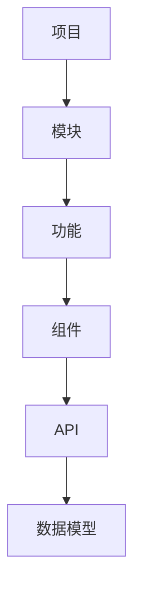
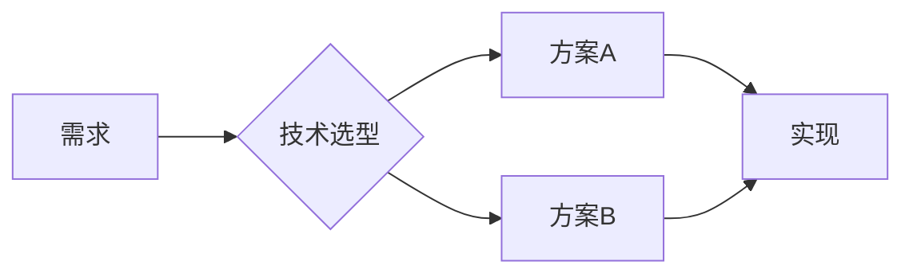

# 知识图谱

> 项目知识网络，记录实体关系和关键概念

## 概念定义

| 概念 | 定义 | 相关概念 |
| ---- | ---- | -------- |
| -    | -    | -        |

## 实体关系

```mermaid
graph TD
    A[项目] --> B[模块]
    B --> C[功能]
    C --> D[组件]
    D --> E[API]
    E --> F[数据模型]
```

## 领域模型

_待补充_

## 技术决策链

```mermaid
flowchart LR
    A[需求] --> B{技术选型}
    B --> C[方案A]
    B --> D[方案B]
    C --> E[实现]
    D --> E
```

## 依赖关系图

_待补充_
