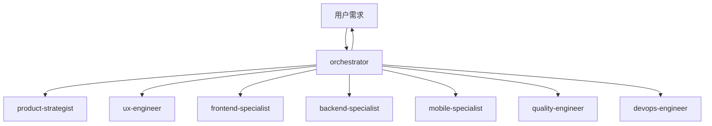

# Trae Workflow

> **专为个人开发者设计** - AI 编码助手配置，基于 Skills-Rules 双层架构

---

## 目录

- [核心特性](#核心特性)
- [快速开始](#快速开始)
- [系统要求](#系统要求)
- [架构设计](#架构设计)
- [专家团队](#专家团队)
- [技能分类](#技能分类)
- [用户规则](#用户规则)
- [工作流程](#工作流程)
- [项目结构](#项目结构)
- [GitHub 上传](#github-上传)
- [卸载](#卸载)
- [故障排除](#故障排除)

---

## 核心特性

| 技能 | 规则     | 模板 | 架构     |
| ---- | -------- | ---- | -------- |
| 58+  | 完整体系 | 30+  | 三层架构 |

**三层架构**：`Orchestrator (调度) → Skills (执行) → Rules (约束)`

---

## 快速开始

### 方式一：安装脚本（推荐）

**Windows:**

```powershell
.\setup.ps1
```

**Linux/macOS:**

```bash
chmod +x setup.sh && ./setup.sh
```

### 方式二：CLI 工具

```bash
npm install -g trae-workflow-cli
traew install
```

### 方式三：手动安装

```bash
# 1. 克隆项目
git clone <repository-url> && cd "Trae Workflow"

# 2. 复制配置（Linux/macOS）
mkdir -p ~/.trae-cn/{skills,user_rules}
cp -r skills/* ~/.trae-cn/skills/
cp -r user_rules/* ~/.trae-cn/user_rules/

# 2. 复制配置（Windows PowerShell）
New-Item -ItemType Directory -Force -Path "$env:USERPROFILE\.trae-cn\skills"
New-Item -ItemType Directory -Force -Path "$env:USERPROFILE\.trae-cn\user_rules"
Copy-Item -Path "skills\*" -Destination "$env:USERPROFILE\.trae-cn\skills" -Recurse -Force
Copy-Item -Path "user_rules\*" -Destination "$env:USERPROFILE\.trae-cn\user_rules" -Recurse -Force
```

### 安装参数

| 参数            | 说明             |
| --------------- | ---------------- |
| `--backup`      | 备份现有配置     |
| `--skip-skills` | 跳过 Skills 配置 |
| `--skip-rules`  | 跳过 Rules 配置  |
| `--quiet`       | 静默模式         |
| `--force`       | 强制执行         |

### 验证安装

```bash
# 检查目录
ls ~/.trae-cn/skills  # Linux/macOS
dir $env:USERPROFILE\.trae-cn\skills  # Windows

# 重启 Trae IDE 后测试
# - orchestrator - 开始新项目
# - tdd-patterns - TDD 工作流
# - quality-engineer - 代码审查
```

---

## 系统要求

| 软件     | 版本     |
| -------- | -------- |
| Trae IDE | 最新版本 |
| Node.js  | 18.0+    |
| Git      | 2.0+     |

---

## 架构设计

```
~/.trae-cn/
├── skills/                    # 技能目录（58+ 技能）
│   ├── orchestrator/          # 协调中枢
│   ├── product-strategist/    # 产品战略
│   ├── frontend-specialist/   # 前端开发
│   └── ...
└── user_rules/                # 用户规则目录
    ├── core-principles.md     # 核心原则
    ├── coding-style.md        # 代码规范
    └── ...
```

| 层级             | 角色 | 职责                         |
| ---------------- | ---- | ---------------------------- |
| **Orchestrator** | 调度 | 解析需求、编排任务、调用技能 |
| **Skills**       | 执行 | 如何完成特定动作             |
| **Rules**        | 约束 | 什么能做，什么不能做         |

---

## 专家团队

### 协调中枢

**orchestrator** - 智能中枢，负责任务分解、资源调度、进度同步



### 专家分工

| 类型     | 专家                                                                      | 职责                           |
| -------- | ------------------------------------------------------------------------- | ------------------------------ |
| **产品** | product-strategist, ux-engineer                                           | 需求分析、MVP 定义、UI/UX 设计 |
| **开发** | frontend-specialist, backend-specialist, mobile-specialist, data-engineer | 前端、后端、移动端、数据管道   |
| **质量** | quality-engineer, security-auditor, docs-engineer                         | 测试、安全、文档               |
| **运维** | devops-engineer, retro-facilitator                                        | CI/CD、复盘总结                |
| **架构** | tech-architect                                                            | 技术选型、架构设计             |

---

## 技能分类

### 前端 & UI

`tailwind-patterns` `a11y-patterns` `i18n-patterns` `vue-patterns` `react-patterns` `nextjs-patterns`

### 后端 & API

`rest-patterns` `graphql-patterns` `express-patterns` `fastapi-patterns` `django-patterns` `python-patterns` `golang-patterns` `rust-patterns`

### 移动端

`ios-native-patterns` `android-native-patterns` `react-native-patterns` `mini-program-patterns`

### 桌面端

`electron-patterns` `tauri-patterns`

### 支付集成

`stripe-patterns` `alipay-patterns` `wechatpay-patterns` `paypal-patterns`

### 数据 & 缓存

`postgres-patterns` `mongodb-patterns` `clickhouse-io` `redis-patterns` `caching-patterns`

### 消息 & 实时

`message-queue-patterns` `realtime-websocket` `webrtc-patterns`

### 架构 & 工程

`clean-architecture` `ddd-patterns` `cqrs-patterns` `circuit-breaker` `monorepo-patterns`

### 开发工具

`git-workflow` `docker-patterns` `deployment-patterns` `tdd-workflow` `e2e-testing` `database-migrations`

### 基础设施

`background-jobs` `file-storage-patterns` `email-patterns` `rate-limiting` `logging-observability`

### 其他

`feature-flags` `security-review` `error-handling-patterns` `skill-creator` `analytics-tracking`

---

## 用户规则

| 规则文件                  | 说明                           |
| ------------------------- | ------------------------------ |
| `core-principles.md`      | 智能体优先、测试驱动、安全第一 |
| `coding-style.md`         | 命名、格式、文件组织           |
| `development-workflow.md` | 规划、TDD、审查、提交          |
| `testing.md`              | 覆盖率、TDD 流程               |
| `security.md`             | 密钥管理、输入验证             |
| `git-workflow.md`         | 提交格式、分支策略             |
| `patterns.md`             | API 响应、仓储模式             |

---

## 工作流程

### 7 阶段流程


| 阶段        | 专家               | 产出        |
| ----------- | ------------------ | ----------- |
| 1. 需求解析 | orchestrator       | 任务工单    |
| 2. 产品定义 | product-strategist | PRD、设计稿 |
| 3. 架构设计 | tech-architect     | 技术方案    |
| 4. 并行开发 | frontend + backend | 源代码      |
| 5. 质量保障 | quality-engineer   | 测试报告    |
| 6. 部署上线 | devops-engineer    | 线上服务    |
| 7. 闭环迭代 | retro-facilitator  | 改进建议    |

---

## 项目结构

```
Trae Workflow/
├── skills/                    # 58+ 技能
├── templates/                 # 30+ 模板
├── user_rules/                # 用户规则
├── cli/                       # CLI 工具
├── setup.ps1                  # Windows 安装脚本
├── setup.sh                   # Linux/macOS 安装脚本
└── README.md                  # 项目文档
```

### 模板目录

```
templates/
├── orchestrator/              # 任务看板、通信协议
├── product-strategist/        # PRD、用户故事
├── tech-architect/            # 架构设计、ADR
├── frontend-specialist/       # 组件模板
├── backend-specialist/        # API 模板
├── quality-engineer/          # 测试报告
└── ...
```

---

## GitHub 上传

```bash
# 1. 创建仓库（GitHub 网页操作）

# 2. 配置 Git
git config --global user.name "你的用户名"
git config --global user.email "你的邮箱"

# 3. 初始化并推送
git init
git add .
git commit -m "feat: initial commit"
git remote add origin https://github.com/YOUR_USERNAME/Trae-Workflow.git
git branch -M main
git push -u origin main

# 4. 后续更新
git add . && git commit -m "feat: update" && git push
```

---

## 卸载

**Windows:**

```powershell
Remove-Item "$env:USERPROFILE\.trae-cn\skills" -Recurse -Force
Remove-Item "$env:USERPROFILE\.trae-cn\user_rules" -Recurse -Force
```

**Linux/macOS:**

```bash
rm -rf ~/.trae-cn/skills ~/.trae-cn/user_rules
```

---

## 故障排除

| 问题             | 解决方案                                                                                           |
| ---------------- | -------------------------------------------------------------------------------------------------- |
| **脚本无法运行** | Windows: `Set-ExecutionPolicy RemoteSigned -Scope CurrentUser`<br>Linux/macOS: `chmod +x setup.sh` |
| **技能无法使用** | 检查 `~/.trae-cn/skills` 目录和 `SKILL.md` 文件，重启 Trae IDE                                     |
| **规则未加载**   | 检查规则文件路径和格式，重启 Trae IDE                                                              |
| **配置未生效**   | 重启 Trae IDE，清除缓存                                                                            |
| **推送需认证**   | 使用 GitHub Personal Access Token                                                                  |

---

## 许可证

MIT License
