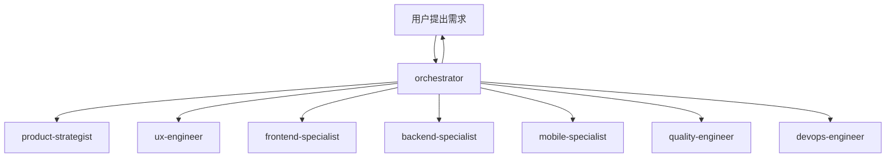

# Trae Workflow

> **专为个人开发者设计** - AI 编码助手配置，基于 Skills-Rules 双层架构

---

## 核心数字

| 技能 | 规则     | 模板 |
| ---- | -------- | ---- |
| 58+  | 完整体系 | 30+  |

---

## 架构分层

```
Orchestrator (调度) → Skills (执行) → Rules (约束)
```

| 层级             | 角色     | 关注点                       |
| ---------------- | -------- | ---------------------------- |
| **Orchestrator** | 任务调度 | 解析需求、编排任务、调用技能 |
| **Skills**       | 原子能力 | 如何完成特定动作             |
| **Rules**        | 行为规范 | 什么能做，什么不能做         |

---

## 协调中枢专家

**orchestrator** - 团队的智能中枢，负责任务分解、资源调度、进度同步与风险协调



---

## 快速开始

```bash
# 安装 CLI
npm install -g trae-workflow-cli

# 安装配置
traew install

# 更新
traew update
```

---

## 专家团队

### 产品 & 设计

| 专家                   | 说明                         |
| ---------------------- | ---------------------------- |
| **orchestrator**       | 协调中枢，任务调度           |
| **product-strategist** | 产品规划、需求分析、MVP 定义 |
| **ux-engineer**        | UI/UX 设计模式               |

### 开发专家

| 专家                    | 说明                     |
| ----------------------- | ------------------------ |
| **frontend-specialist** | 前端开发、React、Next.js |
| **backend-specialist**  | 后端开发、API 设计       |
| **mobile-specialist**   | 移动端开发、跨平台       |
| **data-engineer**       | 数据管道、ETL            |

### 质量 & 运维

| 专家                  | 说明               |
| --------------------- | ------------------ |
| **quality-engineer**  | 测试策略、质量保障 |
| **devops-engineer**   | CI/CD、部署、监控  |
| **security-auditor**  | 安全审计、漏洞扫描 |
| **docs-engineer**     | 文档编写           |
| **retro-facilitator** | 复盘总结           |

### 技术架构

| 专家               | 说明               |
| ------------------ | ------------------ |
| **tech-architect** | 技术选型、架构设计 |

---

## 技能速览

### 前端 & UI

| 技能                  | 说明                |
| --------------------- | ------------------- |
| **tailwind-patterns** | Tailwind CSS 原子化 |
| **a11y-patterns**     | 无障碍设计、WCAG    |
| **i18n-patterns**     | 国际化              |

### 后端 & API

| 技能                 | 说明              |
| -------------------- | ----------------- |
| **rest-patterns**    | REST API 设计     |
| **graphql-patterns** | GraphQL Schema    |
| **express-dev**      | Node.js + Express |
| **fastapi-dev**      | FastAPI 异步      |
| **python-dev**       | Python 后端       |

### 移动端

| 技能                   | 说明              |
| ---------------------- | ----------------- |
| **ios-native-dev**     | iOS Swift/SwiftUI |
| **android-native-dev** | Android Kotlin    |
| **react-native-dev**   | React Native      |
| **mini-program-dev**   | 微信小程序        |

### 桌面端

| 技能             | 说明              |
| ---------------- | ----------------- |
| **electron-dev** | Electron 桌面应用 |

### 支付集成

| 技能                   | 说明         |
| ---------------------- | ------------ |
| **payment-patterns**   | 统一支付接口 |
| **stripe-patterns**    | Stripe 支付  |
| **alipay-patterns**    | 支付宝支付   |
| **wechatpay-patterns** | 微信支付     |
| **paypal-patterns**    | PayPal 支付  |

### 消息 & 集成

| 技能                       | 说明               |
| -------------------------- | ------------------ |
| **kafka-patterns**         | Kafka 分布式消息   |
| **rabbitmq-patterns**      | RabbitMQ 消息队列  |
| **message-queue-patterns** | 消息队列模式       |
| **websocket-patterns**     | WebSocket 实时通信 |

### 数据 & 缓存

| 技能                        | 说明                  |
| --------------------------- | --------------------- |
| **cache-strategy-patterns** | 多级缓存策略          |
| **redis-patterns**          | Redis 数据结构        |
| **postgres-patterns**       | PostgreSQL 优化       |
| **clickhouse-patterns**     | ClickHouse 分析数据库 |
| **mongodb-patterns**        | MongoDB 文档数据库    |
| **database-dev**            | 数据库开发模式        |

### 架构 & 工程

| 技能                         | 说明              |
| ---------------------------- | ----------------- |
| **clean-architecture**       | 整洁架构          |
| **cqrs-patterns**            | CQRS 命令查询分离 |
| **ddd-patterns**             | 领域驱动设计      |
| **circuit-breaker-patterns** | 熔断器模式        |
| **microservice-patterns**    | 微服务模式        |
| **serverless-patterns**      | 无服务器模式      |

### 开发工具

| 技能                  | 说明                |
| --------------------- | ------------------- |
| **git-patterns**      | Git 版本控制        |
| **docker-patterns**   | Docker 容器化       |
| **devops-patterns**   | 部署流水线          |
| **tdd-patterns**      | 测试驱动开发        |
| **e2e-test-patterns** | Playwright E2E 测试 |
| **coding-standards**  | 代码规范            |

### 基础设施

| 技能                               | 说明           |
| ---------------------------------- | -------------- |
| **tasks-patterns**                 | 后台任务队列   |
| **file-storage-patterns**          | 文件存储       |
| **email-patterns**                 | 邮件服务       |
| **rate-limiting-patterns**         | 限流模式       |
| **logging-observability-patterns** | 日志与可观测性 |

### 其他

| 技能                       | 说明           |
| -------------------------- | -------------- |
| **feature-flags-patterns** | 功能开关       |
| **auth-patterns**          | 认证授权       |
| **llm-patterns**           | LLM 应用模式   |
| **ml-patterns**            | 机器学习模式   |
| **etl-patterns**           | ETL 数据处理   |
| **contract-test-patterns** | 契约测试       |
| **skill-creator**          | Skill 创建指南 |

---

## 项目结构

```
Trae Workflow/
├── skills/                    # 58+ 技能
│   ├── orchestrator/          # 协调中枢
│   ├── product-strategist/    # 产品战略
│   ├── ux-engineer/           # 体验工程
│   ├── frontend-specialist/   # 前端开发
│   ├── backend-specialist/    # 后端开发
│   ├── mobile-specialist/     # 移动端开发
│   ├── quality-engineer/      # 质量工程
│   ├── devops-engineer/       # 运维工程
│   └── ...                    # 其他技能
├── templates/                 # 模板文件
│   ├── orchestrator/          # 协调中枢模板
│   ├── product-strategist/    # 产品模板
│   ├── tech-architect/        # 架构模板
│   └── ...                    # 其他模板
├── context/                   # 上下文配置
│   └── message-protocol.json  # 专家通信协议
├── user_rules/                # 用户规则
│   ├── core-principles.md     # 核心原则
│   ├── coding-style.md        # 代码规范
│   ├── testing.md             # 测试规范
│   └── ...                    # 其他规则
├── cli/                       # CLI 工具
│   ├── bin/                   # 可执行文件
│   └── lib/                   # 库文件
├── setup.ps1                  # Windows 安装脚本
├── setup.sh                   # Linux/macOS 安装脚本
└── package.json               # 项目配置
```

---

## 模板文件

模板统一存放在 `templates/` 目录，按专家名称分类：

```
templates/
├── orchestrator/              # 任务看板、通信协议、项目上下文
├── product-strategist/        # PRD、用户故事、MVP定义
├── tech-architect/            # 架构设计、技术选型、ADR
├── frontend-specialist/       # 组件模板、页面模板
├── backend-specialist/        # API模板、服务模板
├── mobile-specialist/         # 移动端模板
├── ux-engineer/               # 设计系统、交互设计
├── quality-engineer/          # 测试报告、质量报告
├── devops-engineer/           # 部署模板、监控模板
├── security-auditor/          # 安全审计报告
├── docs-engineer/             # 文档模板
└── retro-facilitator/         # 复盘报告、进度文档
```

---

## 用户规则

用户规则定义了开发过程中的行为规范：

| 规则文件                  | 说明                                     |
| ------------------------- | ---------------------------------------- |
| `core-principles.md`      | 核心原则：智能体优先、测试驱动、安全第一 |
| `coding-style.md`         | 代码规范：命名、格式、文件组织           |
| `development-workflow.md` | 开发工作流：规划、TDD、审查、提交        |
| `testing.md`              | 测试规范：覆盖率、TDD流程                |
| `security.md`             | 安全规范：密钥管理、输入验证             |
| `git-workflow.md`         | Git规范：提交格式、分支策略              |
| `patterns.md`             | 架构模式：API响应、仓储模式              |

---

## 7阶段工作流


| 阶段        | 专家               | 产出        |
| ----------- | ------------------ | ----------- |
| 1. 需求解析 | orchestrator       | 任务工单    |
| 2. 产品定义 | product-strategist | PRD、设计稿 |
| 3. 架构设计 | tech-architect     | 技术方案    |
| 4. 并行开发 | frontend + backend | 源代码      |
| 5. 质量保障 | quality-engineer   | 测试报告    |
| 6. 部署上线 | devops-engineer    | 线上服务    |
| 7. 闭环迭代 | retro-facilitator  | 改进建议    |

---

## 许可证

MIT License
