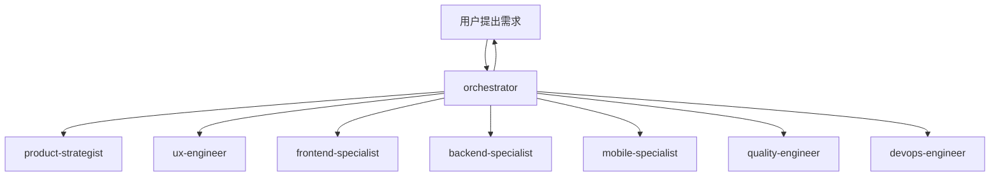

# Trae Workflow

> **专为个人开发者设计** - AI 编码助手配置，基于 MCP-Skills-Rules 三层架构

---

## 🎯 核心数字

| 智能体 | 技能 | 规则     |
| ------ | ---- | -------- |
| 1      | 70+  | 完整体系 |

---

## 🏗️ 架构分层

```
Orchestrator (调度) → Skills (执行) → Rules (约束) → MCP (连接)
```

| 层级             | 角色     | 关注点                       |
| ---------------- | -------- | ---------------------------- |
| **Orchestrator** | 任务调度 | 解析需求、编排任务、调用技能 |
| **Skills**       | 原子能力 | 如何完成特定动作             |
| **Rules**        | 行为规范 | 什么能做，什么不能做         |
| **MCP**          | 通信协议 | 如何连接和交换数据           |

---

## 🎛️ 协调中枢专家

**orchestrator** - 团队的智能中枢，负责任务分解、资源调度、进度同步与风险协调



---

## 🚀 快速开始

```bash
# 安装 CLI
npm install -g trae-workflow-cli

# 安装配置
traew install

# 更新
traew update
```

---

## 📚 技能速览

### 产品 & 设计

- **product-strategist** - 产品规划、需求分析、MVP 定义
- **ux-engineer** - UI/UX 设计模式

### 前端 & UI

- **frontend-specialist** - React、Next.js、状态管理
- **tailwind-patterns** - Tailwind CSS 原子化
- **a11y-patterns** - 无障碍设计、WCAG

### 后端 & API

- **backend-specialist** - 后端架构模式
- **rest-patterns** - REST API 设计
- **graphql-patterns** - GraphQL Schema
- **express-dev** - Node.js + Express
- **fastapi-dev** - FastAPI 异步
- **python-dev** - Python 后端

### 移动端

- **mobile-specialist** - 移动端统一入口
- **ios-native-dev** - iOS Swift/SwiftUI
- **android-native-dev** - Android Kotlin
- **react-native-dev** - React Native
- **mini-program-dev** - 微信小程序

### 桌面端

- **electron-dev** - Electron 桌面应用

### 支付集成

- **payment-patterns** - 统一支付接口
- **stripe-patterns** - Stripe 支付集成
- **alipay-patterns** - 支付宝支付集成
- **wechatpay-patterns** - 微信支付集成
- **douyinpay-patterns** - 抖音支付集成
- **paypal-patterns** - PayPal 支付集成

### 消息 & 集成

- **kafka-patterns** - Kafka 分布式消息
- **rabbitmq-patterns** - RabbitMQ 消息队列
- **message-queue-patterns** - 消息队列模式

### 性能 & 缓存

- **cache-strategy-patterns** - 多级缓存策略
- **redis-patterns** - Redis 数据结构
- **postgres-patterns** - PostgreSQL 优化
- **clickhouse-patterns** - ClickHouse 分析数据库
- **mongodb-patterns** - MongoDB 文档数据库
- **database-dev** - 数据库开发模式
- **logging-observability-patterns** - 日志与可观测性

### 架构 & 工程

- **clean-architecture** - 整洁架构
- **cqrs-patterns** - CQRS 命令查询分离
- **ddd-patterns** - 领域驱动设计
- **circuit-breaker-patterns** - 熔断器模式

### 开发工具

- **git-patterns** - Git 版本控制
- **docker-patterns** - Docker 容器化
- **devops-patterns** - 部署流水线
- **tdd-patterns** - 测试驱动开发
- **e2e-test-patterns** - Playwright E2E 测试
- **coding-standards** - 代码规范

### 质量 & 平台

- **quality-engineer** - 质量保障与验证流程
- **devops-engineer** - 架构、CI/CD、监控、安全
- **security-auditor** - 安全最佳实践
- **rate-limiting-patterns** - 限流模式

### 专项技术

- **performance-specialist** - 技术专项入口
- **tech-selection-patterns** - 技术选型指南
- **feature-flags-patterns** - 功能开关

### 实时 & 通信

- **websocket-patterns** - WebSocket 实时通信

### 基础设施

- **tasks-patterns** - 后台任务队列
- **file-storage-patterns** - 文件存储
- **email-patterns** - 邮件服务
- **i18n-patterns** - 国际化

### 其他

- **retro-facilitator** - 复盘与改进
- **docs-engineer** - 文档编写
- **skill-creator** - Skill 创建指南
- **vercel-react-best-practices** - Vercel React 最佳实践

---

## 📁 项目结构

```

Trae-Workflow/
├── skills/ # 70+ 技能
│   ├── orchestrator/  # 协调中枢
│   ├── product-strategist/   # 产品战略
│   ├── ux-engineer/    # 体验工程
│   ├── frontend-specialist/ # 前端开发
│   ├── backend-specialist/   # 后端开发
│   ├── mobile-specialist/    # 移动端开发
│   ├── quality-engineer/   # 质量工程
│   ├── devops-engineer/  # 运维工程
│   └── **/              # 其他模式
├── project_rules/ # 项目规则
├── user_rules/    # 用户规则
```
