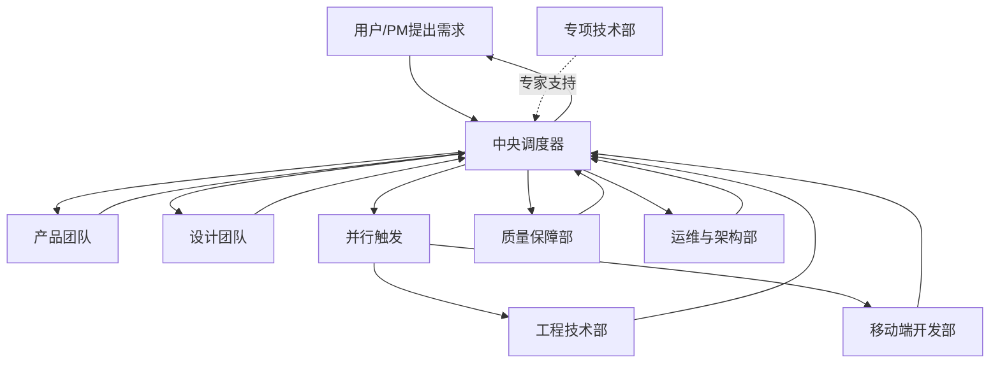

# Trae Workflow

> **专为个人开发者设计** - AI 编码助手配置，基于 MCP-Rules-Skills-Agents 四层架构

---

## 🎯 核心数字

| 智能体 | 技能 | 规则     |
| ------ | ---- | -------- |
| 7      | 62+  | 完整体系 |

---

## 🏗️ 架构分层

```
Agents (决策) → Skills (执行) → Rules (约束) → MCP (连接)
```

| 层级       | 角色       | 关注点                       |
| ---------- | ---------- | ---------------------------- |
| **Agents** | 自主执行体 | 为何做、何时做、按什么顺序做 |
| **Skills** | 原子能力   | 如何完成特定动作             |
| **Rules**  | 行为规范   | 什么能做，什么不能做         |
| **MCP**    | 通信协议   | 如何连接和交换数据           |

---

## 🎛️ 中央调度器

**orchestrator** - 解析用户需求，按顺序调用或并行触发相应的智能体部门



---

## 🚀 快速开始

```bash
# 安装 CLI
npm install -g trae-workflow-cli

# 安装配置
traew install

# 更新
traew update
```

---

## 🤖 部门结构

### 1. 产品团队

**product-team** - 定义"做什么"——产品规划、需求分析、MVP 定义

### 2. 设计团队

**design-team** - 定义"做成什么样"——交互设计、视觉设计、设计系统

### 3. 工程技术部

**engineering-team** - 负责产品的"构建与实现"

| 整合来源                                  | 核心职责                                         |
| ----------------------------------------- | ------------------------------------------------ |
| 后端开发 + 前端开发 + 集成团队 + 文档团队 | 后端开发、前端开发、API 设计、集成开发、技术文档 |

### 4. 质量保障部

**quality-team** - 负责产品的"质量保障与卓越工程"

| 整合来源            | 核心职责                                 |
| ------------------- | ---------------------------------------- |
| 测试团队 + 审查团队 | 测试策略、自动化测试、代码审查、安全检查 |

### 5. 运维与架构部

**platform-team** - 负责系统的"稳定、安全与高效"

| 整合来源                       | 核心职责                                              |
| ------------------------------ | ----------------------------------------------------- |
| 运维团队 + 安全团队 + 性能团队 | 技术架构、CI/CD、容器化、监控告警、安全策略、性能优化 |

### 6. 移动端开发部

**mobile-team** - 负责移动端产品的"原生体验与交付"

| 整合来源       | 核心职责                           |
| -------------- | ---------------------------------- |
| 移动端开发团队 | iOS/Android/跨端框架开发、应用优化 |

### 7. 专项技术部

**specialized-team** - 负责"前瞻性技术探索与复杂专项攻坚"

| 整合来源                           | 核心职责                                                 |
| ---------------------------------- | -------------------------------------------------------- |
| 从原规划、集成、性能团队中抽取专家 | 技术可行性研究、架构迁移、核心算法优化、重大性能瓶颈攻克 |

---

### 部门速览

| 部门         | Agent              | 触发场景                            |
| ------------ | ------------------ | ----------------------------------- |
| 中央调度器   | `orchestrator`     | 用户需求解析、流程编排、任务调度    |
| 产品团队     | `product-team`     | 产品规划、需求分析、MVP             |
| 设计团队     | `design-team`      | 交互设计、视觉设计、原型            |
| 工程技术部   | `engineering-team` | 后端开发、前端开发、API 集成、文档  |
| 质量保障部   | `quality-team`     | 测试、代码审查、质量验证            |
| 运维与架构部 | `platform-team`    | 架构设计、CI/CD、监控安全、性能优化 |
| 移动端开发部 | `mobile-team`      | iOS、Android、React Native          |
| 专项技术部   | `specialized-team` | 架构迁移、性能瓶颈、技术可行性      |

---

### 协作流程

```
用户需求 → 中央调度器（解析+编排）
                ↓
        产品团队 → 需求文档
                ↓
        设计团队 → 交互原型 + 视觉稿
                ↓
        工程技术部 / 移动端开发部（并行）
                ↓
        质量保障部 → 测试 + 代码审查
                ↓
        运维与架构部 → CI/CD + 部署 + 监控
                ↓
        专项技术部 → 复杂问题攻坚（如需）
                ↓
        中央调度器 → 验收 + 反馈
```

---

## 📚 技能速览

### 前端 & UI

- **frontend-patterns** - React、Next.js、状态管理
- **vue-patterns** - Vue 3 组合式 API
- **tailwind-patterns** - Tailwind CSS 原子化
- **design-patterns** - UI/UX 设计模式
- **a11y-patterns** - 无障碍设计、WCAG

### 后端 & API

- **backend-patterns** - 后端架构模式
- **rest-patterns** - REST API 设计
- **graphql-patterns** - GraphQL Schema
- **express-patterns** - Node.js + Express
- **fastapi-patterns** - FastAPI 异步
- **django-patterns** - Django 架构

### 移动端

- **ios-native-patterns** - iOS Swift/SwiftUI
- **android-native-patterns** - Android Kotlin
- **react-native-patterns** - React Native

### 架构 & 工程

- **clean-architecture** - 整洁架构
- **cqrs-patterns** - CQRS 命令查询分离
- **ddd-patterns** - 领域驱动设计

### 消息 & 集成

- **kafka-patterns** - Kafka 分布式消息
- **rabbitmq-patterns** - RabbitMQ 消息队列
- **stripe-patterns** - Stripe 支付集成
- **alipay-patterns** - 支付宝支付集成
- **wechatpay-patterns** - 微信支付集成
- **paypal-patterns** - PayPal 支付集成

### 性能 & 缓存

- **caching-patterns** - 多级缓存策略
- **redis-patterns** - Redis 数据结构
- **postgres-patterns** - PostgreSQL 优化
- **logging-observability** - 日志与可观测性

### 开发工具

- **git-workflow** - Git 版本控制
- **docker-patterns** - Docker 容器化
- **deployment-patterns** - 部署流水线
- **tdd-patterns** - 测试驱动开发
- **e2e-testing** - Playwright E2E 测试

---

## 📁 项目结构

```
Trae-Workflow/
├── agents/              # 7 个智能体
├── skills/              # 62+ 技能
├── project_rules/       # 项目规则
├── user_rules/          # 用户规则
└── README.md
```

---

## 🔧 MCP 服务器

| 服务器              | 用途        |
| ------------------- | ----------- |
| memory              | 长期记忆    |
| sequential-thinking | 链式思维    |
| context7            | 代码上下文  |
| docker              | Docker 管理 |
| github              | GitHub API  |

---

## 📄 许可

MIT
