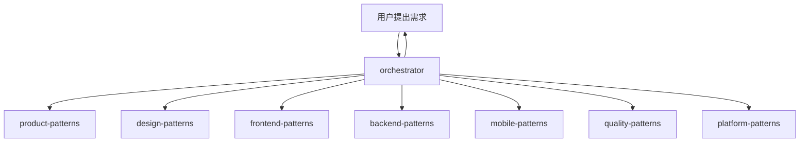

# Trae Workflow

> **专为个人开发者设计** - AI 编码助手配置，基于 MCP-Skills-Rules 三层架构

---

## 🎯 核心数字

| 智能体 | 技能 | 规则     |
| ------ | ---- | -------- |
| 1      | 70+  | 完整体系 |

---

## 🏗️ 架构分层

```
Orchestrator (调度) → Skills (执行) → Rules (约束) → MCP (连接)
```

| 层级             | 角色     | 关注点                       |
| ---------------- | -------- | ---------------------------- |
| **Orchestrator** | 任务调度 | 解析需求、编排任务、调用技能 |
| **Skills**       | 原子能力 | 如何完成特定动作             |
| **Rules**        | 行为规范 | 什么能做，什么不能做         |
| **MCP**          | 通信协议 | 如何连接和交换数据           |

---

## 🎛️ 中央调度器

**orchestrator** - 解析用户需求，调用相应的 Skill 完成具体任务



---

## 🚀 快速开始

```bash
# 安装 CLI
npm install -g trae-workflow-cli

# 安装配置
traew install

# 更新
traew update
```

---

## 📚 技能速览

### 产品 & 设计

- **product-patterns** - 产品规划、需求分析、MVP 定义
- **design-patterns** - UI/UX 设计模式

### 前端 & UI

- **frontend-patterns** - React、Next.js、状态管理
- **vue-patterns** - Vue 3 组合式 API
- **tailwind-patterns** - Tailwind CSS 原子化
- **a11y-patterns** - 无障碍设计、WCAG

### 后端 & API

- **backend-patterns** - 后端架构模式
- **rest-patterns** - REST API 设计
- **graphql-patterns** - GraphQL Schema
- **express-patterns** - Node.js + Express
- **fastapi-patterns** - FastAPI 异步
- **django-patterns** - Django 架构

### 移动端

- **mobile-patterns** - 移动端统一入口
- **ios-native-patterns** - iOS Swift/SwiftUI
- **android-native-patterns** - Android Kotlin
- **react-native-patterns** - React Native
- **mini-program-patterns** - 微信小程序

### 桌面端

- **electron-patterns** - Electron 桌面应用
- **tauri-patterns** - Tauri 桌面应用

### 架构 & 工程

- **clean-architecture** - 整洁架构
- **cqrs-patterns** - CQRS 命令查询分离
- **ddd-patterns** - 领域驱动设计

### 支付集成

- **payment-patterns** - 统一支付接口
- **stripe-patterns** - Stripe 支付集成
- **alipay-patterns** - 支付宝支付集成
- **wechatpay-patterns** - 微信支付集成
- **douyinpay-patterns** - 抖音支付集成
- **paypal-patterns** - PayPal 支付集成

### 消息 & 集成

- **kafka-patterns** - Kafka 分布式消息
- **rabbitmq-patterns** - RabbitMQ 消息队列
- **message-queue-patterns** - 消息队列模式

### 性能 & 缓存

- **caching-patterns** - 多级缓存策略
- **redis-patterns** - Redis 数据结构
- **postgres-patterns** - PostgreSQL 优化
- **clickhouse-io** - ClickHouse 分析数据库
- **logging-observability** - 日志与可观测性

### Web & 跨平台

- **webassembly-patterns** - WebAssembly 高性能计算
- **webrtc-patterns** - WebRTC 实时通信

### 开发工具

- **git-workflow** - Git 版本控制
- **docker-patterns** - Docker 容器化
- **deployment-patterns** - 部署流水线
- **tdd-patterns** - 测试驱动开发
- **e2e-testing** - Playwright E2E 测试
- **quality-patterns** - 质量保障与验证流程
- **platform-patterns** - 架构、CI/CD、监控、安全

---

## 📁 项目结构

```
Trae-Workflow/
├── agents/              # 1 个调度器
│   └── orchestrator.md
├── skills/              # 70+ 技能
├── project_rules/       # 项目规则
├── user_rules/          # 用户规则
├── .trae/               # 规则目录
└── README.md
```

---

## 🔧 MCP 服务器

| 服务器              | 用途        |
| ------------------- | ----------- |
| memory              | 长期记忆    |
| sequential-thinking | 链式思维    |
| context7            | 代码上下文  |
| docker              | Docker 管理 |
| github              | GitHub API  |

---

## 📄 许可

MIT
