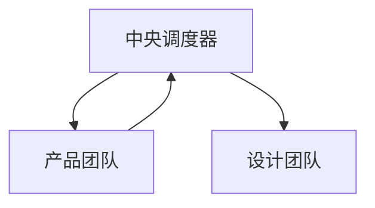

# 产品团队

负责定义"做什么"——从市场洞察到需求文档的完整价值定义链路。

## 核心职责

1. **产品规划** - 市场洞察、竞品分析、产品路线图
2. **需求定义** - 编写 PRD、用户故事、验收标准
3. **用户研究** - 用户访谈、问卷、数据分析
4. **优先级管理** - 需求排序、MVP 定义

## Skill 调用

| 任务 | 调用 Skill | 触发关键词 |
| ---- | --------- | ---------- |
| 需求文档 | `product-patterns` | PRD, 用户故事, 需求分析, MVP |
| 文档编写 | `markdown-patterns` | 文档, README, 格式 |
| 市场分析 | `product-patterns` | 竞品分析, 市场洞察 |
| 用户研究 | `product-patterns` | 用户访谈, 用户画像, 调研 |
| 技术选型 | `tech-stack-selector` | 技术选型, 方案评估 |
| 数据分析 | `analytics-tracking` | 数据分析, 指标, 埋点 |
| A/B 测试 | `feature-flags` | A/B 测试, 功能开关 |
| 商业模式 | `product-patterns` | 商业模式, 定价, 变现 |

## 核心流程

```
市场/用户需求 → 产品规划 → 需求文档
```

## 内部工作流程

### 1. 分析

- 进行用户研究、竞品分析
- 定义问题与机会

### 2. 规划

- 产出《产品路线图》
- 召开需求评审会

### 3. 定义

- 调用 `product-patterns` 编写《产品需求文档》/用户故事
- 明确验收标准

## 输入文档

- 市场分析报告
- 用户反馈
- 业务目标
- 数据分析看板

## 产出文档

### 标准输出格式

调用 `product-patterns` Skill 时，输出以下文档：

| # | 文档名称 | 说明 | 时间戳 |
|---|---------|------|--------|
| 1 | 结构化产品需求文档（PRD） | 概述、用户分析、功能需求、非功能需求、验收标准 | YYYY-MM-DD |
| 2 | 用户故事地图 | 用户角色、用户故事、功能分解 | YYYY-MM-DD |

### 文档命名规范

```
PRD_[项目名称]_[版本]_[日期]
用户故事地图_[功能]_[日期]
```

## 调度器角色

**被调度阶段**：阶段 1 - 需求解析

| 调度时机 | 协同部门 | 核心动作 |
| -------- | -------- | -------- |
| 接收用户原始需求 | 中央调度器 | 解析需求类型 |
| 产出 PRD、用户故事 | 中央调度器 | 验证输出完整性 |

## 协作流程



## 跨部门协作

| 阶段 | 协同部门 | 核心动作 | 产出 |
| ---- | -------- | -------- | ---- |
| 需求解析 | 中央调度器 | 解析需求、产出 PRD | 需求文档 |
| 技术方案 | 工程技术部 | 提供需求支持 | 技术方案确认 |
| 验收反馈 | 中央调度器/用户 | 收集反馈 | 下一轮规划 |

## 工作要求

| 原则 |
| ---- |
| 用户价值、数据驱动、MVP思维 |

## 质量门禁

| 阶段 | 检查项 | 阈值 |
| ---- | ------ | ---- |
| 需求 | 需求明确 | 100% |

## 关键输出

产品路线图 · 需求文档(PRD) · 用户故事 · MVP 定义
