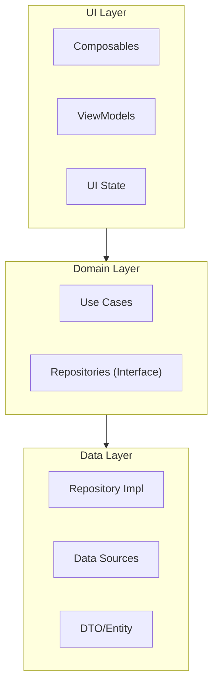

# Android 原生开发模式

> 用于构建高性能、可维护 Android 应用的 Kotlin 模式与最佳实践

## 何时激活

- 编写新的 Android 原生应用
- 设计 Android 架构模式
- 实现 Jetpack Compose 界面
- 处理 Android 协程和数据
- 实现依赖注入
- 设计数据持久化方案

## 技术栈版本

| 技术            | 最低版本 | 推荐版本 |
| --------------- | -------- | -------- |
| Kotlin          | 1.9+     | 2.0+     |
| Android SDK     | 34+      | 最新     |
| Jetpack Compose | 1.6+     | 最新     |
| Hilt            | 2.50+    | 最新     |
| Coroutines      | 1.8+     | 最新     |

---

## 架构模式

### 整体架构



### 分层职责

| 层级   | 职责                   | 组件                            |
| ------ | ---------------------- | ------------------------------- |
| UI     | 展示数据，响应用户操作 | Composables, ViewModels         |
| Domain | 业务逻辑，用例编排     | Use Cases, Repository 接口      |
| Data   | 数据获取，持久化       | Repository 实现, Room, Retrofit |

---

## UI 状态管理

### StateFlow 模式

```kotlin
data class UserListState(
    val users: List<User> = emptyList(),
    val isLoading: Boolean = false,
    val error: String? = null,
    val selectedUser: User? = null
)

class UserListViewModel @Inject constructor(
    private val getUsers: GetUsersUseCase,
    private val getUser: GetUserUseCase
) : ViewModel() {

    private val _state = MutableStateFlow(UserListState())
    val state: StateFlow<UserListState> = _state.asStateFlow()

    fun loadUsers() {
        viewModelScope.launch {
            _state.update { it.copy(isLoading = true, error = null) }

            getUsers()
                .onSuccess { users ->
                    _state.update { it.copy(users = users, isLoading = false) }
                }
                .onFailure { e ->
                    _state.update { it.copy(error = e.message, isLoading = false) }
                }
        }
    }

    fun selectUser(user: User) {
        _state.update { it.copy(selectedUser = user) }
    }
}
```

### UI 状态收集

```kotlin
@Composable
fun UserListScreen(
    viewModel: UserListViewModel = hiltViewModel()
) {
    val state by viewModel.state.collectAsStateWithLifecycle()

    UserListContent(
        state = state,
        onUserClick = viewModel::selectUser,
        onRefresh = viewModel::loadUsers
    )
}

@Composable
private fun UserListContent(
    state: UserListState,
    onUserClick: (User) -> Unit,
    onRefresh: () -> Unit
) {
    LaunchedEffect(state.error) {
        state.error?.let { error ->
            // 显示错误 Toast 或 Snackbar
        }
    }

    when {
        state.isLoading -> LoadingView()
        state.error != null -> ErrorView(message = state.error, onRetry = onRefresh)
        else -> UserList(users = state.users, onUserClick = onUserClick)
    }
}
```

---

## Jetpack Compose

### 基础组件

```kotlin
@Composable
fun UserCard(
    user: User,
    onClick: () -> Unit,
    modifier: Modifier = Modifier
) {
    Card(
        onClick = onClick,
        modifier = modifier.fillMaxWidth()
    ) {
        Row(
            modifier = Modifier
                .fillMaxWidth()
                .padding(16.dp),
            horizontalArrangement = Arrangement.spacedBy(12.dp)
        ) {
            AsyncImage(
                model = user.avatarUrl,
                contentDescription = null,
                modifier = Modifier
                    .size(48.dp)
                    .clip(CircleShape)
            )

            Column {
                Text(
                    text = user.name,
                    style = MaterialTheme.typography.titleMedium
                )
                Text(
                    text = user.email,
                    style = MaterialTheme.typography.bodyMedium,
                    color = MaterialTheme.colorScheme.onSurfaceVariant
                )
            }
        }
    }
}
```

### Scaffold 结构

```kotlin
@OptIn(ExperimentalMaterial3Api::class)
@Composable
fun MainScreen(
    viewModel: MainViewModel = hiltViewModel()
) {
    val state by viewModel.state.collectAsState()

    Scaffold(
        topBar = {
            TopAppBar(
                title = { Text(state.title) },
                actions = {
                    IconButton(onClick = viewModel::openSettings) {
                        Icon(Icons.Default.Settings, contentDescription = "Settings")
                    }
                }
            )
        },
        bottomBar = {
            NavigationBar {
                NavigationBarItem(
                    selected = state.selectedTab == Tab.HOME,
                    onClick = viewModel::selectTab(Tab.HOME),
                    icon = { Icon(Icons.Default.Home, contentDescription = null) },
                    label = { Text("Home") }
                )
                NavigationBarItem(
                    selected = state.selectedTab == Tab.PROFILE,
                    onClick = viewModel::selectTab(Tab.PROFILE),
                    icon = { Icon(Icons.Default.Person, contentDescription = null) },
                    label = { Text("Profile") }
                )
            }
        },
        floatingActionButton = {
            if (state.showFab) {
                FloatingActionButton(onClick = viewModel::addItem) {
                    Icon(Icons.Default.Add, contentDescription = "Add")
                }
            }
        }
    ) { padding ->
        Box(modifier = Modifier.padding(padding)) {
            MainContent(state = state)
        }
    }
}
```

### 列表渲染

```kotlin
@Composable
fun UserList(
    users: List<User>,
    onUserClick: (User) -> Unit,
    modifier: Modifier = Modifier
) {
    LazyColumn(
        modifier = modifier.fillMaxSize(),
        contentPadding = PaddingValues(16.dp),
        verticalArrangement = Arrangement.spacedBy(8.dp)
    ) {
        items(
            items = users,
            key = { it.id }
        ) { user ->
            UserCard(
                user = user,
                onClick = { onUserClick(user) }
            )
        }
    }
}

@Composable
fun UserGrid(
    users: List<User>,
    onUserClick: (User) -> Unit,
    modifier: Modifier = Modifier
) {
    LazyVerticalGrid(
        columns = GridCells.Adaptive(minSize = 160.dp),
        modifier = modifier.fillMaxSize(),
        contentPadding = PaddingValues(16.dp),
        horizontalArrangement = Arrangement.spacedBy(8.dp),
        verticalArrangement = Arrangement.spacedBy(8.dp)
    ) {
        items(users, key = { it.id }) { user ->
            UserGridItem(user = user, onClick = { onUserClick(user) })
        }
    }
}
```

---

## 依赖注入 (Hilt)

### Application

```kotlin
@HiltAndroidApp
class MyApplication : Application()
```

### Module

```kotlin
@Module
@InstallIn(SingletonComponent::class)
object NetworkModule {

    @Provides
    @Singleton
    fun provideOkHttpClient(
        loggingInterceptor: HttpLoggingInterceptor
    ): OkHttpClient {
        return OkHttpClient.Builder()
            .addInterceptor(loggingInterceptor)
            .addInterceptor { chain ->
                val request = chain.request().newBuilder()
                    .addHeader("Content-Type", "application/json")
                    .build()
                chain.proceed(request)
            }
            .connectTimeout(30, TimeUnit.SECONDS)
            .readTimeout(30, TimeUnit.SECONDS)
            .writeTimeout(30, TimeUnit.SECONDS)
            .build()
    }

    @Provides
    @Singleton
    fun provideRetrofit(okHttpClient: OkHttpClient): Retrofit {
        return Retrofit.Builder()
            .baseUrl("https://api.example.com/")
            .client(okHttpClient)
            .addConverterFactory(Json.asConverterFactory("application/json".toMediaType()))
            .build()
    }

    @Provides
    @Singleton
    fun provideApiService(retrofit: Retrofit): ApiService {
        return retrofit.create(ApiService::class.java)
    }
}

@Module
@InstallIn(SingletonComponent::class)
object DatabaseModule {

    @Provides
    @Singleton
    fun provideDatabase(@ApplicationContext context: Context): AppDatabase {
        return Room.databaseBuilder(
            context,
            AppDatabase::class.java,
            "app_database"
        ).build()
    }

    @Provides
    fun provideUserDao(database: AppDatabase): UserDao {
        return database.userDao()
    }
}
```

### ViewModel 注入

```kotlin
@HiltViewModel
class UserViewModel @Inject constructor(
    private val getUsers: GetUsersUseCase,
    private val getUser: GetUserUseCase,
    private val saveUser: SaveUserUseCase
) : ViewModel() {
    // ...
}
```

---

## 协程模式

### Flow

```kotlin
class UserRepository @Inject constructor(
    private val apiService: ApiService,
    private val userDao: UserDao
) : IUserRepository {

    fun getUsers(): Flow<List<User>> = channelFlow {
        val cached = userDao.getAll()
        if (cached.isNotEmpty()) {
            send(cached)
        }

        try {
            val remote = apiService.getUsers()
            userDao.insertAll(remote)
            send(remote)
        } catch (e: Exception) {
            if (cached.isEmpty()) {
                throw e
            }
        }
    }

    suspend fun refreshUsers(): Result<Unit> = coroutineScope {
        try {
            val remote = apiService.getUsers()
            userDao.deleteAll()
            userDao.insertAll(remote)
            Result.success(Unit)
        } catch (e: Exception) {
            Result.failure(e)
        }
    }
}
```

### 并发操作

```kotlin
class DashboardRepository @Inject constructor(
    private val userRepository: IUserRepository,
    private val orderRepository: IOrderRepository,
    private val notificationRepository: INotificationRepository
) {
    suspend fun loadDashboard(): Dashboard = coroutineScope {
        val userDeferred = async { userRepository.getCurrentUser() }
        val ordersDeferred = async { orderRepository.getRecentOrders() }
        val notificationsDeferred = async { notificationRepository.getNotifications() }

        Dashboard(
            user = userDeferred.await(),
            orders = ordersDeferred.await(),
            notifications = notificationsDeferred.await()
        )
    }
}
```

### 错误处理

```kotlin
sealed class Result<out T> {
    data class Success<T>(val data: T) : Result<T>()
    data class Error(val exception: Throwable) : Result<Nothing>()
}

suspend inline fun <reified T> safeApiCall(
    crossinline apiCall: suspend () -> T
): Result<T> {
    return try {
        Result.Success(apiCall())
    } catch (e: HttpException) {
        Result.Error(e)
    } catch (e: IOException) {
        Result.Error(e)
    } catch (e: Exception) {
        Result.Error(e)
    }
}
```

---

## 数据持久化

### Room

```kotlin
@Entity(tableName = "users")
data class UserEntity(
    @PrimaryKey val id: String,
    val name: String,
    val email: String,
    val avatarUrl: String?,
    val createdAt: Long = System.currentTimeMillis()
)

@Dao
interface UserDao {
    @Query("SELECT * FROM users ORDER BY createdAt DESC")
    fun getAll(): Flow<List<UserEntity>>

    @Query("SELECT * FROM users WHERE id = :id")
    suspend fun getById(id: String): UserEntity?

    @Insert(onConflict = OnConflictStrategy.REPLACE)
    suspend fun insertAll(users: List<UserEntity>)

    @Insert(onConflict = OnConflictStrategy.REPLACE)
    suspend fun insert(user: UserEntity)

    @Query("DELETE FROM users")
    suspend fun deleteAll()
}

@Database(entities = [UserEntity::class], version = 1, exportSchema = false)
abstract class AppDatabase : RoomDatabase() {
    abstract fun userDao(): UserDao
}
```

### DataStore

```kotlin
val Context.dataStore: DataStore<Preferences> by preferencesDataStore(name = "settings")

class SettingsRepository @Inject constructor(
    @ApplicationContext private val context: Context
) {
    private object PreferencesKeys {
        val DARK_MODE = booleanPreferencesKey("dark_mode")
        val LANGUAGE = stringPreferencesKey("language")
        val NOTIFICATIONS = booleanPreferencesKey("notifications")
    }

    val settings: Flow<Settings> = context.dataStore.data.map { prefs ->
        Settings(
            darkMode = prefs[PreferencesKeys.DARK_MODE] ?: false,
            language = prefs[PreferencesKeys.LANGUAGE] ?: "en",
            notifications = prefs[PreferencesKeys.NOTIFICATIONS] ?: true
        )
    }

    suspend fun updateDarkMode(enabled: Boolean) {
        context.dataStore.edit { prefs ->
            prefs[PreferencesKeys.DARK_MODE] = enabled
        }
    }
}
```

---

## 网络请求

### Retrofit

```kotlin
interface ApiService {
    @GET("users")
    suspend fun getUsers(): List<UserDto>

    @GET("users/{id}")
    suspend fun getUser(@Path("id") id: String): UserDto

    @POST("users")
    suspend fun createUser(@Body user: CreateUserRequest): UserDto

    @PUT("users/{id}")
    suspend fun updateUser(
        @Path("id") id: String,
        @Body user: UpdateUserRequest
    ): UserDto

    @DELETE("users/{id}")
    suspend fun deleteUser(@Path("id") id: String)
}

data class CreateUserRequest(
    val name: String,
    val email: String
)

data class UpdateUserRequest(
    val name: String?,
    val email: String?
)
```

### OkHttp 拦截器

```kotlin
class AuthInterceptor @Inject constructor(
    private val tokenProvider: TokenProvider
) : Interceptor {
    override fun intercept(chain: Interceptor.Chain): Response {
        val original = chain.request()
        val token = runBlocking { tokenProvider.getToken() }

        val request = if (token != null) {
            original.newBuilder()
                .addHeader("Authorization", "Bearer $token")
                .build()
        } else {
            original
        }

        return chain.proceed(request)
    }
}
```

---

## 导航

### 类型安全导航

```kotlin
@Serializable
object UserList

@Serializable
data class UserDetail(val userId: String)

@Serializable
object Settings

@Composable
fun AppNavigation() {
    val navController = rememberNavController()

    NavHost(
        navController = navController,
        startDestination = UserList
    ) {
        composable<UserList> { backStackEntry ->
            UserListScreen(
                onUserClick = { user ->
                    navController.navigate(UserDetail(user.id))
                }
            )
        }

        composable<UserDetail> { backStackEntry ->
            val userDetail: UserDetail = backStackEntry.toRoute()
            UserDetailScreen(
                userId = userDetail.userId,
                onBack = { navController.popBackStack() }
            )
        }

        composable<Settings> {
            SettingsScreen(
                onBack = { navController.popBackStack() }
            )
        }
    }
}
```

### Deep Link

```kotlin
@Serializable
data class ProductDetail(val productId: String)

composable<ProductDetail>(
    deepLinks = listOf(
        navDeepLink<ProductDetail>(basePath = "myapp://product")
    )
) { backStackEntry ->
    val product: ProductDetail = backStackEntry.toRoute()
    ProductDetailScreen(productId = product.productId)
}
```

---

## 主题配置

```kotlin
private fun DarkColorScheme() = darkColorScheme(
    primary = Color(0xFF90CAF9),
    onPrimary = Color(0xFF003258),
    primaryContainer = Color(0xFF004A77),
    onPrimaryContainer = Color(0xFFD1E4FF),
    secondary = Color(0xFFBB8BC9),
    onSecondary = Color(0xFF2D1040),
    error = Color(0xFFFFB4AB),
    background = Color(0xFF1C1B1F),
    surface = Color(0xFF1C1B1F)
)

private fun LightColorScheme() = lightColorScheme(
    primary = Color(0xFF1976D2),
    onPrimary = Color.White,
    primaryContainer = Color(0xFFD1E4FF),
    onPrimaryContainer = Color(0xFF001D36),
    secondary = Color(0xFF7D5260),
    onSecondary = Color.White,
    error = Color(0xFFBA1A1A),
    background = Color(0xFFFFFBFE),
    surface = Color(0xFFFFFBFE)
)

@Composable
fun MyAppTheme(
    darkTheme: Boolean = isSystemInDarkTheme(),
    content: @Composable () -> Unit
) {
    val colorScheme = if (darkTheme) DarkColorScheme() else LightColorScheme()

    MaterialTheme(
        colorScheme = colorScheme,
        typography = Typography,
        content = content
    )
}
```

---

## 测试

### ViewModel 单元测试

```kotlin
@OptIn(ExperimentalCoroutinesApi::class)
class UserViewModelTest {
    @Test
    fun `loadUsers updates state with users`() = runTest {
        val mockUsers = listOf(User("1", "Alice", "alice@example.com"))
        val mockUseCase = GetUsersUseCase { Result.success(mockUsers) }
        val viewModel = UserViewModel(mockUseCase)

        viewModel.loadUsers()
        advanceUntilIdle()

        assertEquals(mockUsers, viewModel.state.value.users)
        assertFalse(viewModel.state.value.isLoading)
    }

    @Test
    fun `loadUsers handles error`() = runTest {
        val mockUseCase = GetUsersUseCase { Result.failure(Exception("Network error")) }
        val viewModel = UserViewModel(mockUseCase)

        viewModel.loadUsers()
        advanceUntilIdle()

        assertEquals("Network error", viewModel.state.value.error)
        assertFalse(viewModel.state.value.isLoading)
    }
}
```

### Compose UI 测试

```kotlin
@ComposeExperimental
class UserListScreenTest {
    @get:Rule
    val composeTestRule = createComposeRule()

    @Test
    fun `displays loading when loading`() {
        val viewModel = UserViewModel().apply {
            // Set loading state
        }

        composeTestRule.setContent {
            UserListScreen(viewModel = viewModel)
        }

        composeTestRule.onNodeWithText("Loading").assertIsDisplayed()
    }

    @Test
    fun `displays users when loaded`() {
        val viewModel = UserViewModel().apply {
            // Set users state
        }

        composeTestRule.setContent {
            UserListScreen(viewModel = viewModel)
        }

        composeTestRule.onNodeWithText("Alice").assertIsDisplayed()
    }
}
```

---

## 快速检查清单

### 开发前

- [ ] 配置 Hilt 依赖注入
- [ ] 设置 Room 数据库
- [ ] 配置 Retrofit 网络
- [ ] 定义主题色彩

### 开发中

- [ ] ViewModel 管理 UI State
- [ ] 使用 Flow 收集数据
- [ ] 编写可组合函数
- [ ] 实现类型安全导航

### 发布前

- [ ] 单元测试覆盖率 > 80%
- [ ] UI 测试关键流程
- [ ] ProGuard/R8 混淆
- [ ] 签名配置

---

## 常见错误

| 错误         | 原因                 | 解决方案                         |
| ------------ | -------------------- | -------------------------------- |
| 协程取消异常 | ViewModel 未取消     | 使用 viewModelScope              |
| 内存泄漏     | 收集 Flow 未取消     | 使用 collectAsStateWithLifecycle |
| 状态丢失     | Configuration Change | 使用 ViewModel 存储状态          |
| 导航回退     | 未正确处理返回       | 使用 savedStateHandle            |

---

## 参考

- [Jetpack Compose 文档](https://developer.android.com/compose)
- [Hilt 依赖注入](https://developer.android.com/training/dependency-injection/hilt)
- [Room 数据库](https://developer.android.com/training/data-storage/room)
- [Navigation Compose](https://developer.android.com/jetpack/compose/navigation)
