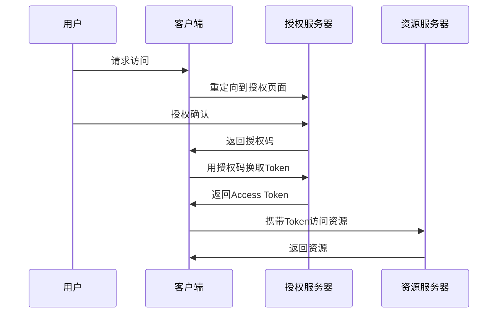
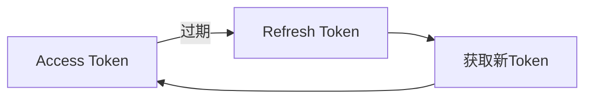
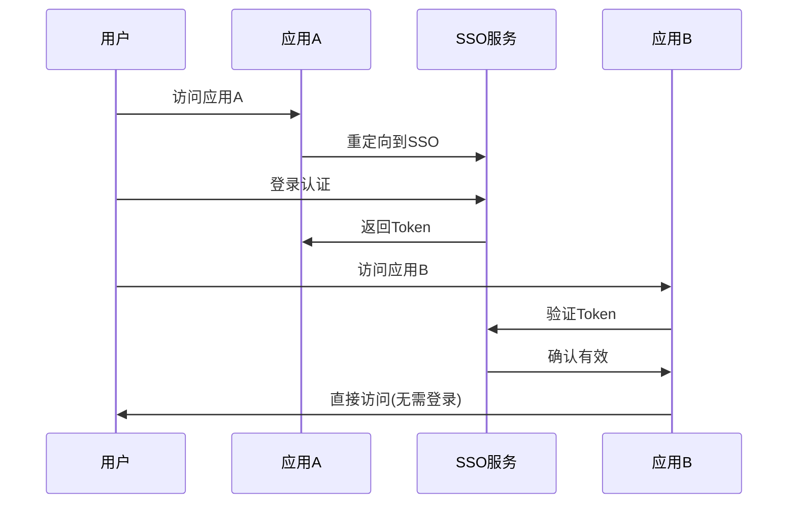

# 认证授权模式

> 安全可靠的身份管理

## 核心概念

### 认证 vs 授权

| 概念 | 说明 | 问题 |
|------|------|------|
| 认证(Authentication) | 验证身份 | 你是谁？ |
| 授权(Authorization) | 验证权限 | 你能做什么？ |

### 安全原则

| 原则 | 说明 |
|------|------|
| 最小权限 | 只授予必要权限 |
| 默认拒绝 | 默认拒绝所有访问 |
| 纵深防御 | 多层安全措施 |
| 审计日志 | 记录所有操作 |

---

## 认证模式

### 密码认证

| 要素 | 说明 |
|------|------|
| 密码强度 | 复杂度要求 |
| 密码哈希 | bcrypt、Argon2 |
| 盐值 | 随机盐防彩虹表 |
| 限流 | 防暴力破解 |

### OAuth2流程



### OAuth2授权类型

| 类型 | 适用场景 |
|------|----------|
| Authorization Code | Web应用 |
| Implicit | 单页应用(已弃用) |
| Client Credentials | 服务间调用 |
| Password | 受信任应用(不推荐) |
| Refresh Token | 刷新访问令牌 |

### 多因素认证(MFA)

| 因素 | 说明 | 示例 |
|------|------|------|
| 知道什么 | 密码、PIN | 密码 |
| 拥有什么 | 设备、卡片 | 手机验证码 |
| 是什么 | 生物特征 | 指纹、人脸 |

---

## Token模式

### JWT结构

```
Header.Payload.Signature
```

| 部分 | 内容 |
|------|------|
| Header | 算法、类型 |
| Payload | 用户信息、过期时间 |
| Signature | 签名验证 |

### Token存储

| 方式 | 安全性 | 适用场景 |
|------|--------|----------|
| 内存 | 高 | 单页应用 |
| HttpOnly Cookie | 较高 | Web应用 |
| LocalStorage | 低 | 不推荐 |
| SessionStorage | 中 | 临时存储 |

### Token刷新



---

## 授权模式

### RBAC(基于角色)

| 元素 | 说明 |
|------|------|
| 用户 | 系统使用者 |
| 角色 | 权限集合 |
| 权限 | 操作许可 |

```
用户 → 角色 → 权限
```

### RBAC设计

```json
{
  "roles": {
    "admin": ["user:read", "user:write", "user:delete"],
    "editor": ["user:read", "user:write"],
    "viewer": ["user:read"]
  }
}
```

### ABAC(基于属性)

| 属性类型 | 说明 |
|----------|------|
| 用户属性 | 部门、职级 |
| 资源属性 | 敏感级别、所有者 |
| 环境属性 | 时间、IP |
| 操作属性 | 读取、写入 |

### ABAC策略

```yaml
policy:
  effect: allow
  subject:
    department: finance
  resource:
    type: invoice
    sensitivity: internal
  action: read
  condition:
    time: business_hours
```

---

## 单点登录(SSO)

### SSO流程



### SSO协议

| 协议 | 说明 |
|------|------|
| SAML | 企业级SSO |
| OIDC | OAuth2扩展 |
| CAS | 中央认证服务 |

---

## API安全

### API Key

| 特点 | 说明 |
|------|------|
| 简单 | 易于实现 |
| 无状态 | 服务器无需存储 |
| 适合服务间 | 机器对机器 |

### API认证方式

| 方式 | 适用场景 |
|------|----------|
| API Key | 服务间调用 |
| JWT | 用户认证 |
| OAuth2 | 第三方授权 |
| mTLS | 高安全场景 |

---

## 会话管理

### 会话安全

| 措施 | 说明 |
|------|------|
| 会话超时 | 自动过期 |
| 并发控制 | 限制登录数 |
| 会话固定防护 | 登录后更新ID |
| 安全Cookie | HttpOnly、Secure |

### 会话存储

| 存储 | 说明 |
|------|------|
| 内存 | 简单、重启丢失 |
| Redis | 分布式、高性能 |
| 数据库 | 持久化 |

---

## 最佳实践

### 密码安全

- 使用强哈希算法(bcrypt、Argon2)
- 强制密码复杂度
- 定期更换密码
- 密码泄露检测

### Token安全

- 短期有效的Access Token
- 安全存储Refresh Token
- Token撤销机制
- Token黑名单

### 权限设计

- 最小权限原则
- 权限分离
- 定期审计权限
- 敏感操作二次确认

---

## 反模式

| 反模式 | 问题 | 解决方案 |
|--------|------|----------|
| 明文密码 | 安全风险 | 哈希存储 |
| 永不过期Token | 无法撤销 | 设置过期时间 |
| 过度权限 | 权限滥用 | 最小权限 |
| 硬编码密钥 | 泄露风险 | 环境变量 |
