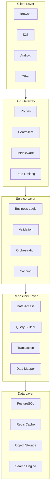
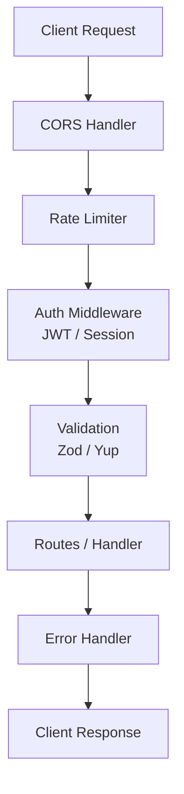
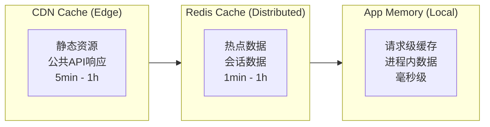

# 后端开发模式

> 用于可扩展服务器端应用程序的后端架构模式和最佳实践

## 何时激活

- 设计 REST 或 GraphQL API 端点时
- 实现仓储层、服务层或控制器层时
- 优化数据库查询（N+1 问题、索引、连接池）时
- 添加缓存（Redis、内存缓存、HTTP 缓存头）时
- 设置后台作业或异步处理时
- 为 API 构建错误处理和验证结构时
- 构建中间件（认证、日志记录、速率限制）时
- 实现数据库事务和分布式锁时
- 处理文件上传和云存储集成时
- 构建实时功能（WebSocket、SSE）时
- 设计微服务通信和事件驱动架构时

## 技术栈版本

| 技术            | 最低版本    | 推荐版本 |
| --------------- | ----------- | -------- |
| Node.js         | 20+         | 22+      |
| TypeScript      | 5.0+        | 最新     |
| Express/Fastify | 4.18+/4.24+ | 最新     |
| Prisma          | 5.0+        | 最新     |
| Redis           | 7.0+        | 7.4+     |
| PostgreSQL      | 15+         | 16+      |
| BullMQ          | 5.0+        | 最新     |

---

## 架构模式

### 整体架构



### 分层职责

| 层级       | 职责                       | 组件                |
| ---------- | -------------------------- | ------------------- |
| API        | 路由、参数解析、响应格式化 | Routes, Controllers |
| Service    | 业务逻辑、验证、编排       | Services, UseCases  |
| Repository | 数据访问、缓存             | Repositories, DAOs  |

### 中间件架构



---

## API 设计

### RESTful 命名规范

```typescript
// 资源命名 - 使用复数名词
GET    /api/users              # 获取用户列表
GET    /api/users/:id          # 获取单个用户
POST   /api/users              # 创建用户
PUT    /api/users/:id          # 全量更新
PATCH  /api/users/:id          # 部分更新
DELETE /api/users/:id          # 删除用户

// 关系资源 - 嵌套路由
GET    /api/users/:id/posts           # 获取用户的帖子
POST   /api/users/:id/posts            # 为用户创建帖子
GET    /api/posts/:id/comments         # 获取帖子的评论
POST   /api/posts/:id/comments         # 为帖子添加评论

// 动作资源 - 非CRUD操作
POST   /api/orders/:id/cancel          # 取消订单
POST   /api/users/:id/activate         # 激活用户
POST   /api/users/:id/reset-password   # 重置密码
POST   /api/payments/:id/refund        # 退款

// 批量操作
POST   /api/users/bulk                 # 批量创建
PATCH  /api/users/bulk                 # 批量更新
DELETE /api/users/bulk                 # 批量删除
```

### 查询参数

```typescript
// 过滤
GET /api/users?status=active&role=admin

// 排序 - 字段:方向，多字段逗号分隔
GET /api/users?sort=createdAt:desc,name:asc

// 分页 - page/limit 或 offset/limit
GET /api/users?page=1&limit=20
GET /api/users?offset=0&limit=20

// 搜索 - 多字段搜索
GET /api/users?search=john&fields=name,email

// 字段选择 - 只返回需要的字段
GET /api/users?select=id,name,email

// 展开关联 - 避免 N+1
GET /api/users?include=posts,profile,settings

// 日期范围
GET /api/orders?createdAfter=2024-01-01&createdBefore=2024-12-31
```

### API 响应格式

```typescript
// 统一响应格式
interface ApiResponse<T> {
  success: boolean;
  data: T | null;
  error: string | null;
  meta?: {
    total?: number;
    page?: number;
    limit?: number;
    totalPages?: number;
  };
}

// 分页响应
interface PaginatedResponse<T> {
  success: true;
  data: T[];
  error: null;
  meta: {
    total: number;
    page: number;
    limit: number;
    totalPages: number;
    hasNextPage: boolean;
    hasPrevPage: boolean;
  };
}

// 成功响应工厂函数
function successResponse<T>(data: T, meta?: Meta): ApiResponse<T> {
  return { success: true, data, error: null, meta };
}

// 错误响应工厂函数
function errorResponse(error: string, code?: string): ApiResponse<null> {
  return { success: false, data: null, error, code };
}

// 响应格式化中间件
function formatResponse<T>(data: T, meta?: Meta) {
  return successResponse(data, meta);
}
```

### 分页模式

```typescript
// Cursor-based 分页 (推荐大数据集 - 高性能)
interface CursorPagination {
  data: User[];
  nextCursor: string | null;
  hasMore: boolean;
}

async function getUsersByCursor(cursor?: string, limit = 20) {
  const query = supabase
    .from('users')
    .select('*')
    .order('id')
    .limit(limit + 1);

  if (cursor) {
    query.gt('id', cursor);
  }

  const { data } = await query;
  const hasMore = data.length > limit;
  const results = hasMore ? data.slice(0, -1) : data;

  return {
    data: results,
    nextCursor: hasMore ? results[results.length - 1].id : null,
    hasMore,
  };
}

// Offset-based 分页 (适合小数据集 - 简单场景)
interface OffsetPagination {
  data: User[];
  total: number;
  page: number;
  limit: number;
  totalPages: number;
}

async function getUsersByOffset(page = 1, limit = 20) {
  const offset = (page - 1) * limit;

  const { data, count } = await supabase
    .from('users')
    .select('*', { count: 'exact' })
    .range(offset, offset + limit - 1);

  return {
    data,
    total: count ?? 0,
    page,
    limit,
    totalPages: Math.ceil((count ?? 0) / limit),
  };
}
```

---

## 仓储模式

### 接口定义

```typescript
interface Repository<T, CreateDto, UpdateDto> {
  findAll(filters?: Filters): Promise<T[]>;
  findById(id: string): Promise<T | null>;
  findOne(filters: Partial<T>): Promise<T | null>;
  create(data: CreateDto): Promise<T>;
  update(id: string, data: UpdateDto): Promise<T>;
  delete(id: string): Promise<void>;
  count(filters?: Filters): Promise<number>;
}

interface Filters {
  limit?: number;
  offset?: number;
  sort?: SortOptions;
  search?: string;
}

interface SortOptions {
  field: string;
  direction: 'asc' | 'desc';
}
```

### Prisma 实现

```typescript
class PrismaUserRepository implements Repository<User, CreateUserDto, UpdateUserDto> {
  async findAll(filters?: UserFilters): Promise<User[]> {
    return prisma.user.findMany({
      where: this.buildWhereClause(filters),
      take: filters?.limit ?? 50,
      skip: filters?.offset ?? 0,
      orderBy: filters?.sort ?? { createdAt: 'desc' },
      include: filters?.include,
    });
  }

  async findById(id: string): Promise<User | null> {
    return prisma.user.findUnique({ where: { id } });
  }

  async findOne(filters: Partial<User>): Promise<User | null> {
    return prisma.user.findFirst({ where: filters });
  }

  async create(data: CreateUserDto): Promise<User> {
    return prisma.user.create({ data });
  }

  async update(id: string, data: UpdateUserDto): Promise<User> {
    return prisma.user.update({ where: { id }, data });
  }

  async delete(id: string): Promise<void> {
    await prisma.user.delete({ where: { id } });
  }

  async count(filters?: UserFilters): Promise<number> {
    return prisma.user.count({ where: this.buildWhereClause(filters) });
  }

  private buildWhereClause(filters?: UserFilters): Prisma.UserWhereInput {
    return {
      ...(filters?.status && { status: filters.status }),
      ...(filters?.role && { role: filters.role }),
      ...(filters?.search && {
        OR: [
          { name: { contains: filters.search, mode: 'insensitive' } },
          { email: { contains: filters.search, mode: 'insensitive' } },
        ],
      }),
    };
  }
}
```

---

## 服务层模式

### 服务编排

```typescript
class OrderService {
  constructor(
    private orderRepo: Repository<Order, CreateOrderDto, UpdateOrderDto>,
    private userRepo: Repository<User, CreateUserDto, UpdateUserDto>,
    private productRepo: Repository<Product, CreateProductDto, UpdateProductDto>,
    private cache: RedisClient,
    private eventEmitter: EventEmitter
  ) {}

  async createOrder(userId: string, items: OrderItem[]): Promise<Order> {
    const user = await this.userRepo.findById(userId);
    if (!user) throw new NotFoundError('User');

    const productIds = items.map((i) => i.productId);
    const products = await this.productRepo.findAll({
      where: { id: { in: productIds } },
    });

    const unavailable = items.filter(
      (item) => !products.find((p) => p.id === item.productId && p.stock >= item.quantity)
    );
    if (unavailable.length > 0) {
      throw new ValidationError('Some products are out of stock');
    }

    const totalAmount = this.calculateTotal(items, products);
    const order = await this.orderRepo.create({
      userId,
      items,
      totalAmount,
      status: 'pending',
    });

    await this.invalidateUserCache(userId);
    this.eventEmitter.emit('order:created', order);

    return order;
  }

  async cancelOrder(orderId: string, userId: string): Promise<Order> {
    const order = await this.orderRepo.findById(orderId);
    if (!order) throw new NotFoundError('Order');
    if (order.userId !== userId) throw new ForbiddenError();
    if (order.status !== 'pending') {
      throw new ValidationError('Only pending orders can be cancelled');
    }

    const updated = await this.orderRepo.update(orderId, { status: 'cancelled' });
    this.eventEmitter.emit('order:cancelled', updated);
    return updated;
  }

  private calculateTotal(items: OrderItem[], products: Product[]): number {
    return items.reduce((sum, item) => {
      const product = products.find((p) => p.id === item.productId)!;
      return sum + product.price * item.quantity;
    }, 0);
  }

  private async invalidateUserCache(userId: string): Promise<void> {
    await this.cache.del(`user:${userId}`);
    await this.cache.del(`user:${userId}:orders`);
  }
}
```

---

## 数据库模式

### 查询优化

```typescript
// ✅ GOOD: 明确选择需要的列
const { data } = await supabase
  .from('markets')
  .select('id, name, status, volume')
  .eq('status', 'active')
  .order('volume', { ascending: false })
  .limit(10);

// ❌ BAD: 使用 select('*')
const { data } = await supabase.from('markets').select('*');

// ✅ GOOD: 使用范围查询
const { data } = await supabase
  .from('orders')
  .select('id, total, created_at')
  .gte('created_at', startDate)
  .lte('created_at', endDate);

// ❌ BAD: 在查询中过滤内存数据
const { data } = await supabase.from('orders').select('*');
const filtered = data.filter((o) => o.total > 100); // ❌
```

### N+1 查询预防

```typescript
// ❌ BAD: N+1 问题
const orders = await getOrders();
for (const order of orders) {
  order.user = await getUser(order.userId); // N 次额外查询
}

// ✅ GOOD: 批量预加载
const orders = await getOrders();
const userIds = [...new Set(orders.map((o) => o.userId))];
const users = await getUsers(userIds); // 1 次查询
const userMap = new Map(users.map((u) => [u.id, u]));

orders.forEach((order) => {
  order.user = userMap.get(order.userId);
});

// ✅ BEST: 使用 Prisma include
const orders = await prisma.order.findMany({
  include: { user: { select: { id: true, name: true } } },
});
```

### 事务模式

```typescript
// Prisma 事务 - 确保数据一致性
await prisma.$transaction(async (tx) => {
  const user = await tx.user.create({ data: { email, name } });
  await tx.account.create({ data: { userId: user.id, provider } });
  await tx.session.create({ data: { userId: user.id } });
  return user;
});

// 交互式事务 - 用于复杂业务逻辑
const result = await prisma.$transaction(async (tx) => {
  const product = await tx.product.update({
    where: { id: productId },
    data: { stock: { decrement: quantity } },
  });

  if (product.stock < 0) {
    throw new ValidationError('Insufficient stock');
  }

  return tx.order.create({
    data: { userId, productId, quantity, total: product.price * quantity },
  });
});

// Supabase RPC 原子操作
const { data, error } = await supabase.rpc('atomic_create_order', {
  p_user_id: userId,
  p_product_ids: productIds,
  p_quantities: quantities,
});
```

### 索引策略

```sql
-- 单字段索引
CREATE INDEX idx_users_email ON users(email);

-- 复合索引 (字段顺序很重要)
CREATE INDEX idx_orders_user_status ON orders(user_id, status);
CREATE INDEX idx_orders_created_status ON orders(created_at DESC, status);

-- 条件索引
CREATE INDEX idx_products_active ON products(category) WHERE status = 'active';

-- GIN 索引 (全文搜索)
CREATE INDEX idx_posts_content ON posts USING gin(to_tsvector('english', content));

-- 查看查询计划
EXPLAIN ANALYZE SELECT * FROM orders WHERE user_id = 'xxx' AND status = 'pending';
```

---

## Prisma ORM

### Schema 设计

```prisma
generator client {
  provider = "prisma-client-js"
}

datasource db {
  provider = "postgresql"
  url      = env("DATABASE_URL")
}

model User {
  id        String   @id @default(cuid())
  email     String   @unique
  name      String?
  avatarUrl String?
  role      Role     @default(USER)
  status    Status   @default(ACTIVE)
  posts     Post[]
  orders    Order[]
  createdAt DateTime @default(now())
  updatedAt DateTime @updatedAt

  @@index([email])
  @@index([status, role])
}

enum Role {
  USER
  ADMIN
  MODERATOR
}

enum Status {
  ACTIVE
  INACTIVE
  SUSPENDED
}

model Post {
  id        String   @id @default(cuid())
  title     String
  content   String?
  published Boolean  @default(false)
  viewCount Int      @default(0)
  authorId  String
  author    User     @relation(fields: [authorId], references: [id])
  tags      Tag[]
  createdAt DateTime @default(now())
  updatedAt DateTime @updatedAt

  @@index([authorId])
  @@index([published, createdAt])
}

model Tag {
  id    String @id @default(cuid())
  name  String @unique
  posts Post[]
}
```

### CRUD 操作

```typescript
const prisma = new PrismaClient();

// 创建
const user = await prisma.user.create({
  data: { email: 'user@example.com', name: 'John' },
});

// 批量创建
const users = await prisma.user.createMany({
  data: [
    { email: 'user1@example.com', name: 'User 1' },
    { email: 'user2@example.com', name: 'User 2' },
  ],
});

// 条件查询
const activeAdmins = await prisma.user.findMany({
  where: { role: 'ADMIN', status: 'ACTIVE' },
  orderBy: { createdAt: 'desc' },
  take: 10,
});

// 唯一查询
const user = await prisma.user.findUnique({
  where: { email: 'user@example.com' },
});

// 聚合查询
const stats = await prisma.user.aggregate({
  _count: { _all: true },
  _avg: { age: true },
  where: { status: 'ACTIVE' },
});

// 分页
const users = await prisma.user.findMany({
  skip: 0,
  take: 20,
  cursor: { id: lastId },
  orderBy: { createdAt: 'desc' },
});
```

### 关系查询

```typescript
// 嵌套预加载
const user = await prisma.user.findUnique({
  where: { id: userId },
  include: {
    posts: {
      where: { published: true },
      include: { tags: true },
      orderBy: { createdAt: 'desc' },
      take: 5,
    },
    _count: { select: { posts: true, orders: true } },
  },
});

// 选择特定字段
const user = await prisma.user.findUnique({
  where: { id: userId },
  select: { id: true, email: true, name: true },
});

// 聚合统计
const userWithStats = await prisma.user.findUnique({
  where: { id: userId },
  select: {
    _count: { select: { posts: true, comments: true } },
    _avg: { select: { posts: { select: { viewCount: true } } } },
  },
});
```

---

## 输入验证

### Zod 模式定义

```typescript
import { z } from 'zod';

const CreateUserSchema = z.object({
  email: z.string().email('Invalid email format'),
  name: z.string().min(2, 'Name must be at least 2 characters').max(100),
  password: z
    .string()
    .min(8, 'Password must be at least 8 characters')
    .regex(/[A-Z]/, 'Must contain at least one uppercase letter')
    .regex(/[a-z]/, 'Must contain at least one lowercase letter')
    .regex(/[0-9]/, 'Must contain at least one number'),
  role: z.enum(['USER', 'ADMIN', 'MODERATOR']).optional(),
});

const UpdateUserSchema = z.object({
  email: z.string().email().optional(),
  name: z.string().min(2).max(100).optional(),
  avatarUrl: z.string().url().optional().nullable(),
});

const PaginationSchema = z.object({
  page: z.coerce.number().int().positive().default(1),
  limit: z.coerce.number().int().positive().max(100).default(20),
  sort: z.string().optional(),
  order: z.enum(['asc', 'desc']).optional(),
});

type CreateUserDto = z.infer<typeof CreateUserSchema>;
type UpdateUserDto = z.infer<typeof UpdateUserSchema>;
type PaginationDto = z.infer<typeof PaginationSchema>;
```

### 验证中间件

```typescript
function validate<T>(schema: z.ZodSchema<T>) {
  return async (req: Request, res: Response, next: NextFunction) => {
    try {
      const result = await schema.safeParseAsync(req.body);
      if (!result.success) {
        throw new ValidationError(result.error.errors);
      }
      req.body = result.data;
      next();
    } catch (error) {
      if (error instanceof ValidationError) {
        res.status(400).json(errorResponse(error.message, error.errors));
      }
      next(error);
    }
  };
}

// 使用
app.post('/api/users', validate(CreateUserSchema), userController.create);
app.get('/api/users', validate(PaginationSchema), userController.list);
```

---

## 错误处理

### 错误类层次

```typescript
class AppError extends Error {
  constructor(
    public statusCode: number,
    public message: string,
    public code?: string,
    public details?: unknown
  ) {
    super(message);
    this.name = 'AppError';
  }
}

class NotFoundError extends AppError {
  constructor(resource: string) {
    super(404, `${resource} not found`, 'NOT_FOUND');
  }
}

class ValidationError extends AppError {
  constructor(
    message: string,
    public errors: FieldError[] = []
  ) {
    super(400, message, 'VALIDATION_ERROR', errors);
  }
}

class ConflictError extends AppError {
  constructor(message: string) {
    super(409, message, 'CONFLICT');
  }
}

class UnauthorizedError extends AppError {
  constructor(message = 'Unauthorized') {
    super(401, message, 'UNAUTHORIZED');
  }
}

class ForbiddenError extends AppError {
  constructor() {
    super(403, 'Forbidden', 'FORBIDDEN');
  }
}

class TooManyRequestsError extends AppError {
  constructor(retryAfter?: number) {
    super(429, 'Rate limit exceeded', 'TOO_MANY_REQUESTS', { retryAfter });
  }
}
```

### 全局错误处理器

```typescript
function errorHandler(error: unknown, req: Request, res: Response, next: NextFunction) {
  // Validation errors
  if (error instanceof ValidationError) {
    return res.status(400).json({
      success: false,
      error: error.message,
      code: error.code,
      details: error.errors,
    });
  }

  // Known application errors
  if (error instanceof AppError) {
    return res.status(error.statusCode).json({
      success: false,
      error: error.message,
      code: error.code,
    });
  }

  // Unexpected errors
  console.error('Unexpected error:', error);
  return res.status(500).json({
    success: false,
    error: 'Internal server error',
    code: 'INTERNAL_ERROR',
  });
}
```

### 重试与超时

```typescript
async function fetchWithRetry<T>(
  fn: () => Promise<T>,
  options: { maxRetries?: number; baseDelay?: number; timeout?: number } = {}
): Promise<T> {
  const { maxRetries = 3, baseDelay = 1000, timeout = 5000 } = options;
  let lastError: Error;

  for (let i = 0; i < maxRetries; i++) {
    try {
      return await withTimeout(fn(), timeout);
    } catch (error) {
      lastError = error as Error;
      if (i < maxRetries - 1) {
        const delay = Math.pow(2, i) * baseDelay;
        await sleep(delay);
      }
    }
  }

  throw lastError!;
}

function withTimeout<T>(promise: Promise<T>, ms: number): Promise<T> {
  return Promise.race([
    promise,
    new Promise<T>((_, reject) => setTimeout(() => reject(new Error('Operation timed out')), ms)),
  ]);
}
```

---

## 缓存策略

### 缓存层级



### Redis 缓存实现

```typescript
interface CacheOptions {
  ttl?: number;
  namespace?: string;
}

class CachedRepository<T> {
  constructor(
    private baseRepo: Repository<T, any, any>,
    private redis: RedisClient,
    private options: CacheOptions = { ttl: 300, namespace: 'cache' }
  ) {}

  private buildKey(id: string): string {
    return `${this.options.namespace}:${id}`;
  }

  async findById(id: string): Promise<T | null> {
    const key = this.buildKey(id);
    const cached = await this.redis.get(key);
    if (cached) return JSON.parse(cached);

    const result = await this.baseRepo.findById(id);
    if (result) {
      await this.redis.setex(key, this.options.ttl!, JSON.stringify(result));
    }
    return result;
  }

  async invalidate(id: string): Promise<void> {
    await this.redis.del(this.buildKey(id));
  }

  async invalidatePattern(pattern: string): Promise<void> {
    const keys = await this.redis.keys(`${this.options.namespace}:${pattern}`);
    if (keys.length > 0) {
      await this.redis.del(...keys);
    }
  }
}
```

### 缓存策略对比

| 策略          | 适用场景           | 一致性 | 复杂度 |
| ------------- | ------------------ | ------ | ------ |
| Cache-Aside   | 读多写少           | 最终   | 低     |
| Write-Through | 数据一致性要求高   | 强     | 中     |
| Write-Behind  | 写多读少，异步写   | 最终   | 高     |
| Read-Before   | 怕缓存雪崩         | 强     | 中     |
| Refresh-Ahead | 热点数据，定期预热 | 最终   | 高     |

---

## 认证与授权

### 密码处理

```typescript
import { hash, compare } from 'bcrypt';
import { scrypt, randomBytes } from 'crypto';

const SALT_ROUNDS = 12;

async function hashPassword(password: string): Promise<string> {
  return hash(password, SALT_ROUNDS);
}

async function verifyPassword(password: string, hashed: string): Promise<boolean> {
  return compare(password, hashed);
}

// 使用 scrypt (原生)
function hashPasswordSync(password: string): string {
  const salt = randomBytes(16).toString('hex');
  const hash = scryptSync(password, salt, 64).toString('hex');
  return `${salt}:${hash}`;
}

function verifyPasswordSync(password: string, stored: string): boolean {
  const [salt, hash] = stored.split(':');
  const verifyHash = scryptSync(password, salt, 64).toString('hex');
  return timingSafeEqual(Buffer.from(hash), Buffer.from(verifyHash));
}
```

### JWT 实现

```typescript
import { SignJWT, jwtVerify, JWTPayload } from 'jose';

const secret = new TextEncoder().encode(process.env.JWT_SECRET!);
const refreshSecret = new TextEncoder().encode(process.env.JWT_REFRESH_SECRET!);

interface TokenPayload extends JWTPayload {
  userId: string;
  role: string;
}

async function createAccessToken(payload: TokenPayload): Promise<string> {
  return new SignJWT(payload)
    .setProtectedHeader({ alg: 'HS256' })
    .setIssuedAt()
    .setExpirationTime('15m')
    .sign(secret);
}

async function createRefreshToken(payload: TokenPayload): Promise<string> {
  return new SignJWT({ ...payload, type: 'refresh' })
    .setProtectedHeader({ alg: 'HS256' })
    .setIssuedAt()
    .setExpirationTime('7d')
    .sign(refreshSecret);
}

async function verifyToken(token: string): Promise<TokenPayload> {
  const { payload } = await jwtVerify(token, secret);
  return payload as TokenPayload;
}
```

### RBAC 权限系统

```typescript
type Permission = 'read' | 'write' | 'delete' | 'admin';
type Role = 'user' | 'moderator' | 'admin' | 'super_admin';

const rolePermissions: Record<Role, Permission[]> = {
  super_admin: ['read', 'write', 'delete', 'admin'],
  admin: ['read', 'write', 'delete', 'admin'],
  moderator: ['read', 'write'],
  user: ['read'],
};

function hasPermission(role: Role, permission: Permission): boolean {
  return rolePermissions[role]?.includes(permission) ?? false;
}

function requirePermission(permission: Permission) {
  return async (req: Request, res: Response, next: NextFunction) => {
    const user = req.user as User;
    if (!hasPermission(user.role, permission)) {
      throw new ForbiddenError();
    }
    next();
  };
}

// 使用
app.delete('/api/users/:id', requirePermission('delete'), userController.delete);
```

### 安全响应头

```typescript
function securityHeaders(req: Request, res: Response, next: NextFunction) {
  res.setHeader('X-Content-Type-Options', 'nosniff');
  res.setHeader('X-Frame-Options', 'DENY');
  res.setHeader('X-XSS-Protection', '1; mode=block');
  res.setHeader('Referrer-Policy', 'strict-origin-when-cross-origin');
  res.setHeader('Permissions-Policy', 'geolocation=(), microphone=(), camera=()');
  res.setHeader('Strict-Transport-Security', 'max-age=31536000; includeSubDomains; preload');
  res.setHeader(
    'Content-Security-Policy',
    "default-src 'self'; script-src 'self' 'unsafe-inline'; style-src 'self' 'unsafe-inline';"
  );
  next();
}
```

---

## 速率限制

### 多层限流

```typescript
// Redis 滑动窗口限流器
class SlidingWindowRateLimiter {
  constructor(private redis: RedisClient) {}

  async checkLimit(
    key: string,
    limit: number,
    windowMs: number
  ): Promise<{ allowed: boolean; remaining: number; resetAt: number }> {
    const now = Date.now();
    const windowKey = `ratelimit:${key}`;

    const pipeline = this.redis.pipeline();
    pipeline.zremrangebyscore(windowKey, 0, now - windowMs);
    pipeline.zadd(windowKey, now, `${now}:${Math.random()}`);
    pipeline.zcard(windowKey);
    pipeline.expire(windowKey, Math.ceil(windowMs / 1000));

    const results = await pipeline.exec();
    const count = results?.[2]?.[1] as number;
    const allowed = count <= limit;

    return {
      allowed,
      remaining: Math.max(0, limit - count),
      resetAt: now + windowMs,
    };
  }
}

// Token Bucket 限流器 (平滑限流)
class TokenBucketLimiter {
  private tokens: Map<string, { count: number; lastRefill: number }> = new Map();

  constructor(
    private redis: RedisClient,
    private capacity: number,
    private refillRate: number
  ) {}

  async consume(key: string, tokens = 1): Promise<boolean> {
    const bucket = await this.getBucket(key);
    if (bucket.count >= tokens) {
      bucket.count -= tokens;
      await this.saveBucket(key, bucket);
      return true;
    }
    return false;
  }

  private async getBucket(key: string) {
    const cached = await this.redis.hgetall(`bucket:${key}`);
    if (cached.count !== undefined) {
      const elapsed = Date.now() - Number(cached.lastRefill);
      const refillTokens = Math.floor((elapsed / 1000) * this.refillRate);
      return {
        count: Math.min(this.capacity, Number(cached.count) + refillTokens),
        lastRefill: Date.now(),
      };
    }
    return { count: this.capacity, lastRefill: Date.now() };
  }

  private async saveBucket(key: string, bucket: { count: number; lastRefill: number }) {
    await this.redis.hmset(`bucket:${key}`, bucket);
  }
}
```

---

## 后台任务

### BullMQ 任务队列

```typescript
import { Queue, Worker, Job } from 'bullmq';
import { Redis } from 'ioredis';

const connection = new Redis();

// 定义队列
const emailQueue = new Queue('email', { connection });
const paymentQueue = new Queue('payment', { connection });

// 添加任务
async function sendWelcomeEmail(userId: string) {
  await emailQueue.add(
    'welcome',
    { userId },
    {
      attempts: 3,
      backoff: { type: 'exponential', delay: 1000 },
      removeOnComplete: { count: 100 },
      removeOnFail: { count: 500 },
    }
  );
}

// 处理器
const emailWorker = new Worker(
  'email',
  async (job: Job) => {
    const { userId } = job.data;
    const user = await getUser(userId);
    await sendEmail({ to: user.email, template: 'welcome' });
  },
  { connection }
);

emailWorker.on('failed', (job, err) => {
  console.error(`Job ${job?.id} failed:`, err);
});
```

### 定时任务

```typescript
import { CronJob } from 'cron';

const cleanupJob = new CronJob('0 2 * * *', async () => {
  console.log('Running cleanup job');
  await cleanupExpiredSessions();
  await cleanupOldLogs();
  await generateDailyReport();
});

cleanupJob.start();
```

---

## 日志记录

### 结构化日志

```typescript
interface LogEntry {
  timestamp: string;
  level: 'debug' | 'info' | 'warn' | 'error';
  message: string;
  requestId?: string;
  userId?: string;
  method?: string;
  path?: string;
  statusCode?: number;
  duration?: number;
  [key: string]: unknown;
}

class Logger {
  private log(level: LogEntry['level'], message: string, context?: Record<string, unknown>) {
    const entry: LogEntry = {
      timestamp: new Date().toISOString(),
      level,
      message,
      ...context,
    };
    console.log(JSON.stringify(entry));
  }

  debug(message: string, context?: Record<string, unknown>) {
    this.log('debug', message, context);
  }

  info(message: string, context?: Record<string, unknown>) {
    this.log('info', message, context);
  }

  warn(message: string, context?: Record<string, unknown>) {
    this.log('warn', message, context);
  }

  error(message: string, error?: Error, context?: Record<string, unknown>) {
    this.log('error', message, {
      ...context,
      error: error?.message,
      stack: error?.stack,
    });
  }
}

const logger = new Logger();
```

---

## 健康检查

```typescript
interface HealthCheck {
  status: 'healthy' | 'degraded' | 'unhealthy';
  latency?: number;
  error?: string;
}

interface HealthStatus {
  status: 'healthy' | 'unhealthy';
  timestamp: string;
  version: string;
  checks: {
    database: HealthCheck;
    redis: HealthCheck;
    external: HealthCheck;
  };
}

app.get('/health', async (req, res) => {
  const [database, redis, external] = await Promise.all([
    checkDatabase(),
    checkRedis(),
    checkExternalServices(),
  ]);

  const checks = { database, redis, external };
  const healthy = Object.values(checks).every((c) => c.status === 'healthy');

  res.status(healthy ? 200 : 503).json({
    status: healthy ? 'healthy' : 'unhealthy',
    timestamp: new Date().toISOString(),
    version: process.env.APP_VERSION ?? '1.0.0',
    checks,
  } as HealthStatus);
});

async function checkDatabase(): Promise<HealthCheck> {
  const start = Date.now();
  try {
    await prisma.$queryRaw`SELECT 1`;
    return { status: 'healthy', latency: Date.now() - start };
  } catch (error) {
    return { status: 'unhealthy', latency: Date.now() - start, error: String(error) };
  }
}
```

---

## 快速检查清单

### 开发前

- [ ] 设计 API 结构和响应格式
- [ ] 定义数据模型和关系
- [ ] 选择合适的认证方案
- [ ] 配置环境变量
- [ ] 设计索引策略

### 开发中

- [ ] 使用 Zod 验证输入
- [ ] 实现统一的错误处理
- [ ] 添加请求日志中间件
- [ ] 配置速率限制
- [ ] 设置缓存策略
- [ ] 实现事务处理
- [ ] 添加健康检查端点

### 发布前

- [ ] 安全响应头配置
- [ ] 监控和告警
- [ ] 文档更新
- [ ] 压测验证
- [ ] 备份策略

---

## 参考

- [Express.js](https://expressjs.com/)
- [Fastify](https://fastify.dev/)
- [Prisma](https://prisma.io/)
- [Redis](https://redis.io/)
- [BullMQ](https://docs.bullmq.io/)
- [Zod](https://zod.dev/)
- [jose](https://github.com/panva/jose)
