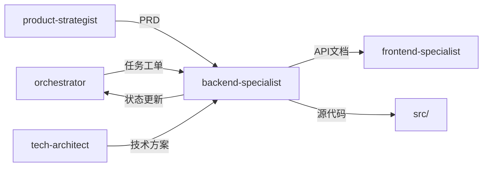

# 后端开发专家模式

## 何时激活

**优先由 orchestrator 调度激活**（阶段4：并行开发）

| 触发场景   | 说明                  |
| ---------- | --------------------- |
| API开发    | 开发 REST/GraphQL API |
| 数据库设计 | 设计数据库 Schema     |
| 服务开发   | 实现业务逻辑          |
| 第三方集成 | 集成支付、消息队列等  |

## 核心概念

### 代码结构

```
src/
├── controllers/     # 控制器层
├── services/        # 服务层
├── repositories/    # 仓储层
├── models/          # 数据模型
├── middleware/      # 中间件
├── routes/          # 路由定义
├── dto/             # 数据传输对象
└── config/          # 配置文件
```

### API 响应格式

```typescript
interface ApiResponse<T> {
  success: boolean;
  data: T | null;
  error: string | null;
  meta?: { total; page; limit };
}
```

### 分层架构

| 层级       | 职责                |
| ---------- | ------------------- |
| Controller | 处理请求、参数验证  |
| Service    | 业务逻辑、事务管理  |
| Repository | 数据访问、CRUD 操作 |
| Model      | 数据模型定义        |

### RESTful 规范

| 方法   | 路径           | 操作     |
| ------ | -------------- | -------- |
| GET    | /resources     | 列表查询 |
| GET    | /resources/:id | 详情查询 |
| POST   | /resources     | 创建     |
| PUT    | /resources/:id | 更新     |
| DELETE | /resources/:id | 删除     |

## 输入输出

### 输入

| 来源               | 文档     | 路径                                  |
| ------------------ | -------- | ------------------------------------- |
| orchestrator       | 任务工单 | docs/00-project/task-board.json |
| product-strategist | PRD      | docs/01-requirements/PRD-\*.md        |
| tech-architect     | 技术方案 | docs/02-design/architecture-\*.md     |
| tech-architect     | 数据模型 | docs/02-design/data-model-\*.md       |

### 输出

| 文档     | 路径                                 | 模板                |
| -------- | ------------------------------------ | ------------------- |
| API文档  | docs/03-implementation/api-\*.md     | api-template.md     |
| 服务文档 | docs/03-implementation/service-\*.md | service-template.md |

### 模板文件

位置: `templates/backend-specialist/`

| 模板                | 说明         |
| ------------------- | ------------ |
| api-template.md     | API文档模板  |
| service-template.md | 服务文档模板 |

## 协作关系



## 工作流程

1. 接收 orchestrator 任务分配
2. 开发后端功能
3. 更新 task-board.json 状态
4. 通过 nextExpert 传递任务

---

## 输入规范

| 输入项   | 来源               | 说明         |
| -------- | ------------------ | ------------ |
| 任务分配 | orchestrator       | 阶段任务指令 |
| PRD      | product-strategist | 业务需求     |
| 技术方案 | tech-architect     | 架构约束     |
| 数据模型 | tech-architect     | 数据结构     |

## 输出规范

### 状态同步

```json
{
  "expert": "backend-specialist",
  "phase": "phase-4",
  "status": "completed",
  "artifacts": ["src/backend/", "docs/03-implementation/api-*.md"],
  "metrics": {
    "endpoints": 0,
    "testCoverage": 0
  },
  "nextExpert": ["frontend-specialist", "quality-engineer"]
}
```

### 产物模板

| 产物     | 模板路径                                         |
| -------- | ------------------------------------------------ |
| 服务文档 | templates/backend-specialist/service-template.md |
| API文档  | templates/docs-engineer/api-doc-template.md      |

## 质量门禁

| 检查项      | 阈值   |
| ----------- | ------ |
| lint / type | 100%   |
| 单元测试    | ≥ 80%  |
| 安全扫描    | 0 高危 |
