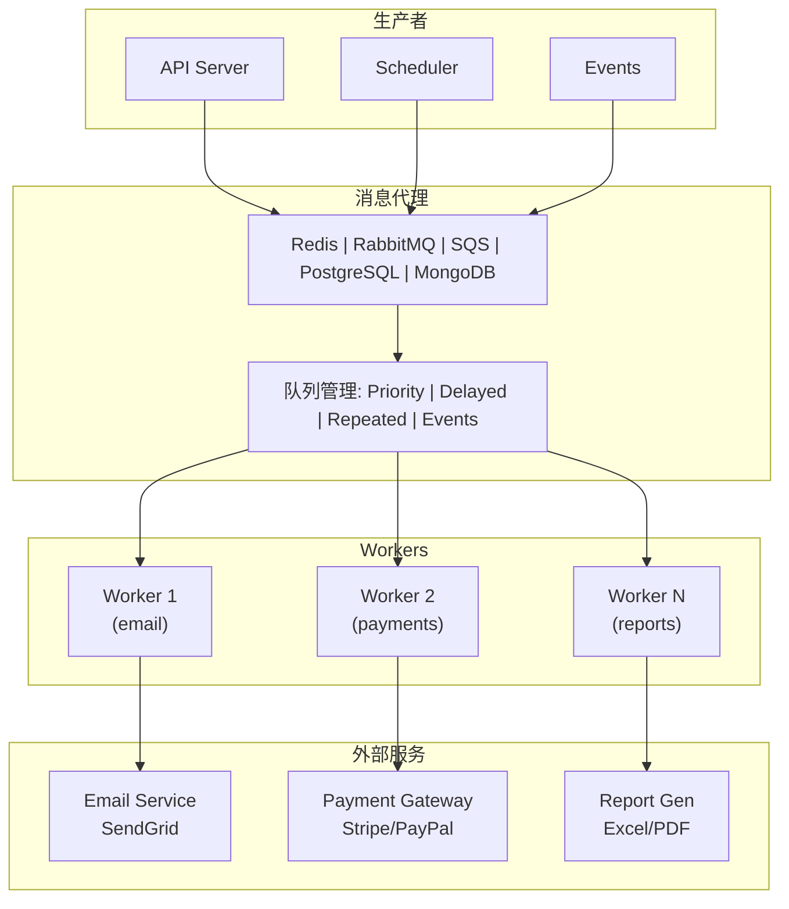
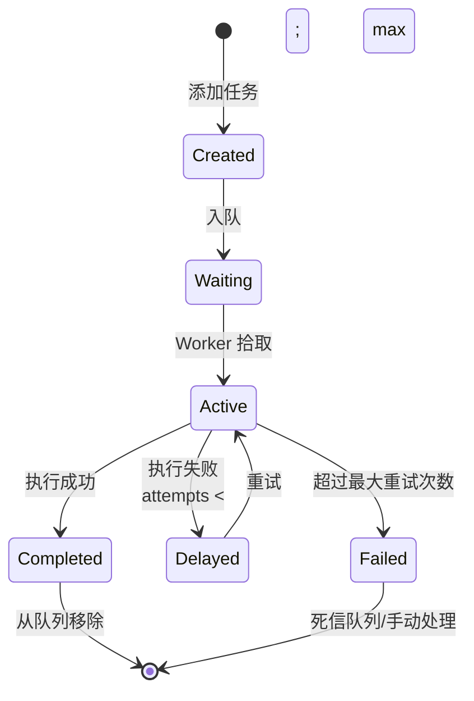

# 后台任务模式

> 任务队列、定时任务、异步处理的最佳实践

## 何时激活

- 实现异步任务处理时
- 配置定时任务（Cron、延迟任务）时
- 处理长时间运行任务（视频处理、数据导出）时
- 实现任务重试机制和失败处理时
- 设计任务优先级和任务调度时
- 需要分布式锁或幂等性处理时
- 构建事件驱动架构时
- 实现消息队列和事件分发时
- 处理批量任务和批处理作业时
- 需要任务监控和告警时

## 技术栈版本

| 技术     | 最低版本 | 推荐版本 |
| -------- | -------- | -------- |
| BullMQ   | 5.0+     | 最新     |
| Redis    | 7.0+     | 7.4+     |
| Agenda   | 5.0+     | 最新     |
| Temporal | 1.0+     | 最新     |
| pg-boss  | 8.0+     | 最新     |

---

## 架构模式

### 整体架构



### 任务生命周期



### 方案对比

| 方案     | 消息持久化 | 优先级  | 延迟任务 | 定时任务 | 吞吐量 | 复杂度 |
| -------- | ---------- | ------- | -------- | -------- | ------ | ------ |
| BullMQ   | ✅ Redis   | ✅      | ✅       | ✅       | 高     | 低     |
| Agenda   | ✅ MongoDB | ✅      | ✅       | ✅       | 中     | 低     |
| Temporal | ✅ 持久化  | ✅      | ✅       | ✅       | 高     | 高     |
| pg-boss  | ✅ Postgre | ✅      | ✅       | ✅       | 中     | 低     |
| RabbitMQ | ✅         | ✅      | ✅       | ❌       | 高     | 中     |
| SQS      | ✅ AWS     | ✅ FIFO | ✅       | ❌       | 高     | 低     |

---

## BullMQ

### 快速开始

```typescript
import { Queue, Worker, Job } from 'bullmq';
import Redis from 'ioredis';

const connection = new Redis(process.env.REDIS_URL, {
  maxRetriesPerRequest: null,
});

// 定义任务接口
interface EmailJob {
  to: string;
  subject: string;
  template: string;
  data: Record<string, unknown>;
}

// 创建队列
const emailQueue = new Queue<EmailJob>('email', { connection });

// 创建 worker
const emailWorker = new Worker<EmailJob>(
  'email',
  async (job: Job<EmailJob>) => {
    const { to, subject, template, data } = job.data;

    await job.updateProgress(10);
    const result = await sendEmail({ to, subject, template, data });
    await job.updateProgress(100);

    return { sent: true, to, messageId: result.id };
  },
  {
    connection,
    concurrency: 5,
    limiter: {
      max: 100,
      duration: 1000,
    },
  }
);
```

### 任务添加

```typescript
// 普通任务
async function scheduleEmail(data: EmailJob): Promise<string> {
  const job = await emailQueue.add('send', data, {
    attempts: 3,
    backoff: {
      type: 'exponential',
      delay: 1000,
    },
    removeOnComplete: { count: 100 },
    removeOnFail: { count: 500 },
  });
  return job.id!;
}

// 延迟任务
async function scheduleDelayedEmail(data: EmailJob, delayMs: number): Promise<string> {
  const job = await emailQueue.add('send', data, {
    delay: delayMs,
    attempts: 3,
  });
  return job.id!;
}

// 定时重复任务
async function scheduleRecurringEmail(data: EmailJob): Promise<string> {
  const job = await emailQueue.add('send', data, {
    repeat: {
      pattern: '0 9 * * *', // 每天上午9点
      tz: 'Asia/Shanghai',
    },
  });
  return job.id!;
}

// 批量添加
async function scheduleBulkEmails(batch: EmailJob[]): Promise<Job[]> {
  const jobs = batch.map((data, index) => ({
    name: 'send',
    data,
    opts: {
      priority: index, // 优先级
      attempts: 3,
    },
  }));
  return emailQueue.addBulk(jobs);
}
```

### 任务优先级

```typescript
const priorityQueue = new Queue('priority-tasks', { connection });

// 数字越小优先级越高
await priorityQueue.add('critical', { task: 'critical-task' }, { priority: 1 });
await priorityQueue.add('high', { task: 'high-task' }, { priority: 3 });
await priorityQueue.add('normal', { task: 'normal-task' }, { priority: 5 });
await priorityQueue.add('low', { task: 'low-task' }, { priority: 10 });

// 优先级队列消费顺序
// critical → high → normal → low
```

### 任务重试策略

```typescript
const worker = new Worker(
  'tasks',
  async (job) => {
    try {
      await processTask(job.data);
    } catch (error) {
      // 业务逻辑决定是否重试
      if (isRetryableError(error)) {
        throw error; // 触发重试
      }
      // 不可重试错误直接标记失败
      throw new Error('Non-retryable error', { cause: error });
    }
  },
  {
    connection,
    attempts: 5,
    backoff: {
      type: 'exponential',
      delay: 2000,
    },
    removeOnComplete: true,
    removeOnFail: { count: 1000 },
  }
);
```

### 重试策略对比

| 策略        | 说明           | 适用场景           |
| ----------- | -------------- | ------------------ |
| Fixed       | 固定延迟       | 简单重试           |
| Exponential | 指数退避       | 网络请求、API 调用 |
| Linear      | 线性增加延迟   | 资源清理任务       |
| Custom      | 自定义延迟函数 | 特殊业务逻辑       |

---

## 分布式锁

### Redis 分布式锁

```typescript
import { Redis } from 'ioredis';

class DistributedLock {
  constructor(
    private redis: Redis,
    private ttl: number = 30000
  ) {}

  async acquire(resource: string, ownerId: string): Promise<boolean> {
    const key = `lock:${resource}`;
    const result = await this.redis.set(key, ownerId, 'PX', this.ttl, 'NX');
    return result === 'OK';
  }

  async release(resource: string, ownerId: string): Promise<boolean> {
    const key = `lock:${resource}`;
    const script = `
      if redis.call("get", KEYS[1]) == ARGV[1] then
        return redis.call("del", KEYS[1])
      else
        return 0
      end
    `;
    const result = await this.redis.eval(script, 1, key, ownerId);
    return result === 1;
  }

  async extend(resource: string, ownerId: string, additionalTtl: number): Promise<boolean> {
    const key = `lock:${resource}`;
    const script = `
      if redis.call("get", KEYS[1]) == ARGV[1] then
        return redis.call("pexpire", KEYS[1], ARGV[2])
      else
        return 0
      end
    `;
    const result = await this.redis.eval(script, 1, key, ownerId, additionalTtl);
    return result === 1;
  }
}

// 使用
const lock = new DistributedLock(redis);

async function processWithLock(taskId: string) {
  const ownerId = `${process.pid}:${taskId}`;

  if (!(await lock.acquire(`task:${taskId}`, ownerId))) {
    throw new Error('Could not acquire lock');
  }

  try {
    await processTask(taskId);
  } finally {
    await lock.release(`task:${taskId}`, ownerId);
  }
}
```

### BullMQ 分布式锁

```typescript
import { Queue, Worker } from 'bullmq';

const queue = new Queue('tasks');

// 确保单实例处理
const worker = new Worker(
  'tasks',
  async (job) => {
    // 使用任务 ID 作为锁键
    const lockKey = `lock:task:${job.id}`;

    // 尝试获取锁
    const acquired = await job.lock(10000); // 10秒锁

    if (!acquired) {
      throw new Error('Could not acquire lock for this task');
    }

    try {
      await processTask(job.data);
    } finally {
      await job.releaseLock();
    }
  },
  { connection }
);
```

---

## 定时任务

### Cron 表达式

```typescript
// Cron 字段: 分 时 日 月 周
const patterns = {
  everyMinute: '* * * * *',
  everyHour: '0 * * * *',
  everyDay: '0 0 * * *',
  everyWeek: '0 0 * * 0',
  everyMonth: '0 0 1 * *',
  weekdays9am: '0 9 * * 1-5', // 工作日9点
  weekends: '0 0 * * 0,6',
};
```

### BullMQ 定时任务

```typescript
const queue = new Queue('scheduled-tasks', { connection });

// 每天凌晨执行
await queue.add(
  'cleanup',
  { task: 'cleanup-expired-sessions' },
  {
    repeat: {
      pattern: '0 2 * * *', // 每天凌晨2点
      tz: 'Asia/Shanghai',
    },
  }
);

// 每周一执行
await queue.add(
  'weekly-report',
  { reportType: 'weekly' },
  {
    repeat: {
      pattern: '0 9 * * 1', // 每周一9点
    },
  }
);

// 取消定时任务
const repeatableJobs = await queue.getRepeatableJobs();
for (const job of repeatableJobs) {
  if (job.name === 'cleanup') {
    await queue.removeRepeatableByKey(job.key);
  }
}
```

### Agenda 定时任务

```typescript
import Agenda from 'agenda';

const agenda = new Agenda({
  db: { address: process.env.MONGODB_URL, collection: 'agendaJobs' },
  processEvery: '1 minute',
});

agenda.define('send-digest', async (job) => {
  const { userId, frequency } = job.attrs.data;
  const digest = await generateDigest(userId, frequency);
  await sendEmailDigest(userId, digest);
});

agenda.define('cleanup-expired', async (job) => {
  await cleanupExpiredSessions();
  await cleanupOldLogs();
});

await agenda.start();

// 定时执行
await agenda.every('1 day', 'send-digest', { frequency: 'daily' });
await agenda.every('1 week', 'send-digest', { frequency: 'weekly' });

// 指定时间执行
await agenda.schedule('tomorrow at 10:00', 'send-digest', { userId: 123 });

// 立即执行
await agenda.now('cleanup-expired');

// 管理任务
await agenda.cancel({ name: 'send-digest' });
await agenda.purge();
```

---

## Temporal 工作流

### 工作流定义

```typescript
import { proxyActivities, defineWorkflow, defineSignal, setHandler } from '@temporalio/workflow';

const { sendEmail, processPayment, updateOrderStatus, sendSlackNotification } = proxyActivities({
  startToCloseTimeout: '1 minute',
  retry: {
    maximumAttempts: 3,
    initialInterval: '1s',
    backoffCoefficient: 2,
  },
});

export const orderWorkflow = defineWorkflow({
  name: 'orderWorkflow',
  signals: {
    cancel: defineSignal(),
    modifyShipping: defineSignal<[string]>(),
  },
  async execute(orderId: string) {
    let shippingAddress = '';

    // 处理取消信号
    setHandler('cancel', () => {
      throw new Error('Order cancelled by user');
    });

    // 处理修改地址信号
    setHandler('modifyShipping', (address: string) => {
      shippingAddress = address;
    });

    try {
      // 创建订单
      await updateOrderStatus(orderId, 'pending');

      // 处理支付
      const paymentResult = await processPayment(orderId);
      if (!paymentResult.success) {
        await updateOrderStatus(orderId, 'payment_failed');
        await sendSlackNotification(orderId, 'Payment failed');
        throw new Error('Payment failed');
      }

      // 更新状态
      await updateOrderStatus(orderId, 'processing');

      // 发送确认邮件
      await sendEmail(orderId, 'confirmation');

      // 完成
      await updateOrderStatus(orderId, 'completed');
      await sendEmail(orderId, 'completed');
    } catch (error) {
      await updateOrderStatus(orderId, 'failed');
      await sendSlackNotification(orderId, `Order failed: ${error.message}`);
      throw error;
    }
  },
});
```

### 活动（Activity）

```typescript
import { proxyActivity } from '@temporalio/workflow';

export const activities = {
  async sendEmail(orderId: string, template: string): Promise<void> {
    const order = await getOrder(orderId);
    const user = await getUser(order.userId);
    await emailService.send({
      to: user.email,
      template,
      data: { order },
    });
  },

  async processPayment(orderId: string): Promise<PaymentResult> {
    const order = await getOrder(orderId);
    return paymentGateway.charge({
      amount: order.total,
      currency: order.currency,
      customerId: order.customerId,
    });
  },

  async updateOrderStatus(orderId: string, status: OrderStatus): Promise<void> {
    await prisma.order.update({
      where: { id: orderId },
      data: { status },
    });
  },
};
```

### 信号处理

```typescript
import { WorkflowClient } from '@temporalio/client';

const client = new Client();

async function handleCancelRequest(orderId: string) {
  const handle = await client.workflow.getHandle(orderId);

  // 发送取消信号
  await handle.signal('cancel');

  // 等待结果
  const result = await handle.result();
}

async function handleModifyAddress(orderId: string, newAddress: string) {
  const handle = await client.workflow.getHandle(orderId);

  // 发送修改地址信号
  await handle.signal('modifyShipping', newAddress);
}
```

---

## 任务监控

### QueueEvents 监控

```typescript
import { QueueEvents } from 'bullmq';

const queueEvents = new QueueEvents('email', { connection });

queueEvents.on('waiting', ({ jobId }) => {
  console.log(`Job ${jobId} is waiting`);
  metrics.increment('job_waiting');
});

queueEvents.on('active', ({ jobId }) => {
  console.log(`Job ${jobId} is now active`);
  metrics.increment('job_active');
});

queueEvents.on('completed', ({ jobId, returnvalue }) => {
  console.log(`Job ${jobId} completed:`, returnvalue);
  metrics.increment('job_completed');
  metrics.timing('job_duration', Date.now() - job.timestamp);
});

queueEvents.on('failed', ({ jobId, failedReason }) => {
  console.error(`Job ${jobId} failed:`, failedReason);
  metrics.increment('job_failed');
  metrics.increment(`job_failed_reason:${getErrorType(failedReason)}`);
});

queueEvents.on('progress', ({ jobId, data }) => {
  metrics.gauge('job_progress', data);
});

queueEvents.on('stalled', ({ jobId }) => {
  console.warn(`Job ${jobId} stalled`);
  metrics.increment('job_stalled');
  // 触发告警
  alertService.notify('Job stalled', { jobId });
});
```

### 任务状态统计

```typescript
interface QueueMetrics {
  waiting: number;
  active: number;
  completed: number;
  failed: number;
  delayed: number;
  paused: number;
  total: number;
}

async function getQueueMetrics(queue: Queue): Promise<QueueMetrics> {
  const [waiting, active, completed, failed, delayed, paused] = await Promise.all([
    queue.getWaitingCount(),
    queue.getActiveCount(),
    queue.getCompletedCount(),
    queue.getFailedCount(),
    queue.getDelayedCount(),
    queue.getPausedCount(),
  ]);

  return {
    waiting,
    active,
    completed,
    failed,
    delayed,
    paused,
    total: waiting + active + delayed,
  };
}

async function checkQueueHealth(): Promise<HealthStatus> {
  const metrics = await getQueueMetrics(emailQueue);

  const healthy = metrics.failed < 100 && metrics.delayed < 1000 && metrics.waiting < 5000;

  return {
    healthy,
    metrics,
    alerts: [
      ...(metrics.failed > 100 ? ['High failure count'] : []),
      ...(metrics.delayed > 1000 ? ['Task backlog detected'] : []),
      ...(metrics.waiting > 5000 ? ['Queue congestion'] : []),
    ],
  };
}
```

### 健康检查端点

```typescript
app.get('/health/queues', async (req, res) => {
  const queues = [emailQueue, paymentQueue, notificationQueue];
  const results = await Promise.all(
    queues.map(async (q) => {
      const metrics = await getQueueMetrics(q);
      return {
        name: q.name,
        ...metrics,
      };
    })
  );

  const allHealthy = results.every((r) => r.failed < 100 && r.delayed < 1000);

  res.status(allHealthy ? 200 : 503).json({
    status: allHealthy ? 'healthy' : 'degraded',
    timestamp: new Date().toISOString(),
    queues: results,
  });
});
```

---

## 错误处理

### 错误分类

```typescript
enum ErrorType {
  RETRYABLE = 'RETRYABLE', // 可重试错误
  TRANSIENT = 'TRANSIENT', // 临时错误（网络）
  BUSINESS = 'BUSINESS', // 业务错误（余额不足）
  FATAL = 'FATAL', // 致命错误（数据损坏）
}

interface TaskError {
  type: ErrorType;
  message: string;
  retryable: boolean;
  shouldAlert: boolean;
}

function classifyError(error: unknown): TaskError {
  if (error instanceof NetworkError) {
    return {
      type: ErrorType.TRANSIENT,
      message: error.message,
      retryable: true,
      shouldAlert: false,
    };
  }

  if (error instanceof BusinessError) {
    return {
      type: ErrorType.BUSINESS,
      message: error.message,
      retryable: false,
      shouldAlert: true,
    };
  }

  if (error instanceof DataCorruptionError) {
    return {
      type: ErrorType.FATAL,
      message: error.message,
      retryable: false,
      shouldAlert: true,
    };
  }

  return {
    type: ErrorType.RETRYABLE,
    message: String(error),
    retryable: true,
    shouldAlert: false,
  };
}
```

### 死信队列

```typescript
const deadLetterQueue = new Queue('dead-letter', { connection });

const worker = new Worker(
  'tasks',
  async (job) => {
    try {
      await processTask(job.data);
    } catch (error) {
      const errorInfo = classifyError(error);

      if (!errorInfo.retryable || job.attemptsMade >= job.opts.attempts!) {
        // 转移到死信队列
        await deadLetterQueue.add(
          'failed-task',
          {
            originalQueue: job.queueName,
            originalJobId: job.id,
            data: job.data,
            error: errorInfo.message,
            errorType: errorInfo.type,
            attemptsMade: job.attemptsMade,
            failedAt: new Date().toISOString(),
          },
          {
            attempts: 3,
            backoff: { type: 'fixed', delay: 5000 },
          }
        );

        // 记录日志
        logger.error('Task moved to DLQ', {
          originalJobId: job.id,
          error: errorInfo,
        });

        // 触发告警
        if (errorInfo.shouldAlert) {
          alertService.notify('Task failed permanently', {
            jobId: job.id,
            error: errorInfo,
          });
        }
      }

      throw error;
    }
  },
  { connection }
);
```

### 优雅关闭

```typescript
async function gracefulShutdown() {
  console.log('Shutting down workers...');

  // 停止接收新任务
  await worker.close();
  await emailQueue.close();

  // 等待当前任务完成（最多30秒）
  const isPaused = await worker.pause(true);

  if (!isPaused) {
    console.log('Force closing after timeout');
    await worker.close({ force: true });
  }

  console.log('Workers shut down');
  process.exit(0);
}

process.on('SIGTERM', gracefulShutdown);
process.on('SIGINT', gracefulShutdown);
```

---

## 最佳实践

### 任务设计原则

| 原则     | 说明                   | 示例               |
| -------- | ---------------------- | ------------------ |
| 幂等性   | 任务可安全重试多次     | 使用唯一任务ID防重 |
| 原子性   | 任务要么成功，要么回滚 | 事务 + 补偿机制    |
| 独立性   | 任务间无依赖           | 避免共享状态       |
| 可观测性 | 任务有日志、进度、状态 | 结构化日志 + 指标  |
| 超时控制 | 任务有最大执行时间     | 设置合理 timeout   |
| 优雅关闭 | 服务停止时等待任务完成 | SIGTERM 处理       |
| 优先级   | 紧急任务优先处理       | 数字越小优先级越高 |
| 批处理   | 合并小任务减少开销     | 批量发送、批量处理 |

### 任务大小控制

```typescript
// ✅ GOOD: 合理的任务大小
interface ProcessOrderTask {
  orderId: string; // 单个订单
}

// ❌ BAD: 任务包含过多数据
interface ProcessOrdersTask {
  orderIds: string[]; // 1000个订单，JSON可能过大
}

// ✅ GOOD: 使用分页/游标
async function processOrdersInBatches() {
  let cursor: string | undefined;

  do {
    const { orders, nextCursor } = await getOrders(cursor, 100);
    await queue.addBulk(
      orders.map((order) => ({
        name: 'process-order',
        data: { orderId: order.id },
      }))
    );
    cursor = nextCursor;
  } while (cursor);
}
```

### 性能优化

```typescript
// 1. 控制并发数
const worker = new Worker('tasks', processor, {
  connection,
  concurrency: 10, // 根据CPU和内存调整
});

// 2. 使用 Limiter 限制速率
const queue = new Queue('api-calls', {
  connection,
  limiter: {
    max: 100, // 每duration内最多100个
    duration: 1000,
  },
});

// 3. 批量处理
const worker = new Worker(
  'batch-tasks',
  async (jobs) => {
    const items = jobs.map((j) => j.data);
    const results = await processBatch(items);
    return results;
  },
  {
    connection,
    batchSize: 100, // 每批100个
    batchInterval: 1000, // 或每1秒处理一批
  }
);
```

---

## 快速检查清单

### 开发前

- [ ] 选择合适的队列方案（BullMQ/Agenda/Temporal）
- [ ] 设计任务接口和类型
- [ ] 确定重试策略和最大尝试次数
- [ ] 设计死信队列处理流程
- [ ] 确定监控和告警策略

### 开发中

- [ ] 实现任务幂等性
- [ ] 添加任务进度更新
- [ ] 实现优雅关闭
- [ ] 添加结构化日志
- [ ] 配置合理的超时时间
- [ ] 实现任务优先级

### 发布前

- [ ] 压测队列性能
- [ ] 配置监控仪表盘
- [ ] 设置告警阈值
- [ ] 验证重试机制
- [ ] 验证死信处理
- [ ] 文档更新

---

## 参考

- [BullMQ Docs](https://docs.bullmq.io/)
- [Agenda Docs](https://github.com/agenda/agenda)
- [Temporal Docs](https://docs.temporal.io/)
- [pg-boss](https://github.com/timgit/pg-boss)
- [Redis Distributed Locks](https://redis.io/docs/manual/patterns/distributed-locks/)
