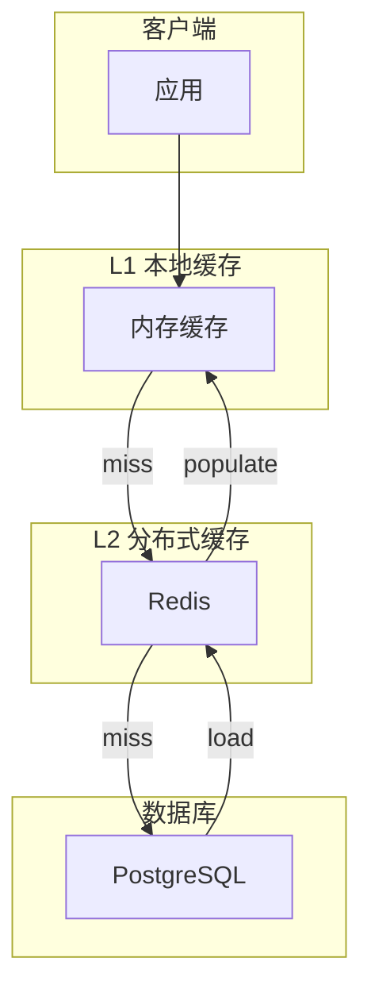

# 缓存策略模式

> 多级缓存、缓存一致性、性能优化的最佳实践

## 何时激活

- 实现缓存层
- 设计缓存策略
- 处理缓存穿透/雪崩/击穿
- 优化读取性能
- 保证缓存一致性

## 技术栈版本

| 技术          | 最低版本 | 推荐版本 |
| ------------- | -------- | -------- |
| Redis         | 7.0+     | 最新     |
| Memcached     | 1.6+     | 最新     |
| Caffeine      | 3.0+     | 最新     |
| cache-manager | 4.0+     | 最新     |

## 缓存策略对比

| 策略          | 说明                 | 适用场景         |
| ------------- | -------------------- | ---------------- |
| Cache-Aside   | 应用直接管理缓存     | 读多写少         |
| Read-Through  | 缓存自动加载数据     | 简化应用代码     |
| Write-Through | 同步写入缓存和存储   | 数据一致性要求高 |
| Write-Behind  | 异步写入存储         | 写入性能要求高   |
| Refresh-Ahead | 预刷新即将过期的数据 | 可预测的热点数据 |

## 缓存架构



## 多级缓存实现

### 1. 本地内存缓存 (L1)

```typescript
import { Cache } from '@cache-manager/core';
import { MemoryStore } from '@cache-manager/memory';

interface CachedValue<T> {
  value: T;
  expiresAt: number;
}

class TwoLevelCache<T> {
  private l1: Map<string, CachedValue<T>> = new Map();
  private l2: Cache;

  constructor(
    private ttl: number = 3600,
    private maxL1Size: number = 1000
  ) {
    this.l2 = new Cache({
      store: new MemoryStore(),
      ttl: this.ttl,
    });
  }

  async get(key: string): Promise<T | null> {
    // L1 查找
    const l1Value = this.l1.get(key);
    if (l1Value && l1Value.expiresAt > Date.now()) {
      return l1Value.value;
    }

    // L2 查找
    const l2Value = await this.l2.get(key);
    if (l2Value) {
      this.setL1(key, l2Value);
      return l2Value;
    }

    return null;
  }

  async set(key: string, value: T): Promise<void> {
    this.setL1(key, value);
    await this.l2.set(key, value);
  }

  private setL1(key: string, value: T): void {
    if (this.l1.size >= this.maxL1Size) {
      const firstKey = this.l1.keys().next().value;
      this.l1.delete(firstKey);
    }
    this.l1.set(key, {
      value,
      expiresAt: Date.now() + this.ttl * 1000,
    });
  }

  async delete(key: string): Promise<void> {
    this.l1.delete(key);
    await this.l2.del(key);
  }
}
```

### 2. Redis 分布式缓存 (L2)

```typescript
import Redis from 'ioredis';

class RedisCache {
  constructor(
    private redis: Redis,
    private prefix: string = 'cache:'
  ) {}

  async get<T>(key: string): Promise<T | null> {
    const value = await this.redis.get(`${this.prefix}${key}`);
    return value ? JSON.parse(value) : null;
  }

  async set<T>(key: string, value: T, ttlSeconds: number = 3600): Promise<void> {
    await this.redis.setex(`${this.prefix}${key}`, ttlSeconds, JSON.stringify(value));
  }

  async delete(key: string): Promise<void> {
    await this.redis.del(`${this.prefix}${key}`);
  }

  async getOrSet<T>(key: string, factory: () => Promise<T>, ttlSeconds: number = 3600): Promise<T> {
    const cached = await this.get<T>(key);
    if (cached !== null) return cached;

    const value = await factory();
    await this.set(key, value, ttlSeconds);
    return value;
  }
}
```

## 缓存问题处理

### 1. 缓存穿透（Cache Penetration）

```typescript
class CachePenetrationProtection {
  constructor(
    private cache: RedisCache,
    private bloomFilter: BloomFilter
  ) {}

  async getOrLoad<T>(key: string, loader: () => Promise<T>, ttl: number = 3600): Promise<T | null> {
    // 布隆过滤器检查
    if (!this.bloomFilter.mightContain(key)) {
      return null; // 一定不存在
    }

    const cached = await this.cache.get<T>(key);
    if (cached !== null) return cached;

    const value = await loader();
    if (value === null) {
      // 缓存空值，防止穿透
      await this.cache.set(key, null, 60); // 短TTL
      return null;
    }

    await this.cache.set(key, value, ttl);
    return value;
  }
}
```

### 2. 缓存雪崩（Cache Avalanche）

```typescript
class CacheAvalancheProtection {
  constructor(private cache: RedisCache) {}

  async setWithJitter(key: string, value: unknown, baseTtl: number = 3600): Promise<void> {
    // 添加随机抖动：±10%
    const jitter = baseTtl * 0.1 * (Math.random() * 2 - 1);
    const ttl = Math.floor(baseTtl + jitter);
    await this.cache.set(key, value, ttl);
  }

  async mgetWithLock<T>(
    keys: string[],
    loader: (keys: string[]) => Promise<Map<string, T>>
  ): Promise<Map<string, T>> {
    const results = new Map<string, T>();
    const missingKeys: string[] = [];

    // 批量获取
    for (const key of keys) {
      const value = await this.cache.get<T>(key);
      if (value !== null) {
        results.set(key, value);
      } else {
        missingKeys.push(key);
      }
    }

    // 加载缺失的key
    if (missingKeys.length > 0) {
      const loaded = await loader(missingKeys);
      for (const [key, value] of loaded) {
        await this.setWithJitter(key, value);
        results.set(key, value);
      }
    }

    return results;
  }
}
```

### 3. 缓存击穿（Cache Breakdown）

```typescript
class CacheBreakdownProtection {
  private locks = new Map<string, Promise<unknown>>();

  constructor(private cache: RedisCache) {}

  async getOrLoad<T>(key: string, loader: () => Promise<T>, ttl: number = 3600): Promise<T> {
    const cached = await this.cache.get<T>(key);
    if (cached !== null) return cached;

    // 检查是否已有其他请求在加载
    const existingLock = this.locks.get(key);
    if (existingLock) {
      return existingLock as Promise<T>;
    }

    // 创建加载锁
    const loadPromise = loader().then(async (value) => {
      await this.cache.set(key, value, ttl);
      this.locks.delete(key);
      return value;
    });

    this.locks.set(key, loadPromise);

    try {
      return await loadPromise;
    } catch (error) {
      this.locks.delete(key);
      throw error;
    }
  }
}
```

## 缓存一致性

### 1. Cache-Aside 模式

```typescript
class CacheAsideRepository<T> {
  constructor(
    private cache: RedisCache,
    private db: Database,
    private cacheTtl: number = 3600
  ) {}

  async findById(id: string): Promise<T | null> {
    // 读：Cache-Aside
    const cached = await this.cache.get<T>(`${this.tableName}:${id}`);
    if (cached) return cached;

    const entity = await this.db.findById(this.tableName, id);
    if (entity) {
      await this.cache.set(`${this.tableName}:${id}`, entity, this.cacheTtl);
    }
    return entity;
  }

  async save(id: string, entity: T): Promise<void> {
    // 写：先更新数据库，再删除缓存
    await this.db.save(this.tableName, id, entity);
    await this.cache.delete(`${this.tableName}:${id}`);
  }

  async delete(id: string): Promise<void> {
    await this.db.delete(this.tableName, id);
    await this.cache.delete(`${this.tableName}:${id}`);
  }
}
```

### 2. Write-Through 模式

```typescript
class WriteThroughCache<T> {
  constructor(
    private cache: RedisCache,
    private db: Database
  ) {}

  async save(id: string, entity: T, ttl: number = 3600): Promise<void> {
    // 同步写入缓存和数据库
    await Promise.all([
      this.db.save(this.tableName, id, entity),
      this.cache.set(`${this.tableName}:${id}`, entity, ttl),
    ]);
  }
}
```

## 缓存监控

```typescript
interface CacheMetrics {
  hits: number;
  misses: number;
  evictions: number;
  size: number;
}

class CacheMonitor {
  private metrics = {
    hits: 0,
    misses: 0,
    evictions: 0,
  };

  recordHit(): void {
    this.metrics.hits++;
  }

  recordMiss(): void {
    this.metrics.misses++;
  }

  getHitRate(): number {
    const total = this.metrics.hits + this.metrics.misses;
    return total > 0 ? this.metrics.hits / total : 0;
  }

  getMetrics(): CacheMetrics {
    return {
      ...this.metrics,
      size: this.getCurrentSize(),
    };
  }
}
```

## 缓存策略模式

### 策略接口抽象

```typescript
interface CacheEntry<T> {
  key: string;
  value: T;
  createdAt: number;
  expiresAt?: number;
  accessCount: number;
}

interface CacheStrategy<T> {
  name: string;
  get(key: string): CacheEntry<T> | undefined;
  set(key: string, value: T, ttl?: number): void;
  delete(key: string): boolean;
  clear(): void;
  getAll(): CacheEntry<T>[];
  getSize(): number;
  getKeys(): string[];
  has(key: string): boolean;
}

interface CacheStats {
  hits: number;
  misses: number;
  evictions: number;
  hitRate: number;
}

abstract class BaseCacheStrategy<T> implements CacheStrategy<T> {
  abstract name: string;
  protected store: Map<string, CacheEntry<T>> = new Map();
  protected stats: CacheStats = { hits: 0, misses: 0, evictions: 0, hitRate: 0 };
  protected maxSize: number;
  protected defaultTtl?: number;

  constructor(maxSize: number = 1000, defaultTtl?: number) {
    this.maxSize = maxSize;
    this.defaultTtl = defaultTtl;
  }

  abstract evict(): void;

  get(key: string): CacheEntry<T> | undefined {
    const entry = this.store.get(key);
    if (!entry) {
      this.stats.misses++;
      this.updateHitRate();
      return undefined;
    }
    if (entry.expiresAt && entry.expiresAt < Date.now()) {
      this.store.delete(key);
      this.stats.misses++;
      this.stats.evictions++;
      this.updateHitRate();
      return undefined;
    }
    this.stats.hits++;
    this.updateHitRate();
    return this.onAccess(entry);
  }

  set(key: string, value: T, ttl?: number): void {
    if (this.store.size >= this.maxSize && !this.store.has(key)) {
      this.evict();
    }
    const now = Date.now();
    const entry: CacheEntry<T> = {
      key,
      value,
      createdAt: now,
      expiresAt: ttl
        ? now + ttl * 1000
        : this.defaultTtl
          ? now + this.defaultTtl * 1000
          : undefined,
      accessCount: 0,
    };
    this.store.set(key, entry);
  }

  delete(key: string): boolean {
    return this.store.delete(key);
  }

  clear(): void {
    this.store.clear();
    this.stats = { hits: 0, misses: 0, evictions: 0, hitRate: 0 };
  }

  getAll(): CacheEntry<T>[] {
    return Array.from(this.store.values());
  }

  getSize(): number {
    return this.store.size;
  }

  getKeys(): string[] {
    return Array.from(this.store.keys());
  }

  has(key: string): boolean {
    const entry = this.store.get(key);
    if (!entry) return false;
    if (entry.expiresAt && entry.expiresAt < Date.now()) {
      this.store.delete(key);
      return false;
    }
    return true;
  }

  getStats(): CacheStats {
    return { ...this.stats };
  }

  protected abstract onAccess(entry: CacheEntry<T>): CacheEntry<T>;

  private updateHitRate(): void {
    const total = this.stats.hits + this.stats.misses;
    this.stats.hitRate = total > 0 ? this.stats.hits / total : 0;
  }
}
```

### LRU (Least Recently Used) 策略

```typescript
class LruCacheStrategy<T> extends BaseCacheStrategy<T> {
  name = 'LRU';
  private accessOrder: string[] = [];

  protected onAccess(entry: CacheEntry<T>): CacheEntry<T> {
    entry.accessCount++;
    const idx = this.accessOrder.indexOf(entry.key);
    if (idx > -1) {
      this.accessOrder.splice(idx, 1);
    }
    this.accessOrder.push(entry.key);
    return entry;
  }

  evict(): void {
    if (this.accessOrder.length > 0) {
      const oldest = this.accessOrder.shift();
      if (oldest) {
        this.store.delete(oldest);
        this.stats.evictions++;
      }
    }
  }

  set(key: string, value: T, ttl?: number): void {
    if (this.store.has(key)) {
      const idx = this.accessOrder.indexOf(key);
      if (idx > -1) {
        this.accessOrder.splice(idx, 1);
      }
    }
    super.set(key, value, ttl);
    this.accessOrder.push(key);
  }

  delete(key: string): boolean {
    const idx = this.accessOrder.indexOf(key);
    if (idx > -1) {
      this.accessOrder.splice(idx, 1);
    }
    return super.delete(key);
  }
}
```

### FIFO (First In First Out) 策略

```typescript
class FifoCacheStrategy<T> extends BaseCacheStrategy<T> {
  name = 'FIFO';
  private insertionOrder: string[] = [];

  protected onAccess(entry: CacheEntry<T>): CacheEntry<T> {
    entry.accessCount++;
    return entry;
  }

  evict(): void {
    if (this.insertionOrder.length > 0) {
      const oldest = this.insertionOrder.shift();
      if (oldest) {
        this.store.delete(oldest);
        this.stats.evictions++;
      }
    }
  }

  set(key: string, value: T, ttl?: number): void {
    if (!this.store.has(key)) {
      this.insertionOrder.push(key);
    }
    super.set(key, value, ttl);
  }

  delete(key: string): boolean {
    const idx = this.insertionOrder.indexOf(key);
    if (idx > -1) {
      this.insertionOrder.splice(idx, 1);
    }
    return super.delete(key);
  }
}
```

### TTL (Time To Live) 策略

```typescript
class TtlCacheStrategy<T> extends BaseCacheStrategy<T> {
  name = 'TTL';
  private expirations: Map<string, number> = new Map();
  private cleanupInterval?: NodeJS.Timeout;

  constructor(maxSize: number = 1000, defaultTtl: number = 3600, autoCleanup = true) {
    super(maxSize, defaultTtl);
    if (autoCleanup) {
      this.startCleanup();
    }
  }

  protected onAccess(entry: CacheEntry<T>): CacheEntry<T> {
    entry.accessCount++;
    return entry;
  }

  evict(): void {
    const now = Date.now();
    let oldestKey: string | null = null;
    let oldestTime = Infinity;

    for (const [key, expiresAt] of this.expirations) {
      if (expiresAt < oldestTime) {
        oldestTime = expiresAt;
        oldestKey = key;
      }
    }

    if (oldestKey && oldestTime < now) {
      this.store.delete(oldestKey);
      this.expirations.delete(oldestKey);
      this.stats.evictions++;
    } else if (oldestKey) {
      const oldest = this.insertionOrder?.shift();
      if (oldest) {
        this.store.delete(oldest);
        this.expirations.delete(oldest);
        this.stats.evictions++;
      }
    }
  }

  set(key: string, value: T, ttl?: number): void {
    const now = Date.now();
    const expiration = ttl
      ? now + ttl * 1000
      : this.defaultTtl
        ? now + this.defaultTtl * 1000
        : Infinity;
    this.expirations.set(key, expiration);
    super.set(key, value, ttl);
  }

  delete(key: string): boolean {
    this.expirations.delete(key);
    return super.delete(key);
  }

  clear(): void {
    super.clear();
    this.expirations.clear();
  }

  private startCleanup(): void {
    this.cleanupInterval = setInterval(() => {
      this.cleanup();
    }, 60000);
  }

  private cleanup(): void {
    const now = Date.now();
    for (const [key, expiresAt] of this.expirations) {
      if (expiresAt < now) {
        this.store.delete(key);
        this.expirations.delete(key);
        this.stats.evictions++;
      }
    }
  }

  destroy(): void {
    if (this.cleanupInterval) {
      clearInterval(this.cleanupInterval);
    }
  }
}
```

### LFU (Least Frequently Used) 策略

```typescript
class LfuCacheStrategy<T> extends BaseCacheStrategy<T> {
  name = 'LFU';
  private frequencyMap: Map<string, number> = new Map();
  private minFrequency = 1;

  protected onAccess(entry: CacheEntry<T>): CacheEntry<T> {
    const newFreq = (this.frequencyMap.get(entry.key) || 0) + 1;
    this.frequencyMap.set(entry.key, newFreq);
    entry.accessCount = newFreq;
    if (newFreq < this.minFrequency) {
      this.minFrequency = newFreq;
    }
    return entry;
  }

  evict(): void {
    let victimKey: string | null = null;
    let minFreq = Infinity;

    for (const [key, freq] of this.frequencyMap) {
      if (freq < minFreq) {
        minFreq = freq;
        victimKey = key;
      }
    }

    if (victimKey) {
      this.store.delete(victimKey);
      this.frequencyMap.delete(victimKey);
      this.stats.evictions++;
      this.recalculateMinFrequency();
    }
  }

  set(key: string, value: T, ttl?: number): void {
    if (!this.store.has(key)) {
      this.frequencyMap.set(key, 0);
    }
    super.set(key, value, ttl);
  }

  delete(key: string): boolean {
    const deleted = super.delete(key);
    if (deleted) {
      this.frequencyMap.delete(key);
      this.recalculateMinFrequency();
    }
    return deleted;
  }

  clear(): void {
    super.clear();
    this.frequencyMap.clear();
    this.minFrequency = 1;
  }

  private recalculateMinFrequency(): void {
    this.minFrequency = Infinity;
    for (const freq of this.frequencyMap.values()) {
      if (freq < this.minFrequency) {
        this.minFrequency = freq;
      }
    }
    if (this.minFrequency === Infinity) {
      this.minFrequency = 1;
    }
  }
}
```

### 策略注册与管理机制

```typescript
type CacheStrategyConstructor<T> = new (
  maxSize?: number,
  defaultTtl?: number,
  ...args: unknown[]
) => CacheStrategy<T>;

class CacheStrategyRegistry<T> {
  private strategies: Map<string, CacheStrategyConstructor<T>> = new Map();
  private activeStrategy?: CacheStrategy<T>;

  register(name: string, strategy: CacheStrategyConstructor<T>): void {
    this.strategies.set(name, strategy);
  }

  create(name: string, maxSize?: number, defaultTtl?: number): CacheStrategy<T> {
    const Constructor = this.strategies.get(name);
    if (!Constructor) {
      throw new Error(
        `Cache strategy '${name}' not found. Available: ${Array.from(this.strategies.keys()).join(', ')}`
      );
    }
    return new Constructor(maxSize, defaultTtl);
  }

  setActiveStrategy(strategy: CacheStrategy<T>): void {
    this.activeStrategy = strategy;
  }

  getActiveStrategy(): CacheStrategy<T> | undefined {
    return this.activeStrategy;
  }

  getAvailableStrategies(): string[] {
    return Array.from(this.strategies.keys());
  }

  switchStrategy(name: string, maxSize?: number, defaultTtl?: number): CacheStrategy<T> {
    const newStrategy = this.create(name, maxSize, defaultTtl);
    this.setActiveStrategy(newStrategy);
    return newStrategy;
  }
}

const registry = new CacheStrategyRegistry<unknown>();

registry.register('LRU', LruCacheStrategy);
registry.register('FIFO', FifoCacheStrategy);
registry.register('TTL', TtlCacheStrategy);
registry.register('LFU', LfuCacheStrategy);
```

### 统一缓存接口

```typescript
interface CacheOptions {
  strategy?: string;
  maxSize?: number;
  defaultTtl?: number;
  enableStats?: boolean;
}

class CacheManager<T> {
  private strategy: CacheStrategy<T>;
  private options: CacheOptions;
  private stats: CacheStats = { hits: 0, misses: 0, evictions: 0, hitRate: 0 };

  constructor(options: CacheOptions = {}) {
    this.options = options;
    const strategyName = options.strategy || 'LRU';
    this.strategy = registry.create(strategyName, options.maxSize, options.defaultTtl);
  }

  async get(key: string): Promise<T | undefined> {
    const entry = this.strategy.get(key);
    return entry?.value;
  }

  async set(key: string, value: T, ttl?: number): Promise<void> {
    this.strategy.set(key, value, ttl);
  }

  async delete(key: string): Promise<boolean> {
    return this.strategy.delete(key);
  }

  async clear(): Promise<void> {
    this.strategy.clear();
  }

  async has(key: string): Promise<boolean> {
    return this.strategy.has(key);
  }

  getStats(): CacheStats {
    return this.strategy.getStats();
  }

  getSize(): number {
    return this.strategy.getSize();
  }

  switchStrategy(name: string): void {
    this.strategy = registry.switchStrategy(name, this.options.maxSize, this.options.defaultTtl);
  }
}

function createCache<T>(options: CacheOptions = {}): CacheManager<T> {
  return new CacheManager<T>(options);
}
```

### 使用示例

```typescript
const cache = createCache({
  strategy: 'LRU',
  maxSize: 1000,
  defaultTtl: 3600,
});

await cache.set('user:1', { name: 'Alice', age: 30 });
await cache.set('user:2', { name: 'Bob', age: 25 });
const user1 = await cache.get('user:1');
const hasUser = await cache.has('user:1');
const stats = cache.getStats();
console.log(`Hit rate: ${(stats.hitRate * 100).toFixed(2)}%`);

cache.switchStrategy('LFU');
```

## 单元测试

```typescript
import { describe, it, expect, beforeEach, vi } from 'vitest';

describe('LRU Cache Strategy', () => {
  let cache: LruCacheStrategy<string>;

  beforeEach(() => {
    cache = new LruCacheStrategy<string>(3);
  });

  it('should store and retrieve values', () => {
    cache.set('a', '1');
    expect(cache.get('a')?.value).toBe('1');
  });

  it('should evict least recently used item when full', () => {
    cache.set('a', '1');
    cache.set('b', '2');
    cache.set('c', '3');
    cache.set('d', '4');
    expect(cache.get('a')).toBeUndefined();
    expect(cache.get('d')?.value).toBe('4');
  });

  it('should update access order on get', () => {
    cache.set('a', '1');
    cache.set('b', '2');
    cache.get('a');
    cache.set('c', '3');
    cache.set('d', '4');
    expect(cache.get('a')?.value).toBe('1');
  });

  it('should track hits and misses', () => {
    cache.set('a', '1');
    cache.get('a');
    cache.get('b');
    const stats = cache.getStats();
    expect(stats.hits).toBe(1);
    expect(stats.misses).toBe(1);
    expect(stats.hitRate).toBe(0.5);
  });
});

describe('FIFO Cache Strategy', () => {
  let cache: FifoCacheStrategy<string>;

  beforeEach(() => {
    cache = new FifoCacheStrategy<string>(3);
  });

  it('should evict first inserted item when full', () => {
    cache.set('a', '1');
    cache.set('b', '2');
    cache.set('c', '3');
    cache.set('d', '4');
    expect(cache.get('a')).toBeUndefined();
    expect(cache.get('d')?.value).toBe('4');
  });
});

describe('TTL Cache Strategy', () => {
  let cache: TtlCacheStrategy<string>;

  beforeEach(() => {
    cache = new TtlCacheStrategy<string>(10, 1, false);
  });

  it('should expire items after TTL', async () => {
    cache.set('a', '1', 1);
    expect(cache.get('a')?.value).toBe('1');
    await new Promise((r) => setTimeout(r, 1100));
    expect(cache.get('a')).toBeUndefined();
  });
});

describe('LFU Cache Strategy', () => {
  let cache: LfuCacheStrategy<string>;

  beforeEach(() => {
    cache = new LfuCacheStrategy<string>(3);
  });

  it('should evict least frequently used item when full', () => {
    cache.set('a', '1');
    cache.set('b', '2');
    cache.set('c', '3');
    cache.get('a');
    cache.get('a');
    cache.set('d', '4');
    expect(cache.get('b')).toBeUndefined();
    expect(cache.get('a')?.value).toBe('1');
  });
});

describe('Cache Manager', () => {
  it('should switch strategies dynamically', () => {
    const cache = createCache<string>({ strategy: 'LRU', maxSize: 2 });
    cache.set('a', '1');
    cache.set('b', '2');
    cache.switchStrategy('FIFO');
    cache.set('c', '3');
    expect(cache.get('a')).toBeUndefined();
  });
});
```
