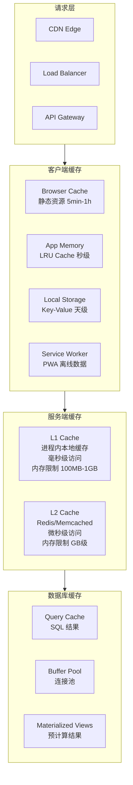
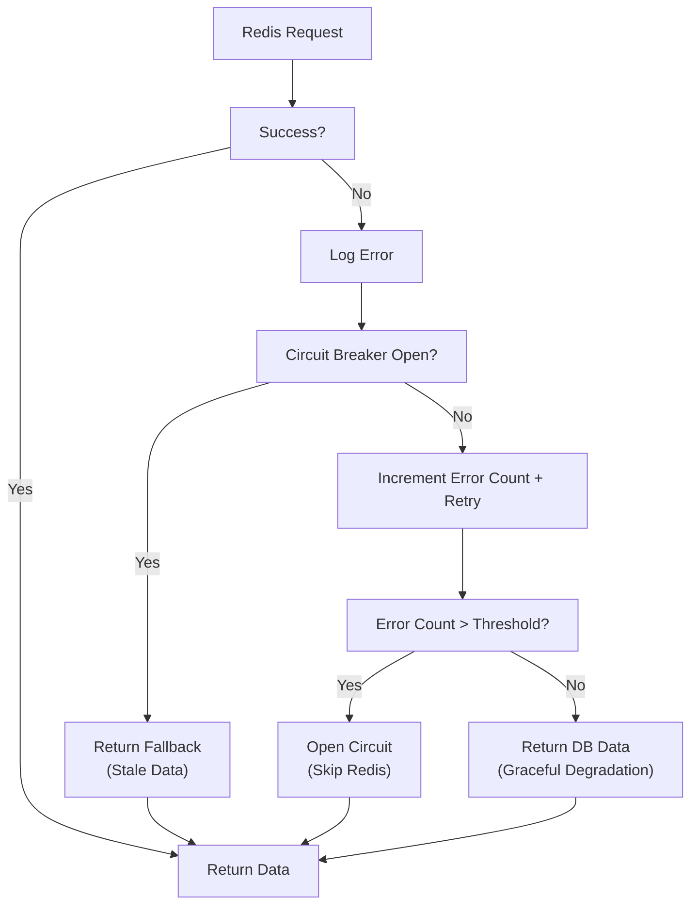

# 缓存策略模式

> 用于构建高性能、高可用缓存系统的模式与最佳实践

## 何时激活

- 设计缓存策略（Redis、Memcached）时
- 实现多级缓存（L1/L2 缓存）时
- 解决缓存一致性（穿透、雪崩、击穿）问题时
- 优化缓存性能（命中率、延迟）时
- 实现分布式缓存（一致性哈希、Session 共享）时
- 设计缓存预热和失效策略时
- 处理缓存与数据库双写问题时

## 技术栈版本

| 技术                  | 最低版本 | 推荐版本 |
| --------------------- | -------- | -------- |
| Redis                 | 7.0+     | 7.4+     |
| Memcached             | 1.6+     | 最新     |
| Node.js cache-manager | 5.0+     | 最新     |
| ioredis               | 5.0+     | 最新     |
| TypeScript            | 5.0+     | 最新     |

---

## 架构模式

### 缓存层级架构



### 缓存指标体系

| 指标类型 | 指标名称        | 计算公式                                              | 目标值                         |
| -------- | --------------- | ----------------------------------------------------- | ------------------------------ |
| 命中率   | Hit Rate        | Cache Hits / (Cache Hits + Cache Misses)              | 热点数据 > 95%，一般数据 > 80% |
| 命中率   | Miss Rate       | Cache Misses / Total Requests                         | < 20%                          |
| 延迟     | Avg Latency     | (Hit Latency × Hit Rate) + (Miss Latency × Miss Rate) | -                              |
| 延迟     | P99 Latency     | 99th percentile of all read operations                | L1 < 1ms, L2 < 5ms, DB < 100ms |
| 容量     | Memory Usage    | Used Memory / Max Memory                              | < 80%                          |
| 容量     | Eviction Rate   | Evictions / Time Unit                                 | 越低越好                       |
| 容量     | Expiration Rate | Expired Keys / Time Unit                              | 正常范围                       |

---

## 缓存策略

### Cache-Aside (旁路缓存)

```typescript
class CacheAsideService {
  constructor(
    private cache: RedisClient,
    private db: Database
  ) {}

  async get<T>(key: string): Promise<T | null> {
    const cached = await this.cache.get(key);
    if (cached !== null) {
      return JSON.parse(cached);
    }

    const data = await this.db.query<T>(key);
    if (data !== null) {
      await this.cache.setex(key, 3600, JSON.stringify(data));
    }

    return data;
  }

  async set<T>(key: string, value: T, ttl = 3600): Promise<void> {
    await this.db.update(key, value);
    await this.cache.del(key);
  }

  async delete(key: string): Promise<void> {
    await this.db.delete(key);
    await this.cache.del(key);
  }
}
```

### Read-Through (读穿透)

```typescript
class ReadThroughCache {
  constructor(
    private cache: RedisClient,
    private loader: (key: string) => Promise<any>
  ) {}

  async get<T>(key: string, ttl = 3600): Promise<T | null> {
    const cached = await this.cache.get(key);
    if (cached !== null) {
      return JSON.parse(cached);
    }

    const data = await this.loader(key);
    if (data !== null) {
      await this.cache.setex(key, ttl, JSON.stringify(data));
    }

    return data;
  }
}
```

### Write-Through (写穿透)

```typescript
class WriteThroughCache {
  constructor(
    private cache: RedisClient,
    private db: Database
  ) {}

  async set<T>(key: string, value: T, ttl = 3600): Promise<void> {
    await Promise.all([
      this.cache.setex(key, ttl, JSON.stringify(value)),
      this.db.update(key, value),
    ]);
  }
}
```

### Write-Behind (写回)

```typescript
class WriteBehindCache {
  private writeQueue: Map<string, { value: any; timestamp: number }> = new Map();
  private flushInterval = 5000;
  private db: Database;

  constructor(
    private cache: RedisClient,
    db: Database
  ) {
    this.db = db;
    setInterval(() => this.flush(), this.flushInterval);
  }

  async set<T>(key: string, value: T): Promise<void> {
    await this.cache.set(key, JSON.stringify(value));
    this.writeQueue.set(key, { value, timestamp: Date.now() });
  }

  private async flush(): Promise<void> {
    if (this.writeQueue.size === 0) return;

    const entries = Array.from(this.writeQueue.entries());
    this.writeQueue.clear();

    for (const [key, { value }] of entries) {
      try {
        await this.db.update(key, value);
      } catch (error) {
        this.writeQueue.set(key, { value, timestamp: Date.now() });
      }
    }
  }
}
```

### Write-Around (绕写)

```typescript
class WriteAroundCache {
  constructor(
    private cache: RedisClient,
    private db: Database
  ) {}

  async set<T>(key: string, value: T): Promise<void> {
    await this.db.update(key, value);
  }

  async get<T>(key: string): Promise<T | null> {
    const cached = await this.cache.get(key);
    if (cached !== null) {
      return JSON.parse(cached);
    }

    const data = await this.db.query<T>(key);
    if (data !== null) {
      await this.cache.setex(key, 3600, JSON.stringify(data));
    }

    return data;
  }
}
```

### Refresh-Ahead (预刷新)

```typescript
class RefreshAheadCache {
  constructor(
    private cache: RedisClient,
    private db: Database,
    private refreshThreshold = 0.8
  ) {}

  async get<T>(key: string, ttl = 3600): Promise<T | null> {
    const cached = await this.cache.get(key);

    if (cached !== null) {
      const { value, expireAt } = JSON.parse(cached);
      const now = Date.now();

      if (now >= expireAt * this.refreshThreshold) {
        this.refresh(key, ttl);
      }

      return value;
    }

    return this.loadAndCache(key, ttl);
  }

  private async refresh(key: string, ttl: number): Promise<void> {
    const data = await this.db.query(key);
    if (data !== null) {
      const expireAt = Math.floor((Date.now() + ttl * 1000) / 1000);
      await this.cache.setex(key, ttl, JSON.stringify({ value: data, expireAt }));
    }
  }

  private async loadAndCache<T>(key: string, ttl: number): Promise<T | null> {
    const data = await this.db.query<T>(key);
    if (data !== null) {
      const expireAt = Math.floor((Date.now() + ttl * 1000) / 1000);
      await this.cache.setex(key, ttl, JSON.stringify({ value: data, expireAt }));
    }
    return data;
  }
}
```

### 策略对比

| 策略          | 读性能 | 写性能 | 一致性 | 复杂度 | 适用场景         | 延迟敏感性 |
| ------------- | ------ | ------ | ------ | ------ | ---------------- | ---------- |
| Cache-Aside   | 高     | 中     | 最终   | 低     | 通用场景         | 低         |
| Read-Through  | 高     | -      | 最终   | 中     | 读多写少         | 低         |
| Write-Through | 中     | 中     | 强     | 中     | 数据一致性要求高 | 中         |
| Write-Behind  | 高     | 高     | 弱     | 高     | 高吞吐写入       | 低         |
| Write-Around  | 中     | 高     | 最终   | 低     | 写多读少         | 中         |
| Refresh-Ahead | 高     | 中     | 最终   | 高     | 热点数据定期预热 | 低         |

### 缓存防护策略对比

| 防护类型 | 问题描述                  | 解决方案                   | 复杂度 | 性能影响 |
| -------- | ------------------------- | -------------------------- | ------ | -------- |
| 缓存穿透 | 查询不存在的数据          | 布隆过滤器 + 空值缓存      | 中     | 低       |
| 缓存雪崩 | 大量 key 同时过期         | TTL 随机 jitter + 分布式锁 | 中     | 低       |
| 缓存击穿 | 热 key 过期的瞬间大量请求 | 互斥锁 + 热点永不过期      | 中     | 低       |
| 缓存倾斜 | 节点分布不均              | 一致性哈希 + 虚拟节点      | 高     | 低       |
| 缓存抖动 | 频繁更新导致缓存失效      | 合并写 + 延迟删除          | 中     | 低       |

### 缓存防护工作流程

```mermaid
flowchart TD
    subgraph Penetration["缓存穿透防护"]
        PK["Request Key"] --> BF["BloomFilter Check"]
        BF -->|No| RN["Return Null<br/>(Quick Exit)"]
        BF -->|Yes| CR["Check Redis"]
        CR -->|Hit| RD["Return Data"]
        CR -->|Miss| CD["Check Database"]
        CD -->|Exists| WC["Write to Cache<br/>(TTL: Normal)"]
        CD -->|Not Exists| WN["Write NULL<br/>(TTL: Short)"]
        WC --> RD
        WN --> RN
    end

    subgraph Avalanche["缓存雪崩防护"]
        AK["Request Key"] --> AR["Check Redis"]
        AR -->|Hit| RA["Return Data"]
        AR -->|Miss| AL["Acquire Lock"]
        AL -->|Success| LD["Load from DB"]
        AL -->|Fail| WR["Wait + Retry"]
        WR --> AR
        LD --> SJ["Set with Jitter TTL<br/>Base + Random 0-300s"]
        SJ --> RL["Release Lock"]
        RL --> RA
    end

    subgraph Breakdown["缓存击穿防护"]
        BK["Request Key"] --> BR["Check Redis"]
        BR -->|Hit| BA["Return Data"]
        BR -->|Miss| BL["Check Local Lock"]
        BL -->|Exists| WP["Wait on Promise"]
        BL -->|Not Exists| AL2["Acquire Local Lock<br/>+ Load"]
        WP --> AL2
        AL2 --> RS["Return Data<br/>+ Set Redis<br/>+ Release Lock"]
        RS --> BA
    end
```



---

## Redis 实现

### 基础操作

```typescript
import Redis from 'ioredis';

const redis = new Redis(process.env.REDIS_URL, {
  maxRetriesPerRequest: null,
});

async function redisExamples() {
  const key = 'user:123';

  await redis.set(key, JSON.stringify({ name: 'John' }));
  await redis.setex(key, 3600, JSON.stringify({ name: 'John' }));
  await redis.get(key);
  await redis.del(key);

  await redis.hset('user:123', 'name', 'John', 'email', 'john@example.com');
  await redis.hgetall('user:123');

  await redis.zadd('leaderboard', 100, 'user:1', 90, 'user:2');
  await redis.zrevrange('leaderboard', 0, 9, 'WITHSCORES');

  await redis.set('rate:limit:user:123', '1', 'EX', 60, 'NX');
}
```

### 缓存过期策略

```typescript
class RedisExpiryManager {
  constructor(private redis: Redis) {}

  async setWithExpiry(key: string, value: any, ttlSeconds: number): Promise<void> {
    await this.redis.setex(key, ttlSeconds, JSON.stringify(value));
  }

  async getWithRefresh<T>(key: string, ttlSeconds: number, loader: () => Promise<T>): Promise<T> {
    const cached = await this.redis.get(key);

    if (cached !== null) {
      return JSON.parse(cached);
    }

    const data = await loader();
    await this.setWithExpiry(key, data, ttlSeconds);
    return data;
  }

  async getTtl(key: string): Promise<number> {
    return this.redis.ttl(key);
  }

  async refreshExpiry(key: string, ttlSeconds: number): Promise<void> {
    await this.redis.expire(key, ttlSeconds);
  }
}
```

### 模式匹配操作

```typescript
class PatternOperations {
  constructor(private redis: Redis) {}

  async deleteByPattern(pattern: string): Promise<number> {
    const keys = await this.redis.keys(pattern);
    if (keys.length === 0) return 0;
    return this.redis.del(...keys);
  }

  async getKeysByPattern(pattern: string): Promise<string[]> {
    return this.redis.keys(pattern);
  }

  async scanKeys(pattern: string, count = 100): Promise<string[]> {
    const keys: string[] = [];
    let cursor = '0';

    do {
      const [nextCursor, foundKeys] = await this.redis.scan(
        cursor,
        'MATCH',
        pattern,
        'COUNT',
        count
      );
      cursor = nextCursor;
      keys.push(...foundKeys);
    } while (cursor !== '0');

    return keys;
  }
}
```

---

## 多级缓存

### L1/L2 缓存实现

```typescript
class MultiLevelCache {
  private l1: Map<string, { value: any; expireAt: number }> = new Map();
  private l1MaxSize = 1000;
  private l1TtlMs = 60000;

  constructor(
    private redis: Redis,
    private db: Database
  ) {}

  async get<T>(key: string): Promise<T | null> {
    const l1Result = this.l1Get<T>(key);
    if (l1Result !== null) {
      return l1Result;
    }

    const cached = await this.redis.get(key);
    if (cached !== null) {
      const data = JSON.parse(cached);
      this.l1Set(key, data);
      return data;
    }

    const dbResult = await this.db.query<T>(key);
    if (dbResult !== null) {
      await this.redis.setex(key, 3600, JSON.stringify(dbResult));
      this.l1Set(key, dbResult);
    }

    return dbResult;
  }

  async set<T>(key: string, value: T, ttl = 3600): Promise<void> {
    await Promise.all([
      this.redis.setex(key, ttl, JSON.stringify(value)),
      this.db.update(key, value),
    ]);
    this.l1Set(key, value);
  }

  async invalidate(key: string): Promise<void> {
    this.l1.delete(key);
    await this.redis.del(key);
    await this.pubsub.publish('cache:invalidate', { key, nodeId: this.nodeId });
  }

  private l1Get<T>(key: string): T | null {
    const entry = this.l1.get(key);
    if (!entry) return null;

    if (Date.now() > entry.expireAt) {
      this.l1.delete(key);
      return null;
    }

    return entry.value as T;
  }

  private l1Set(key: string, value: any): void {
    if (this.l1.size >= this.l1MaxSize) {
      const firstKey = this.l1.keys().next().value;
      this.l1.delete(firstKey);
    }
    this.l1.set(key, { value, expireAt: Date.now() + this.l1TtlMs });
  }
}
```

### 缓存同步机制

```typescript
class CacheSynchronizer {
  private localCache: Map<string, any> = new Map();
  private nodeId: string;
  private pubsub: Redis;

  constructor(private redis: Redis) {
    this.nodeId = `${process.pid}:${Math.random().toString(36).slice(2)}`;
    this.subscribe();
  }

  private async subscribe(): Promise<void> {
    this.pubsub = this.redis.duplicate();
    await this.pubsub.subscribe('cache:invalidate');

    this.pubsub.on('message', (channel, message) => {
      if (channel === 'cache:invalidate') {
        const { key, nodeId } = JSON.parse(message);
        if (nodeId !== this.nodeId) {
          this.localCache.delete(key);
        }
      }
    });
  }

  async invalidate(key: string): Promise<void> {
    this.localCache.delete(key);
    await this.redis.publish('cache:invalidate', JSON.stringify({ key, nodeId: this.nodeId }));
  }
}
```

---

## 缓存一致性

### 缓存穿透防护

```typescript
class CachePenetrationProtection {
  constructor(
    private redis: Redis,
    private db: Database,
    private nullValueTtl = 60
  ) {}

  async get<T>(key: string): Promise<T | null> {
    const cached = await this.redis.get(key);

    if (cached === 'NULL') {
      return null;
    }

    if (cached !== null) {
      return JSON.parse(cached);
    }

    const data = await this.db.query<T>(key);

    if (data === null) {
      await this.redis.setex(key, this.nullValueTtl, 'NULL');
      return null;
    }

    await this.redis.setex(key, 3600, JSON.stringify(data));
    return data;
  }
}

class BloomFilterProtection {
  private bloomFilter: BloomFilter;

  constructor(private redis: Redis) {
    this.bloomFilter = new BloomFilter(1000000, 0.01);
  }

  mightContain(key: string): boolean {
    return this.bloomFilter.check(key);
  }

  add(key: string): void {
    this.bloomFilter.add(key);
  }

  async get<T>(key: string, loader: () => Promise<T | null>): Promise<T | null> {
    if (!this.bloomFilter.check(key)) {
      return null;
    }

    const cached = await this.redis.get(key);
    if (cached !== null && cached !== 'NULL') {
      return JSON.parse(cached);
    }

    const data = await loader();

    if (data === null) {
      this.bloomFilter.add(key);
      await this.redis.setex(key, 60, 'NULL');
      return null;
    }

    await this.redis.setex(key, 3600, JSON.stringify(data));
    return data;
  }
}
```

### 缓存雪崩防护

```typescript
class CacheAvalancheProtection {
  constructor(private redis: Redis) {}

  async setWithJitter(key: string, value: any, baseTtl: number): Promise<void> {
    const jitter = Math.floor(Math.random() * 300);
    const ttl = baseTtl + jitter;
    await this.redis.setex(key, ttl, JSON.stringify(value));
  }

  async getWithLock<T>(key: string, loader: () => Promise<T>): Promise<T> {
    const cached = await this.redis.get(key);
    if (cached !== null) {
      return JSON.parse(cached);
    }

    const lockKey = `lock:${key}`;
    const lockAcquired = await this.redis.set(lockKey, '1', 'NX', 'PX', 5000);

    if (!lockAcquired) {
      await new Promise((resolve) => setTimeout(resolve, 100));
      return this.getWithLock(key, loader);
    }

    try {
      const data = await loader();
      await this.setWithJitter(key, data, 3600);
      return data;
    } finally {
      await this.redis.del(lockKey);
    }
  }
}
```

### 缓存击穿防护

```typescript
class CacheBreakdownProtection {
  private locks: Map<string, Promise<any>> = new Map();

  constructor(private redis: Redis) {}

  async get<T>(key: string, loader: () => Promise<T>, ttl = 3600): Promise<T> {
    const cached = await this.redis.get(key);
    if (cached !== null) {
      return JSON.parse(cached);
    }

    let promise = this.locks.get(key);
    if (!promise) {
      promise = this.loadWithLock(key, loader, ttl);
      this.locks.set(key, promise);
    }

    try {
      return await promise;
    } finally {
      this.locks.delete(key);
    }
  }

  private async loadWithLock<T>(key: string, loader: () => Promise<T>, ttl: number): Promise<T> {
    const data = await loader();
    await this.redis.setex(key, ttl, JSON.stringify(data));
    return data;
  }
}
```

### 分布式锁

```typescript
class DistributedLock {
  constructor(
    private redis: Redis,
    private ttl = 30000
  ) {}

  async acquire(resource: string, ownerId: string): Promise<boolean> {
    const key = `lock:${resource}`;
    const result = await this.redis.set(key, ownerId, 'PX', this.ttl, 'NX');
    return result === 'OK';
  }

  async release(resource: string, ownerId: string): Promise<boolean> {
    const key = `lock:${resource}`;
    const script = `
      if redis.call("get", KEYS[1]) == ARGV[1] then
        return redis.call("del", KEYS[1])
      else
        return 0
      end
    `;
    return (await this.redis.eval(script, 1, key, ownerId)) === 1;
  }

  async extend(resource: string, ownerId: string, additionalTtl: number): Promise<boolean> {
    const key = `lock:${resource}`;
    const script = `
      if redis.call("get", KEYS[1]) == ARGV[1] then
        return redis.call("pexpire", KEYS[1], ARGV[2])
      else
        return 0
      end
    `;
    return (await this.redis.eval(script, 1, key, ownerId, additionalTtl)) === 1;
  }
}
```

---

## 缓存淘汰策略

### 内存缓存实现

```typescript
class LRUCache<K, V> {
  private capacity: number;
  private cache: Map<K, V>;

  constructor(capacity: number) {
    this.capacity = capacity;
    this.cache = new Map();
  }

  get(key: K): V | undefined {
    if (!this.cache.has(key)) return undefined;
    const value = this.cache.get(key)!;
    this.cache.delete(key);
    this.cache.set(key, value);
    return value;
  }

  set(key: K, value: V): void {
    if (this.cache.has(key)) {
      this.cache.delete(key);
    } else if (this.cache.size >= this.capacity) {
      const firstKey = this.cache.keys().next().value;
      this.cache.delete(firstKey);
    }
    this.cache.set(key, value);
  }

  has(key: K): boolean {
    return this.cache.has(key);
  }

  delete(key: K): boolean {
    return this.cache.delete(key);
  }

  clear(): void {
    this.cache.clear();
  }
}
```

```typescript
class LFUCache<K, V> {
  private capacity: number;
  private cache: Map<K, { value: V; count: number }>;
  private freqMap: Map<number, Set<K>>;
  private minFreq = 0;

  constructor(capacity: number) {
    this.capacity = capacity;
    this.cache = new Map();
    this.freqMap = new Map();
  }

  get(key: K): V | undefined {
    const entry = this.cache.get(key);
    if (!entry) return undefined;
    this.incrementFreq(key);
    return entry.value;
  }

  set(key: K, value: V): void {
    if (this.capacity === 0) return;

    if (this.cache.has(key)) {
      this.cache.get(key)!.value = value;
      this.incrementFreq(key);
      return;
    }

    if (this.cache.size >= this.capacity) {
      this.evict();
    }

    this.cache.set(key, { value, count: 1 });
    this.addToFreqMap(1, key);
    this.minFreq = 1;
  }

  private incrementFreq(key: K): void {
    const entry = this.cache.get(key)!;
    const oldFreq = entry.count++;
    this.removeFromFreqMap(oldFreq, key);
    this.addToFreqMap(entry.count, key);
  }

  private evict(): void {
    const keys = this.freqMap.get(this.minFreq);
    if (keys && keys.size > 0) {
      const keyToEvict = keys.values().next().value;
      keys.delete(keyToEvict);
      this.cache.delete(keyToEvict);
    }
  }

  private addToFreqMap(freq: number, key: K): void {
    if (!this.freqMap.has(freq)) {
      this.freqMap.set(freq, new Set());
    }
    this.freqMap.get(freq)!.add(key);
  }

  private removeFromFreqMap(freq: number, key: K): void {
    this.freqMap.get(freq)?.delete(key);
  }
}
```

### TTL 策略

```typescript
class TTLCacheStrategy {
  constructor(private redis: Redis) {}

  async setWithSmartTTL(
    key: string,
    value: any,
    options: {
      baseTtl?: number;
      readFrequency?: 'high' | 'medium' | 'low';
    }
  ): Promise<void> {
    const { baseTtl = 3600, readFrequency = 'medium' } = options;

    const ttlMultipliers = {
      high: 2,
      medium: 1,
      low: 0.5,
    };

    const jitter = Math.floor(Math.random() * 300);
    const ttl = Math.floor(baseTtl * ttlMultipliers[readFrequency]) + jitter;

    await this.redis.setex(key, ttl, JSON.stringify(value));
  }

  async analyzeTTLStrategy(
    keys: string[]
  ): Promise<Record<string, { current: number; recommended: number }>> {
    const analysis: Record<string, { current: number; recommended: number }> = {};

    for (const key of keys) {
      const ttl = await this.redis.ttl(key);
      const hitRate = await this.getHitRate(key);

      let recommended: number;
      if (hitRate > 0.9) {
        recommended = ttl * 1.5;
      } else if (hitRate > 0.7) {
        recommended = ttl;
      } else {
        recommended = ttl * 0.8;
      }

      analysis[key] = { current: ttl, recommended };
    }

    return analysis;
  }
}
```

---

## 分布式缓存

### 一致性哈希

```typescript
class ConsistentHashing {
  private ring: Map<number, string> = new Map();
  private nodes: Set<string> = new Set();
  private virtualNodes = 150;

  addNode(node: string): void {
    this.nodes.add(node);
    for (let i = 0; i < this.virtualNodes; i++) {
      const hash = this.hash(`${node}:${i}`);
      this.ring.set(hash, node);
    }
  }

  removeNode(node: string): void {
    this.nodes.delete(node);
    for (let i = 0; i < this.virtualNodes; i++) {
      const hash = this.hash(`${node}:${i}`);
      this.ring.delete(hash);
    }
  }

  getNode(key: string): string {
    if (this.ring.size === 0) {
      throw new Error('No nodes available');
    }

    const hash = this.hash(key);
    const sortedHashes = Array.from(this.ring.keys()).sort((a, b) => a - b);

    for (const h of sortedHashes) {
      if (hash <= h) {
        return this.ring.get(h)!;
      }
    }

    return this.ring.get(sortedHashes[0])!;
  }

  private hash(key: string): number {
    let hash = 0;
    for (let i = 0; i < key.length; i++) {
      hash = (hash * 31 + key.charCodeAt(i)) >>> 0;
    }
    return hash;
  }
}
```

### Redis Cluster

```typescript
class RedisClusterCache {
  private cluster: Redis.Cluster;

  constructor(nodes: { host: string; port: number }[]) {
    this.cluster = new Redis.Cluster(nodes, {
      redisOptions: {
        maxRetriesPerRequest: 3,
      },
      slotsRefreshTimeout: 10000,
    });
  }

  async get(key: string): Promise<string | null> {
    return this.cluster.get(key);
  }

  async set(key: string, value: string, ttl?: number): Promise<void> {
    if (ttl) {
      await this.cluster.setex(key, ttl, value);
    } else {
      await this.cluster.set(key, value);
    }
  }

  async del(key: string): Promise<void> {
    await this.cluster.del(key);
  }

  async mget(keys: string[]): Promise<(string | null)[]> {
    return this.cluster.mget(...keys);
  }

  async mset(keyValues: Record<string, string>, ttl?: number): Promise<void> {
    const pipeline = this.cluster.pipeline();
    for (const [key, value] of Object.entries(keyValues)) {
      if (ttl) {
        pipeline.setex(key, ttl, value);
      } else {
        pipeline.set(key, value);
      }
    }
    await pipeline.exec();
  }
}
```

---

## 监控与指标

### 缓存监控

```typescript
interface CacheMetrics {
  hits: number;
  misses: number;
  hitRate: number;
  memoryUsed: number;
  memoryTotal: number;
  keysCount: number;
  expiredKeys: number;
  evictedKeys: number;
}

class CacheMonitor {
  constructor(private redis: Redis) {}

  async getMetrics(): Promise<CacheMetrics> {
    const [info, dbsize, keyCount] = await Promise.all([
      this.redis.info('memory'),
      this.redis.dbsize(),
      this.redis.info('stats'),
    ]);

    const { total_commands_processed, keyspace_hits, keyspace_misses } = this.parseInfo(info);
    const { used_memory, maxmemory } = this.parseMemoryInfo(info);

    return {
      hits: keyspace_hits,
      misses: keyspace_misses,
      hitRate: keyspace_hits / (keyspace_hits + keyspace_misses),
      memoryUsed: used_memory,
      memoryTotal: maxmemory,
      keysCount: dbsize,
      expiredKeys: 0,
      evictedKeys: 0,
    };
  }

  private parseInfo(info: string): Record<string, number> {
    const result: Record<string, number> = {};
    const lines = info.split('\r\n');
    for (const line of lines) {
      const [key, value] = line.split(':');
      if (key && value && !isNaN(Number(value))) {
        result[key] = Number(value);
      }
    }
    return result;
  }

  private parseMemoryInfo(info: string): Record<string, number> {
    const result: Record<string, number> = {};
    const lines = info.split('\r\n');
    for (const line of lines) {
      if (line.startsWith('used_memory:') || line.startsWith('maxmemory:')) {
        const [key, value] = line.split(':');
        result[key] = Number(value);
      }
    }
    return result;
  }
}
```

### 健康检查

```typescript
app.get('/health/cache', async (req, res) => {
  const monitor = new CacheMonitor(redis);

  try {
    const metrics = await monitor.getMetrics();

    const healthy = metrics.hitRate > 0.8 && metrics.memoryUsed < metrics.memoryTotal * 0.9;

    res.status(healthy ? 200 : 503).json({
      status: healthy ? 'healthy' : 'degraded',
      timestamp: new Date().toISOString(),
      metrics: {
        hitRate: `${(metrics.hitRate * 100).toFixed(2)}%`,
        memoryUsage: `${((metrics.memoryUsed / metrics.memoryTotal) * 100).toFixed(2)}%`,
        keysCount: metrics.keysCount,
      },
      alerts: [
        ...(metrics.hitRate < 0.8 ? ['Low hit rate'] : []),
        ...(metrics.memoryUsed > metrics.memoryTotal * 0.9 ? ['High memory usage'] : []),
      ],
    });
  } catch (error) {
    res.status(503).json({
      status: 'unhealthy',
      error: String(error),
    });
  }
});
```

---

## 最佳实践

### 设计原则

| 原则       | 说明                         | 示例                         | 优先级 |
| ---------- | ---------------------------- | ---------------------------- | ------ |
| 缓存键命名 | 使用冒号分隔层级             | `user:123:profile`           | 高     |
| 缓存值大小 | 控制单条数据大小 < 1MB       | 分页存储大对象               | 高     |
| TTL 设计   | 根据数据更新频率设置合理 TTL | 配置 5min, 用户 1h, 商品 24h | 高     |
| 容量规划   | 预留 20% 内存空间            | maxmemory 80%                | 中     |
| 监控告警   | 监控命中率、内存使用率       | hit_rate < 0.8 告警          | 高     |
| 优雅降级   | 缓存失败时回源数据库         | try-catch 实现               | 高     |
| 分布式锁   | 跨进程同步时使用锁           | Redlock 算法                 | 中     |
| 预热策略   | 服务启动时预加载热点数据     | 定时任务 + 手动触发          | 中     |
| 容量预警   | 设置内存阈值自动告警         | used_memory > 80% 预警       | 高     |

### 键设计规范

```typescript
const keyPatterns = {
  user: 'user:{userId}',
  userProfile: 'user:{userId}:profile',
  userSession: 'session:{sessionId}',
  product: 'product:{productId}',
  productList: 'products:list:{category}:{page}',
  config: 'config:{appId}:{env}',
  rateLimit: 'ratelimit:{userId}:{endpoint}',
  lock: 'lock:{resource}',
  cache: 'cache:{namespace}:{id}',
};

function buildKey(pattern: string, params: Record<string, string | number>): string {
  return pattern.replace(/\{(\w+)\}/g, (_, key) => String(params[key]));
}
```

### TTL 设计指南

| 数据类型 | 推荐 TTL | 更新频率  | 说明               |
| -------- | -------- | --------- | ------------------ |
| 会话数据 | 15-30min | 每次访问  | 活跃用户频繁更新   |
| 用户配置 | 1-24h    | 手动修改  | 很少变更           |
| 热点商品 | 5-30min  | 价格/库存 | 频繁变化但需要缓存 |
| 静态配置 | 24h+     | 配置变更  | 几乎不变           |
| 排行榜   | 1-5min   | 定时更新  | 实时性要求不高     |
| 计数器   | -        | 实时      | 不设 TTL，定期重置 |
| 分布式锁 | 10-30s   | 持有时    | 需设置 TTL 防死锁  |
| 验证码   | 5-10min  | 发送时    | 短期有效           |

### 性能优化

```typescript
class CachePerformanceOptimizer {
  constructor(private redis: Redis) {}

  async pipelineGet(keys: string[]): Promise<(string | null)[]> {
    const pipeline = this.redis.pipeline();
    for (const key of keys) {
      pipeline.get(key);
    }
    const results = await pipeline.exec();
    return results?.map(([err, val]) => (err ? null : val)) ?? [];
  }

  async pipelineSet(items: Record<string, string>, ttl?: number): Promise<void> {
    const pipeline = this.redis.pipeline();
    for (const [key, value] of Object.entries(items)) {
      if (ttl) {
        pipeline.setex(key, ttl, value);
      } else {
        pipeline.set(key, value);
      }
    }
    await pipeline.exec();
  }

  async mget效率优化(keys: string[]): Promise<(string | null)[]> {
    if (keys.length > 1000) {
      const chunks = this.chunk(keys, 1000);
      const results: (string | null)[] = [];
      for (const chunk of chunks) {
        const chunkResults = await this.redis.mget(...chunk);
        results.push(...chunkResults);
      }
      return results;
    }
    return this.redis.mget(...keys);
  }

  private chunk<T>(array: T[], size: number): T[][] {
    return Array.from({ length: Math.ceil(array.length / size) }, (_, i) =>
      array.slice(i * size, i * size + size)
    );
  }
}
```

### 重试策略

| 策略        | 实现方式             | 适用场景             | 退避时间            |
| ----------- | -------------------- | -------------------- | ------------------- |
| Fixed       | 固定间隔重试         | 瞬时故障快速恢复     | 100ms, 200ms        |
| Exponential | 指数退避             | 网络波动、临时不可用 | 100ms, 200ms, 400ms |
| Linear      | 线性增加延迟         | 资源清理任务         | 1s, 2s, 3s          |
| Jitter      | 添加随机抖动防止惊群 | 高并发场景           | base \* random      |

```typescript
async function withRetry<T>(
  operation: () => Promise<T>,
  options: {
    maxAttempts?: number;
    strategy?: 'fixed' | 'exponential' | 'linear';
    baseDelay?: number;
    maxDelay?: number;
  } = {}
): Promise<T> {
  const { maxAttempts = 3, strategy = 'exponential', baseDelay = 100, maxDelay = 5000 } = options;

  let lastError: Error;

  for (let attempt = 1; attempt <= maxAttempts; attempt++) {
    try {
      return await operation();
    } catch (error) {
      lastError = error as Error;

      if (attempt === maxAttempts) break;

      let delay = baseDelay;
      if (strategy === 'exponential') {
        delay = Math.min(baseDelay * Math.pow(2, attempt - 1), maxDelay);
      } else if (strategy === 'linear') {
        delay = baseDelay * attempt;
      } else if (strategy === 'jitter') {
        delay = baseDelay * Math.pow(2, attempt - 1) * (0.5 + Math.random() * 0.5);
      }

      await new Promise((resolve) => setTimeout(resolve, delay));
    }
  }

  throw lastError!;
}
```

### 缓存容量规划

| 场景           | 内存规划        | 过期策略            | 淘汰策略     |
| -------------- | --------------- | ------------------- | ------------ |
| 小型应用       | 256MB - 1GB     | 主动过期 + 懒淘汰   | allkeys-lru  |
| 中型应用       | 1GB - 8GB       | TTL 分层            | allkeys-lru  |
| 大型应用       | 8GB - 64GB      | 分级缓存 + 淘汰策略 | allkeys-lru  |
| 热点缓存       | 按需分配        | 热点数据永不过期    | volatile-lru |
| 持久化缓存     | 较大内存        | 长 TTL + 定期清理   | noeviction   |
| 分布式 Session | 集群总内存 50%+ | TTL 自动清理        | allkeys-lru  |

### 故障处理流程



---

## 快速检查清单

### 开发前

- [ ] 确定缓存层级（L1/L2/L3）
- [ ] 选择缓存策略（Cache-Aside/Write-Through 等）
- [ ] 设计缓存键命名规范
- [ ] 设置 TTL 策略
- [ ] 规划缓存容量

### 开发中

- [ ] 实现缓存穿透防护
- [ ] 实现缓存雪崩防护
- [ ] 实现缓存击穿防护
- [ ] 添加缓存监控指标
- [ ] 实现优雅降级

### 发布前

- [ ] 压测缓存性能
- [ ] 配置监控告警
- [ ] 验证缓存一致性
- [ ] 验证故障恢复
- [ ] 文档更新

---

## 参考

- [Redis Documentation](https://redis.io/docs/)
- [Cache Patterns](https://docs.microsoft.com/en-us/azure/architecture/patterns/category/caching)
- [Caching Best Practices](https://aws.amazon.com/caching/best-practices/)
```
