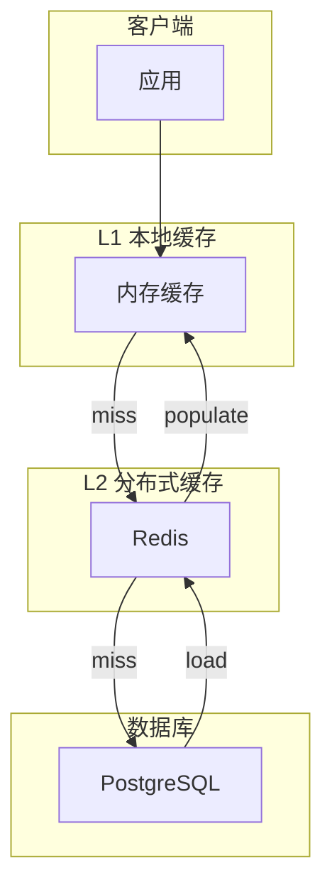

# 缓存策略模式

> 多级缓存、缓存一致性、性能优化的最佳实践

## 何时激活

- 实现缓存层
- 设计缓存策略
- 处理缓存穿透/雪崩/击穿
- 优化读取性能
- 保证缓存一致性

## 技术栈版本

| 技术           | 最低版本 | 推荐版本 |
| -------------- | -------- | -------- |
| Redis          | 7.0+     | 最新     |
| Memcached      | 1.6+     | 最新     |
| Caffeine       | 3.0+     | 最新     |
| cache-manager  | 4.0+     | 最新     |

## 缓存策略对比

| 策略     | 说明                   | 适用场景           |
| -------- | ---------------------- | ------------------ |
| Cache-Aside | 应用直接管理缓存       | 读多写少           |
| Read-Through | 缓存自动加载数据     | 简化应用代码       |
| Write-Through | 同步写入缓存和存储  | 数据一致性要求高   |
| Write-Behind | 异步写入存储         | 写入性能要求高     |
| Refresh-Ahead | 预刷新即将过期的数据 | 可预测的热点数据   |

## 缓存架构



## 多级缓存实现

### 1. 本地内存缓存 (L1)

```typescript
import { Cache } from '@cache-manager/core';
import { MemoryStore } from '@cache-manager/memory';

interface CachedValue<T> {
  value: T;
  expiresAt: number;
}

class TwoLevelCache<T> {
  private l1: Map<string, CachedValue<T>> = new Map();
  private l2: Cache;

  constructor(
    private ttl: number = 3600,
    private maxL1Size: number = 1000
  ) {
    this.l2 = new Cache({
      store: new MemoryStore(),
      ttl: this.ttl,
    });
  }

  async get(key: string): Promise<T | null> {
    // L1 查找
    const l1Value = this.l1.get(key);
    if (l1Value && l1Value.expiresAt > Date.now()) {
      return l1Value.value;
    }

    // L2 查找
    const l2Value = await this.l2.get(key);
    if (l2Value) {
      this.setL1(key, l2Value);
      return l2Value;
    }

    return null;
  }

  async set(key: string, value: T): Promise<void> {
    this.setL1(key, value);
    await this.l2.set(key, value);
  }

  private setL1(key: string, value: T): void {
    if (this.l1.size >= this.maxL1Size) {
      const firstKey = this.l1.keys().next().value;
      this.l1.delete(firstKey);
    }
    this.l1.set(key, {
      value,
      expiresAt: Date.now() + this.ttl * 1000,
    });
  }

  async delete(key: string): Promise<void> {
    this.l1.delete(key);
    await this.l2.del(key);
  }
}
```

### 2. Redis 分布式缓存 (L2)

```typescript
import Redis from 'ioredis';

class RedisCache {
  constructor(
    private redis: Redis,
    private prefix: string = 'cache:'
  ) {}

  async get<T>(key: string): Promise<T | null> {
    const value = await this.redis.get(`${this.prefix}${key}`);
    return value ? JSON.parse(value) : null;
  }

  async set<T>(key: string, value: T, ttlSeconds: number = 3600): Promise<void> {
    await this.redis.setex(
      `${this.prefix}${key}`,
      ttlSeconds,
      JSON.stringify(value)
    );
  }

  async delete(key: string): Promise<void> {
    await this.redis.del(`${this.prefix}${key}`);
  }

  async getOrSet<T>(
    key: string,
    factory: () => Promise<T>,
    ttlSeconds: number = 3600
  ): Promise<T> {
    const cached = await this.get<T>(key);
    if (cached !== null) return cached;

    const value = await factory();
    await this.set(key, value, ttlSeconds);
    return value;
  }
}
```

## 缓存问题处理

### 1. 缓存穿透（Cache Penetration）

```typescript
class CachePenetrationProtection {
  constructor(
    private cache: RedisCache,
    private bloomFilter: BloomFilter
  ) {}

  async getOrLoad<T>(
    key: string,
    loader: () => Promise<T>,
    ttl: number = 3600
  ): Promise<T | null> {
    // 布隆过滤器检查
    if (!this.bloomFilter.mightContain(key)) {
      return null; // 一定不存在
    }

    const cached = await this.cache.get<T>(key);
    if (cached !== null) return cached;

    const value = await loader();
    if (value === null) {
      // 缓存空值，防止穿透
      await this.cache.set(key, null, 60); // 短TTL
      return null;
    }

    await this.cache.set(key, value, ttl);
    return value;
  }
}
```

### 2. 缓存雪崩（Cache Avalanche）

```typescript
class CacheAvalancheProtection {
  constructor(private cache: RedisCache) {}

  async setWithJitter(
    key: string,
    value: unknown,
    baseTtl: number = 3600
  ): Promise<void> {
    // 添加随机抖动：±10%
    const jitter = baseTtl * 0.1 * (Math.random() * 2 - 1);
    const ttl = Math.floor(baseTtl + jitter);
    await this.cache.set(key, value, ttl);
  }

  async mgetWithLock<T>(
    keys: string[],
    loader: (keys: string[]) => Promise<Map<string, T>>
  ): Promise<Map<string, T>> {
    const results = new Map<string, T>();
    const missingKeys: string[] = [];

    // 批量获取
    for (const key of keys) {
      const value = await this.cache.get<T>(key);
      if (value !== null) {
        results.set(key, value);
      } else {
        missingKeys.push(key);
      }
    }

    // 加载缺失的key
    if (missingKeys.length > 0) {
      const loaded = await loader(missingKeys);
      for (const [key, value] of loaded) {
        await this.setWithJitter(key, value);
        results.set(key, value);
      }
    }

    return results;
  }
}
```

### 3. 缓存击穿（Cache Breakdown）

```typescript
class CacheBreakdownProtection {
  private locks = new Map<string, Promise<unknown>>();

  constructor(private cache: RedisCache) {}

  async getOrLoad<T>(
    key: string,
    loader: () => Promise<T>,
    ttl: number = 3600
  ): Promise<T> {
    const cached = await this.cache.get<T>(key);
    if (cached !== null) return cached;

    // 检查是否已有其他请求在加载
    const existingLock = this.locks.get(key);
    if (existingLock) {
      return existingLock as Promise<T>;
    }

    // 创建加载锁
    const loadPromise = loader().then(async (value) => {
      await this.cache.set(key, value, ttl);
      this.locks.delete(key);
      return value;
    });

    this.locks.set(key, loadPromise);

    try {
      return await loadPromise;
    } catch (error) {
      this.locks.delete(key);
      throw error;
    }
  }
}
```

## 缓存一致性

### 1. Cache-Aside 模式

```typescript
class CacheAsideRepository<T> {
  constructor(
    private cache: RedisCache,
    private db: Database,
    private cacheTtl: number = 3600
  ) {}

  async findById(id: string): Promise<T | null> {
    // 读：Cache-Aside
    const cached = await this.cache.get<T>(`${this.tableName}:${id}`);
    if (cached) return cached;

    const entity = await this.db.findById(this.tableName, id);
    if (entity) {
      await this.cache.set(`${this.tableName}:${id}`, entity, this.cacheTtl);
    }
    return entity;
  }

  async save(id: string, entity: T): Promise<void> {
    // 写：先更新数据库，再删除缓存
    await this.db.save(this.tableName, id, entity);
    await this.cache.delete(`${this.tableName}:${id}`);
  }

  async delete(id: string): Promise<void> {
    await this.db.delete(this.tableName, id);
    await this.cache.delete(`${this.tableName}:${id}`);
  }
}
```

### 2. Write-Through 模式

```typescript
class WriteThroughCache<T> {
  constructor(
    private cache: RedisCache,
    private db: Database
  ) {}

  async save(id: string, entity: T, ttl: number = 3600): Promise<void> {
    // 同步写入缓存和数据库
    await Promise.all([
      this.db.save(this.tableName, id, entity),
      this.cache.set(`${this.tableName}:${id}`, entity, ttl),
    ]);
  }
}
```

## 缓存监控

```typescript
interface CacheMetrics {
  hits: number;
  misses: number;
  evictions: number;
  size: number;
}

class CacheMonitor {
  private metrics = {
    hits: 0,
    misses: 0,
    evictions: 0,
  };

  recordHit(): void {
    this.metrics.hits++;
  }

  recordMiss(): void {
    this.metrics.misses++;
  }

  getHitRate(): number {
    const total = this.metrics.hits + this.metrics.misses;
    return total > 0 ? this.metrics.hits / total : 0;
  }

  getMetrics(): CacheMetrics {
    return {
      ...this.metrics,
      size: this.getCurrentSize(),
    };
  }
}
```
