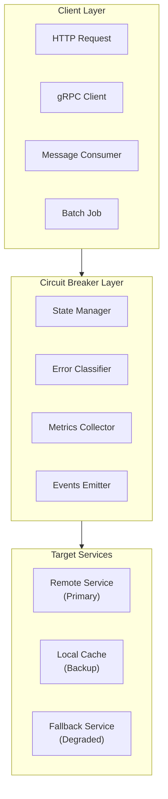
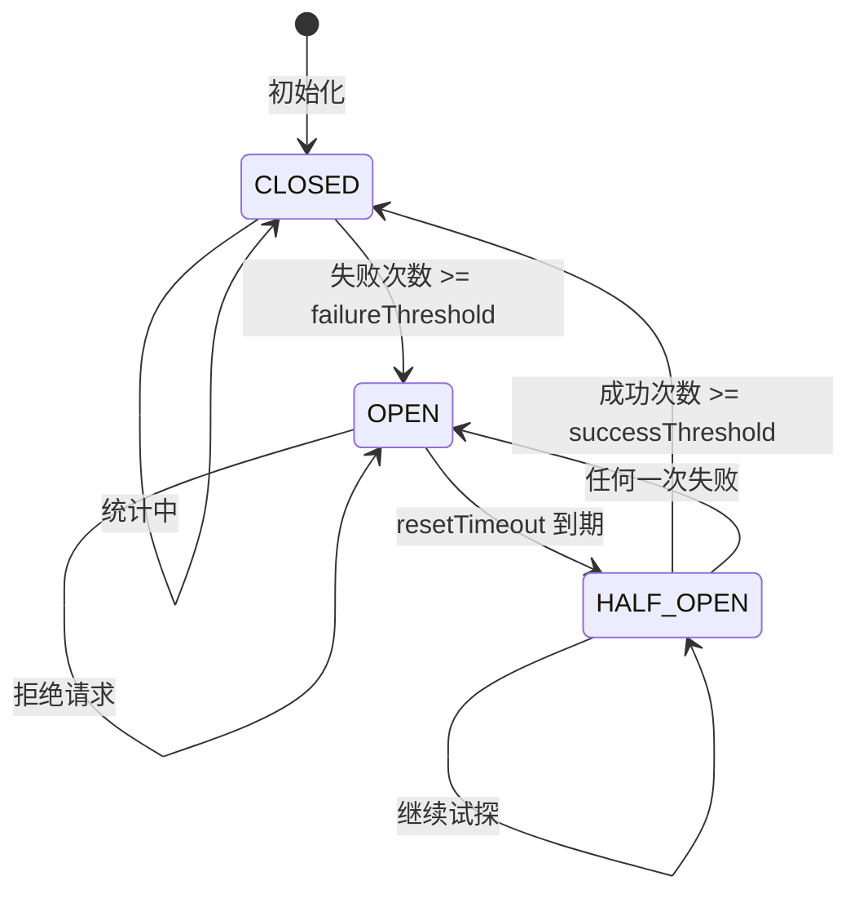
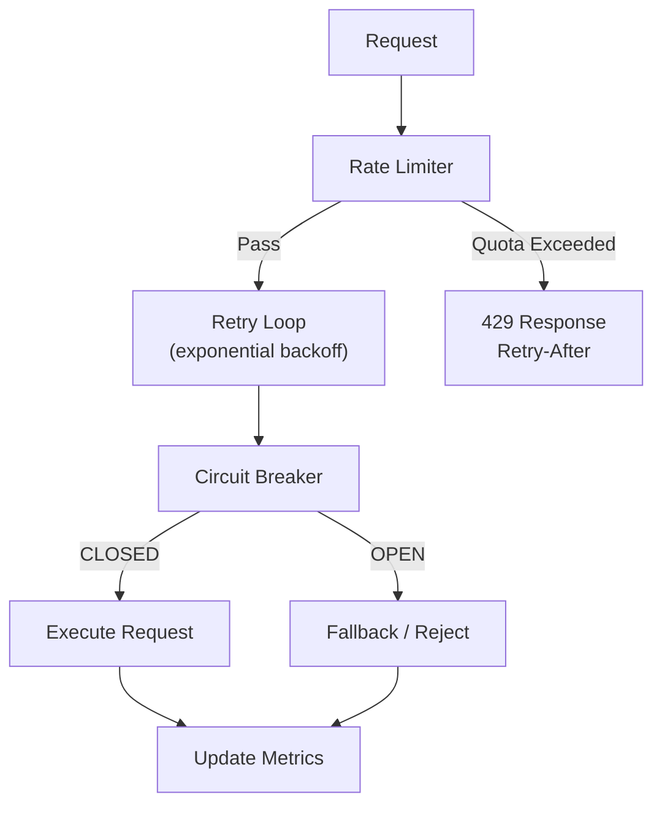
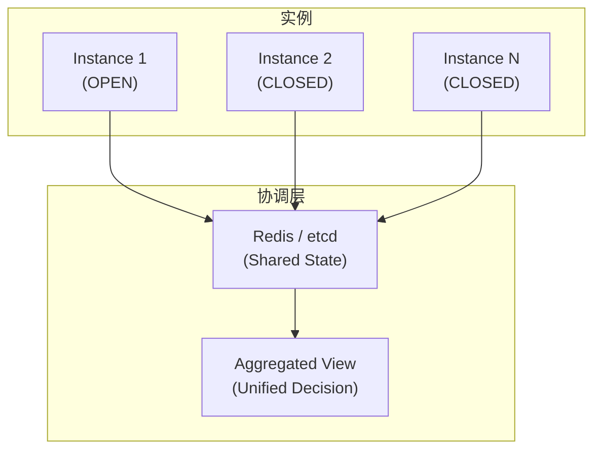

# 熔断器模式

> 服务弹性、故障隔离、自动恢复的最佳实践

## 何时激活

- 微服务间调用
- 外部 API 集成
- 数据库连接
- 实现服务降级
- 故障隔离

## 技术栈版本

| 技术         | 最低版本 | 推荐版本 | 语言    | 特点                   |
| ------------ | -------- | -------- | ------- | ---------------------- |
| Opossum      | 7.0+     | 最新     | Node.js | 事件驱动、功能丰富     |
| resilience4j | 2.0+     | 最新     | Java    | 响应式、模块化         |
| Polly        | 8.0+     | 最新     | .NET    | 声明式、策略丰富       |
| Hystrix      | 2.0+     | 已归档   | Java    | Netflix 遗留，维护停止 |
| Sentinel     | 1.8+     | 最新     | Java    | Alibaba 出品、流量控制 |
| gobreaker    | 3.0+     | 最新     | Go      | 轻量级、易集成         |

## 熔断器架构



## 熔断器状态详解

### 状态定义

| 状态      | 说明         | 允许请求 | 行为                     |
| --------- | ------------ | -------- | ------------------------ |
| CLOSED    | 正常关闭状态 | ✅ 是    | 统计失败，达到阈值则熔断 |
| OPEN      | 熔断激活状态 | ❌ 否    | 直接返回错误或降级响应   |
| HALF_OPEN | 半开试探状态 | ⚠️ 限定  | 允许有限请求，成功则关闭 |

### 状态转换条件



### 错误分类

| 错误类型   | 是否计入失败 | 说明                   | 处理方式         |
| ---------- | ------------ | ---------------------- | ---------------- |
| 超时       | ✅ 是        | 响应超时               | 重试或降级       |
| 连接失败   | ✅ 是        | 网络不通               | 降级、告警       |
| 5xx 错误   | ✅ 是        | 服务器内部错误         | 重试或降级       |
| 429 限流   | ✅ 是        | 请求被限流             | 延迟重试         |
| 400 错误   | ❌ 否        | 客户端错误（配置问题） | 不重试、记录日志 |
| 404 未找到 | ⚠️ 可配置    | 资源不存在             | 缓存结果短时有效 |
| 业务异常   | ⚠️ 可配置    | 如余额不足             | 业务逻辑判断     |

### 熔断器参数详解

| 参数                     | 默认值  | 说明                         | 调优建议           |
| ------------------------ | ------- | ---------------------------- | ------------------ |
| failureThreshold         | 5       | OPEN 状态的失败次数阈值      | 根据服务稳定性调整 |
| successThreshold         | 2       | HALF_OPEN 恢复需要的成功次数 | 不要太大，恢复太慢 |
| timeout                  | 3000ms  | 单次请求超时时间             | 略高于 P99 延迟    |
| resetTimeout             | 30000ms | OPEN 到 HALF_OPEN 的等待时间 | 根据恢复时间调整   |
| volumeThreshold          | 10      | 统计生效的最小请求量         | 避免低流量时误触发 |
| errorThresholdPercentage | 50%     | 失败率阈值（百分比）         | 关键服务设置较低   |
| slowCallThreshold        | 2000ms  | 慢调用阈值                   | 根据业务 SLO 设置  |

---

## 基础实现

```typescript
enum CircuitState {
  CLOSED = 'CLOSED',
  OPEN = 'OPEN',
  HALF_OPEN = 'HALF_OPEN',
}

interface CircuitBreakerOptions {
  failureThreshold: number;
  successThreshold: number;
  timeout: number;
  resetTimeout: number;
}

class CircuitBreaker<T> {
  private state: CircuitState = CircuitState.CLOSED;
  private failures = 0;
  private successes = 0;
  private lastFailureTime: number | null = null;

  constructor(
    private fn: () => Promise<T>,
    private options: CircuitBreakerOptions
  ) {}

  async execute(): Promise<T> {
    if (this.state === CircuitState.OPEN) {
      if (this.shouldAttemptReset()) {
        this.state = CircuitState.HALF_OPEN;
      } else {
        throw new Error('Circuit breaker is OPEN');
      }
    }

    try {
      const result = await this.executeWithTimeout();
      this.onSuccess();
      return result;
    } catch (error) {
      this.onFailure();
      throw error;
    }
  }

  private async executeWithTimeout(): Promise<T> {
    return new Promise((resolve, reject) => {
      const timer = setTimeout(() => {
        reject(new Error('Timeout'));
      }, this.options.timeout);

      this.fn()
        .then((result) => {
          clearTimeout(timer);
          resolve(result);
        })
        .catch((error) => {
          clearTimeout(timer);
          reject(error);
        });
    });
  }

  private onSuccess(): void {
    this.failures = 0;

    if (this.state === CircuitState.HALF_OPEN) {
      this.successes++;
      if (this.successes >= this.options.successThreshold) {
        this.state = CircuitState.CLOSED;
        this.successes = 0;
      }
    }
  }

  private onFailure(): void {
    this.failures++;
    this.lastFailureTime = Date.now();

    if (this.state === CircuitState.HALF_OPEN) {
      this.state = CircuitState.OPEN;
      this.successes = 0;
    } else if (this.failures >= this.options.failureThreshold) {
      this.state = CircuitState.OPEN;
    }
  }

  private shouldAttemptReset(): boolean {
    if (!this.lastFailureTime) return false;
    return Date.now() - this.lastFailureTime >= this.options.resetTimeout;
  }

  getState(): CircuitState {
    return this.state;
  }

  getStats() {
    return {
      state: this.state,
      failures: this.failures,
      successes: this.successes,
    };
  }
}
```

## Opossum 实现

```typescript
import CircuitBreaker from 'opossum';

async function externalApiCall(id: string): Promise<any> {
  const response = await fetch(`https://api.example.com/users/${id}`);
  return response.json();
}

const breaker = new CircuitBreaker(externalApiCall, {
  timeout: 3000,
  errorThresholdPercentage: 50,
  resetTimeout: 30000,
  volumeThreshold: 10,
});

breaker.on('open', () => console.log('Circuit opened'));
breaker.on('halfOpen', () => console.log('Circuit half-open'));
breaker.on('close', () => console.log('Circuit closed'));
breaker.fallback(() => ({ cached: true, data: getCachedData() }));

async function getUser(id: string) {
  try {
    return await breaker.fire(id);
  } catch (error) {
    console.error('Circuit breaker error:', error);
    return null;
  }
}
```

## 降级策略

```typescript
class ResilientService {
  private breaker: CircuitBreaker<any>;
  private cache = new Map<string, any>();

  constructor() {
    this.breaker = new CircuitBreaker(this.callExternalService.bind(this), {
      failureThreshold: 5,
      successThreshold: 2,
      timeout: 5000,
      resetTimeout: 30000,
    });
  }

  async getData(key: string): Promise<any> {
    try {
      const data = await this.breaker.execute();
      this.cache.set(key, data);
      return data;
    } catch (error) {
      return this.fallback(key);
    }
  }

  private fallback(key: string): any {
    if (this.cache.has(key)) {
      return { ...this.cache.get(key), cached: true };
    }
    return { error: 'Service unavailable', cached: false };
  }

  private async callExternalService(): Promise<any> {
    // External API call
  }
}
```

## 重试 + 熔断组合

```typescript
class ResilientClient {
  private breaker: CircuitBreaker<any>;

  async request<T>(fn: () => Promise<T>, retries = 3): Promise<T> {
    return this.retry(() => this.breaker.execute(), retries);
  }

  private async retry<T>(fn: () => Promise<T>, retries: number): Promise<T> {
    let lastError: Error;

    for (let i = 0; i < retries; i++) {
      try {
        return await fn();
      } catch (error) {
        lastError = error;
        await this.delay(Math.pow(2, i) * 1000);
      }
    }

    throw lastError;
  }

  private delay(ms: number): Promise<void> {
    return new Promise((resolve) => setTimeout(resolve, ms));
  }
}
```

## 模式组合使用

### 熔断器 + 限流 + 重试



### 组合策略对比

| 模式组合           | 适用场景            | 作用                 |
| ------------------ | ------------------- | -------------------- |
| 熔断 + 降级        | 关键服务保护        | 故障时提供有损服务   |
| 熔断 + 重试        | 瞬时故障恢复        | 减少临时故障的错误率 |
| 限流 + 熔断        | 流量控制 + 服务保护 | 防止过载 + 故障隔离  |
| 缓存 + 熔断        | 读多写少场景        | 降级时返回缓存数据   |
| 熔断 + 限流 + 重试 | 高可用系统          | 全方位保护，层层降级 |

### 完整实现示例

```typescript
interface ResilientOptions {
  timeout: number;
  retries: number;
  failureThreshold: number;
  resetTimeout: number;
  rateLimit: number;
  rateWindow: number;
}

class ResilientService {
  private breaker: CircuitBreaker<any>;
  private cache = new Map<string, { data: any; timestamp: number }>();
  private rateLimiter: Map<string, number[]> = new Map();

  constructor(private options: ResilientOptions) {
    this.breaker = new CircuitBreaker(this.execute.bind(this), {
      failureThreshold: options.failureThreshold,
      successThreshold: 2,
      timeout: options.timeout,
      resetTimeout: options.resetTimeout,
    });
  }

  async request<T>(key: string, fn: () => Promise<T>, ttl = 3600): Promise<T> {
    if (!this.checkRateLimit(key)) {
      throw new Error('Rate limit exceeded');
    }

    try {
      return await this.breaker.execute(fn);
    } catch (error) {
      return this.fallback<T>(key, fn, ttl);
    }
  }

  private checkRateLimit(key: string): boolean {
    const now = Date.now();
    const windowStart = now - this.options.rateWindow;

    if (!this.rateLimiter.has(key)) {
      this.rateLimiter.set(key, []);
    }

    const timestamps = this.rateLimiter.get(key)!;
    const validTimestamps = timestamps.filter((t) => t > windowStart);
    validTimestamps.push(now);
    this.rateLimiter.set(key, validTimestamps);

    return validTimestamps.length <= this.options.rateLimit;
  }

  private async fallback<T>(key: string, fn: () => Promise<T>, ttl: number): Promise<T> {
    const cached = this.cache.get(key);
    if (cached && Date.now() - cached.timestamp < ttl * 1000) {
      return cached.data as T;
    }

    try {
      const data = await fn();
      this.cache.set(key, { data, timestamp: Date.now() });
      return data;
    } catch {
      throw new Error('Service unavailable and no fallback available');
    }
  }

  private async execute<T>(fn: () => Promise<T>): Promise<T> {
    return fn();
  }
}
```

## 健康检查与恢复策略

### 健康检查端点

```typescript
app.get('/health/circuit-breaker', (req, res) => {
  const state = breaker.getState();
  const stats = breaker.getStats();

  const healthy = state !== 'OPEN';
  const degraded = state === 'HALF_OPEN';

  res.status(healthy ? 200 : 503).json({
    status: healthy ? 'healthy' : 'degraded',
    circuitBreaker: {
      state,
      failures: stats.failures,
      successes: stats.successes,
      lastFailureTime: stats.lastFailureTime,
    },
    recommendations: generateRecommendations(state, stats),
  });
});

function generateRecommendations(state: string, stats: any): string[] {
  const recommendations: string[] = [];

  if (state === 'OPEN') {
    recommendations.push(
      'Service is experiencing issues. Consider checking downstream dependencies.'
    );
  }

  if (stats.failures > 10) {
    recommendations.push('High failure rate detected. Review error patterns.');
  }

  return recommendations;
}
```

### 自动恢复策略

| 策略         | 说明                     | 配置建议                  |
| ------------ | ------------------------ | ------------------------- |
| 指数退避     | resetTimeout 逐步增加    | maxResetTimeout = 5min    |
| 渐进式开放   | 逐步增加请求量           | volumeThreshold 递增      |
| 依赖服务检测 | 主动探测下游服务健康状态 | healthCheckInterval = 30s |
| 人工干预     | 手动重置熔断器状态       | admin API 支持            |
| 分组隔离     | 按服务分组熔断           | 避免全局熔断              |

## 分布式熔断器

### 多实例协调



### Redis 分布式熔断实现

```typescript
class DistributedCircuitBreaker {
  constructor(
    private redis: Redis,
    private options: CircuitBreakerOptions
  ) {}

  async isOpen(service: string): Promise<boolean> {
    const state = await this.redis.get(`circuit:${service}:state`);
    return state === 'OPEN';
  }

  async recordFailure(service: string): Promise<void> {
    const key = `circuit:${service}:failures`;
    const count = await this.redis.incr(key);
    await this.redis.expire(key, this.options.resetTimeout / 1000);

    if (count >= this.options.failureThreshold) {
      await this.redis.set(`circuit:${service}:state`, 'OPEN');
      await this.redis.setex(
        `circuit:${service}:openedAt`,
        this.options.resetTimeout / 1000,
        Date.now().toString()
      );
    }
  }

  async recordSuccess(service: string): Promise<void> {
    await this.redis.del(`circuit:${service}:failures`);
    await this.redis.set(`circuit:${service}:state`, 'CLOSED');
  }

  async shouldAttemptReset(service: string): Promise<boolean> {
    const openedAt = await this.redis.get(`circuit:${service}:openedAt`);
    if (!openedAt) return false;

    const elapsed = Date.now() - parseInt(openedAt, 10);
    return elapsed >= this.options.resetTimeout;
  }
}
```

## 监控指标

### 核心指标

| 指标名称                | 类型      | 说明                                | 告警阈值        |
| ----------------------- | --------- | ----------------------------------- | --------------- |
| circuit_state           | gauge     | 当前状态 (0=CLOSED, 1=HALF, 2=OPEN) | = 2 告警        |
| circuit_failures_total  | counter   | 总失败次数                          | 增长速率 > 10/s |
| circuit_successes_total | counter   | 总成功次数                          | -               |
| circuit_rejects_total   | counter   | OPEN 状态拒绝数                     | > 100           |
| circuit_latency_seconds | histogram | 请求延迟分布                        | P99 > 1s        |
| circuit_error_rate      | gauge     | 失败率百分比                        | > 50%           |

### Prometheus 指标导出

```typescript
import client from 'prom-client';

const circuitBreakerMetrics = new client.Gauge({
  name: 'circuit_breaker_state',
  help: 'Circuit breaker state (0=CLOSED, 1=HALF_OPEN, 2=OPEN)',
  labelNames: ['service'],
});

const circuitFailures = new client.Counter({
  name: 'circuit_breaker_failures_total',
  help: 'Total number of circuit breaker failures',
  labelNames: ['service'],
});

const circuitLatency = new client.Histogram({
  name: 'circuit_breaker_latency_seconds',
  help: 'Circuit breaker request latency',
  labelNames: ['service'],
  buckets: [0.1, 0.5, 1, 2, 5],
});

app.get('/metrics', async (req, res) => {
  res.set('Content-Type', client.register.contentType);
  res.end(await client.register.metrics());
});
```

## Express 中间件

```typescript
function circuitBreakerMiddleware(breaker: CircuitBreaker<any>) {
  return async (req: Request, res: Response, next: NextFunction) => {
    if (breaker.getState() === CircuitState.OPEN) {
      return res.status(503).json({
        error: 'Service temporarily unavailable',
        retryAfter: 30,
      });
    }

    try {
      await breaker.execute();
      next();
    } catch (error) {
      res.status(503).json({ error: 'Service unavailable' });
    }
  };
}
```

## 配置建议

| 参数             | 推荐值 | 说明               |
| ---------------- | ------ | ------------------ |
| failureThreshold | 5-10   | 触发熔断的失败次数 |
| successThreshold | 2-3    | 恢复正常的成功次数 |
| timeout          | 3-5s   | 单次请求超时       |
| resetTimeout     | 30-60s | 熔断恢复等待时间   |

## 快速参考

```typescript
// 创建熔断器
const breaker = new CircuitBreaker(fn, {
  failureThreshold: 5,
  resetTimeout: 30000,
});

// 执行请求
const result = await breaker.execute();

// 降级处理
breaker.fallback(() => getCachedData());

// 监听状态
breaker.on('open', () => {});
breaker.on('close', () => {});
```

## 参考

- [Circuit Breaker Pattern (Martin Fowler)](https://martinfowler.com/bliki/CircuitBreaker.html)
- [Opossum](https://github.com/nodeshift/opossum)
- [Resilience4j](https://resilience4j.readme.io/)
- [Microsoft Azure - Circuit Breaker](https://docs.microsoft.com/en-us/azure/architecture/patterns/circuit-breaker)
