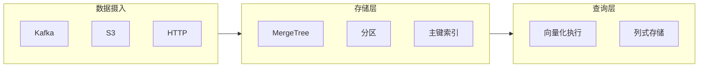

# ClickHouse 数据库模式

用于高性能分析查询和实时数据处理的 ClickHouse 最佳实践。

## 何时激活

- 设计 ClickHouse 表结构
- 编写高效分析查询
- 优化大数据集查询性能
- 实现实时数据管道
- 配置数据复制和分片

## 技术栈版本

| 技术              | 最低版本 | 推荐版本 |
| ---------------- | -------- | -------- |
| ClickHouse       | 23.0+    | 最新     |
| clickhouse-js    | 0.3.0+   | 最新     |
| clickhouse-local | 23.0+    | 最新     |

## 核心概念



## 表引擎选择

| 引擎类型     | 使用场景                     | 特点                 |
| ------------ | ---------------------------- | -------------------- |
| MergeTree    | 主表引擎，通用场景           | 支持主键、索引、分区 |
| SummingMergeTree | 预聚合表                 | 自动求和             |
| ReplacingMergeTree | 最新值优先              | 自动去重             |
| CollapsingMergeTree | 折叠-sign 值          | 支持软删除           |
| AggregatingMergeTree | 物化视图聚合          | 高效预聚合           |

## 表设计模式

### 1. MergeTree 表

```sql
CREATE TABLE events (
    event_date Date,
    event_time DateTime,
    event_type String,
    user_id String,
    session_id String,
    properties Map(String, String),
    amount Float64
)
ENGINE = MergeTree()
PARTITION BY toYYYYMM(event_date)
ORDER BY (event_type, user_id, event_time)
TTL event_date + INTERVAL 90 DAY
SETTINGS index_granularity = 8192;
```

### 2. 物化视图

```sql
-- 创建聚合物化视图
CREATE MATERIALIZED VIEW hourly_stats
ENGINE = SummingMergeTree()
PARTITION BY tuple()
ORDER BY (event_type, hour)
AS SELECT
    event_type,
    toStartOfHour(event_time) as hour,
    count() as cnt,
    sum(amount) as total_amount
FROM events
GROUP BY event_type, toStartOfHour(event_time);
```

### 3. 数组和 Map 类型

```sql
CREATE TABLE user_events (
    user_id String,
    event_date Date,
    events Array(EventType),
    properties Map(String, String)
)
ENGINE = MergeTree()
ORDER BY (user_id, event_date);
```

## 查询优化

### 1. WHERE 子句优化

```sql
-- ✅ 使用主键列过滤
SELECT * FROM events
WHERE event_type = 'purchase'
  AND event_date = '2024-01-15';

-- ❌ 避免在主键列上使用函数
SELECT * FROM events
WHERE toYYYYMM(event_date) = 202401;
```

### 2. PREWHERE 优化

```sql
-- ClickHouse 自动使用 PREWHERE
SELECT user_id, event_type
FROM events
WHERE event_type IN ('purchase', 'refund');
```

### 3. 采样查询

```sql
SELECT
    event_type,
    count() as cnt
FROM events
SAMPLE 0.1  -- 10% 采样
WHERE event_date = '2024-01-15'
GROUP BY event_type;
```

## 数据摄入

### 1. Kafka 引擎

```sql
CREATE TABLE events_queue (
    event_type String,
    user_id String,
    event_time DateTime,
    properties String
)
ENGINE = Kafka(
    'localhost:9092',
    'events_topic',
    'events_group',
    'JSONEachRow'
);
```

### 2. S3 表函数

```sql
-- 直接查询 S3
SELECT * FROM s3(
    'https://bucket/path/*.parquet',
    'parquet'
);

-- 批量导入
INSERT INTO events FROM s3('s3://bucket/data/*.parquet');
```

## 复制和分片

### 副本配置

```xml
<clickhouse>
    <remote_servers>
        <production>
            <shard>
                <replica>
                    <host>ch1.example.com</host>
                    <port>9000</port>
                </replica>
                <replica>
                    <host>ch2.example.com</host>
                    <port>9000</port>
                </replica>
            </shard>
        </production>
    </remote_servers>
</clickhouse>
```

## 性能监控

```sql
-- 查询性能
SELECT
    query,
    elapsed,
    rows_read,
    bytes_read
FROM system.query_log
WHERE type = 'QueryFinish'
  AND event_date >= today() - 7
ORDER BY elapsed DESC
LIMIT 10;

-- 资源使用
SELECT
    metric,
    value
FROM system.metrics
WHERE metric IN ('Query', 'Merge', 'Memory');
```
