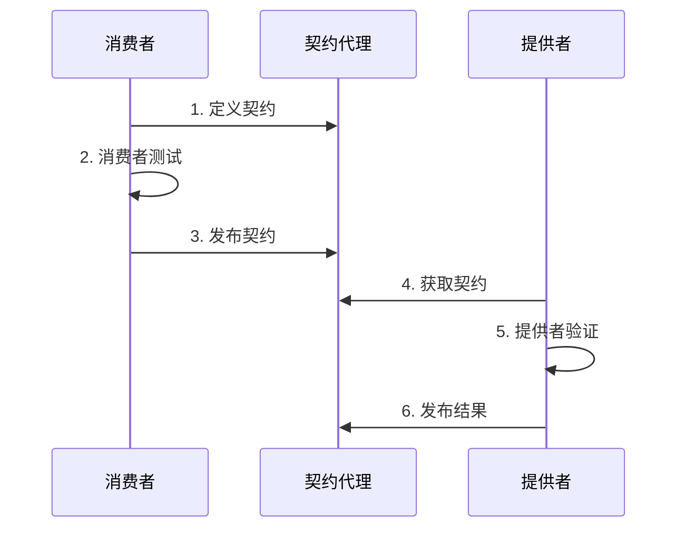
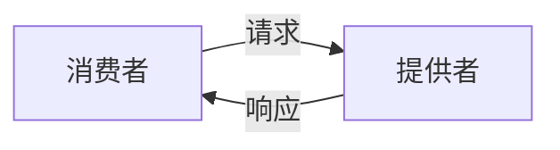
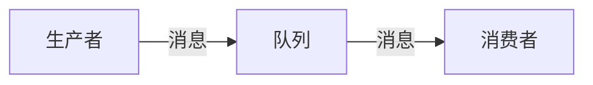

# 契约测试模式

> 确保服务间接口兼容

## 核心概念

### 什么是契约测试

| 概念 | 说明 |
|------|------|
| 契约 | 服务间接口的约定 |
| 契约测试 | 验证服务是否符合契约 |
| 消费者驱动 | 消费者定义契约 |

### 契约测试 vs 集成测试

| 对比 | 契约测试 | 集成测试 |
|------|----------|----------|
| 范围 | 单个服务 | 多个服务 |
| 环境 | 独立环境 | 集成环境 |
| 速度 | 快 | 慢 |
| 反馈 | 早期 | 后期 |

---

## 消费者驱动契约

### 工作流程



### 契约内容

```json
{
  "consumer": { "name": "order-service" },
  "provider": { "name": "user-service" },
  "interactions": [
    {
      "description": "获取用户信息",
      "request": {
        "method": "GET",
        "path": "/users/123"
      },
      "response": {
        "status": 200,
        "headers": { "Content-Type": "application/json" },
        "body": {
          "id": 123,
          "name": "John"
        }
      }
    }
  ]
}
```

---

## Pact框架

### 消费者测试

```python
from pact import Consumer, Provider

pact = Consumer('order-service').has_pact_with(Provider('user-service'))

def test_get_user():
    (pact
     .given('user exists')
     .upon_receiving('a request for user')
     .with_request('GET', '/users/123')
     .will_respond_with(200, body={
         'id': 123,
         'name': 'John'
     }))
    
    with pact:
        response = get_user(123)
        assert response['name'] == 'John'
```

### 提供者验证

```bash
pact-verifier \
  --provider-base-url=http://localhost:8080 \
  --pact-url=pacts/order-service-user-service.json
```

---

## 契约定义

### 请求契约

| 元素 | 说明 |
|------|------|
| method | HTTP方法 |
| path | 请求路径 |
| query | 查询参数 |
| headers | 请求头 |
| body | 请求体 |

### 响应契约

| 元素 | 说明 |
|------|------|
| status | 状态码 |
| headers | 响应头 |
| body | 响应体 |

### 匹配规则

| 规则 | 说明 | 示例 |
|------|------|------|
| 精确匹配 | 完全相同 | `"name": "John"` |
| 类型匹配 | 类型相同 | `like(123)` |
| 正则匹配 | 符合正则 | `regex("\\d+")` |
| 数组匹配 | 数组元素 | `each_like({"id": 1})` |

---

## 契约模式

### 同步契约



适用于：REST API、gRPC

### 异步契约



适用于：消息队列、事件驱动

### 消息契约

```json
{
  "description": "订单创建事件",
  "providerStates": [{ "name": "订单已创建" }],
  "content": {
    "eventType": "order.created",
    "data": {
      "orderId": "123",
      "userId": "456"
    }
  }
}
```

---

## CI/CD集成

### 流水线集成

```yaml
stages:
  - consumer-test
  - publish-contract
  - provider-verify
  
consumer-test:
  script:
    - npm run test:pact
    
publish-contract:
  script:
    - pact-broker publish pacts/
    
provider-verify:
  script:
    - pact-verifier --pact-broker-url=$PACT_BROKER_URL
```

### 契约Broker

| 功能 | 说明 |
|------|------|
| 契约存储 | 集中管理契约 |
| 版本管理 | 契约版本控制 |
| 结果展示 | 验证结果可视化 |
| Webhook | 验证触发通知 |

---

## 最佳实践

### 契约设计

- 保持契约简洁
- 使用匹配规则而非精确值
- 覆盖所有场景
- 包含错误响应

### 测试策略

- 消费者测试独立运行
- 提供者测试使用真实实现
- 验证所有交互
- 定期运行验证

### 版本管理

- 语义化版本
- 契约向后兼容
- 废弃流程明确
- 文档同步更新

---

## 常见问题

### 契约不兼容

| 问题 | 解决方案 |
|------|----------|
| 字段类型变更 | 新增字段，保留旧字段 |
| 字段删除 | 先废弃，后删除 |
| 接口变更 | 版本化API |

### 测试失败

| 原因 | 解决方案 |
|------|----------|
| 契约过期 | 更新契约 |
| 实现不符 | 修复实现 |
| 环境问题 | 检查环境配置 |

---

## 工具对比

| 工具 | 说明 | 适用场景 |
|------|------|----------|
| Pact | 消费者驱动契约 | 微服务 |
| Spring Cloud Contract | Spring生态 | Spring应用 |
| OpenAPI | API规范 | REST API |
| gRPC | 接口定义 | 高性能RPC |

---

## 反模式

| 反模式 | 问题 | 解决方案 |
|--------|------|----------|
| 契约过于严格 | 无法演进 | 使用匹配规则 |
| 不发布契约 | 无法验证 | 集成CI/CD |
| 跳过验证 | 兼容性风险 | 强制验证 |
| 契约膨胀 | 维护困难 | 按需定义 |
