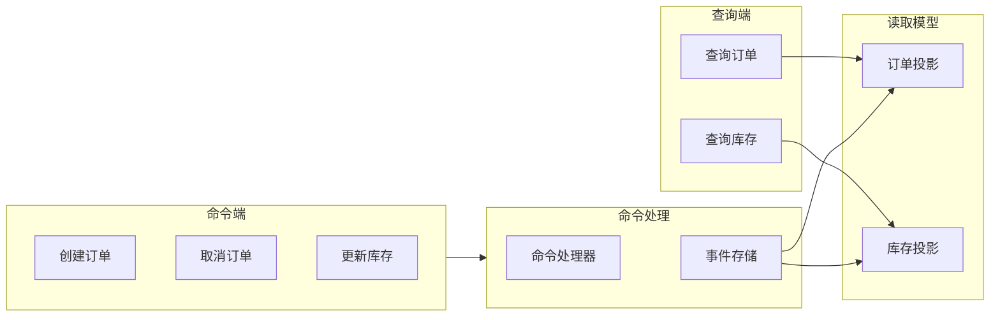

# CQRS 命令查询职责分离

> 读写分离、事件溯源、最终一致性的最佳实践

## 何时激活

- 实现读写分离架构
- 设计事件溯源系统
- 处理复杂业务逻辑
- 构建高并发系统
- 实现最终一致性

## 核心概念



## 命令与查询分离

### 1. 命令接口

```typescript
interface Command {
  type: string;
  payload: unknown;
  metadata: {
    correlationId: string;
    timestamp: Date;
    userId: string;
  };
}

interface CommandHandler<T extends Command> {
  handle(command: T): Promise<void>;
}

// 示例：创建订单命令
interface CreateOrderCommand extends Command {
  type: 'CREATE_ORDER';
  payload: {
    customerId: string;
    items: OrderItem[];
    shippingAddress: Address;
  };
}

class CreateOrderHandler implements CommandHandler<CreateOrderCommand> {
  constructor(
    private eventStore: EventStore,
    private orderRepository: OrderRepository
  ) {}

  async handle(command: CreateOrderCommand): Promise<void> {
    const orderId = generateOrderId();
    const orderCreated = new OrderCreatedEvent({
      orderId,
      customerId: command.payload.customerId,
      items: command.payload.items,
      shippingAddress: command.payload.shippingAddress,
      timestamp: command.metadata.timestamp,
    });

    await this.eventStore.save(orderCreated);
  }
}
```

### 2. 查询接口

```typescript
interface Query {
  type: string;
  parameters: unknown;
}

interface QueryHandler<T extends Query, R> {
  handle(query: T): Promise<R>;
}

// 示例：查询订单
interface GetOrderQuery extends Query {
  type: 'GET_ORDER';
  parameters: {
    orderId: string;
  };
}

interface OrderSummary {
  orderId: string;
  customerName: string;
  totalAmount: number;
  status: OrderStatus;
  createdAt: Date;
}

class GetOrderHandler implements QueryHandler<GetOrderQuery, OrderSummary> {
  constructor(private readModel: OrderReadModel) {}

  async handle(query: GetOrderQuery): Promise<OrderSummary> {
    return this.readModel.findById(query.parameters.orderId);
  }
}
```

## 事件溯源

### 1. 事件存储

```typescript
interface Event {
  id: string;
  aggregateId: string;
  aggregateType: string;
  eventType: string;
  payload: unknown;
  metadata: {
    version: number;
    timestamp: Date;
    userId: string;
  };
}

interface EventStore {
  save(event: Event): Promise<void>;
  getByAggregateId(aggregateId: string): Promise<Event[]>;
  append(event: Event): Promise<void>;
}

class EventStoreImpl implements EventStore {
  constructor(private connection: DatabaseConnection) {}

  async save(event: Event): Promise<void> {
    await this.connection.execute(
      `INSERT INTO events (id, aggregate_id, aggregate_type, event_type, payload, metadata, version)
       VALUES (?, ?, ?, ?, ?, ?, ?)`,
      [
        event.id,
        event.aggregateId,
        event.aggregateType,
        event.eventType,
        JSON.stringify(event.payload),
        JSON.stringify(event.metadata),
        event.metadata.version,
      ]
    );
  }

  async getByAggregateId(aggregateId: string): Promise<Event[]> {
    const rows = await this.connection.query(
      'SELECT * FROM events WHERE aggregate_id = ? ORDER BY version',
      [aggregateId]
    );
    return rows.map(this.mapToEvent);
  }
}
```

### 2. 聚合根

```typescript
interface Aggregate {
  id: string;
  version: number;
  getUncommittedEvents(): Event[];
  markEventsAsCommitted(): void;
}

class Order implements Aggregate {
  id: string;
  version: number = 0;
  private uncommittedEvents: Event[] = [];

  constructor(
    private customerId: string,
    private items: OrderItem[],
    private status: OrderStatus = OrderStatus.PENDING
  ) {
    this.id = generateOrderId();
  }

  create(): void {
    this.apply(new OrderCreatedEvent({
      orderId: this.id,
      customerId: this.customerId,
      items: this.items,
      timestamp: new Date(),
    }));
  }

  cancel(): void {
    if (this.status === OrderStatus.SHIPPED) {
      throw new Error('Cannot cancel shipped order');
    }
    this.apply(new OrderCancelledEvent({
      orderId: this.id,
      reason: 'Customer requested',
      timestamp: new Date(),
    }));
  }

  private apply(event: Event): void {
    this.uncommittedEvents.push(event);
    this.version++;
  }

  getUncommittedEvents(): Event[] {
    return this.uncommittedEvents;
  }

  markEventsAsCommitted(): void {
    this.uncommittedEvents = [];
  }

  static fromEvents(events: Event[]): Order {
    const order = new Order('', []);
    events.forEach(event => {
      // 应用事件重建聚合状态
    });
    return order;
  }
}
```

## 投影管理

### 1. 同步投影

```typescript
interface Projection {
  name: string;
  handle(event: Event): Promise<void>;
}

class OrderListProjection implements Projection {
  name = 'order_list';

  constructor(private db: DatabaseConnection) {}

  async handle(event: Event): Promise<void> {
    switch (event.eventType) {
      case 'ORDER_CREATED':
        await this.onOrderCreated(event);
        break;
      case 'ORDER_CANCELLED':
        await this.onOrderCancelled(event);
        break;
    }
  }

  private async onOrderCreated(event: Event): Promise<void> {
    const payload = event.payload as OrderCreatedPayload;
    await this.db.execute(
      'INSERT INTO order_list (order_id, customer_id, total, status, created_at) VALUES (?, ?, ?, ?, ?)',
      [payload.orderId, payload.customerId, payload.total, 'PENDING', payload.timestamp]
    );
  }

  private async onOrderCancelled(event: Event): Promise<void> {
    const payload = event.payload as OrderCancelledPayload;
    await this.db.execute(
      'UPDATE order_list SET status = ? WHERE order_id = ?',
      ['CANCELLED', payload.orderId]
    );
  }
}
```

### 2. 异步投影（投影处理器）

```typescript
class ProjectionProcessor {
  constructor(
    private eventStore: EventStore,
    private projections: Projection[],
    private eventBus: EventBus
  ) {
    this.eventBus.subscribe('*', this.processEvent.bind(this));
  }

  async processEvent(event: Event): Promise<void> {
    await Promise.all(
      this.projections.map(p => p.handle(event))
    );
  }

  async rebuildProjection(projectionName: string): Promise<void> {
    const projection = this.projections.find(p => p.name === projectionName);
    if (!projection) throw new Error(`Projection ${projectionName} not found`);

    const events = await this.eventStore.getAll();
    for (const event of events) {
      await projection.handle(event);
    }
  }
}
```

## 一致性策略

### 最终一致性

```typescript
class EventuallyConsistentReadModel {
  constructor(
    private cache: Cache,
    private readModel: ReadModel
  ) {}

  async findById(id: string): Promise<Entity | null> {
    const cached = await this.cache.get(`readmodel:${id}`);
    if (cached) return cached;

    const entity = await this.readModel.findById(id);
    await this.cache.set(`readmodel:${id}`, entity, { ttl: 300 });
    return entity;
  }
}
```

## Saga 模式（跨聚合事务）

```typescript
interface Saga {
  execute(): Promise<void>;
  compensate(): Promise<void>;
}

class OrderSaga implements Saga {
  constructor(
    private commandBus: CommandBus,
    private eventBus: EventBus
  ) {}

  async execute(): Promise<void> {
    // 1. 创建订单
    await this.commandBus.send(new CreateOrderCommand({ ... }));

    // 2. 预留库存
    await this.commandBus.send(new ReserveInventoryCommand({ ... }));

    // 3. 处理支付
    await this.commandBus.send(new ProcessPaymentCommand({ ... }));
  }

  async compensate(): Promise<void> {
    await this.commandBus.send(new CancelReservationCommand({ ... }));
    await this.commandBus.send(new RefundPaymentCommand({ ... }));
    await this.commandBus.send(new CancelOrderCommand({ ... }));
  }
}
```
