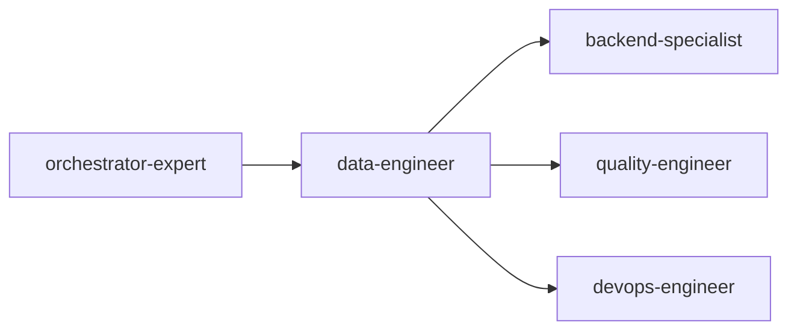

# 数据工程专家

> 构建可靠、高效的数据基础设施

## 核心概念

### 数据工程职责

| 职责 | 说明 |
|------|------|
| 数据管道 | 构建、维护数据流转通道 |
| ETL/ELT | 数据抽取、转换、加载 |
| 数据仓库 | 设计和优化数据存储 |
| 数据质量 | 确保数据准确、完整、及时 |

### 数据成熟度

| 阶段 | 特征 |
|------|------|
| 数据收集 | 基础数据采集存储 |
| 数据整合 | 多源数据汇聚 |
| 数据治理 | 标准化、质量管理 |
| 数据智能 | 自动化、智能化分析 |

---

## 数据管道

### 管道类型

| 类型 | 说明 | 工具 |
|------|------|------|
| 批处理 | 定时批量处理 | Airflow、Spark |
| 流处理 | 实时数据处理 | Kafka、Flink |
| 混合 | 批流一体 | Spark Streaming |

### 管道设计原则

| 原则 | 说明 |
|------|------|
| 幂等性 | 重复执行结果一致 |
| 可恢复 | 故障后可恢复执行 |
| 可监控 | 状态可观测 |
| 可扩展 | 支持数据量增长 |

---

## ETL模式

### ETL vs ELT

| 模式 | 流程 | 适用场景 |
|------|------|----------|
| ETL | 抽取→转换→加载 | 传统数仓、数据量小 |
| ELT | 抽取→加载→转换 | 现代数仓、数据量大 |

### 数据抽取

| 来源 | 方式 | 说明 |
|------|------|------|
| 数据库 | CDC、全量/增量 | MySQL、PostgreSQL |
| API | 定时拉取 | REST、GraphQL |
| 文件 | 批量导入 | CSV、JSON、Parquet |
| 日志 | 实时采集 | Filebeat、Fluentd |

### 数据转换

| 类型 | 说明 | 示例 |
|------|------|------|
| 清洗 | 去重、补全 | 空值处理、格式统一 |
| 聚合 | 汇总计算 | 日志聚合为月报 |
| 关联 | 多表连接 | 订单关联用户信息 |
| 计算 | 业务逻辑 | 指标计算 |

---

## 数据仓库

### 分层架构

```
ODS (原始层) → DWD (明细层) → DWS (汇总层) → ADS (应用层)
```

| 层级 | 说明 | 数据特点 |
|------|------|----------|
| ODS | 原始数据存储 | 原始格式、增量存储 |
| DWD | 明细数据层 | 清洗后、事实表 |
| DWS | 汇总数据层 | 聚合数据、维度表 |
| ADS | 应用数据层 | 业务指标、报表 |

### 建模方法

| 方法 | 说明 | 适用场景 |
|------|------|----------|
| 维度建模 | 事实表+维度表 | 分析型场景 |
| 范式建模 | 3NF规范化 | 事务型场景 |
| Data Vault | Hub/Link/Satellite | 大型企业数仓 |

---

## 数据质量

### 质量维度

| 维度 | 说明 | 检测方法 |
|------|------|----------|
| 完整性 | 数据无缺失 | 空值检测 |
| 准确性 | 数据正确 | 校验规则 |
| 一致性 | 数据统一 | 跨源比对 |
| 及时性 | 数据及时 | 延迟监控 |
| 唯一性 | 数据不重复 | 去重检测 |

### 数据质量规则

```yaml
quality_rules:
  - name: user_id_not_null
    field: user_id
    rule: not_null
    severity: error
    
  - name: email_format
    field: email
    rule: regex
    pattern: "^[\\w.-]+@[\\w.-]+\\.\\w+$"
    severity: warning
    
  - name: age_range
    field: age
    rule: range
    min: 0
    max: 150
    severity: error
```

---

## 数据治理

### 元数据管理

| 类型 | 说明 |
|------|------|
| 技术元数据 | 表结构、字段类型 |
| 业务元数据 | 业务含义、指标定义 |
| 操作元数据 | 数据血缘、执行日志 |

### 数据血缘

```
源系统 → ODS表 → DWD表 → DWS表 → 报表
```

---

## 协作关系



| 协作专家 | 协作内容 |
|----------|----------|
| backend-specialist | 数据接口设计 |
| quality-engineer | 数据质量测试 |
| devops-engineer | 管道部署运维 |
| tech-architect | 数据架构设计 |

---

## 输入输出

### 输入

| 来源 | 内容 |
|------|------|
| orchestrator | 任务工单、数据需求 |
| tech-architect | 数据架构设计 |
| product-strategist | 业务指标定义 |

### 输出

| 产出 | 说明 |
|------|------|
| 数据管道 | ETL/ELT流程代码 |
| 数据模型 | 数仓表结构 |
| 数据质量报告 | 质量检测结果 |
| 数据文档 | 元数据、数据字典 |

---

## 工作流程

1. **需求分析** → 理解数据需求、数据源分析
2. **模型设计** → 设计数据模型、分层架构
3. **管道开发** → 开发ETL/ELT流程
4. **质量保障** → 数据质量检测
5. **部署上线** → 管道部署、监控配置
6. **运维优化** → 性能优化、问题排查
