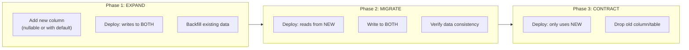

# 数据库模式与迁移

为生产系统提供安全的数据库设计模式和可逆的模式变更。

## 何时激活

- 设计新的数据库模式
- 创建或修改数据库表
- 添加/删除列或索引
- 运行数据迁移（回填、转换）
- 计划零停机模式变更
- 为新项目设置迁移工具

## 技术栈版本

| 技术       | 最低版本 | 推荐版本 |
| ---------- | -------- | -------- |
| PostgreSQL | 14.0+    | 16.0+    |
| MySQL      | 8.0+     | 最新     |

---

## 数据库设计模式

### 通用命名规范

| 规范类型 | 规则                 | 示例                    |
| -------- | -------------------- | ----------------------- |
| 表名     | 复数名词，下划线分隔 | `users`, `order_items`  |
| 列名     | 下划线分隔，名词     | `user_id`, `created_at` |
| 主键     | `id` 或 `表名_id`    | `id`, `user_id`         |
| 外键     | `表名_id`            | `user_id`, `order_id`   |
| 索引     | `idx_表名_列名`      | `idx_users_email`       |
| 唯一约束 | `u_表名_列名`        | `u_users_email`         |

### 软删除模式

```sql
-- 带 deleted_at 时间戳的软删除
ALTER TABLE users ADD COLUMN deleted_at TIMESTAMP NULL;

-- 查询时自动过滤已删除记录
CREATE VIEW active_users AS
SELECT * FROM users WHERE deleted_at IS NULL;

-- 或者使用行级安全策略 (RLS)
ALTER TABLE users ENABLE ROW LEVEL SECURITY;
CREATE POLICY soft_delete_policy ON users
    FOR DELETE USING (deleted_at IS NULL);
```

### 时间戳模式

```sql
-- 创建时间戳
created_at TIMESTAMP WITH TIME ZONE DEFAULT NOW(),

-- 更新时间戳（自动更新）
updated_at TIMESTAMP WITH TIME ZONE DEFAULT NOW(),
-- 在触发器中更新：
-- CREATE TRIGGER update_updated_at
-- BEFORE UPDATE ON table_name
-- FOR EACH ROW EXECUTE FUNCTION update_updated_at_column();
```

### 枚举模式

```sql
-- PostgreSQL 枚举类型
CREATE TYPE order_status AS ENUM (
    'pending',
    'processing',
    'shipped',
    'delivered',
    'cancelled'
);

-- 添加枚举值（安全方式）
ALTER TYPE order_status ADD VALUE IF NOT EXISTS 'refunded';

-- MySQL 枚举
ALTER TABLE orders MODIFY COLUMN status
    ENUM('pending', 'processing', 'shipped', 'delivered', 'cancelled', 'refunded');
```

### 继承模式（PostgreSQL）

```sql
-- 创建父表
CREATE TABLE documents (
    id SERIAL PRIMARY KEY,
    title VARCHAR(255) NOT NULL,
    created_at TIMESTAMP WITH TIME ZONE DEFAULT NOW()
);

-- 创建子表
CREATE TABLE invoices (
    invoice_number VARCHAR(50) NOT NULL,
    amount DECIMAL(10, 2) NOT NULL
) INHERITS (documents);

-- 查询包括子表数据
SELECT * FROM documents;
-- 或只查询子表
SELECT * FROM invoices;
```

### JSON 字段模式

```sql
-- 灵活的可扩展字段
ALTER TABLE products ADD COLUMN metadata JSONB;

-- 查询 JSON 字段
SELECT * FROM products
WHERE metadata->>'brand' = 'Apple';

-- 索引 JSON 字段
CREATE INDEX idx_products_brand ON products ((metadata->>'brand'));
```

---

## 核心迁移原则

1. **每个变更都是一次迁移** — 切勿手动更改生产数据库
2. **迁移在生产环境中是只进不退的** — 回滚使用新的前向迁移
3. **模式迁移和数据迁移是分开的** — 切勿在一个迁移中混合 DDL 和 DML
4. **针对生产规模的数据测试迁移** — 适用于 100 行的迁移可能在 1000 万行时锁定
5. **迁移一旦部署就是不可变的** — 切勿编辑已在生产中运行的迁移

## 迁移安全检查清单

应用任何迁移之前：

- [ ] 迁移同时包含 UP 和 DOWN（或明确标记为不可逆）
- [ ] 对大表没有全表锁（使用并发操作）
- [ ] 新列有默认值或可为空（切勿添加没有默认值的 NOT NULL）
- [ ] 索引是并发创建的（对于现有表，不与 CREATE TABLE 内联创建）
- [ ] 数据回填是与模式变更分开的迁移
- [ ] 已针对生产数据副本进行测试
- [ ] 回滚计划已记录

---

## PostgreSQL 模式变更

### 安全地添加列

```sql
-- GOOD: Nullable column, no lock
ALTER TABLE users ADD COLUMN avatar_url TEXT;

-- GOOD: Column with default (Postgres 11+ is instant, no rewrite)
ALTER TABLE users ADD COLUMN is_active BOOLEAN NOT NULL DEFAULT true;

-- BAD: NOT NULL without default on existing table (requires full rewrite)
ALTER TABLE users ADD COLUMN role TEXT NOT NULL;
-- This locks the table and rewrites every row
```

### 无停机添加索引

```sql
-- BAD: Blocks writes on large tables
CREATE INDEX idx_users_email ON users (email);

-- GOOD: Non-blocking, allows concurrent writes
CREATE INDEX CONCURRENTLY idx_users_email ON users (email);

-- Note: CONCURRENTLY cannot run inside a transaction block
-- Most migration tools need special handling for this
```

### 重命名列（零停机）

切勿在生产中直接重命名。使用扩展-收缩模式：

```sql
-- Step 1: Add new column (migration 001)
ALTER TABLE users ADD COLUMN display_name TEXT;

-- Step 2: Backfill data (migration 002, data migration)
UPDATE users SET display_name = username WHERE display_name IS NULL;

-- Step 3: Update application code to read/write both columns
-- Deploy application changes

-- Step 4: Stop writing to old column, drop it (migration 003)
ALTER TABLE users DROP COLUMN username;
```

### 安全地删除列

```sql
-- Step 1: Remove all application references to the column
-- Step 2: Deploy application without the column reference
-- Step 3: Drop column in next migration
ALTER TABLE orders DROP COLUMN legacy_status;

-- For Django: use SeparateDatabaseAndState to remove from model
-- without generating DROP COLUMN (then drop in next migration)
```

### 大型数据迁移

```sql
-- BAD: Updates all rows in one transaction (locks table)
UPDATE users SET normalized_email = LOWER(email);

-- GOOD: Batch update with progress
DO $$
DECLARE
  batch_size INT := 10000;
  rows_updated INT;
BEGIN
  LOOP
    UPDATE users
    SET normalized_email = LOWER(email)
    WHERE id IN (
      SELECT id FROM users
      WHERE normalized_email IS NULL
      LIMIT batch_size
      FOR UPDATE SKIP LOCKED
    );
    GET DIAGNOSTICS rows_updated = ROW_COUNT;
    RAISE NOTICE 'Updated % rows', rows_updated;
    EXIT WHEN rows_updated = 0;
    COMMIT;
  END LOOP;
END $$;
```

---

## ORM 迁移工具

### Prisma (TypeScript/Node.js)

```bash
# Create migration from schema changes
npx prisma migrate dev --name add_user_avatar

# Apply pending migrations in production
npx prisma migrate deploy

# Reset database (dev only)
npx prisma migrate reset

# Generate client after schema changes
npx prisma generate
```

```prisma
model User {
  id        String   @id @default(cuid())
  email     String   @unique
  name      String?
  avatarUrl String?  @map("avatar_url")
  createdAt DateTime @default(now()) @map("created_at")
  updatedAt DateTime @updatedAt @map("updated_at")
  orders    Order[]

  @@map("users")
  @@index([email])
}
```

```bash
# Create empty migration, then edit the SQL manually
npx prisma migrate dev --create-only --name add_email_index
```

```sql
-- migrations/20240115_add_email_index/migration.sql
CREATE INDEX CONCURRENTLY IF NOT EXISTS idx_users_email ON users (email);
```

### Drizzle (TypeScript/Node.js)

```bash
# Generate migration from schema changes
npx drizzle-kit generate

# Apply migrations
npx drizzle-kit migrate

# Push schema directly (dev only, no migration file)
npx drizzle-kit push
```

```typescript
import { pgTable, text, timestamp, uuid, boolean } from 'drizzle-orm/pg-core';

export const users = pgTable('users', {
  id: uuid('id').primaryKey().defaultRandom(),
  email: text('email').notNull().unique(),
  name: text('name'),
  isActive: boolean('is_active').notNull().default(true),
  createdAt: timestamp('created_at').notNull().defaultNow(),
  updatedAt: timestamp('updated_at').notNull().defaultNow(),
});
```

### Aerich (Tortoise ORM, Python Async)

```bash
# 初始化Aerich
aerich init -t your_project.module.TORTOISE_ORM_CONFIG_VARIABLE
aerich init-db

# 生成迁移
aerich migrate --name add_user_avatar

# 应用迁移
aerich upgrade

# 降级
aerich downgrade

# 查看状态
aerich heads
aerich history
```

```python
from tortoise import fields, models

class User(models.Model):
    id = fields.IntField(pk=True)
    email = fields.CharField(max_length=255, unique=True)
    name = fields.CharField(max_length=255, null=True)
    avatar_url = fields.CharField(max_length=255, null=True)
    created_at = fields.DatetimeField(auto_now_add=True)
    updated_at = fields.DatetimeField(auto_now=True)
```

### Django (Python)

```bash
python manage.py makemigrations
python manage.py migrate
python manage.py showmigrations
python manage.py makemigrations --empty app_name -n description
```

```python
from django.db import migrations

def backfill_display_names(apps, schema_editor):
    User = apps.get_model("accounts", "User")
    batch_size = 5000
    users = User.objects.filter(display_name="")
    while users.exists():
        batch = list(users[:batch_size])
        for user in batch:
            user.display_name = user.username
        User.objects.bulk_update(batch, ["display_name"], batch_size=batch_size)

def reverse_backfill(apps, schema_editor):
    pass

class Migration(migrations.Migration):
    dependencies = [("accounts", "0015_add_display_name")]
    operations = [
        migrations.RunPython(backfill_display_names, reverse_backfill),
    ]
```

```python
class Migration(migrations.Migration):
    operations = [
        migrations.SeparateDatabaseAndState(
            state_operations=[
                migrations.RemoveField(model_name="user", name="legacy_field"),
            ],
            database_operations=[],
        ),
    ]
```

### golang-migrate (Go)

```bash
migrate create -ext sql -dir migrations -seq add_user_avatar
migrate -path migrations -database "$DATABASE_URL" up
migrate -path migrations -database "$DATABASE_URL" down 1
migrate -path migrations -database "$DATABASE_URL" force VERSION
```

```sql
-- migrations/000003_add_user_avatar.up.sql
ALTER TABLE users ADD COLUMN avatar_url TEXT;
CREATE INDEX CONCURRENTLY idx_users_avatar ON users (avatar_url) WHERE avatar_url IS NOT NULL;

-- migrations/000003_add_user_avatar.down.sql
DROP INDEX IF EXISTS idx_users_avatar;
ALTER TABLE users DROP COLUMN IF EXISTS avatar_url;
```

---

## 零停机迁移策略



| 时间  | 操作                                                 |
| ----- | ---------------------------------------------------- |
| Day 1 | Migration adds new_status column (nullable)          |
| Day 1 | Deploy app v2 — writes to both status and new_status |
| Day 2 | Run backfill migration for existing rows             |
| Day 3 | Deploy app v3 — reads from new_status only           |
| Day 7 | Migration drops old status column                    |

---

## 反模式

| 反模式                           | 为何会失败             | 更好的方法                           |
| -------------------------------- | ---------------------- | ------------------------------------ |
| 在生产中手动执行 SQL             | 没有审计追踪，不可重复 | 始终使用迁移文件                     |
| 编辑已部署的迁移                 | 导致环境间出现差异     | 改为创建新迁移                       |
| 没有默认值的 NOT NULL            | 锁定表，重写所有行     | 添加可为空列，回填数据，然后添加约束 |
| 在大表上内联创建索引             | 在构建期间阻塞写入     | 使用 CREATE INDEX CONCURRENTLY       |
| 在一个迁移中混合模式和数据的变更 | 难以回滚，事务时间长   | 分开的迁移                           |
| 在移除代码之前删除列             | 应用程序在缺失列时出错 | 先移除代码，下一次部署再删除列       |

---

## 相关技能

| 技能                | 说明                |
| ------------------- | ------------------- |
| `backend-expert`    | API 和后端模式      |
| `postgres-patterns` | PostgreSQL 详细模式 |
| `clickhouse-io`     | ClickHouse 分析模式 |
| `mongodb-patterns`  | MongoDB 文档模式    |
| `cache-strategy-patterns`  | 缓存模式            |
