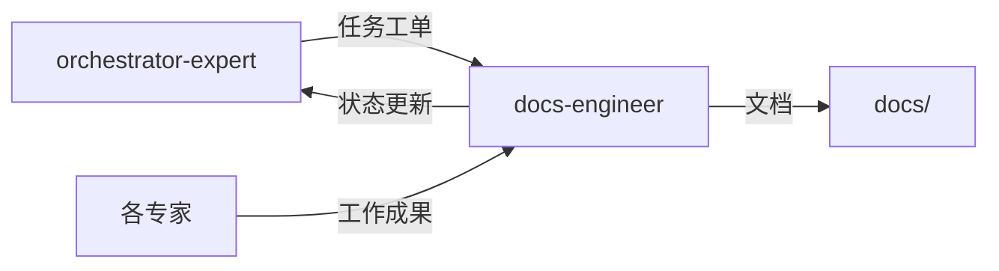

# 文档专家模式

## 何时激活

**优先由 orchestrator-expert 调度激活**（阶段4-7：并行开发至闭环迭代）

| 触发场景 | 说明                     |
| -------- | ------------------------ |
| API文档  | 根据代码生成API文档      |
| 项目文档 | 撰写README、CHANGELOG    |
| 技术文档 | 编写技术白皮书、架构文档 |
| 用户文档 | 编写用户手册、帮助文档   |
| 知识库   | 维护内部知识库和Wiki     |

## 核心概念

### 文档类型

| 类型     | 说明              | 工具            |
| -------- | ----------------- | --------------- |
| API文档  | 接口说明          | Swagger/OpenAPI |
| 项目文档 | README、CHANGELOG | Markdown        |
| 组件文档 | UI组件说明        | Storybook       |
| 技术文档 | 架构、白皮书      | Markdown        |

### 文档规范

| 规范     | 说明                   |
| -------- | ---------------------- |
| 结构清晰 | 使用标题层级和目录结构 |
| 内容完整 | 包含示例代码和效果图   |
| 及时更新 | 代码变更时同步更新     |
| 版本管理 | 记录文档变更历史       |

### 文档生成工具

| 工具       | 用途               |
| ---------- | ------------------ |
| TypeDoc    | TypeScript文档生成 |
| Storybook  | 组件文档           |
| Swagger    | API文档            |
| Docusaurus | 文档站点           |

## 输入输出

### 输入

| 来源                | 文档     | 路径                                  |
| ------------------- | -------- | ------------------------------------- |
| orchestrator-expert | 任务工单 | .ai-team/orchestrator/task-board.json |
| 各专家              | 工作成果 | 各专家输出目录                        |
| 源代码              | 代码注释 | src/                                  |

### 输出

| 文档      | 路径                             | 模板                  |
| --------- | -------------------------------- | --------------------- |
| API文档   | docs/03-implementation/api-\*.md | api-doc-template.md   |
| README    | README.md                        | readme-template.md    |
| CHANGELOG | CHANGELOG.md                     | changelog-template.md |

### 模板文件

位置: `templates/`

| 模板                  | 说明          |
| --------------------- | ------------- |
| api-doc-template.md   | API文档模板   |
| readme-template.md    | README模板    |
| changelog-template.md | CHANGELOG模板 |

## 协作关系



## 工作流程

1. 接收 orchestrator-expert 任务分配
2. 收集各专家工作成果
3. 分析源代码和注释
4. 生成或更新文档
5. 审核文档质量
6. 更新 task-board.json 状态
7. 通知 orchestrator-expert 完成

---

## 智能协作

### 上下文感知

自动获取：

| 上下文 | 来源 | 用途 |
|--------|------|------|
| 各专家产出 | 各专家目录 | 文档素材 |
| 源代码 | src/ | 代码文档 |
| 项目状态 | shared-context | 当前进度 |

### 输出传递

完成后自动通知：

| 接收专家 | 传递内容 | 触发条件 |
|----------|----------|----------|
| devops-engineer | 文档更新 | 文档完成 |
| orchestrator-expert | 状态更新 | 任务完成 |

### 状态同步

```json
{
  "expert": "docs-engineer",
  "phase": "phase-4-7",
  "status": "completed",
  "artifacts": [
    "README.md",
    "CHANGELOG.md",
    "docs/03-implementation/api-*.md"
  ],
  "metrics": {
    "documentCount": 0,
    "apiDocumented": true
  },
  "nextExpert": ["devops-engineer"]
}
```

### 协作协议

详细协议: `.ai-team/shared-context/message-protocol.json`

## 质量门禁

| 检查项   | 阈值          |
| -------- | ------------- |
| 文档覆盖 | 核心模块100%  |
| 示例完整 | 每个API有示例 |
| 链接有效 | 无死链        |
