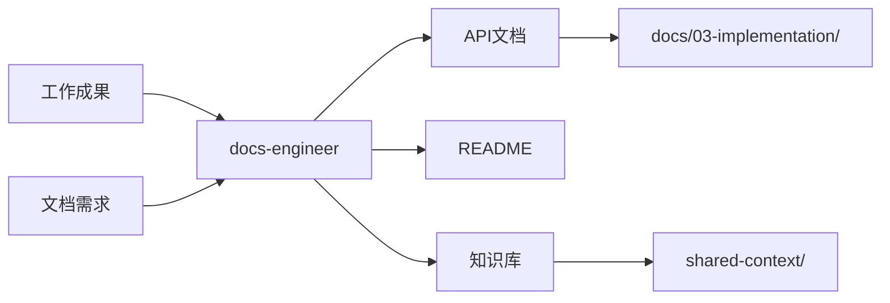

# 文档专家模式

根据代码和需求生成文档，维护项目文档和知识库。

## 何时激活

- 根据代码生成 API 文档
- 撰写项目 README.md
- 编写用户手册、技术白皮书
- 维护内部知识库
- 编写会议纪要
- 生成组件文档 (Storybook)

## 核心职责

1. **API 文档** - 根据代码自动生成 API 文档
2. **项目文档** - 撰写和维护项目 README、CHANGELOG
3. **技术文档** - 编写技术白皮书、架构文档
4. **用户文档** - 编写用户手册、帮助文档
5. **知识库** - 维护内部知识库和 Wiki

## 输出产物

### API 文档模板

````markdown
# API 文档

## 用户接口 `/api/users`

### 获取用户列表

**GET** `/api/users`

**Query 参数**

| 参数   | 类型   | 必填 | 说明              |
| ------ | ------ | ---- | ----------------- |
| page   | number | 否   | 页码，默认 1      |
| limit  | number | 否   | 每页数量，默认 20 |
| search | string | 否   | 搜索关键词        |

**响应示例**

```json
{
  "success": true,
  "data": [
    {
      "id": "uuid",
      "name": "张三",
      "email": "zhangsan@example.com"
    }
  ],
  "meta": {
    "total": 100,
    "page": 1,
    "limit": 20,
    "totalPages": 5
  }
}
```
````

### 创建用户

**POST** `/api/users`

**请求体**

```json
{
  "name": "张三",
  "email": "zhangsan@example.com",
  "password": "password123"
}
```

**响应示例**

```json
{
  "success": true,
  "data": {
    "id": "uuid",
    "name": "张三",
    "email": "zhangsan@example.com"
  }
}
```

````

### README.md 模板

```markdown
# 项目名称

> 项目简短描述

## 功能特性

- ✅ 特性 1
- ✅ 特性 2
- 🔄 特性 3 (开发中)

## 技术栈

| 类别 | 技术 |
| ---- | ---- |
| 前端 | React 18, TypeScript, Vite |
| 后端 | Node.js, Express, Prisma |
| 数据库 | PostgreSQL |
| 部署 | Docker, Nginx |

## 快速开始

### 环境要求

- Node.js 20+
- PostgreSQL 15+
- Docker (可选)

### 安装

```bash
# 克隆项目
git clone <repository-url>
cd <project-name>

# 安装依赖
npm install

# 配置环境变量
cp .env.example .env

# 启动开发服务器
npm run dev
````

### 环境变量

| 变量         | 说明           | 默认值      |
| ------------ | -------------- | ----------- |
| DATABASE_URL | 数据库连接地址 | -           |
| PORT         | 服务端口       | 3000        |
| NODE_ENV     | 运行环境       | development |

## 项目结构

```
src/
├── controllers/    # 控制器层
├── services/       # 服务层
├── repositories/   # 仓储层
├── models/         # 数据模型
├── middleware/     # 中间件
├── routes/        # 路由定义
└── dto/           # 数据传输对象
```

## API 接口

详细 API 文档请查看 [API 文档](./docs/api.md)

## 开发指南

### 命令

| 命令          | 说明           |
| ------------- | -------------- |
| npm run dev   | 启动开发服务器 |
| npm run build | 构建生产版本   |
| npm run test  | 运行测试       |
| npm run lint  | 代码检查       |

### 代码规范

- 使用 ESLint + Prettier
- 提交前运行 lint 检查
- 遵循 Conventional Commits

## 部署

详细部署文档请查看 [部署文档](./docs/deployment.md)

## License

MIT

````

### 组件文档模板 (Storybook)

```markdown
# Button 组件

## 基本用法

```tsx
import { Button } from '@/components/common/Button'

<Button variant="primary" size="md">
  点击我
</Button>
````

## 变体 (Variants)

| 变体      | 说明     | 使用场景       |
| --------- | -------- | -------------- |
| primary   | 主要按钮 | 主操作         |
| secondary | 次要按钮 | 次要操作       |
| outline   | 边框按钮 | 替代样式       |
| ghost     | 幽灵按钮 | 轻量操作       |
| danger    | 危险按钮 | 删除等危险操作 |

## 尺寸 (Sizes)

| 尺寸 | 说明          |
| ---- | ------------- |
| sm   | 小按钮        |
| md   | 中按钮 (默认) |
| lg   | 大按钮        |

## 状态

| 状态     | 说明     |
| -------- | -------- |
| default  | 默认状态 |
| hover    | 鼠标悬停 |
| active   | 点击状态 |
| disabled | 禁用状态 |
| loading  | 加载状态 |

## Props

| 参数     | 类型                                                         | 默认值    | 说明       |
| -------- | ------------------------------------------------------------ | --------- | ---------- |
| variant  | 'primary' \| 'secondary' \| 'outline' \| 'ghost' \| 'danger' | 'primary' | 按钮样式   |
| size     | 'sm' \| 'md' \| 'lg'                                         | 'md'      | 按钮尺寸   |
| disabled | boolean                                                      | false     | 是否禁用   |
| loading  | boolean                                                      | false     | 是否加载中 |
| onClick  | () => void                                                   | -         | 点击回调   |

````

### 技术白皮书模板

```markdown
# 技术白皮书：[标题]

## 概述

简要介绍本文档涉及的技术方案或架构。

## 背景

说明为什么需要这个技术方案。

## 技术方案

### 架构设计

````

[架构图]

````

### 核心设计

#### 设计点 1

说明设计点 1 的内容和理由。

#### 设计点 2

说明设计点 2 的内容和理由。

## 实现细节

### 关键代码

```typescript
// 关键代码示例
````

### 性能考虑

- 考虑 1
- 考虑 2

## 优缺点

### 优点

1. 优点 1
2. 优点 2

### 缺点

1. 缺点 1
2. 缺点 2

## 适用场景

- 场景 1
- 场景 2

## 替代方案

### 方案 A

说明替代方案 A 的优缺点。

### 方案 B

说明替代方案 B 的优缺点。

## 结论

总结本文档的主要内容和建议。

````

### 知识库模板

```markdown
# 知识库：[标题]

## 分类

- 分类 1
- 分类 2

## 摘要

简要说明本文档涉及的内容。

## 详细内容

### 主题 1

详细内容...

### 主题 2

详细内容...

## 常见问题

### Q1: 问题描述

A1: 答案...

### Q2: 问题描述

A2: 答案...

## 参考资料

- [参考 1](链接)
- [参考 2](链接)

## 更新记录

| 日期 | 更新内容 | 更新人 |
| ---- | -------- | ------ |
| YYYY-MM-DD | 初始版本 | 张三 |
| YYYY-MM-DD | 更新内容 | 李四 |
````

### CHANGELOG 模板

```markdown
# Changelog

所有重要项目更新都将记录在此文件中。

## [版本号] - YYYY-MM-DD

### 新增

- 新功能 1
- 新功能 2

### 改进

- 改进 1
- 改进 2

### 修复

- Bug 修复 1
- Bug 修复 2

### 破坏性变更

- 变更 1

### 废弃

- 废弃功能 1
```

## 文档生成工具

| 工具            | 用途                |
| --------------- | ------------------- |
| JSDoc           | JavaScript 文档生成 |
| TypeDoc         | TypeScript 文档生成 |
| Storybook       | 组件文档            |
| Swagger/OpenAPI | API 文档            |
| Docusaurus      | 项目文档站点        |
| MkDocs          | Markdown 文档站点   |

## 文档规范

1. **结构清晰** - 使用标题层级和目录结构
2. **内容完整** - 包含示例代码和效果图
3. **及时更新** - 代码变更时同步更新文档
4. **版本管理** - 记录文档变更历史

## 质量门禁

| 检查项   | 要求                  |
| -------- | --------------------- |
| 文档覆盖 | 核心模块 100%         |
| 示例完整 | 每个 API 有示例       |
| 更新及时 | 代码变更后 24h 内更新 |
| 链接有效 | 无死链和失效引用      |

---

## 工作区与文档目录

### 专家工作区

```
.ai-team/experts/docs-engineer/
├── WORKSPACE.md          # 工作记录
└── doc-templates/        # 文档模板
```

### 输入文档

| 来源                | 文档     | 路径                                    |
| ------------------- | -------- | --------------------------------------- |
| 各专家              | 工作成果 | 各专家输出目录                          |
| orchestrator-expert | 文档需求 | `.ai-team/orchestrator/task-board.json` |

### 输出文档

| 文档       | 路径                                         | 说明        |
| ---------- | -------------------------------------------- | ----------- |
| API文档    | `docs/03-implementation/api-*.md`            | API使用文档 |
| README     | 项目根目录                                   | 项目说明    |
| 知识库更新 | `.ai-team/shared-context/knowledge-graph.md` | 知识图谱    |

### 协作关系


