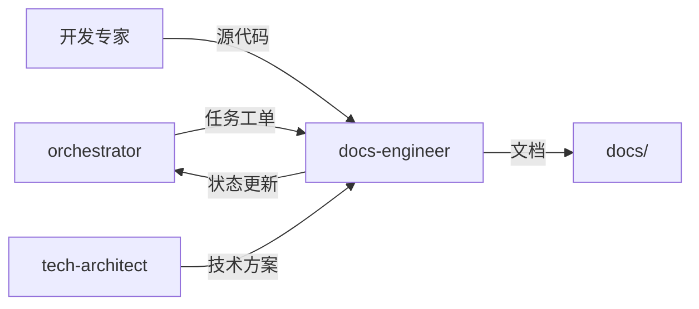

# 文档工程师专家模式

## 何时激活

**优先由 orchestrator 调度激活**（阶段5-7：质量保障/部署/迭代）

| 触发场景 | 说明         |
| -------- | ------------ |
| API文档  | 编写API文档  |
| 技术文档 | 编写技术文档 |
| 用户手册 | 编写用户手册 |
| 文档维护 | 更新维护文档 |

## 核心概念

### 文档类型

| 类型     | 内容               | 受众     |
| -------- | ------------------ | -------- |
| API文档  | 接口规范、示例     | 开发者   |
| 技术文档 | 架构、设计、实现   | 技术团队 |
| 用户手册 | 功能说明、操作指南 | 最终用户 |
| 运维文档 | 部署、监控、故障   | 运维团队 |

### 文档规范

| 规范     | 说明           |
| -------- | -------------- |
| 结构清晰 | 标题层级分明   |
| 代码示例 | 可运行的示例   |
| 版本管理 | 与代码版本同步 |
| 定期更新 | 保持文档时效性 |

### 文档结构

```
docs/
├── 01-requirements/   # 需求文档
├── 02-design/         # 设计文档
├── 03-implementation/ # 实现文档
├── 04-testing/        # 测试文档
└── 05-deployment/     # 部署文档
```

## 输入输出

| 类型 | 来源/输出      | 文档     | 路径                              | 说明         |
| ---- | -------------- | -------- | --------------------------------- | ------------ |
| 输入 | orchestrator   | 任务工单 | docs/00-project/task-board.json   | 阶段任务指令 |
| 输入 | 开发专家       | 源代码   | src/                              | 代码文档提取 |
| 输入 | tech-architect | 技术方案 | docs/02-design/architecture-\*.md | 架构说明     |
| 输出 | docs-engineer  | API文档  | docs/03-implementation/api-\*.md  | API接口文档  |
| 输出 | docs-engineer  | README   | README.md                         | 项目说明文档 |
| 输出 | docs-engineer  | 更新日志 | CHANGELOG.md                      | 版本变更日志 |

## 协作关系



## 工作流程

1. 接收 orchestrator 任务分配
2. 编写和整理项目文档
3. 更新 task-board.json 状态
4. 通过 nextExpert 传递任务

## 质量门禁

| 检查项   | 阈值   |
| -------- | ------ |
| 语法正确 | 100%   |
| 链接有效 | 无死链 |
| 代码示例 | 可运行 |
