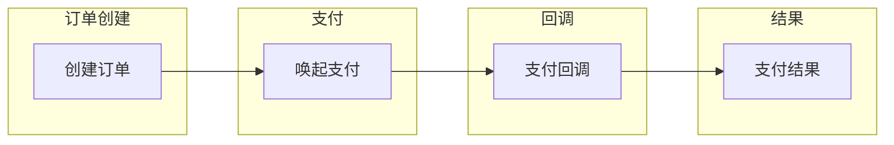

# 抖音支付集成模式

> 抖音支付、字节跳动支付集成最佳实践

## 何时激活

- 集成抖音支付
- 开发抖音小程序支付
- 直播带货支付
- 字节跳动生态支付

## 技术栈版本

| 技术       | 最低版本 | 推荐版本 |
| ---------- | -------- | -------- |
| Douyin SDK | 1.0+     | 最新     |
| Node.js    | 18.0+    | 20.0+    |

## 核心概念



## 支付类型

| 类型   | 说明           | 适用场景   |
| ------ | -------------- | ---------- |
| JSAPI  | 小程序内支付   | 抖音小程序 |
| APP    | APP 内支付     | 抖音 APP   |
| H5     | 手机浏览器支付 | 站外唤起   |
| Native | 二维码支付     | 扫码支付   |

## 初始化

```typescript
import DouyinPay from '@douyin/pay';

const dyPay = new DouyinPay({
  appId: process.env.DY_APP_ID!,
  appSecret: process.env.DY_APP_SECRET!,
  environment: process.env.NODE_ENV === 'production' ? 'production' : 'sandbox',
});
```

## 订单创建

### 统一订单接口

```typescript
interface CreateOrderParams {
  orderId: string;
  amount: number;
  currency: 'CNY' | 'USD';
  subject: string;
  body: string;
  notifyUrl: string;
  validTime?: number;
}

async function createOrder(params: CreateOrderParams) {
  const result = await dyPay.order.create({
    app_id: process.env.DY_APP_ID!,
    out_order_no: params.orderId,
    total_amount: params.amount,
    subject: params.subject,
    body: params.body,
    valid_time: params.validTime || 3600,
    notify_url: params.notifyUrl,
  });

  return {
    orderId: result.order_id,
    paymentToken: result.payment_token,
    expireTime: result.expire_time,
  };
}
```

## JSAPI 支付

```typescript
async function createJSAPIOrder(orderId: string, amount: number, subject: string, openid: string) {
  const result = await dyPay.order.create({
    app_id: process.env.DY_APP_ID!,
    out_order_no: orderId,
    total_amount: amount,
    subject,
    body: subject,
    trade_type: 'JSAPI',
    openid,
    notify_url: `${process.env.BASE_URL}/api/payment/douyin/callback`,
  });

  return {
    orderId: result.order_id,
    paymentToken: result.payment_token,
  };
}
```

## APP 支付

```typescript
async function createAPPOrder(orderId: string, amount: number, subject: string) {
  const result = await dyPay.order.create({
    app_id: process.env.DY_APP_ID!,
    out_order_no: orderId,
    total_amount: amount,
    subject,
    body: subject,
    trade_type: 'APP',
    notify_url: `${process.env.BASE_URL}/api/payment/douyin/callback`,
  });

  return {
    orderId: result.order_id,
    applicationParams: result.application_params,
  };
}
```

## H5 支付

```typescript
async function createH5Order(orderId: string, amount: number, subject: string, returnUrl: string) {
  const result = await dyPay.order.create({
    app_id: process.env.DY_APP_ID!,
    out_order_no: orderId,
    total_amount: amount,
    subject,
    body: subject,
    trade_type: 'H5',
    h5_info: {
      return_url: returnUrl,
    },
    notify_url: `${process.env.BASE_URL}/api/payment/douyin/callback`,
  });

  return {
    orderId: result.order_id,
    h5Url: result.h5_url,
  };
}
```

## Native 支付

```typescript
async function createNativeOrder(orderId: string, amount: number, subject: string) {
  const result = await dyPay.order.create({
    app_id: process.env.DY_APP_ID!,
    out_order_no: orderId,
    total_amount: amount,
    subject,
    body: subject,
    trade_type: 'NATIVE',
    notify_url: `${process.env.BASE_URL}/api/payment/douyin/callback`,
  });

  return {
    orderId: result.order_id,
    qrCode: result.qr_code,
  };
}
```

## 聚合支付

```typescript
async function unifiedPayment(
  channel: 'jsapi' | 'app' | 'h5' | 'native',
  params: {
    orderId: string;
    amount: number;
    subject: string;
    openid?: string;
    returnUrl?: string;
  }
) {
  const baseParams = {
    app_id: process.env.DY_APP_ID!,
    out_order_no: params.orderId,
    total_amount: params.amount,
    subject: params.subject,
    body: params.subject,
    notify_url: `${process.env.BASE_URL}/api/payment/douyin/callback`,
  };

  switch (channel) {
    case 'jsapi':
      return dyPay.order.create({ ...baseParams, trade_type: 'JSAPI', openid: params.openid });
    case 'app':
      return dyPay.order.create({ ...baseParams, trade_type: 'APP' });
    case 'h5':
      return dyPay.order.create({
        ...baseParams,
        trade_type: 'H5',
        h5_info: { return_url: params.returnUrl },
      });
    case 'native':
      return dyPay.order.create({ ...baseParams, trade_type: 'NATIVE' });
    default:
      throw new Error(`Unsupported channel: ${channel}`);
  }
}
```

## 订单查询

### 查询订单

```typescript
async function queryOrder(orderId: string) {
  const result = await dyPay.order.query({
    order_id: orderId,
  });

  return {
    orderId: result.order_id,
    status: result.status,
    amount: result.total_amount,
    payTime: result.pay_time,
    transactionId: result.transaction_id,
  };
}
```

### 订单状态

| 状态    | 说明   | 处理     |
| ------- | ------ | -------- |
| PENDING | 待支付 | 等待支付 |
| PAID    | 已支付 | 完成订单 |
| CLOSED  | 已关闭 | 关闭订单 |
| EXPIRED | 已过期 | 重新创建 |

## 退款

### 申请退款

```typescript
interface RefundParams {
  orderId: string;
  refundId: string;
  amount: number;
  reason?: string;
}

async function refundOrder(params: RefundParams) {
  const result = await dyPay.refund.create({
    order_id: params.orderId,
    out_refund_no: params.refundId,
    refund_amount: params.amount,
    refund_reason: params.reason,
    notify_url: `${process.env.BASE_URL}/api/payment/douyin/refund/callback`,
  });

  return {
    refundId: result.refund_id,
    status: result.status,
    amount: result.refund_amount,
  };
}
```

### 查询退款

```typescript
async function queryRefund(refundId: string) {
  const result = await dyPay.refund.query({
    refund_id: refundId,
  });

  return {
    refundId: result.refund_id,
    status: result.status,
    amount: result.refund_amount,
    successTime: result.success_time,
  };
}
```

## Webhook 处理

```typescript
interface DouyinWebhookEvent {
  event_type: string;
  order_id: string;
  transaction_id?: string;
  status: string;
  refund_id?: string;
  refund_status?: string;
}

async function handleWebhook(payload: Buffer, signature: string): Promise<void> {
  const verified = dyPay.verifySignature(payload, signature, process.env.DY_APP_SECRET!);

  if (!verified) {
    throw new Error('Invalid signature');
  }

  const event: DouyinWebhookEvent = JSON.parse(payload.toString());

  switch (event.event_type) {
    case 'pay.order.paid':
      await handlePaymentSuccess(event.order_id, event.transaction_id!);
      break;
    case 'pay.order.failed':
      await handlePaymentFailed(event.order_id, event.status);
      break;
    case 'pay.refund.succeeded':
      await handleRefundSuccess(event.refund_id!);
      break;
    case 'pay.refund.failed':
      await handleRefundFailed(event.refund_id!, event.refund_status!);
      break;
  }
}

async function handlePaymentSuccess(orderId: string, transactionId: string) {
  await updateOrderByTradeNo(orderId, {
    status: 'PAID',
    transactionId,
    paidAt: new Date(),
  });
}

async function handlePaymentFailed(orderId: string, reason: string) {
  await updateOrderByTradeNo(orderId, {
    status: 'FAILED',
    failReason: reason,
  });
}
```

## 关闭订单

```typescript
async function closeOrder(orderId: string) {
  const result = await dyPay.order.close({
    order_id: orderId,
  });

  return {
    orderId: result.order_id,
    status: result.status,
  };
}
```

## 错误码

| 错误码 | 说明       | 处理建议          |
| ------ | ---------- | ----------------- |
| 10001  | 订单不存在 | 检查订单号        |
| 10002  | 订单已支付 | 防止重复支付      |
| 10003  | 订单已关闭 | 检查订单状态      |
| 10004  | 金额不匹配 | 校验订单金额      |
| 10005  | 签名错误   | 检查签名算法      |
| 10006  | 权限不足   | 检查 app 权限配置 |
| 10007  | 参数错误   | 检查请求参数      |
| 10008  | 订单超时   | 重新创建订单      |

## 支付安全最佳实践

| 措施     | 实现                   |
| -------- | ---------------------- |
| 签名验证 | 验证 Webhook 签名      |
| 幂等性   | 使用订单号防止重复支付 |
| 金额校验 | 服务端校验金额         |
| 异步处理 | 支付回调异步处理       |
| 日志记录 | 完整记录支付流程       |
| 超时处理 | 订单设置合理过期时间   |
| HTTPS    | 强制使用 HTTPS         |

## 相关技能

| 技能               | 说明         |
| ------------------ | ------------ |
| payment-patterns   | 统一支付接口 |
| security-expert    | 支付安全     |
| wechatpay-patterns | 微信支付集成 |
| alipay-patterns    | 支付宝集成   |
