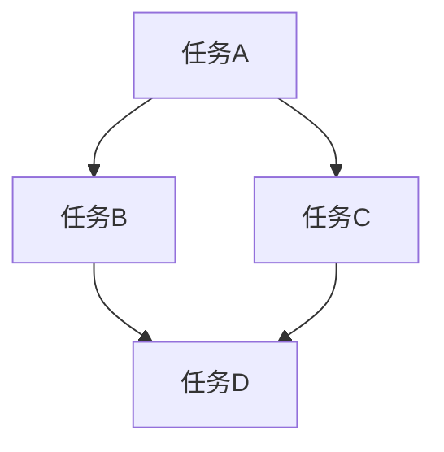

# ETL模式

> 可靠、高效的数据流转

## 核心概念

### ETL vs ELT

| 模式 | 流程 | 特点 |
|------|------|------|
| ETL | 抽取→转换→加载 | 传统方式，转换在加载前 |
| ELT | 抽取→加载→转换 | 现代方式，转换在数仓内 |
| ETLT | 混合模式 | 部分转换在加载前 |

### 数据流向


---

## 数据抽取

### 抽取策略

| 策略 | 说明 | 适用场景 |
|------|------|----------|
| 全量抽取 | 抽取全部数据 | 初始加载、小数据量 |
| 增量抽取 | 只抽取变更数据 | 定期同步 |
| CDC | 变更数据捕获 | 实时同步 |

### 数据源类型

| 类型 | 说明 | 抽取方式 |
|------|------|----------|
| 数据库 | MySQL、PostgreSQL | JDBC、CDC |
| API | REST、GraphQL | HTTP请求 |
| 文件 | CSV、JSON、Parquet | 文件读取 |
| 日志 | 应用日志、系统日志 | 日志采集 |
| 消息队列 | Kafka、RabbitMQ | 消息消费 |

### CDC模式

| 模式 | 说明 |
|------|------|
| 基于时间戳 | 读取更新时间 |
| 基于日志 | 解析binlog/WAL |
| 基于触发器 | 数据库触发器 |
| 基于快照 | 定期对比 |

---

## 数据转换

### 转换类型

| 类型 | 说明 | 示例 |
|------|------|------|
| 清洗 | 数据清理 | 去重、空值处理 |
| 格式化 | 格式统一 | 日期格式、编码转换 |
| 聚合 | 数据汇总 | 日聚合为月 |
| 关联 | 数据连接 | 多表JOIN |
| 计算 | 业务逻辑 | 指标计算 |

### 转换规则

```yaml
transform:
  - field: user_id
    type: cast
    target: integer
    
  - field: created_at
    type: date_format
    format: "%Y-%m-%d"
    
  - field: status
    type: mapping
    map:
      "1": "active"
      "0": "inactive"
```

### 数据质量

| 检查类型 | 说明 |
|----------|------|
| 完整性 | 必填字段检查 |
| 唯一性 | 主键/唯一键检查 |
| 一致性 | 数据一致性检查 |
| 准确性 | 业务规则验证 |
| 及时性 | 数据时效检查 |

---

## 数据加载

### 加载策略

| 策略 | 说明 | 适用场景 |
|------|------|----------|
| 覆盖 | 全量覆盖 | 全量加载 |
| 追加 | 追加数据 | 增量加载 |
| 更新 | 更新已有数据 | 数据修正 |
| Upsert | 插入或更新 | 幂等加载 |

### 加载优化

| 技术 | 说明 |
|------|------|
| 批量加载 | 批量INSERT |
| 并行加载 | 多线程加载 |
| 分区加载 | 按分区加载 |
| 索引延迟 | 加载后建索引 |

---

## 管道设计

### 管道模式

| 模式 | 说明 |
|------|------|
| 线性管道 | 顺序执行 |
| 分支管道 | 并行分支 |
| 合并管道 | 多源合并 |
| 循环管道 | 迭代处理 |

### 容错设计

| 机制 | 说明 |
|------|------|
| 检查点 | 记录执行位置 |
| 重试 | 失败自动重试 |
| 死信队列 | 失败数据隔离 |
| 补偿 | 回滚已执行操作 |

### 幂等设计

```python
def load_data(record):
    key = record['id']
    existing = db.find(key)
    if existing:
        db.update(key, record)
    else:
        db.insert(record)
```

---

## 调度模式

### 调度类型

| 类型 | 说明 | 工具 |
|------|------|------|
| 定时调度 | 定时执行 | Cron、Airflow |
| 事件触发 | 事件驱动 | Lambda、Kafka |
| 手动触发 | 按需执行 | API调用 |

### 依赖管理



### 调度工具

| 工具 | 说明 |
|------|------|
| Airflow | 工作流编排 |
| Dagster | 数据编排 |
| Prefect | 现代编排 |
| dbt | 转换编排 |

---

## 性能优化

### 抽取优化

| 技术 | 说明 |
|------|------|
| 并行抽取 | 多线程读取 |
| 增量抽取 | 减少数据量 |
| 列裁剪 | 只读取需要的列 |
| 分区读取 | 按分区读取 |

### 转换优化

| 技术 | 说明 |
|------|------|
| 内存计算 | 减少IO |
| 向量化 | 批量处理 |
| 增量计算 | 只处理变更 |
| 下推计算 | 数据库内计算 |

### 加载优化

| 技术 | 说明 |
|------|------|
| 批量写入 | 批量INSERT |
| 并行写入 | 多线程写入 |
| 分区写入 | 按分区写入 |
| 压缩存储 | 减少存储空间 |

---

## 监控告警

### 监控指标

| 指标 | 说明 |
|------|------|
| 执行时间 | 任务耗时 |
| 数据量 | 处理记录数 |
| 成功率 | 成功/总数 |
| 延迟 | 数据延迟时间 |

### 告警规则

```yaml
alerts:
  - name: etl_delay
    condition: delay > 1h
    severity: warning
    
  - name: etl_failure
    condition: success_rate < 0.95
    severity: critical
```

---

## 最佳实践

### 设计原则

- 幂等性设计
- 可恢复性
- 可观测性
- 可扩展性

### 数据质量

- 数据验证前置
- 异常数据隔离
- 质量报告生成
- 问题数据修复

### 运维

- 完善的日志
- 监控告警
- 定期数据核对
- 文档维护

---

## 反模式

| 反模式 | 问题 | 解决方案 |
|--------|------|----------|
| 全量覆盖 | 数据丢失风险 | 增量更新 |
| 无检查点 | 无法恢复 | 添加检查点 |
| 单点故障 | 可靠性差 | 冗余设计 |
| 硬编码配置 | 维护困难 | 配置外部化 |
