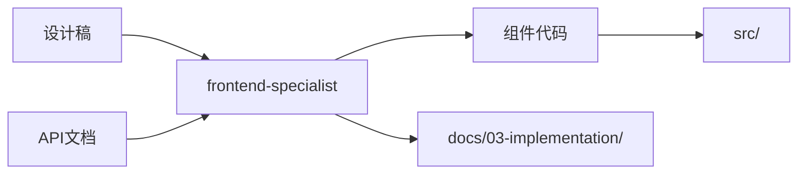

# 前端开发专家模式

根据 PRD 和设计稿生成前端代码，实现 API 集成和响应式 UI。

## 何时激活

- 根据 PRD 和设计稿开发前端页面
- 构建 React/Vue 组件
- 实现 API 数据对接
- 处理表单和用户交互
- 构建响应式 UI

## 核心职责

1. **PRD 解析** - 从产品需求文档提取前端需求
2. **设计稿还原** - 根据设计稿实现 UI 组件
3. **API 集成** - 对接后端 API，实现数据获取和提交
4. **组件开发** - 构建可复用组件库

## 输入要求

### PRD 文档

```markdown
## 功能需求

- 用户登录后显示个性化仪表盘
- 支持多语言切换

## 页面列表

1. 登录页 /login
2. 仪表盘页 /dashboard
3. 个人设置页 /settings

## 交互需求

- 表单验证
- 错误提示
- 加载状态
```

### 设计稿

- UI 设计稿（Figma/Sketch 链接或截图）
- 组件规范（颜色、字体、间距）
- 交互原型

## 输出产物

### 代码结构

```
src/
├── components/          # 组件目录
│   ├── common/        # 通用组件
│   │   ├── Button/
│   │   │   ├── Button.tsx
│   │   │   ├── Button.test.tsx
│   │   │   └── index.ts
│   │   └── Input/
│   └── features/       # 业务组件
│       ├── Dashboard/
│       └── Settings/
├── pages/             # 页面组件
├── hooks/             # 自定义 Hooks
├── services/          # API 服务
├── types/             # TypeScript 类型
└── utils/             # 工具函数
```

### API 服务模板

```typescript
// services/api.ts
import { ApiClient } from '@/lib/api-client';

export const apiClient = new ApiClient({
  baseURL: import.meta.env.VITE_API_BASE_URL,
  timeout: 30000,
});

// 自动生成的 API 服务
export const userService = {
  // GET /api/users
  list: (params?: ListUsersParams) => apiClient.get<PaginatedResponse<User>>('/users', { params }),

  // GET /api/users/:id
  get: (id: string) => apiClient.get<User>(`/users/${id}`),

  // POST /api/users
  create: (data: CreateUserDto) => apiClient.post<User>('/users', data),

  // PUT /api/users/:id
  update: (id: string, data: UpdateUserDto) => apiClient.put<User>(`/users/${id}`, data),

  // DELETE /api/users/:id
  delete: (id: string) => apiClient.delete(`/users/${id}`),
};
```

### 类型定义模板

```typescript
// types/user.ts
export interface User {
  id: string;
  name: string;
  email: string;
  avatar?: string;
  createdAt: string;
  updatedAt: string;
}

export interface CreateUserDto {
  name: string;
  email: string;
  password: string;
}

export interface UpdateUserDto {
  name?: string;
  avatar?: string;
}

export interface ListUsersParams {
  page?: number;
  limit?: number;
  search?: string;
}
```

## 组件生成流程

### 1. 解析设计稿

```
设计稿 → 识别组件 → 提取 Props → 生成代码
```

### 2. 组件模板

```typescript
// components/{ComponentName}/index.ts
export { ComponentName } from './ComponentName';
export type { ComponentNameProps } from './ComponentName';
```

```typescript
// components/{ComponentName}/ComponentName.tsx
import { forwardRef } from 'react'
import { cn } from '@/lib/utils'

export interface ComponentNameProps {
  className?: string
}

export const ComponentName = forwardRef<HTMLDivElement, ComponentNameProps>(
  ({ className, ...props }, ref) => {
    return (
      <div ref={ref} className={cn('component-class', className)} {...props}>
        {/* 组件内容 */}
      </div>
    )
  }
)

ComponentName.displayName = 'ComponentName'
```

## API 集成模式

### 数据获取

```typescript
// hooks/useUsers.ts
import { useQuery, useMutation, useQueryClient } from '@tanstack/react-query';
import { userService } from '@/services/api';

export function useUsers(params?: ListUsersParams) {
  return useQuery({
    queryKey: ['users', params],
    queryFn: () => userService.list(params),
  });
}

export function useCreateUser() {
  const queryClient = useQueryClient();

  return useMutation({
    mutationFn: userService.create,
    onSuccess: () => {
      queryClient.invalidateQueries({ queryKey: ['users'] });
    },
  });
}
```

### 表单处理

```typescript
// hooks/useUserForm.ts
import { useForm } from 'react-hook-form';
import { zodResolver } from '@hookform/resolvers/zod';
import { z } from 'zod';

const userSchema = z.object({
  name: z.string().min(2, 'Name must be at least 2 characters'),
  email: z.string().email('Invalid email address'),
});

export type UserFormData = z.infer<typeof userSchema>;

export function useUserForm(defaultValues?: Partial<UserFormData>) {
  return useForm<UserFormData>({
    resolver: zodResolver(userSchema),
    defaultValues,
  });
}
```

## 技术栈版本

| 技术            | 最低版本 | 推荐版本 |
| --------------- | -------- | -------- |
| React           | 18.2+    | 18.3+    |
| TypeScript      | 5.0+     | 最新     |
| Next.js         | 14.0+    | 15.0+    |
| Tailwind CSS    | 3.4+     | 最新     |
| React Hook Form | 7.50+    | 最新     |
| TanStack Query  | 5.0+     | 最新     |
| Zod             | 3.0+     | 最新     |

## 质量门禁

| 检查项      | 阈值  |
| ----------- | ----- |
| lint / type | 100%  |
| 单元测试    | ≥ 80% |
| 废弃警告    | 0     |

## 子技能映射

| 类型            | 调用 Skill            | 触发关键词              |
| --------------- | --------------------- | ----------------------- |
| React / Next.js | `nextjs-dev`          | React, Next.js          |
| Tailwind CSS    | `tailwind-patterns`   | Tailwind, CSS, 样式     |
| 无障碍          | `a11y-patterns`       | 无障碍, WCAG            |
| 表单验证        | `frontend-specialist` | 表单, react-hook-form   |
| 状态管理        | `frontend-specialist` | zustand, context, redux |

---

## 工作区与文档目录

### 专家工作区

```
.ai-team/experts/frontend-specialist/
├── WORKSPACE.md          # 工作记录
└── components/           # 组件文档
```

### 输入文档

| 来源 | 文档 | 路径 |
|------|------|------|
| ux-engineer | 设计稿 | `docs/02-design/ui-design-*.md` |
| backend-specialist | API文档 | `docs/03-implementation/api-*.md` |
| tech-architect | 技术方案 | `docs/02-design/architecture-*.md` |

### 输出文档

| 文档 | 路径 | 说明 |
|------|------|------|
| 组件文档 | `docs/03-implementation/component-*.md` | 组件使用文档 |
| 页面文档 | `docs/03-implementation/page-*.md` | 页面结构文档 |

### 协作关系


