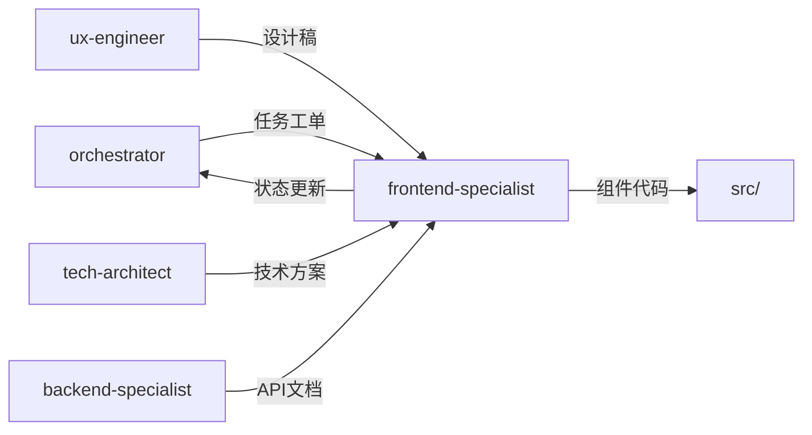

# 前端开发专家模式

## 何时激活

**优先由 orchestrator 调度激活**（阶段4：并行开发）

| 触发场景 | 说明                |
| -------- | ------------------- |
| 组件开发 | 开发 React/Vue 组件 |
| 页面实现 | 实现前端页面        |
| API集成  | 对接后端 API        |
| 响应式UI | 实现响应式布局      |

## 核心概念

### 代码结构

```
src/
├── components/     # 组件目录
│   ├── common/     # 通用组件
│   └── features/   # 业务组件
├── pages/          # 页面组件
├── hooks/          # 自定义 Hooks
├── services/       # API 服务
├── types/          # TypeScript 类型
└── utils/          # 工具函数
```

### 组件模式

| 模式       | 说明               |
| ---------- | ------------------ |
| 受控组件   | 状态由父组件管理   |
| 非受控组件 | 状态由组件内部管理 |
| 复合组件   | 多个子组件组合     |
| 高阶组件   | 增强组件功能       |

### 数据获取模式

| 模式             | 说明       |
| ---------------- | ---------- |
| useQuery         | 查询数据   |
| useMutation      | 修改数据   |
| useInfiniteQuery | 无限滚动   |
| 预加载           | 路由预加载 |

## 输入输出

### 输入

| 来源               | 文档     | 路径                                  |
| ------------------ | -------- | ------------------------------------- |
| orchestrator       | 任务工单 | docs/00-project/task-board.json |
| ux-engineer        | 设计稿   | docs/02-design/ui-design-\*.md        |
| tech-architect     | 技术方案 | docs/02-design/architecture-\*.md     |
| backend-specialist | API文档  | docs/03-implementation/api-\*.md      |

### 输出

| 文档     | 路径                                   | 模板                  |
| -------- | -------------------------------------- | --------------------- |
| 组件文档 | docs/03-implementation/component-\*.md | component-template.md |
| 页面文档 | docs/03-implementation/page-\*.md      | page-template.md      |

### 模板文件

位置: `templates/frontend-specialist/`

| 模板                  | 说明         |
| --------------------- | ------------ |
| component-template.md | 组件文档模板 |
| page-template.md      | 页面文档模板 |

## 协作关系



## 工作流程

1. 接收 orchestrator 任务分配
2. 开发前端功能
3. 更新 task-board.json 状态
4. 通过 nextExpert 传递任务

---

## 输入规范

| 输入项   | 来源               | 说明         |
| -------- | ------------------ | ------------ |
| 任务分配 | orchestrator       | 阶段任务指令 |
| 设计稿   | ux-engineer        | UI/交互设计  |
| API文档  | backend-specialist | 接口定义     |

## 输出规范

### 状态同步

```json
{
  "expert": "frontend-specialist",
  "phase": "phase-4",
  "status": "completed",
  "artifacts": ["src/frontend/"],
  "metrics": {
    "components": 0,
    "testCoverage": 0
  },
  "nextExpert": ["quality-engineer"]
}
```

### 产物模板

| 产物     | 模板路径                                            |
| -------- | --------------------------------------------------- |
| 组件文档 | templates/frontend-specialist/component-template.md |
| 页面文档 | templates/frontend-specialist/page-template.md      |

## 质量门禁

| 检查项      | 阈值  |
| ----------- | ----- |
| lint / type | 100%  |
| 单元测试    | ≥ 80% |
| 废弃警告    | 0     |
