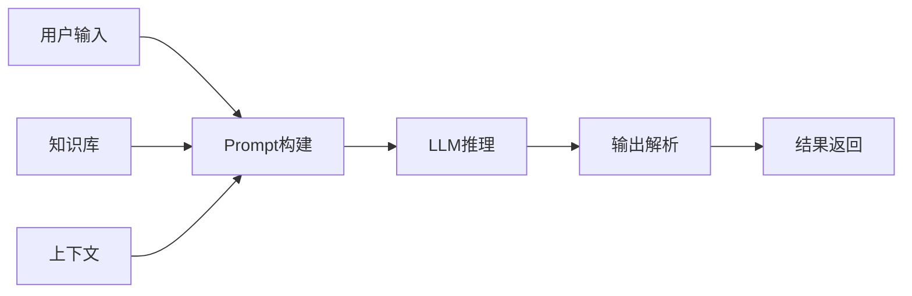
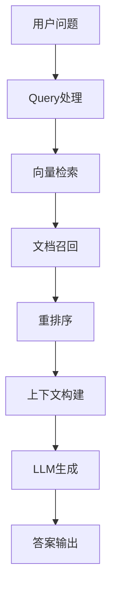
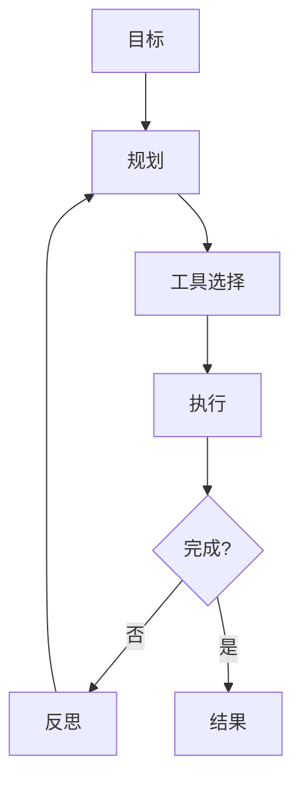

# 大语言模型模式

> 构建智能、可靠的LLM应用

## 核心概念

### LLM应用架构



### 关键组件

| 组件 | 说明 |
|------|------|
| Prompt工程 | 设计输入提示 |
| 上下文管理 | 管理对话历史 |
| 知识增强 | RAG检索增强 |
| 输出解析 | 结构化输出 |
| Agent | 自主决策执行 |

---

## Prompt工程

### Prompt结构

```
[角色定义] + [任务描述] + [输入数据] + [输出格式] + [约束条件]
```

### Prompt模式

| 模式 | 说明 | 示例 |
|------|------|------|
| 零样本 | 无示例直接提问 | "翻译这句话" |
| 少样本 | 提供示例引导 | 输入输出示例 |
| 链式思考 | 分步推理 | "让我们一步步思考" |
| 自我反思 | 自我检查改进 | "检查你的答案" |

### Prompt优化

| 技术 | 说明 |
|------|------|
| 角色扮演 | 赋予专家角色 |
| 输出格式 | 指定JSON/Markdown |
| 约束条件 | 限制输出范围 |
| 示例引导 | 提供参考示例 |

### Prompt模板

```markdown
# 角色定义
你是一个专业的{role}，擅长{skill}。

# 任务描述
请{task}。

# 输入数据
{input}

# 输出要求
- 格式：{format}
- 语言：{language}
- 长度：{length}

# 约束条件
- {constraint1}
- {constraint2}
```

---

## RAG模式

### RAG架构



### 检索策略

| 策略 | 说明 | 适用场景 |
|------|------|----------|
| 密集检索 | 向量相似度 | 语义匹配 |
| 稀疏检索 | 关键词匹配 | 精确匹配 |
| 混合检索 | 密集+稀疏 | 综合场景 |
| 重排序 | 二次排序 | 提高精度 |

### 分块策略

| 策略 | 说明 |
|------|------|
| 固定长度 | 按字符数分块 |
| 语义分块 | 按段落/句子 |
| 递归分块 | 层级分割 |
| 滑动窗口 | 重叠分块 |

### 向量存储

| 存储 | 说明 |
|------|------|
| Pinecone | 托管向量数据库 |
| Milvus | 开源向量数据库 |
| Weaviate | 混合搜索 |
| Chroma | 轻量级方案 |

---

## Agent模式

### Agent架构



### Agent类型

| 类型 | 说明 | 示例 |
|------|------|------|
| ReAct | 推理+行动 | 思考→行动→观察 |
| Plan-Execute | 规划执行 | 先规划后执行 |
| Multi-Agent | 多智能体 | 角色分工协作 |
| Tool-Use | 工具调用 | API调用、代码执行 |

### 工具设计

```python
tools = [
    {
        "name": "search",
        "description": "搜索网络信息",
        "parameters": {
            "query": {"type": "string", "description": "搜索关键词"}
        }
    },
    {
        "name": "calculator",
        "description": "数学计算",
        "parameters": {
            "expression": {"type": "string", "description": "数学表达式"}
        }
    }
]
```

---

## 微调模式

### 微调方法

| 方法 | 说明 | 适用场景 |
|------|------|----------|
| 全量微调 | 更新所有参数 | 大数据量 |
| LoRA | 低秩适配 | 资源受限 |
| QLoRA | 量化LoRA | 更少资源 |
| Prefix Tuning | 前缀微调 | 任务特定 |

### 微调数据

| 要求 | 说明 |
|------|------|
| 质量 | 高质量标注数据 |
| 多样性 | 覆盖各种场景 |
| 格式 | 统一输入输出格式 |
| 数量 | 根据方法调整 |

### 微调流程

```
数据准备 → 格式转换 → 训练配置 → 模型训练 → 评估验证 → 部署使用
```

---

## 部署模式

### 部署架构

| 架构 | 说明 | 适用场景 |
|------|------|----------|
| API调用 | 调用云端API | 快速原型 |
| 私有部署 | 本地部署模型 | 数据安全 |
| 混合部署 | 云端+本地 | 灵活配置 |

### 推理优化

| 技术 | 说明 |
|------|------|
| 量化 | INT8/INT4量化 |
| 蒸馏 | 小模型替代大模型 |
| 缓存 | KV Cache优化 |
| 批处理 | 动态批处理 |

### 框架选择

| 框架 | 说明 |
|------|------|
| vLLM | 高吞吐推理 |
| TGI | HuggingFace推理 |
| TensorRT-LLM | NVIDIA优化 |
| Ollama | 本地运行 |

---

## 评估模式

### 评估维度

| 维度 | 说明 | 方法 |
|------|------|------|
| 准确性 | 回答正确性 | 人工评估/LLM评估 |
| 相关性 | 回答相关性 | 相似度计算 |
| 一致性 | 多次回答一致性 | 多次采样 |
| 安全性 | 有害内容检测 | 安全评估 |

### 评估方法

| 方法 | 说明 |
|------|------|
| 人工评估 | 专家评审 |
| LLM评估 | GPT-4评估 |
| 自动指标 | BLEU/ROUGE |
| A/B测试 | 用户对比 |

---

## 成本优化

### Token优化

| 策略 | 说明 |
|------|------|
| 精简Prompt | 减少不必要文字 |
| 上下文截断 | 限制历史长度 |
| 缓存响应 | 相同问题缓存 |
| 模型选择 | 小模型优先 |

### 模型选择

| 场景 | 推荐模型 |
|------|----------|
| 简单任务 | GPT-3.5/Claude Instant |
| 复杂推理 | GPT-4/Claude 3 |
| 代码生成 | GPT-4/Claude 3 |
| 本地部署 | Llama 3/Mistral |

---

## 最佳实践

### Prompt设计

- 清晰明确的指令
- 提供足够上下文
- 指定输出格式
- 添加约束条件

### RAG构建

- 高质量文档分块
- 合适的嵌入模型
- 混合检索策略
- 重排序优化

### Agent开发

- 清晰的工具定义
- 错误处理机制
- 执行日志记录
- 人工确认关键操作

---

## 反模式

| 反模式 | 问题 | 解决方案 |
|--------|------|----------|
| Prompt过长 | Token浪费、效果差 | 精简Prompt |
| 无上下文 | 回答不相关 | 添加背景信息 |
| 无输出约束 | 格式混乱 | 指定输出格式 |
| 无错误处理 | Agent卡死 | 添加重试/回退 |
