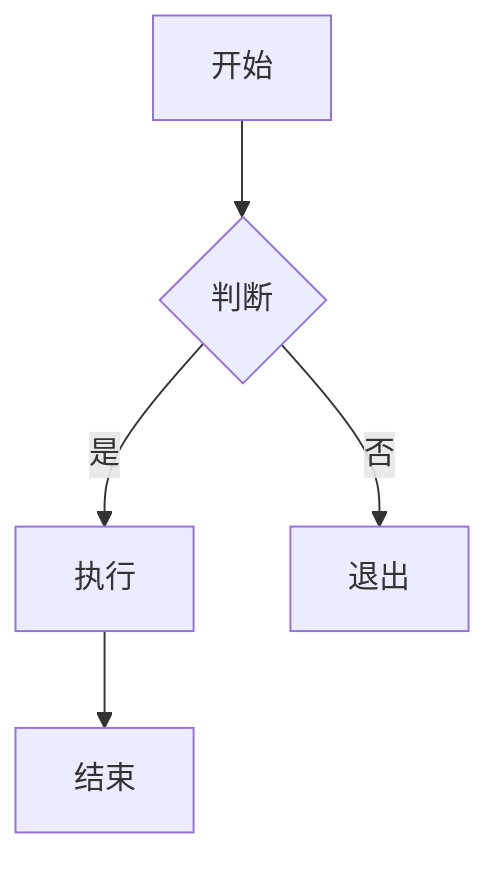
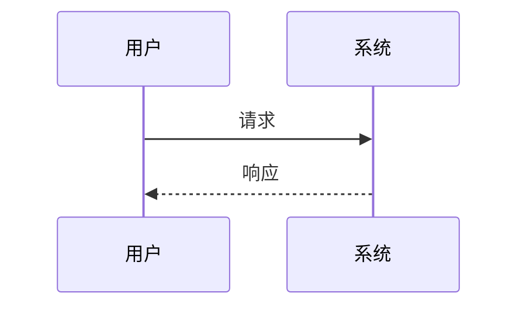
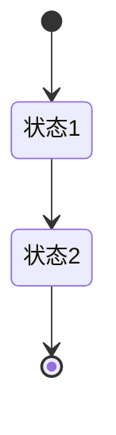
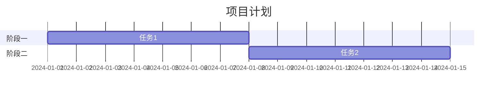

# Markdown 文档编写模式

用于构建清晰、一致且专业的 Markdown 文档的最佳实践。

## 何时激活

- 编写项目文档
- 创建 API 文档
- 编写技术博客
- 构建知识库
- 格式化 README

## 文档结构

### 项目文档结构

```
docs/
├── README.md
├── getting-started.md
├── installation.md
├── configuration.md
├── usage.md
├── api/
│   ├── README.md
│   ├── endpoints.md
│   └── authentication.md
├── guides/
│   ├── beginner.md
│   └── advanced.md
└── troubleshooting.md
```

### 文档开头模板

```markdown
---
title: 文档标题
description: 简短描述文档内容
---

# 文档标题

## 概述
简要介绍...

## 前置条件
- 条件1
- 条件2

## 开始
详细步骤...
```

## 格式规范

### 标题层级

```markdown
# 一级标题 (h1) - 页面主标题
## 二级标题 (h2) - 主要章节
### 三级标题 (h3) - 子章节
#### 四级标题 (h4) - 细节
##### 五级标题 (h5) - 列表项
###### 六级标题 (h6) - 不推荐
```

### 列表格式

```markdown
### 无序列表
- 项目一
- 项目二
  - 嵌套项目
  - 嵌套项目
- 项目三

### 有序列表
1. 第一步
2. 第二步
   1. 子步骤
   2. 子步骤
3. 第三步

### 任务列表
- [x] 已完成任务
- [ ] 待办任务
- [ ] 另一个待办
```

## 代码块

### 基础代码块

````markdown
```语言
代码内容
```
````

### 代码块带标题

````markdown
```javascript title="src/index.js"
function hello() {
  console.log('Hello, World!');
}
```
````

### 代码块带行号

````markdown
```javascript showLineNumbers
const a = 1;
const b = 2;
const sum = a + b;
```
````

### 高亮特定行

````markdown
```javascript highlight="2,3"
const a = 1;
const b = 2;  // 高亮
const c = 3;  // 高亮
```
````

### diff 代码块

````markdown
```diff
- 删除的行
+ 添加的行
```
````

### 代码块中的转义

````markdown
````
code block with backticks
``````

## 表格

### 基础表格

```markdown
| 列1 | 列2 | 列3 |
|------|------|------|
| 内容 | 内容 | 内容 |
| 内容 | 内容 | 内容 |
```

### 对齐表格

```markdown
| 左对齐 | 居中 | 右对齐 |
|:------|:----:|------:|
| 内容  | 内容 |  内容 |
```

### 复杂表格

```markdown
| 功能 | 说明 | 默认值 | 可选值 |
|------|------|--------|--------|
| 模式 | 运行模式 | `development` | `development`, `production` |
| 端口 | 服务端口 | `3000` | 1024-65535 |
| 调试 | 调试模式 | `false` | `true`, `false` |
```

## 链接与图片

### 基础链接

```markdown
[显示文本](URL)
[外部链接](https://example.com)
[内部链接](other-doc.md)
```

### 带属性的链接

```markdown
[链接文本](URL){target="_blank" rel="noopener"}
```

### 图片

```markdown


<!-- 带尺寸 -->

```

### 引用文档片段

```markdown
详见[安装指南](installation.md#前置条件)
```

## 提示与警告

### 块引用

```markdown
> 这是引用文本
> 可以多行
```

### 提示框

```markdown
::: tip 提示
这是有用的提示信息
:::

::: warning 警告
这是警告信息
:::

::: danger 危险
这是危险/错误信息
:::
```

### 提示变体

```markdown
> [!NOTE]
> 额外信息

> [!TIP]
> 有用的建议

> [!WARNING]
> 需要注意的内容

> [!CAUTION]
> 潜在风险
```

## 数学公式

### 行内公式

```markdown
这是一个行内公式 $E = mc^2$ 展示。
```

### 块级公式

```markdown
$$
\sum_{i=1}^{n} x_i = x_1 + x_2 + \cdots + x_n
$$
```

### 复杂公式

```markdown
$$
\int_{-\infty}^{\infty} e^{-x^2} dx = \sqrt{\pi}
$$
```

## Mermaid 图表

### 流程图

````markdown

````

### 序列图

````markdown

````

### 状态图

````markdown

````

### 甘特图

````markdown

````

## 文件结构展示

### 树形结构

```markdown
```
project/
├── src/
│   ├── index.js
│   └── utils.js
├── tests/
│   └── index.test.js
└── package.json
```
```

### 文件内容片段

````markdown
```yaml title="config.yaml"
server:
  port: 3000
  host: localhost

database:
  type: postgres
  url: ${DATABASE_URL}
```
````

## API 文档

### OpenAPI 示例

```markdown
### 获取用户信息

**GET** `/api/users/{id}`

**参数:**

| 名称 | 位置 | 类型 | 必填 | 说明 |
|------|------|------|------|------|
| id | path | string | 是 | 用户ID |

**响应:**

```json
{
  "id": "123",
  "name": "张三",
  "email": "zhang@example.com"
}
```
```

### 请求示例

````markdown
```bash
curl -X GET "https://api.example.com/users/123" \
  -H "Authorization: Bearer token"
```

```javascript
const response = await fetch('https://api.example.com/users/123', {
  method: 'GET',
  headers: {
    'Authorization': 'Bearer token'
  }
});
```
````

## 最佳实践

### 标题规范

| 原则 | 说明 |
|------|------|
| 唯一性 | 每个页面只有一个 h1 |
| 层级清晰 | 不要跳级使用标题 |
| 简洁明了 | 标题应描述内容 |
| 避免特殊字符 | 谨慎使用特殊符号 |

### 链接规范

| 原则 | 说明 |
|------|------|
| 描述性链接 | 使用有意义的链接文本 |
| 相对路径 | 优先使用相对路径 |
| 校验链接 | 定期检查链接有效性 |

### 可读性规范

| 原则 | 说明 |
|------|------|
| 段落长度 | 单段落不超过 5 行 |
| 列表使用 | 适时使用列表增强可读性 |
| 代码示例 | 复杂步骤配代码示例 |
| 空格使用 | 中英文之间加空格 |

## 相关技能

| 技能 | 说明 |
|------|------|
| doc-team | 文档团队 |
| skill-creator | Skill 创建 |
| design-patterns | 设计模式 |
