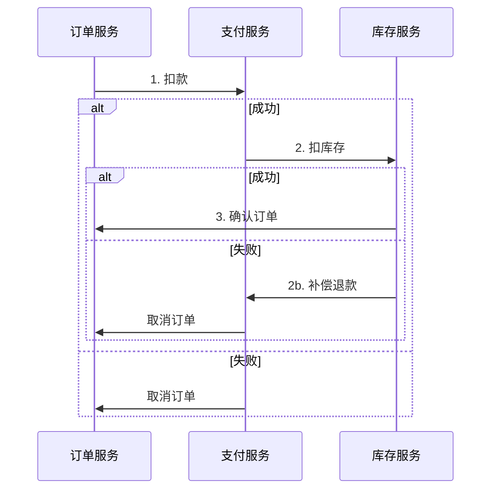
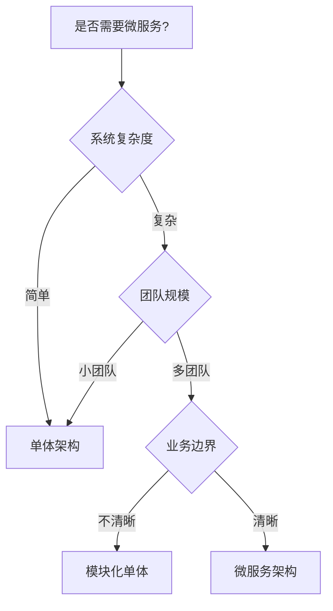

# 微服务架构模式

> 构建可扩展、可维护的分布式系统

## 核心概念

### 服务拆分原则

| 原则 | 说明 |
|------|------|
| 单一职责 | 每个服务只做一件事 |
| 高内聚 | 相关功能聚合在同一服务 |
| 松耦合 | 服务间依赖最小化 |
| 独立部署 | 服务可独立开发、测试、部署 |

### 拆分策略

| 策略 | 适用场景 | 示例 |
|------|----------|------|
| 按业务能力 | 业务边界清晰 | 用户服务、订单服务、支付服务 |
| 按子域 | DDD领域驱动 | 商品子域、库存子域 |
| 按用例 | 功能独立 | 搜索服务、推荐服务 |

---

## 通信模式

### 同步通信

| 模式 | 说明 | 适用场景 |
|------|------|----------|
| REST | HTTP API | 简单查询、CRUD操作 |
| gRPC | 高性能RPC | 内部服务高频调用 |
| GraphQL | 灵活查询 | 复杂数据聚合 |

### 异步通信

| 模式 | 说明 | 适用场景 |
|------|------|----------|
| 消息队列 | 解耦、削峰 | 订单处理、日志收集 |
| 事件驱动 | 松耦合 | 状态变更通知 |
| 发布订阅 | 广播 | 配置更新、缓存失效 |

---

## 数据一致性

### 分布式事务模式

| 模式 | 说明 | 优缺点 |
|------|------|--------|
| 2PC | 两阶段提交 | 强一致，性能差 |
| Saga | 长事务编排 | 最终一致，复杂 |
| TCC | 补偿事务 | 灵活，开发成本高 |
| 本地消息表 | 可靠消息 | 简单，延迟高 |

### Saga 模式



---

## 服务治理

### 服务发现

| 方案 | 说明 | 工具 |
|------|------|------|
| 客户端发现 | 客户端查询注册中心 | Eureka、Nacos |
| 服务端发现 | 通过负载均衡器 | Kubernetes Service、Consul |

### 负载均衡

| 策略 | 说明 |
|------|------|
| 轮询 | 依次分配 |
| 加权轮询 | 按权重分配 |
| 最少连接 | 分配给连接最少的服务 |
| 一致性哈希 | 相同请求路由到同一服务 |

### 熔断降级

| 状态 | 说明 |
|------|------|
| 关闭 | 正常调用 |
| 打开 | 快速失败，不调用 |
| 半开 | 尝试恢复调用 |

### 限流策略

| 算法 | 说明 |
|------|------|
| 固定窗口 | 时间段内限制请求数 |
| 滑动窗口 | 更平滑的限流 |
| 令牌桶 | 允许突发流量 |
| 漏桶 | 恒定速率处理 |

---

## 可观测性

### 三大支柱

| 支柱 | 说明 | 工具 |
|------|------|------|
| 日志 | 事件记录 | ELK、Loki |
| 指标 | 数值监控 | Prometheus、Grafana |
| 追踪 | 请求链路 | Jaeger、Zipkin |

### 分布式追踪

```
请求 → [服务A] → [服务B] → [服务C]
         ↓           ↓           ↓
       TraceID 贯穿整个链路
```

---

## 部署模式

| 模式 | 说明 | 适用场景 |
|------|------|----------|
| 单主机多服务 | 简单部署 | 开发环境 |
| 每服务一主机 | 隔离性好 | 传统部署 |
| 容器化 | 标准化部署 | Kubernetes |
| Serverless | 按需运行 | 事件驱动服务 |

---

## 决策树



---

## 最佳实践

### 服务设计

- 服务粒度适中，避免过细
- API版本化管理
- 契约优先设计

### 数据管理

- 每个服务独立数据库
- 避免跨服务JOIN
- 使用事件同步数据

### 运维

- 自动化部署流水线
- 完善的监控告警
- 故障演练与恢复

---

## 反模式

| 反模式 | 问题 | 解决方案 |
|--------|------|----------|
| 分布式单体 | 服务耦合严重 | 重新拆分 |
| 级联失败 | 故障传播 | 熔断降级 |
| 数据库共享 | 数据耦合 | 独立数据库 |
| 贫血服务 | 服务只做转发 | 合并或重构 |
