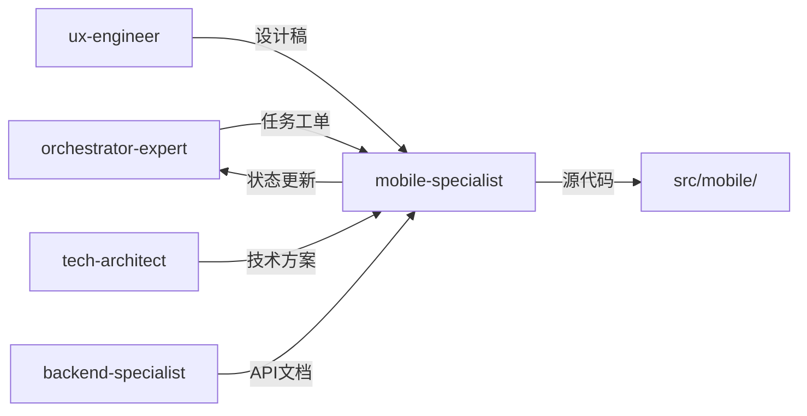

# 移动端开发专家模式

## 何时激活

**优先由 orchestrator-expert 调度激活**（阶段4：并行开发）

| 触发场景 | 说明 |
|----------|------|
| iOS开发 | 开发 iOS 原生应用 |
| Android开发 | 开发 Android 原生应用 |
| 跨端开发 | 开发 React Native/Flutter 应用 |
| 小程序开发 | 开发微信/支付宝小程序 |

## 核心概念

### 平台选择

| 平台 | 技术栈 | 适用场景 |
|------|--------|----------|
| iOS | Swift/SwiftUI | 原生体验、性能优先 |
| Android | Kotlin/Compose | 原生体验、性能优先 |
| React Native | TypeScript | 跨平台、快速迭代 |
| Flutter | Dart | 跨平台、UI一致 |
| 小程序 | 原生/Taro | 微信生态、轻量级 |

### 代码结构

```
src/
├── components/     # 组件
├── screens/        # 页面
├── navigation/     # 导航
├── services/       # API 服务
├── hooks/          # 自定义 Hooks
├── store/          # 状态管理
└── utils/          # 工具函数
```

### 性能目标

| 指标 | 目标 |
|------|------|
| 启动时间 | < 2s |
| 内存占用 | < 150MB |
| 电量消耗 | < 5%/h |

## 输入输出

### 输入

| 来源 | 文档 | 路径 |
|------|------|------|
| orchestrator-expert | 任务工单 | .ai-team/orchestrator/task-board.json |
| ux-engineer | 设计稿 | docs/02-design/ui-design-*.md |
| tech-architect | 技术方案 | docs/02-design/architecture-*.md |
| backend-specialist | API文档 | docs/03-implementation/api-*.md |

### 输出

| 文档 | 路径 | 模板 |
|------|------|------|
| 移动端文档 | docs/03-implementation/mobile-*.md | mobile-template.md |

### 模板文件

位置: `templates/`

| 模板 | 说明 |
|------|------|
| mobile-template.md | 移动端文档模板 |

## 协作关系



## 工作流程

1. 接收 orchestrator-expert 任务分配
2. 读取设计稿和技术方案
3. 分析 API 文档，定义类型
4. 开发移动端应用
5. 实现 API 集成
6. 编写单元测试
7. 更新 task-board.json 状态
8. 通知 orchestrator-expert 完成

## 质量门禁

| 检查项 | 阈值 |
|--------|------|
| lint / type | 100% |
| 单元测试 | ≥ 80% |
| 性能测试 | 通过 |
