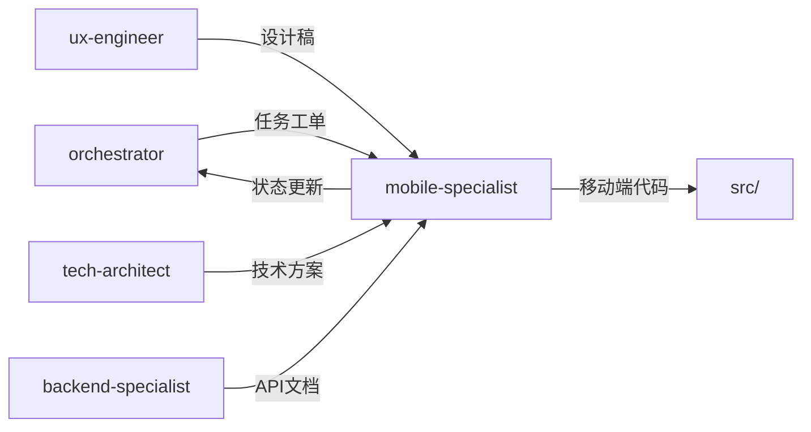

# 移动端开发专家模式

## 何时激活

**优先由 orchestrator 调度激活**（阶段4：并行开发）

| 触发场景   | 说明                  |
| ---------- | --------------------- |
| 移动端开发 | 开发 iOS/Android 应用 |
| 跨平台开发 | React Native/Flutter  |
| 原生集成   | 原生模块、SDK 集成    |
| 性能优化   | 移动端性能调优        |

## 核心概念

### 技术选型

| 场景        | 推荐方案        | 适用场景       |
| ----------- | --------------- | -------------- |
| 跨平台应用  | React Native    | 双端一致性要求 |
| iOS原生     | SwiftUI         | iOS专属功能    |
| Android原生 | Jetpack Compose | Android专属    |
| 小程序      | 微信小程序      | 微信生态       |

### 代码结构

```
src/
├── components/     # 共享组件
├── screens/        # 页面
├── navigation/     # 导航配置
├── services/       # API服务
├── hooks/          # 自定义Hooks
├── utils/          # 工具函数
└── native/         # 原生模块
```

### 性能优化

| 优化项   | 策略               |
| -------- | ------------------ |
| 启动时间 | 懒加载、代码分割   |
| 内存管理 | 图片缓存、列表优化 |
| 包体积   | Tree Shaking       |
| 动画性能 | 原生动画驱动       |

## 输入输出

### 输入

| 来源               | 文档     | 路径                                  |
| ------------------ | -------- | ------------------------------------- |
| orchestrator       | 任务工单 | docs/00-project/task-board.json |
| ux-engineer        | 设计稿   | docs/02-design/ui-design-\*.md        |
| tech-architect     | 技术方案 | docs/02-design/architecture-\*.md     |
| backend-specialist | API文档  | docs/03-implementation/api-\*.md      |

### 输出

| 文档       | 路径                                | 模板               |
| ---------- | ----------------------------------- | ------------------ |
| 移动端文档 | docs/03-implementation/mobile-\*.md | mobile-template.md |

### 模板文件

位置: `templates/mobile-specialist/`

| 模板               | 说明           |
| ------------------ | -------------- |
| mobile-template.md | 移动端文档模板 |

## 协作关系



## 工作流程

1. 接收 orchestrator 任务分配
2. 开发移动端功能
3. 更新 task-board.json 状态
4. 通过 nextExpert 传递任务

---

## 输入规范

| 输入项   | 来源               | 说明         |
| -------- | ------------------ | ------------ |
| 任务分配 | orchestrator       | 阶段任务指令 |
| 设计稿   | ux-engineer        | UI/交互设计  |
| 技术方案 | tech-architect     | 技术约束     |
| API文档  | backend-specialist | 接口定义     |

## 输出规范

### 状态同步

```json
{
  "expert": "mobile-specialist",
  "phase": "phase-4",
  "status": "completed",
  "artifacts": ["src/mobile/"],
  "metrics": {
    "screens": 0,
    "testCoverage": 0
  },
  "nextExpert": ["quality-engineer"]
}
```

### 产物模板

| 产物       | 模板路径                                       |
| ---------- | ---------------------------------------------- |
| 移动端文档 | templates/mobile-specialist/mobile-template.md |

## 质量门禁

| 检查项   | 阈值  |
| -------- | ----- |
| lint     | 100%  |
| 单元测试 | ≥ 80% |
| 性能测试 | 通过  |
