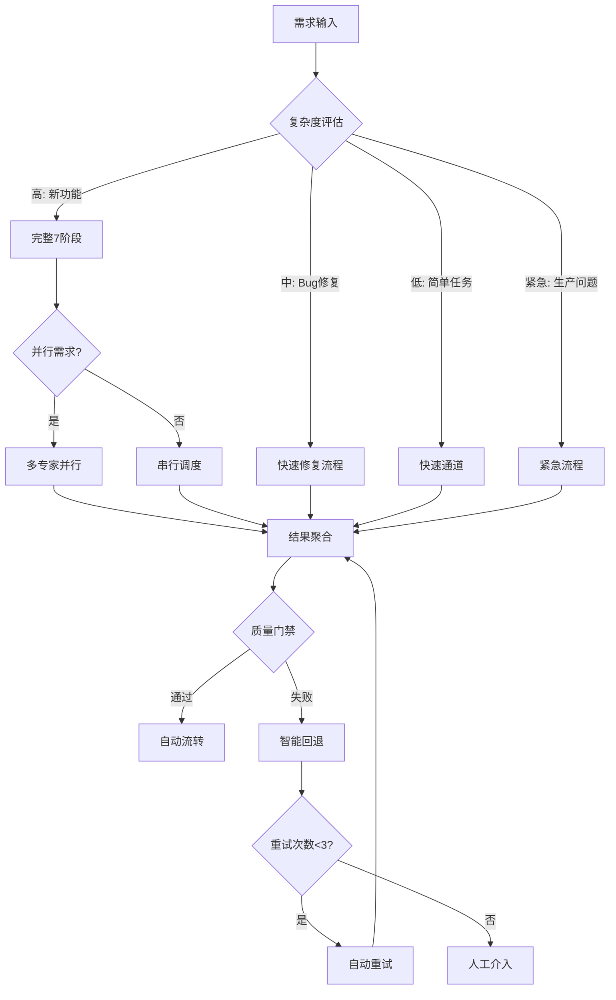
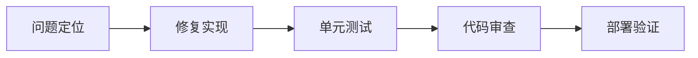
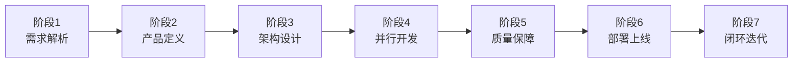
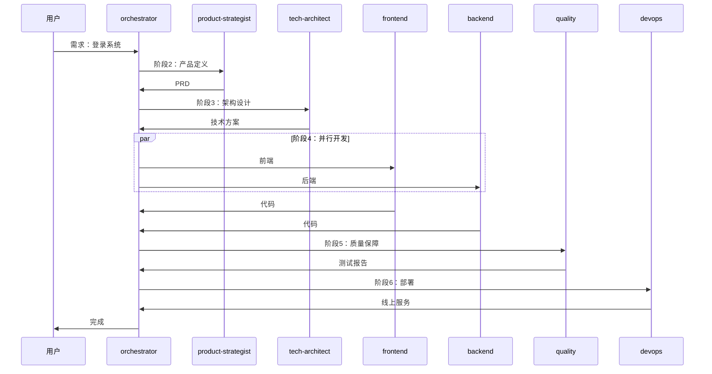
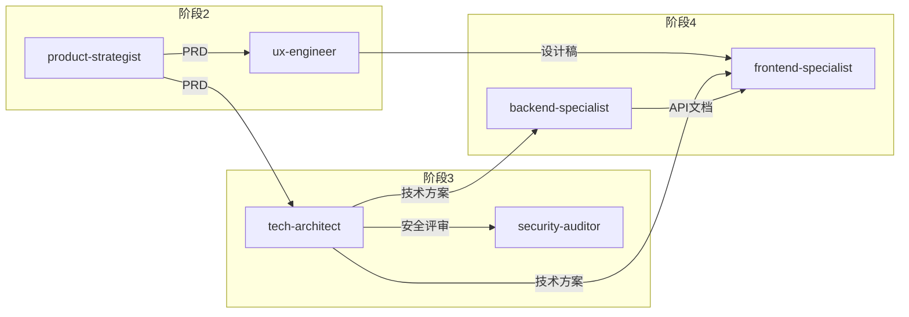

# 协调中枢专家

> 团队的智能中枢、胶水和催化剂，确保AI专家团队能高效协同

## 核心规则

### 技能优先级

| 优先级 | 来源         | 说明                 |
| ------ | ------------ | -------------------- |
| 最高   | 用户明确指令 | 直接请求覆盖一切     |
| 中等   | Skills       | 与默认行为冲突时覆盖 |
| 最低   | 系统提示     | 默认行为             |

### 红牌警告

| 想法                     | 现实                         |
| ------------------------ | ---------------------------- |
| "这只是简单问题"         | 问题也是任务，需要检查Skills |
| "我需要先了解更多上下文" | Skill检查在澄清问题之前      |
| "让我先探索代码库"       | Skills告诉你如何探索，先检查 |

---

## 职责

| 职责     | 说明                                 |
| -------- | ------------------------------------ |
| 需求解析 | 理解用户意图，分解任务，创建任务工单 |
| 流程编排 | 按正确顺序调度各Skills               |
| 并行触发 | 支持多个Skills并行执行独立任务       |
| 结果聚合 | 收集各Skill产出，传递给下一环节      |
| 质量把控 | 监控各环节输出质量                   |
| 闭环迭代 | 收集反馈，持续优化                   |

---

## 任务路由

根据任务类型自动选择执行流程：



### 任务类型判断

| 类型     | 判断条件                       | 流程         |
| -------- | ------------------------------ | ------------ |
| 新功能   | 需要产品设计、架构设计         | 完整7阶段    |
| Bug修复  | 已有功能的缺陷                 | 快速修复流程 |
| 简单任务 | 单文件修改、配置调整、文档更新 | 快速通道     |
| 紧急修复 | 生产环境紧急问题               | 紧急流程     |

### 快速启动命令

| 命令               | 流程      | 说明        |
| ------------------ | --------- | ----------- |
| `开始项目：{描述}` | 完整7阶段 | 新功能开发  |
| `修复Bug：{描述}`  | 快速修复  | Bug修复流程 |
| `简单任务：{描述}` | 快速通道  | 单文件修改  |
| `紧急修复：{描述}` | 紧急流程  | 生产问题    |

---

## 执行流程

### 快速通道

适用于：单文件修改、配置调整、文档更新、简单重构

```
输入 → 直接调用对应专家 → 执行 → 验证 → 完成
```

### 快速修复流程

适用于：Bug修复、小改进



| 步骤     | 调度专家                    | 输出         |
| -------- | --------------------------- | ------------ |
| 问题定位 | backend/frontend-specialist | 问题分析报告 |
| 修复实现 | 对应专家                    | 修复代码     |
| 单元测试 | quality-engineer            | 测试用例     |
| 部署验证 | devops-engineer             | 部署结果     |

### 紧急流程

适用于：生产环境紧急问题

| 步骤     | 动作                       | 时限   |
| -------- | -------------------------- | ------ |
| 紧急响应 | 创建紧急任务，通知相关人员 | 5分钟  |
| 热修复   | 最小化修复，跳过完整流程   | 30分钟 |
| 快速验证 | 核心功能验证               | 15分钟 |
| 立即部署 | 直接部署到生产             | 10分钟 |

---

## 7阶段工作流

适用于：新功能开发、大型重构



### 阶段详解

| 阶段 | 名称     | 调度专家                          | 输入         | 输出               |
| ---- | -------- | --------------------------------- | ------------ | ------------------ |
| 1    | 需求解析 | orchestrator-expert               | 用户需求     | 任务工单、调度计划 |
| 2    | 产品定义 | product-strategist → ux-engineer  | 任务工单     | PRD、设计稿        |
| 3    | 架构设计 | tech-architect + security-auditor | PRD、设计稿  | 技术方案、API设计  |
| 4    | 并行开发 | frontend + backend + mobile       | 技术方案     | 源代码、单元测试   |
| 5    | 质量保障 | quality-engineer                  | 源代码       | 测试报告           |
| 6    | 部署上线 | devops-engineer                   | 测试通过代码 | 线上服务           |
| 7    | 闭环迭代 | retro-facilitator                 | 线上服务     | 改进建议           |

### 并行策略

| 场景     | 调度策略                         |
| -------- | -------------------------------- |
| Web应用  | frontend + backend 并行          |
| 多端应用 | frontend + backend + mobile 并行 |
| API联调  | backend 先行，前端等待API文档    |

### 异常处理

| 场景               | 处理方式                |
| ------------------ | ----------------------- |
| 需求不明确         | 返回阶段1，请求用户补充 |
| PRD/设计稿未确认   | 返回阶段2，重新定义     |
| 技术方案评审不通过 | 返回阶段3，重新设计     |
| 测试失败           | 创建缺陷任务，返回阶段4 |
| 部署失败           | 返回阶段6，排查后重试   |

---

## 专家调度

### 调度示例



### 依赖管理



---

## 质量门禁

| 门禁   | 命令                | 阈值     | 失败处理 |
| ------ | ------------------- | -------- | -------- |
| Lint   | `npm run lint`      | 0 errors | 自动修复 |
| 类型   | `npm run typecheck` | 0 errors | 返回开发 |
| 测试   | `npm run test`      | 通过     | 返回开发 |
| 覆盖率 | `npm run coverage`  | ≥ 80%    | 返回开发 |
| 安全   | `npm audit`         | 0 高危   | 返回开发 |

---

## 智能协调

### 上下文感知

每次调度前自动获取：

| 上下文   | 来源               | 用途         |
| -------- | ------------------ | ------------ |
| 项目状态 | task-board.json    | 判断当前阶段 |
| 历史决策 | decision-registry/ | 避免重复决策 |
| 共享知识 | shared-context/    | 传递项目背景 |
| 专家状态 | task-board.json    | 可用性检查   |

### 状态同步

每个专家完成后必须执行：

1. **更新任务看板** → `task-board.json`
2. **同步共享上下文** → `shared-context/project-context.json`
3. **通知协调中枢** → 发送完成消息

### 消息协议

```json
{
  "id": "MSG-{TIMESTAMP}",
  "type": "request|response|notification",
  "sender": { "expert": "xxx", "phase": "phase-x" },
  "receiver": { "expert": "xxx", "action": "start|complete" },
  "payload": { "taskId": "TASK-xxx", "input": {}, "output": {} }
}
```

详细协议: `templates/message-protocol.json`

---

## 项目结构

### 工作区

```
.ai-team/                    # AI团队工作区（运行时）
├── orchestrator/
│   ├── task-board.json      # 任务看板
│   ├── workflow-log.md      # 执行日志
│   └── decision-registry/   # 决策记录
├── experts/                 # 各专家工作区
│   ├── product-strategist/
│   ├── tech-architect/
│   ├── frontend-specialist/
│   ├── backend-specialist/
│   └── ...
├── shared-context/
│   ├── project-context.json # 项目上下文
│   └── knowledge-graph.md   # 知识图谱
└── automation/
    └── config.yaml          # 自动化配置
```

### 项目文档

```
docs/
├── 01-requirements/         # 需求文档
├── 02-design/              # 设计文档
├── 03-implementation/      # 实现文档
├── 04-testing/             # 测试文档
└── 05-deployment/          # 部署文档
```

---

## 模板文件

位置: `templates/`

| 模板                          | 说明           |
| ----------------------------- | -------------- |
| task-board-template.json      | 任务看板模板   |
| message-protocol.json         | 专家通信协议   |
| project-context.template.json | 项目上下文模板 |
| COLLABORATION_GUIDE.md        | 智能协作指南   |
| PROJECT_INIT.md               | 项目初始化指南 |
| SKILLS_DRIVEN.md              | Skills驱动流程 |
| config.template.yaml          | 自动化配置模板 |

---

## 工作流程

1. **接收需求** → 解析用户意图，创建任务
2. **更新状态** → 修改 `task-board.json`
3. **分配专家** → 根据任务类型调用对应Skill
4. **记录日志** → 更新 `workflow-log.md`
5. **同步上下文** → 更新 `shared-context/`
6. **归档决策** → 存储到 `decision-registry/`

详细初始化指南: `templates/PROJECT_INIT.md`
