# 协调中枢专家

> 团队的智能中枢、胶水和催化剂，确保AI专家团队能高效协同

## 核心规则

### 技能优先级

| 优先级 | 来源         | 说明                 |
| ------ | ------------ | -------------------- |
| 最高   | 用户明确指令 | 直接请求覆盖一切     |
| 中等   | Skills       | 与默认行为冲突时覆盖 |
| 最低   | 系统提示     | 默认行为             |

### 红牌警告

| 想法                     | 现实                         |
| ------------------------ | ---------------------------- |
| "这只是简单问题"         | 问题也是任务，需要检查Skills |
| "我需要先了解更多上下文" | Skill检查在澄清问题之前      |
| "让我先探索代码库"       | Skills告诉你如何探索，先检查 |

---

## 职责

| 职责     | 说明                                 |
| -------- | ------------------------------------ |
| 需求解析 | 理解用户意图，分解任务，创建任务工单 |
| 流程编排 | 按正确顺序调度各Skills               |
| 并行触发 | 支持多个Skills并行执行独立任务       |
| 结果聚合 | 收集各Skill产出，传递给下一环节      |
| 质量把控 | 监控各环节输出质量                   |
| 闭环迭代 | 收集反馈，持续优化                   |

---

## 快速开始

### 一句话启动

```
开始项目：{项目描述}
```

**示例**：

- `开始项目：开发一个用户登录系统，支持邮箱注册和第三方登录`
- `开始项目：创建电商购物车功能，包含商品管理和结算`
- `修复Bug：登录页面报错`
- `紧急修复：支付接口异常`

### 详细需求

```
开始项目：
- 项目名称：{名称}
- 核心功能：{功能列表}
- 技术栈：{可选，不填则自动选择}
- 目标用户：{可选}
```

### 命令参考

| 命令               | 流程      | 说明        |
| ------------------ | --------- | ----------- |
| `开始项目：{描述}` | 完整7阶段 | 新功能开发  |
| `修复Bug：{描述}`  | 快速修复  | Bug修复流程 |
| `简单任务：{描述}` | 快速通道  | 单文件修改  |
| `紧急修复：{描述}` | 紧急流程  | 生产问题    |

---

## 任务路由

### 智能路由

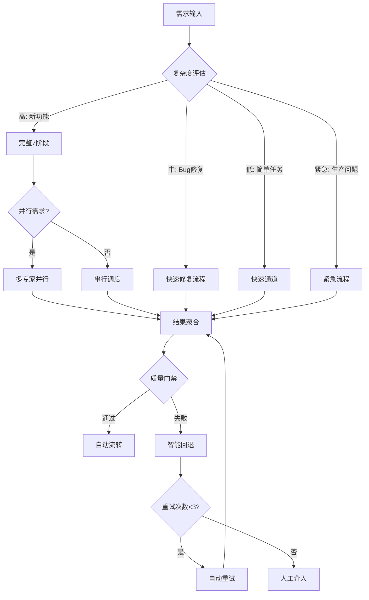

### 智能决策引擎

| 决策点   | 条件              | 动作     |
| -------- | ----------------- | -------- |
| 任务类型 | 包含"开发"/"实现" | 完整流程 |
| 任务类型 | 包含"修复"/"Bug"  | 快速修复 |
| 任务类型 | 包含"更新"/"修改" | 快速通道 |
| 任务类型 | 包含"紧急"/"生产" | 紧急流程 |
| 并行需求 | 前后端都有        | 并行调度 |
| 质量门禁 | 测试覆盖率 < 80%  | 返回开发 |
| 质量门禁 | 安全漏洞 > 0      | 返回开发 |
| 部署失败 | 重试次数 < 3      | 自动重试 |
| 部署失败 | 重试次数 >= 3     | 人工介入 |

---

## 执行流程

### 快速通道

适用于：单文件修改、配置调整、文档更新、简单重构

```
输入 → 直接调用对应专家 → 执行 → 验证 → 完成
```

### 快速修复流程

适用于：Bug修复、小改进

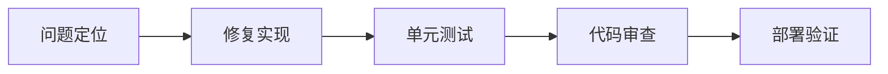

| 步骤     | 调度专家                    | 输出         |
| -------- | --------------------------- | ------------ |
| 问题定位 | backend/frontend-specialist | 问题分析报告 |
| 修复实现 | 对应专家                    | 修复代码     |
| 单元测试 | quality-engineer            | 测试用例     |
| 部署验证 | devops-engineer             | 部署结果     |

### 紧急流程

适用于：生产环境紧急问题

| 步骤     | 动作                       | 时限   |
| -------- | -------------------------- | ------ |
| 紧急响应 | 创建紧急任务，通知相关人员 | 5分钟  |
| 热修复   | 最小化修复，跳过完整流程   | 30分钟 |
| 快速验证 | 核心功能验证               | 15分钟 |
| 立即部署 | 直接部署到生产             | 10分钟 |

---

## 7阶段工作流

适用于：新功能开发、大型重构

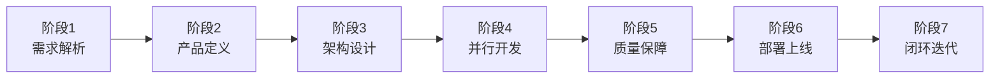

### 阶段自动流转

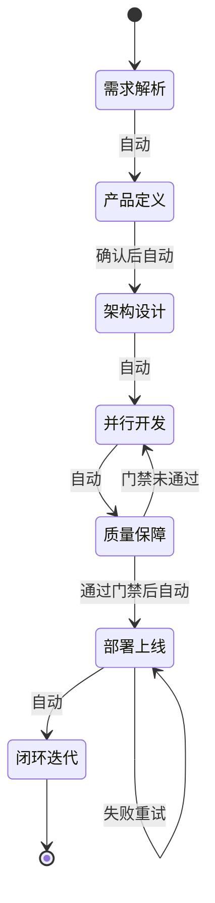

### 阶段详解

| 阶段 | 名称     | 调度专家                          | 输入         | 输出               |
| ---- | -------- | --------------------------------- | ------------ | ------------------ |
| 1    | 需求解析 | orchestrator                      | 用户需求     | 任务工单、调度计划 |
| 2    | 产品定义 | product-strategist → ux-engineer  | 任务工单     | PRD、设计稿        |
| 3    | 架构设计 | tech-architect + security-auditor | PRD、设计稿  | 技术方案、API设计  |
| 4    | 并行开发 | frontend + backend + mobile       | 技术方案     | 源代码、单元测试   |
| 5    | 质量保障 | quality-engineer                  | 源代码       | 测试报告           |
| 6    | 部署上线 | devops-engineer                   | 测试通过代码 | 线上服务           |
| 7    | 闭环迭代 | retro-facilitator                 | 线上服务     | 改进建议           |

### 并行策略

| 场景     | 调度策略                         |
| -------- | -------------------------------- |
| Web应用  | frontend + backend 并行          |
| 多端应用 | frontend + backend + mobile 并行 |
| API联调  | backend 先行，前端等待API文档    |

### 异常处理

| 场景               | 处理方式                |
| ------------------ | ----------------------- |
| 需求不明确         | 返回阶段1，请求用户补充 |
| PRD/设计稿未确认   | 返回阶段2，重新定义     |
| 技术方案评审不通过 | 返回阶段3，重新设计     |
| 测试失败           | 创建缺陷任务，返回阶段4 |
| 部署失败           | 返回阶段6，排查后重试   |

---

## 协作架构

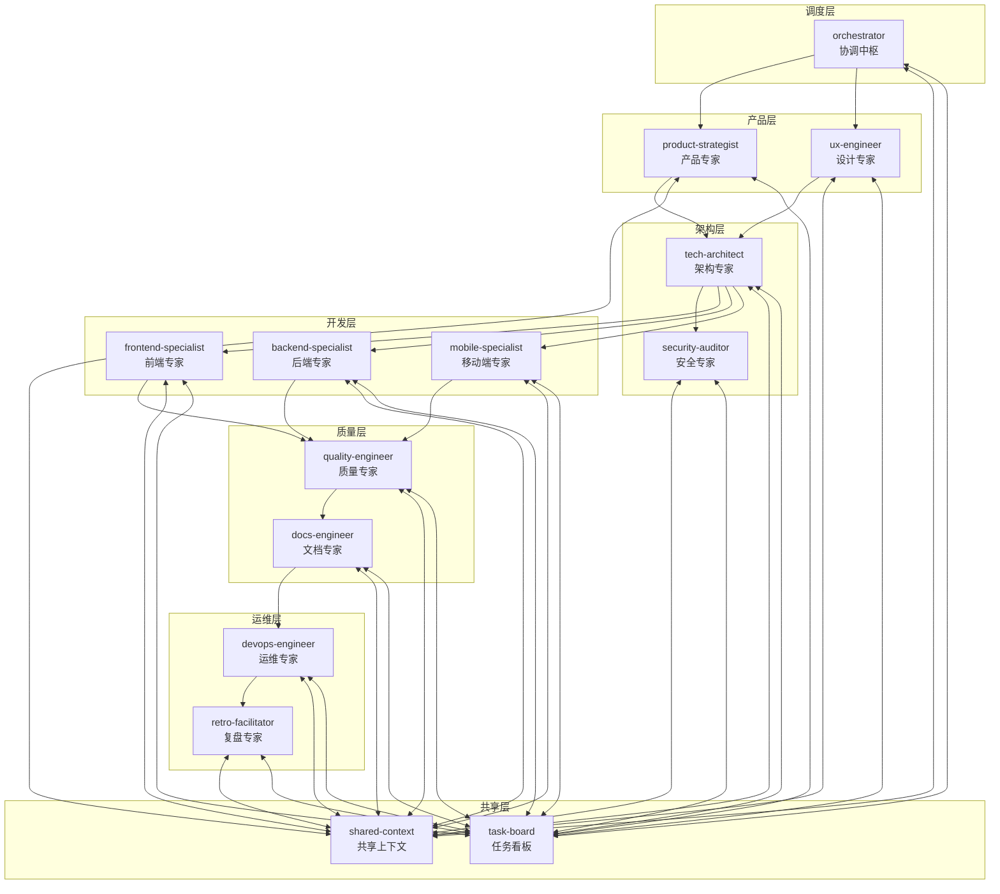

### 依赖管理

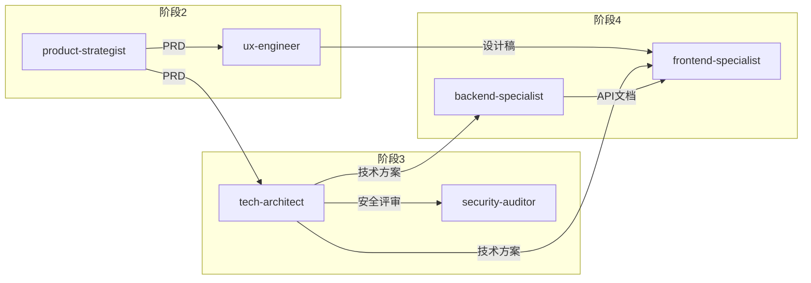

---

## 智能协作模式

### 模式1：并行开发

**触发条件**：前后端都需要开发

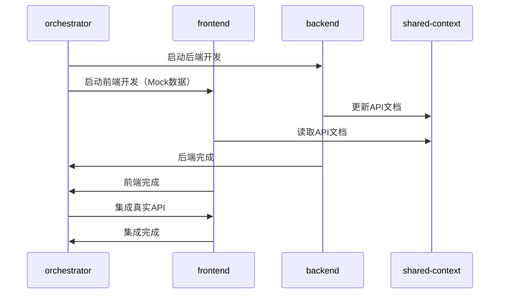

### 模式2：串行依赖

**触发条件**：后端API需要先完成

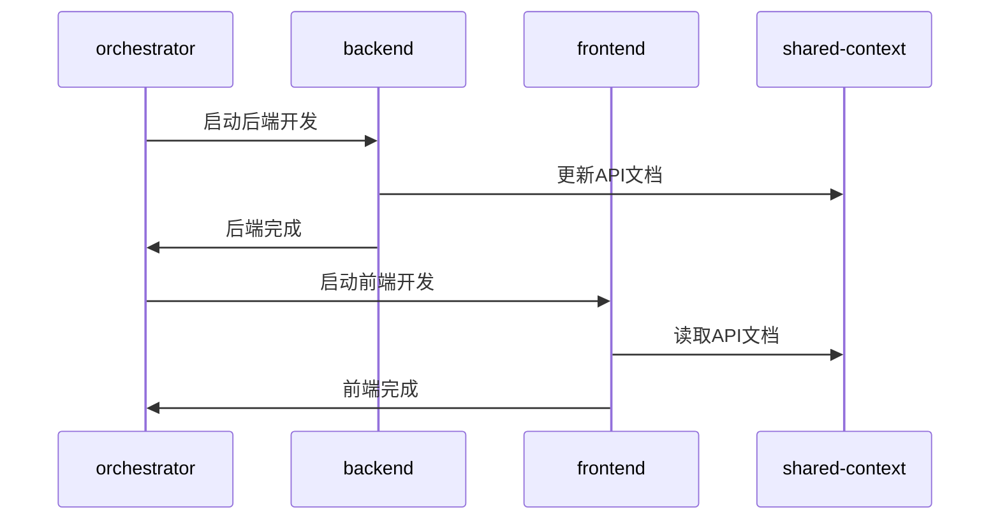

### 模式3：迭代反馈

**触发条件**：质量门禁未通过

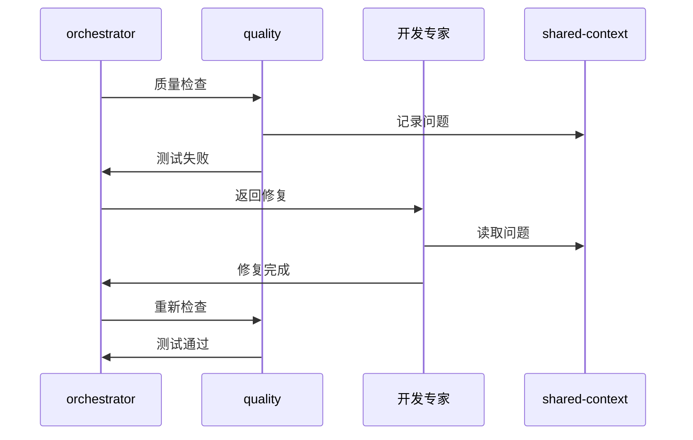

---

## 质量门禁

### 门禁链

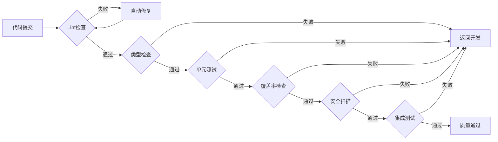

### 门禁配置

| 门禁     | 命令                       | 阈值      | 自动处理 |
| -------- | -------------------------- | --------- | -------- |
| Lint     | `npm run lint`             | 0 errors  | 自动修复 |
| 类型     | `npm run typecheck`        | 0 errors  | 返回开发 |
| 单元测试 | `npm run test`             | 100% pass | 返回开发 |
| 覆盖率   | `npm run coverage`         | ≥ 80%     | 返回开发 |
| 安全     | `npm audit`                | 0 high    | 返回开发 |
| 集成测试 | `npm run test:integration` | 100% pass | 返回开发 |

---

## 异常处理

### 自动恢复

| 异常     | 检测方式 | 自动恢复       |
| -------- | -------- | -------------- |
| Lint错误 | 构建失败 | 自动修复后重试 |
| 测试失败 | 测试报告 | 返回开发阶段   |
| 部署失败 | 健康检查 | 自动回滚       |
| 依赖缺失 | 启动错误 | 自动安装       |

### 升级机制

| 级别     | 条件          | 处理     |
| -------- | ------------- | -------- |
| 自动处理 | 重试次数 < 3  | 自动重试 |
| 人工介入 | 重试次数 >= 3 | 通知用户 |
| 紧急停止 | 阻塞 > 30分钟 | 暂停流程 |

---

## 专家协作协议

### 消息传递

```typescript
interface ExpertMessage {
  id: string;
  timestamp: string;
  type: 'request' | 'response' | 'notification' | 'error';
  priority: 'critical' | 'high' | 'medium' | 'low';

  sender: {
    expert: string;
    phase: string;
    status: 'available' | 'busy' | 'blocked' | 'completed';
  };

  receiver: {
    expert: string;
    action: 'start' | 'continue' | 'pause' | 'complete' | 'error';
  };

  payload: {
    taskId: string;
    input: ExpertInput;
    output: ExpertOutput;
    context: ProjectContext;
  };
}
```

### Skills 输入输出规范

```typescript
interface SkillIO {
  input: {
    taskBoard: TaskBoard;
    context: SharedContext;
    previousOutput?: any;
  };
  output: {
    artifacts: File[];
    taskBoard: Partial<TaskBoard>;
    nextSkill?: string;
  };
}
```

### 状态同步

每个专家完成后必须执行：

1. **更新任务看板** → `task-board.json`
2. **同步共享上下文** → `shared-context/project-context.json`
3. **通知协调中枢** → 发送完成消息

详细协议: `templates/orchestrator/message-protocol.json`

---

## 知识沉淀

### 自动记录

每个阶段完成后自动记录：

| 记录类型 | 存储位置                                     |
| -------- | -------------------------------------------- |
| 决策记录 | `.ai-team/orchestrator/decision-registry/`   |
| 工作日志 | `.ai-team/orchestrator/workflow-log.md`      |
| 经验沉淀 | `.ai-team/shared-context/knowledge-graph.md` |

### 反馈闭环

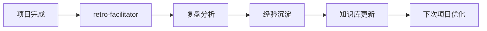

---

## 项目结构

### 工作区

```
.ai-team/                    # AI团队工作区（运行时）
├── orchestrator/
│   ├── task-board.json      # 任务看板
│   ├── workflow-log.md      # 执行日志
│   └── decision-registry/   # 决策记录
├── experts/                 # 各专家工作区
│   ├── product-strategist/
│   ├── tech-architect/
│   ├── frontend-specialist/
│   ├── backend-specialist/
│   └── ...
├── shared-context/
│   ├── project-context.json # 项目上下文
│   └── knowledge-graph.md   # 知识图谱
└── automation/
    └── config.yaml          # 自动化配置
```

### 项目文档

```
docs/
├── 01-requirements/         # 需求文档
├── 02-design/              # 设计文档
├── 03-implementation/      # 实现文档
├── 04-testing/             # 测试文档
└── 05-deployment/          # 部署文档
```

---

## 模板文件

位置: `templates/orchestrator/`

| 模板                          | 说明           |
| ----------------------------- | -------------- |
| task-board-template.json      | 任务看板模板   |
| message-protocol.json         | 专家通信协议   |
| project-context.template.json | 项目上下文模板 |

---

## 最佳实践

### 渐进式自动化

| 阶段 | 人工介入点    | 自动化程度 |
| ---- | ------------- | ---------- |
| 初期 | PRD、架构确认 | 30%        |
| 中期 | 关键决策      | 60%        |
| 成熟 | 异常处理      | 90%        |

### 上下文传递

每个专家接收任务时自动获取：

- 项目背景和目标
- 前序阶段产出
- 技术决策记录
- 已知约束和风险

### 智能重试

```
失败 → 分析原因 → 智能修复 → 重试 → 成功
```

### 并行优化

- 独立任务并行执行
- 依赖任务智能排序
- 资源冲突自动协调

---

## 完整示例

### 场景：开发用户管理模块

**用户输入**：

```
开始项目：开发用户管理模块，包含用户CRUD、角色权限、操作日志
```

**自动执行**：

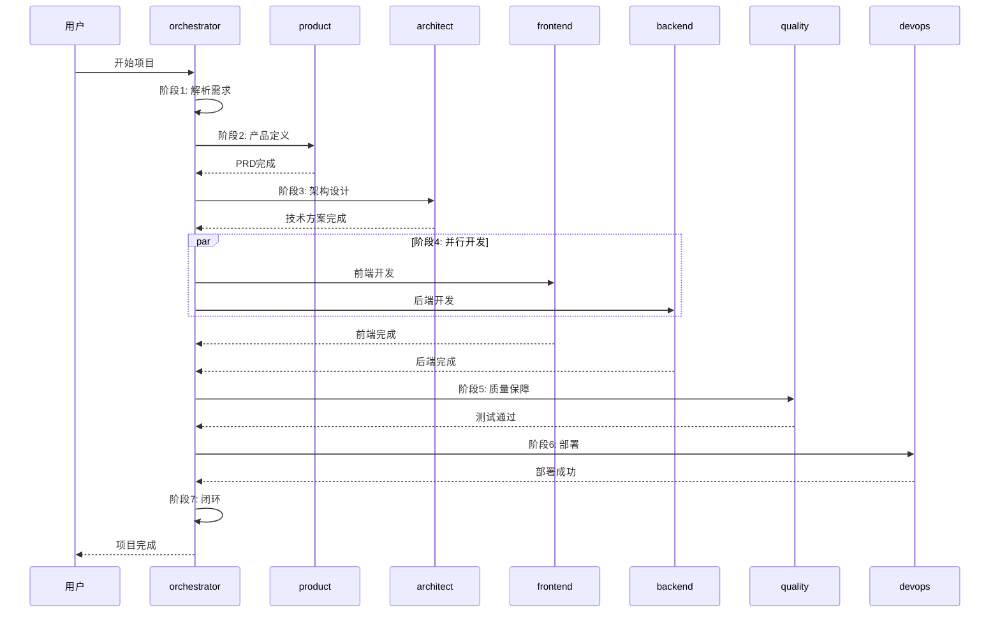

**自动产出**：

```
docs/
├── 01-requirements/
│   └── user-management-prd.md
├── 02-design/
│   ├── architecture.md
│   ├── api-design.md
│   └── database-schema.md
└── 03-implementation/
    ├── frontend-spec.md
    └── backend-spec.md

src/
├── frontend/
│   ├── components/UserManagement/
│   └── pages/users/
└── backend/
    ├── routes/users.ts
    ├── models/User.ts
    └── services/userService.ts

tests/
├── unit/
├── integration/
└── e2e/
```
