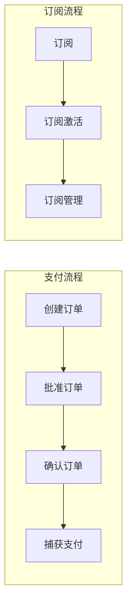

# PayPal 支付集成模式

> Checkout、Subscription、Webhook 处理的最佳实践

## 何时激活

- 实现 PayPal 支付功能
- 快速结账 (Checkout)
- 订阅管理
- 退款处理
- 订单查询与管理
- Webhook 事件处理

## 技术栈版本

| 技术                        | 最低版本 | 推荐版本 |
| --------------------------- | -------- | -------- |
| @paypal/checkout-server-sdk | 1.0.0+   | 最新     |
| @paypal/paypal-server-sdk   | 1.0.0+   | 最新     |
| Node.js                     | 18.0+    | 20.0+    |

## 核心概念



## 初始化

```typescript
import checkout from '@paypal/checkout-server-sdk';

const client = new checkout.PayPalHttpClient({
  clientId: process.env.PAYPAL_CLIENT_ID!,
  clientSecret: process.env.PAYPAL_CLIENT_SECRET!,
  environment:
    process.env.NODE_ENV === 'production'
      ? checkout.CoreEnvironments.Live
      : checkout.CoreEnvironments.Sandbox,
});
```

## Checkout (快速结账)

### 创建订单

```typescript
async function createOrder(
  amount: number,
  currency: string,
  orderId: string,
  description?: string
) {
  const request = new checkout.orders.OrdersCreateRequest();
  request.requestBody({
    intent: 'CAPTURE',
    purchase_units: [
      {
        reference_id: orderId,
        amount: {
          currency_code: currency,
          value: amount.toFixed(2),
        },
        description: description || `Order ${orderId}`,
      },
    ],
    application_context: {
      return_url: `${process.env.BASE_URL}/api/payment/paypal/success`,
      cancel_url: `${process.env.BASE_URL}/api/payment/paypal/cancel`,
    },
  });

  const response = await client.execute(request);
  return {
    orderId: response.result.id,
    status: response.result.status,
    approveUrl: response.result.links.find((l) => l.rel === 'approve')?.href,
  };
}
```

### 批准订单

```typescript
async function captureOrder(orderId: string) {
  const request = new checkout.orders.OrdersCaptureRequest(orderId);
  request.requestBody({});

  const response = await client.execute(request);

  return {
    orderId: response.result.id,
    status: response.result.status,
    payer: response.result.payer,
    purchaseUnits: response.result.purchase_units,
    captureId: response.result.purchase_units[0]?.payments?.captures[0]?.id,
  };
}
```

### 订单查询

```typescript
async function getOrder(orderId: string) {
  const request = new checkout.orders.OrdersGetRequest(orderId);
  const response = await client.execute(request);

  return {
    orderId: response.result.id,
    status: response.result.status,
    amount: response.result.purchase_units[0].amount,
    createTime: response.result.create_time,
    updateTime: response.result.update_time,
  };
}
```

### 订单确认 (Server-side)

```typescript
async function authorizeOrder(orderId: string) {
  const request = new checkout.orders.OrdersAuthorizeRequest(orderId);
  request.requestBody({});

  const response = await client.execute(request);
  return {
    orderId: response.result.id,
    authorizationId: response.result.purchase_units[0].payments?.authorizations[0]?.id,
  };
}
```

## Subscription (订阅)

### 创建订阅

```typescript
async function createSubscription(
  planId: string,
  subscriber: { email_address: string; name?: { given_name: string; surname: string } },
  startTime: string
) {
  const request = new checkout.subscriptions.SubscriptionsCreateRequest();
  request.requestBody({
    plan_id: planId,
    subscriber,
    start_time: startTime,
    application_context: {
      brand_name: process.env.APP_NAME || 'Your Brand',
      locale: 'en-US',
      shipping_preference: 'SET_PROVIDED_ADDRESS',
      user_action: 'SUBSCRIBE_NOW',
      return_url: `${process.env.BASE_URL}/api/payment/paypal/subscription/success`,
      cancel_url: `${process.env.BASE_URL}/api/payment/paypal/subscription/cancel`,
    },
  });

  const response = await client.execute(request);
  return {
    subscriptionId: response.result.id,
    status: response.result.status,
    approveUrl: response.result.links.find((l) => l.rel === 'approve')?.href,
  };
}
```

### 激活订阅

```typescript
async function activateSubscription(subscriptionId: string, note?: string) {
  const request = new checkout.subscriptions.SubscriptionsActivateRequest(subscriptionId);
  request.requestBody({
    reason: note || 'Active',
  });

  await client.execute(request);
}
```

### 暂停订阅

```typescript
async function suspendSubscription(subscriptionId: string, note: string) {
  const request = new checkout.subscriptions.SubscriptionsSuspendRequest(subscriptionId);
  request.requestBody({ reason: note });

  await client.execute(request);
}
```

### 取消订阅

```typescript
async function cancelSubscription(subscriptionId: string, note?: string) {
  const request = new checkout.subscriptions.SubscriptionsCancelRequest(subscriptionId);
  request.requestBody({ reason: note || 'User cancelled' });

  await client.execute(request);
}
```

### 更新订阅

```typescript
async function updateSubscription(subscriptionId: string, planId: string) {
  const request = new checkout.subscriptions.SubscriptionsUpdateRequest(subscriptionId);
  request.requestBody({
    plan_id: planId,
  });

  await client.execute(request);
}
```

## Webhook 处理

```typescript
import crypto from 'crypto';

interface WebhookEvent {
  event_type: string;
  resource: Record<string, unknown>;
  id: string;
  create_time: string;
}

async function handleWebhook(req: { body: Buffer; headers: Record<string, string | undefined> }) {
  const payload = req.body;
  const headers = req.headers;
  const webhookId = process.env.PAYPAL_WEBHOOK_ID!;

  const isValid = await verifyWebhookSignature(payload, headers, webhookId);

  if (!isValid) {
    throw new Error('Invalid webhook signature');
  }

  const event: WebhookEvent = JSON.parse(payload.toString());
  const { event_type, resource } = event;

  try {
    switch (event_type) {
      case 'CHECKOUT.ORDER.APPROVED':
        await handleOrderApproved(resource);
        break;
      case 'PAYMENT.CAPTURE.COMPLETED':
        await handlePaymentCompleted(resource);
        break;
      case 'PAYMENT.CAPTURE.REFUNDED':
        await handlePaymentRefunded(resource);
        break;
      case 'BILLING.SUBSCRIPTION.ACTIVATED':
        await handleSubscriptionActivated(resource);
        break;
      case 'BILLING.SUBSCRIPTION.SUSPENDED':
        await handleSubscriptionSuspended(resource);
        break;
      case 'BILLING.SUBSCRIPTION.CANCELLED':
        await handleSubscriptionCancelled(resource);
        break;
      case 'BILLING.SUBSCRIPTION.EXPIRED':
        await handleSubscriptionExpired(resource);
        break;
      default:
        console.log(`Unhandled event type: ${event_type}`);
    }
  } catch (error) {
    console.error(`Error handling webhook ${event_type}:`, error);
    throw error;
  }
}

async function verifyWebhookSignature(
  payload: Buffer,
  headers: Record<string, string | undefined>,
  webhookId: string
): Promise<boolean> {
  const transmissionId = headers['paypal-transmission-id'];
  const transmissionTime = headers['paypal-transmission-time'];
  const certUrl = headers['paypal-cert-url'];
  const authAlgo = headers['paypal-auth-algo'];
  const transmissionSig = headers['paypal-transmission-sig'];

  if (!transmissionId || !transmissionTime || !certUrl || !authAlgo || !transmissionSig) {
    return false;
  }

  return true;
}

async function handleOrderApproved(resource: Record<string, unknown>) {
  const orderId = resource.id as string;
  console.log(`Order approved: ${orderId}`);
}

async function handlePaymentCompleted(resource: Record<string, unknown>) {
  const captureId = resource.id as string;
  const orderId = (resource.supplementary_data?.related_ids?.order_id || resource.custom_id) as string;
  await updateOrderStatus(orderId, 'paid', captureId);
}

async function handlePaymentRefunded(resource: Record<string, unknown>) {
  const refundId = resource.id as string;
  const captureId = resource.links?.find((l: any) => l.rel === 'up')?.href?.split('/').pop();
  if (captureId) {
    await updateOrderStatus('', 'refunded', captureId, refundId);
  }
}

async function handleSubscriptionActivated(resource: Record<string, unknown>) {
  const subscriptionId = resource.id as string;
  const subscriber = resource.subscriber as { email_address: string };
  await activateSubscriptionAccess(subscriber.email_address, subscriptionId);
}

async function handleSubscriptionSuspended(resource: Record<string, unknown>) {
  const subscriptionId = resource.id as string;
  await updateSubscriptionStatus(subscriptionId, 'suspended');
}

async function handleSubscriptionCancelled(resource: Record<string, unknown>) {
  const subscriptionId = resource.id as string;
  await revokeSubscriptionAccess(subscriptionId);
}

async function handleSubscriptionExpired(resource: Record<string, unknown>) {
  const subscriptionId = resource.id as string;
  await revokeSubscriptionAccess(subscriptionId);
}
```

## 退款

### 退款捕获

```typescript
async function refundCapture(captureId: string, amount?: number, currency?: string) {
  const request = new checkout.payments.CapturesRefundRequest(captureId);
  request.requestBody({
    amount: amount
      ? {
          currency_code: currency || 'USD',
          value: amount.toFixed(2),
        }
      : undefined,
  });

  const response = await client.execute(request);
  return {
    refundId: response.result.id,
    status: response.result.status,
    amount: response.result.amount,
  };
}
```

### 查询退款

```typescript
async function getRefund(refundId: string) {
  const request = new checkout.payments.RefundsGetRequest(refundId);
  const response = await client.execute(request);
  return {
    refundId: response.result.id,
    status: response.result.status,
    amount: response.result.amount,
  };
}
```

## 支付安全最佳实践

| 措施           | 实现                          |
| -------------- | ----------------------------- |
| 签名验证       | Webhook 签名验证              |
| 幂等性         | 使用 orderId 防止重复处理     |
| 金额校验       | 服务端计算金额，防止篡改      |
| HTTPS          | 强制使用 HTTPS                |
| 错误处理       | 捕获 PayPal API 异常          |
| 日志记录       | 记录完整支付流程              |
| 限流           | 防止恶意请求刷单              |

## 错误处理

```typescript
class PayPalPaymentError extends Error {
  constructor(
    public code: string,
    message: string,
    public details?: unknown
  ) {
    super(message);
    this.name = 'PayPalPaymentError';
  }
}

async function handlePayPalError(error: unknown): Promise<void> {
  if (error instanceof Error) {
    console.error('PayPal error:', error.message);
    if (error.message.includes('INSTRUMENT_DECLINED')) {
      console.error('Instrument declined, need user action');
    }
  }
}
```

## 快速参考

```typescript
import checkout from '@paypal/checkout-server-sdk';

const client = new checkout.PayPalHttpClient({
  clientId: process.env.PAYPAL_CLIENT_ID!,
  clientSecret: process.env.PAYPAL_CLIENT_SECRET!,
  environment: checkout.CoreEnvironments.Sandbox,
});

// 创建订单
const createRequest = new checkout.orders.OrdersCreateRequest();
createRequest.requestBody({
  intent: 'CAPTURE',
  purchase_units: [{ amount: { currency_code: 'USD', value: '100.00' } }],
});
const order = await client.execute(createRequest);

// 捕获订单
const captureRequest = new checkout.orders.OrdersCaptureRequest(order.result.id);
const capture = await client.execute(captureRequest);

// 创建订阅
const subRequest = new checkout.subscriptions.SubscriptionsCreateRequest();
subRequest.requestBody({
  plan_id: 'PLAN_ID',
  subscriber: { email_address: 'customer@example.com' },
  start_time: '2024-01-01T00:00:00Z',
});
const subscription = await client.execute(subRequest);
```

## 参考

- [PayPal Developer Docs](https://developer.paypal.com/docs/)
- [@paypal/checkout-server-sdk](https://www.npmjs.com/package/@paypal/checkout-server-sdk)
