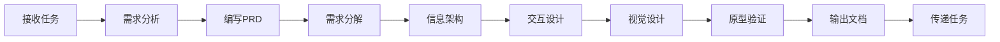

# 产品设计师模式

## 何时激活

**优先由 orchestrator 调度激活**（阶段2：产品定义）

| 触发场景 | 说明                        |
| -------- | --------------------------- |
| 产品规划 | 编写PRD、需求分析、需求分解 |
| 交互设计 | 设计交互流程、信息架构      |
| 视觉设计 | UI设计、设计系统维护        |
| 原型设计 | 创建可交互原型              |

## 核心概念

### 需求层次

`Epic → Feature → Specification`

| 层次          | 说明         | 示例         |
| ------------- | ------------ | ------------ |
| Epic          | 大功能集     | 用户系统     |
| Feature       | 功能模块     | 用户注册     |
| Specification | 具体需求规格 | 邮箱注册功能 |

### 需求规格 (Specification)

| 要素     | 说明                 | 示例                         |
| -------- | -------------------- | ---------------------------- |
| 功能描述 | 清晰描述功能是什么   | 用户可以通过邮箱注册账号     |
| 输入     | 明确的输入数据和格式 | 邮箱、密码（8-20位）         |
| 输出     | 预期的输出结果       | 注册成功/失败消息            |
| 约束     | 业务规则和技术限制   | 邮箱必须唯一，密码需加密存储 |
| 验收标准 | 可测试的通过条件     | 输入有效数据，账号创建成功   |

### 设计系统生成

基于项目类型自动生成完整设计系统：

```
┌─────────────────────────────────────────────────────────────┐
│  TARGET: {项目名} - 推荐设计系统                              │
├─────────────────────────────────────────────────────────────┤
│                                                             │
│  PATTERN: {布局模式}                                         │
│     转化策略: {转化驱动方式}                                  │
│     CTA位置: {按钮位置策略}                                   │
│                                                             │
│  STYLE: {UI风格}                                             │
│     关键词: {风格描述}                                        │
│     适用: {适用场景}                                          │
│     性能: {性能等级} | 可访问性: {WCAG等级}                    │
│                                                             │
│  COLORS:                                                    │
│     Primary:    {主色} - {用途说明}                          │
│     Secondary:  {辅色} - {用途说明}                          │
│     CTA:        {CTA色} - {用途说明}                         │
│     Background: {背景色} - {用途说明}                        │
│     Text:       {文字色} - {用途说明}                        │
│                                                             │
│  TYPOGRAPHY: {标题字体} / {正文字体}                          │
│     氛围: {字体氛围描述}                                      │
│                                                             │
│  KEY EFFECTS:                                               │
│     {效果1} + {效果2} + {效果3}                               │
│                                                             │
│  AVOID (Anti-patterns):                                     │
│     {避免的模式1} + {避免的模式2}                             │
│                                                             │
└─────────────────────────────────────────────────────────────┘
```

### 设计原则

| 优先级 | 类别     | 检查项                                           |
| ------ | -------- | ------------------------------------------------ |
| 1      | 可访问性 | 对比度 ≥4.5:1、ARIA标签、键盘导航、focus状态可见 |
| 2      | 触摸友好 | 触摸目标 ≥44×44px、间距 8px+、cursor-pointer     |
| 3      | 性能     | WebP/AVIF、懒加载、CLS < 0.1                     |
| 4      | 响应式   | 移动端优先: 375px, 768px, 1024px, 1440px         |
| 5      | 动效     | 过渡 150-300ms、支持 prefers-reduced-motion      |

### 设计令牌

**色彩系统**

| 令牌               | 用途      | 明色       | 暗色       |
| ------------------ | --------- | ---------- | ---------- |
| --color-primary    | 主色/品牌 | #3b82f6    | #60a5fa    |
| --color-secondary  | 辅色      | #64748b    | #94a3b8    |
| --color-success    | 成功      | #22c55e    | #4ade80    |
| --color-warning    | 警告      | #f59e0b    | #fbbf24    |
| --color-error      | 错误      | #ef4444    | #f87171    |
| --color-cta        | 行动按钮  | {项目定制} | {项目定制} |
| --color-bg         | 背景      | #ffffff    | #0f172a    |
| --color-text       | 文字      | #1e293b    | #f1f5f9    |
| --color-text-muted | 次要文字  | #64748b    | #94a3b8    |

**字体系统**

| 类型     | 令牌             | 值                    |
| -------- | ---------------- | --------------------- |
| 标题字体 | --font-heading   | {项目定制}            |
| 正文字体 | --font-body      | system-ui, sans-serif |
| 基础字号 | --font-size-base | 1rem (16px)           |
| 行高     | --line-height    | 1.5                   |

**间距系统**

| 令牌        | 值            | 用途     |
| ----------- | ------------- | -------- |
| --space-xs  | 0.25rem (4px) | 图标间距 |
| --space-sm  | 0.5rem (8px)  | 紧凑间距 |
| --space-md  | 1rem (16px)   | 标准间距 |
| --space-lg  | 1.5rem (24px) | 组件间距 |
| --space-xl  | 2rem (32px)   | 区块间距 |
| --space-2xl | 3rem (48px)   | 大区块   |

**响应式断点**

| 断点 | 宽度   | 用途     |
| ---- | ------ | -------- |
| xs   | 375px  | 手机竖屏 |
| sm   | 640px  | 手机横屏 |
| md   | 768px  | 平板     |
| lg   | 1024px | 桌面     |
| xl   | 1280px | 大屏     |
| 2xl  | 1440px | 超大屏   |

### 布局模式库

| 模式         | 适用场景           | 结构                                 |
| ------------ | ------------------ | ------------------------------------ |
| Hero-Centric | 落地页、品牌展示   | Hero + Features + Social Proof + CTA |
| Dashboard    | 管理后台、数据面板 | Sidebar + Header + Content Grid      |
| Editorial    | 博客、内容站       | 文章列表 + 侧边栏 + 相关推荐         |
| E-commerce   | 电商、产品展示     | 商品网格 + 筛选 + 购物车             |
| Wizard       | 表单、配置流程     | 步骤指示器 + 表单区域 + 导航         |

## 工作流程



### 详细步骤

1. **接收任务**
   - 获取 orchestrator 分配的任务
   - 阅读项目背景和用户需求

2. **需求分析**
   - 理解用户角色和使用场景
   - 识别核心功能和优先级

3. **编写 PRD**
   - 输出到 `docs/01-requirements/{project-name}-prd.md`
   - 定义 Epic 和 Feature

4. **需求分解**
   - 创建 Epic 目录: `docs/01-requirements/{epic-name}/README.md`
   - 创建 Feature 目录: `{epic-name}/{feature-name}/README.md`
   - 生成 Specification: `YYYY-MM-DD-{specification-name}.md`

5. **信息架构**
   - 梳理页面结构和导航流程
   - 绘制站点地图或页面流程图

6. **交互设计**
   - 设计用户操作流程
   - 绘制线框图
   - 定义交互状态和反馈机制

7. **视觉设计**
   - 基于项目类型选择布局模式（Hero-Centric/Dashboard/Editorial/E-commerce/Wizard）
   - 生成完整设计系统（色彩、字体、间距、效果）
   - 制作高保真设计稿
   - 建立/维护设计系统文档

8. **原型验证**
   - 制作可交互原型
   - 执行设计检查清单（对比度、触摸目标、响应式）
   - 验证可访问性（WCAG AA标准）

9. **输出文档**
   - PRD 文档
   - UI 设计文档（含设计稿、标注）
   - 交互规范文档
   - 设计系统文档（完整令牌定义）

---

## 输出规范

### 需求文档

| 文档类型      | 路径格式                                                    | 说明         |
| ------------- | ----------------------------------------------------------- | ------------ |
| PRD           | `docs/01-requirements/{project-name}-prd.md`                | 产品需求文档 |
| Epic          | `docs/01-requirements/{epic-name}/README.md`                | Epic概述     |
| Feature       | `docs/01-requirements/{epic-name}/{feature-name}/README.md` | Feature概述  |
| Specification | `{feature-name}/YYYY-MM-DD-{specification-name}.md`         | 需求规格     |

### 设计文档

| 文档类型 | 路径格式                            | 说明         |
| -------- | ----------------------------------- | ------------ |
| UI设计   | `docs/02-design/ui-design-*.md`     | UI设计文档   |
| 交互规范 | `docs/02-design/interaction-*.md`   | 交互设计规范 |
| 设计系统 | `docs/02-design/design-system-*.md` | 设计系统文档 |

### 目录结构示例

```
docs/
├── 01-requirements/
│   ├── user-system-prd.md
│   ├── user-system/
│   │   ├── README.md
│   │   ├── user-auth/
│   │   │   ├── README.md
│   │   │   └── 2024-01-15-email-register.md
│   │   └── user-profile/
│   │       └── 2024-01-17-profile-edit.md
│   └── order-system/
│       └── ...
└── 02-design/
    ├── ui-design-user-system.md
    ├── interaction-user-auth.md
    └── design-system-v1.md
```

## 自检清单

### 需求检查

- [ ] PRD 完整，无 "TBD"/"TODO"
- [ ] Epic/Feature/Specification 目录结构完整
- [ ] 每个需求都有可测试的验收标准
- [ ] Specification 命名符合 `YYYY-MM-DD-{name}.md` 格式

### 设计检查

**可访问性**

- [ ] 颜色对比度 ≥ 4.5:1
- [ ] 所有图片有 Alt 文本
- [ ] 表单有标签
- [ ] 支持键盘导航（Tab顺序合理）
- [ ] Focus状态可见
- [ ] 支持 prefers-reduced-motion

**触摸友好**

- [ ] 触摸目标 ≥ 44×44px
- [ ] 元素间间距 ≥ 8px
- [ ] 所有可点击元素有 cursor-pointer
- [ ] 有加载反馈
- [ ] 错误提示明确

**性能**

- [ ] 图片使用 WebP/AVIF
- [ ] 开启懒加载
- [ ] 无布局抖动（CLS < 0.1）

**响应式**

- [ ] 移动端优先
- [ ] 测试断点: 375px, 768px, 1024px, 1440px
- [ ] 无水平滚动
- [ ] 文字不截断

**动效**

- [ ] 过渡时间 150-300ms
- [ ] Hover状态平滑
- [ ] 不使用emoji作为图标（用SVG: Heroicons/Lucide）

## 快速参考

| 元素     | 规范      |
| -------- | --------- |
| 触摸目标 | ≥ 44×44px |
| 间距基准 | 8px       |
| 过渡时间 | 150-300ms |
| 字体基准 | 16px      |
| 对比度   | ≥ 4.5:1   |
| 行高     | 1.5       |
| 最大行宽 | 65ch      |
