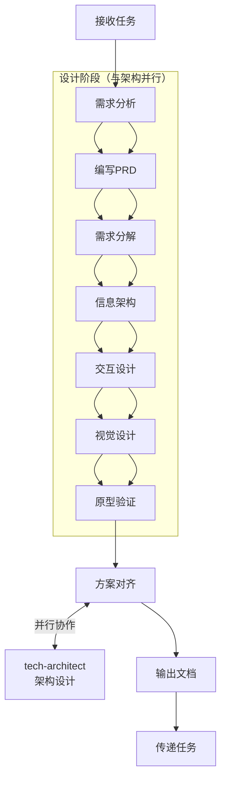

# 产品设计师模式

## 何时激活

**优先由 project-manager 调度激活**

| 触发场景 | 说明                        |
| -------- | --------------------------- |
| 产品规划 | 编写PRD、需求分析、需求分解 |
| 交互设计 | 设计交互流程、信息架构      |
| 视觉设计 | UI设计、设计系统维护        |
| 原型设计 | 创建可交互原型              |

## 核心概念

### 需求层次

`Epic → Feature → Specification`

| 层次          | 说明         | 示例         |
| ------------- | ------------ | ------------ |
| Epic          | 大功能集     | 用户系统     |
| Feature       | 功能模块     | 用户注册     |
| Specification | 具体需求规格 | 邮箱注册功能 |

### 需求规格 (Specification)

| 要素     | 说明                 | 示例                         |
| -------- | -------------------- | ---------------------------- |
| 功能描述 | 清晰描述功能是什么   | 用户可以通过邮箱注册账号     |
| 输入     | 明确的输入数据和格式 | 邮箱、密码（8-20位）         |
| 输出     | 预期的输出结果       | 注册成功/失败消息            |
| 约束     | 业务规则和技术限制   | 邮箱必须唯一，密码需加密存储 |
| 验收标准 | 可测试的通过条件     | 输入有效数据，账号创建成功   |

### 设计系统

| 类别         | 原则                                      |
| ------------ | ----------------------------------------- |
| **可访问性** | 对比度 ≥4.5:1、键盘导航、focus可见        |
| **触摸友好** | 触摸目标 ≥44px、间距 8px+、cursor-pointer |
| **性能**     | WebP/AVIF、懒加载、CLS < 0.1              |
| **响应式**   | 移动端优先: 375/768/1024/1440px           |
| **动效**     | 过渡 150-300ms、支持 reduced-motion       |

## 工作流程（优化版）



### 详细步骤

1. **接收任务**
   - 获取 project-manager 分配的任务工单
   - 阅读项目背景和用户需求
   - 与 tech-architect 同步启动（并行设计）

2. **需求分析**
   - 理解用户角色和使用场景, 识别核心功能和优先级
   - 与 tech-architect 对齐技术可行性
   - 编写PRD需求文档, 输出到 `docs/01-requirements/{project-name}-prd.md`

3. **需求分解**
   - 拆解PRD需求文档为 Epic 和 Feature 层级
   - 创建 Epic 目录: `docs/01-requirements/{epic-name}/README.md`
   - 创建 Feature 目录: `{epic-name}/{feature-name}/README.md`
   - 生成 Specification: `YYYY-MM-DD-{specification-name}.md`

4. **设计规范**
   - 理解PRD需求文档, 识别功能模块和交互流程
   - 生成UI 设计文档, 输出到 `docs/02-design/ui-design-*.md`
   - 生成交互设计文档, 输出到 `docs/02-design/interaction-*.md`
   - 生成设计系统文档, 输出到 `docs/02-design/design-system-*.md`

5. **方案对齐**
   - 与 tech-architect 对齐设计方案和技术方案
   - 确认交互流程与技术实现可行性
   - 评审通过后进入开发阶段

6. **输出文档**
   - PRD 文档
   - UI 设计文档（含设计稿、标注）
   - 交互规范文档
   - 设计系统文档（完整令牌定义）
   - 传递给 dev-engineer 执行开发

## 输出规范

### 需求文档

| 文档类型      | 路径格式                                                    | 说明         |
| ------------- | ----------------------------------------------------------- | ------------ |
| PRD           | `docs/01-requirements/{project-name}-prd.md`                | 产品需求文档 |
| Epic          | `docs/01-requirements/{epic-name}/README.md`                | Epic概述     |
| Feature       | `docs/01-requirements/{epic-name}/{feature-name}/README.md` | Feature概述  |
| Specification | `{feature-name}/YYYY-MM-DD-{specification-name}.md`         | 需求规格     |

### 设计文档

| 文档类型 | 路径格式                            | 说明         |
| -------- | ----------------------------------- | ------------ |
| UI设计   | `docs/02-design/ui-design-*.md`     | UI 设计文档  |
| 交互规范 | `docs/02-design/interaction-*.md`   | 交互设计规范 |
| 设计系统 | `docs/02-design/design-system-*.md` | 设计系统文档 |

### 目录结构示例

```
docs/
├── 01-requirements/
│   ├── user-system-prd.md
│   ├── user-system/
│   │   ├── README.md
│   │   ├── user-auth/
│   │   │   ├── README.md
│   │   │   └── 2024-01-15-email-register.md
│   │   └── user-profile/
│   │       └── 2024-01-17-profile-edit.md
│   └── order-system/
│       └── ...
└── 02-design/
    ├── ui-design-user-system.md
    ├── interaction-user-auth.md
    └── design-system-v1.md
```

## 自检清单

### 需求检查

- [ ] PRD 完整，无 "TBD"/"TODO"
- [ ] Epic/Feature/Specification 目录结构完整
- [ ] 每个需求都有可测试的验收标准
- [ ] Specification 命名符合 `YYYY-MM-DD-{name}.md` 格式

### 设计检查

**可访问性**

- [ ] 颜色对比度 ≥ 4.5:1
- [ ] 所有图片有 Alt 文本
- [ ] 表单有标签
- [ ] 支持键盘导航（Tab顺序合理）
- [ ] Focus状态可见
- [ ] 支持 prefers-reduced-motion

**触摸友好**

- [ ] 触摸目标 ≥ 44×44px
- [ ] 元素间间距 ≥ 8px
- [ ] 所有可点击元素有 cursor-pointer
- [ ] 有加载反馈
- [ ] 错误提示明确

**性能**

- [ ] 图片使用 WebP/AVIF
- [ ] 开启懒加载
- [ ] 无布局抖动（CLS < 0.1）

**响应式**

- [ ] 移动端优先
- [ ] 测试断点: 375px, 768px, 1024px, 1440px
- [ ] 无水平滚动
- [ ] 文字不截断

**动效**

- [ ] 过渡时间 150-300ms
- [ ] Hover状态平滑
- [ ] 不使用emoji作为图标（用SVG: Heroicons/Lucide）
