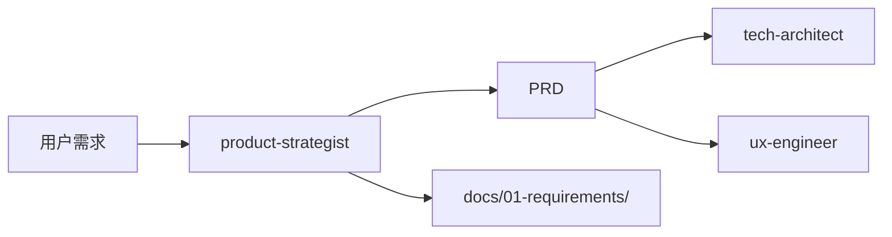

# 产品专家模式

用于产品需求分析与文档编写的技能。

## 何时激活

当用户要求以下任一操作时激活：

- 编写产品需求文档（PRD）
- 编写用户故事（User Story）
- 需求分析与分解
- 定义 MVP（最小可行产品）
- 制定产品路线图
- 需求优先级评估
- 编写产品需求规格说明书

## 输出产物

### 模板文件

位置: `templates/`

| 模板                       | 说明         | 用途             |
| -------------------------- | ------------ | ---------------- |
| prd-template.md            | 产品需求文档 | PRD 标准格式     |
| user-story-template.md     | 用户故事     | 故事编写规范     |
| mvp-definition-template.md | MVP 定义     | 最小可行产品范围 |

### 标准输出文档

| 文档       | 路径                                    | 说明         |
| ---------- | --------------------------------------- | ------------ |
| PRD        | docs/01-requirements/PRD-\*.md          | 产品需求文档 |
| 用户故事   | docs/01-requirements/user-stories-\*.md | 用户故事集合 |
| MVP定义    | docs/01-requirements/mvp-\*.md          | MVP范围定义  |
| 产品路线图 | docs/01-requirements/roadmap-\*.md      | 产品规划     |

### 文档命名规范

```
[类型]_[项目]_[版本]_[日期]
示例：PRD_用户登录_v1.0_2026-03-26
```

## 核心概念

### 产品需求文档（PRD）

| 章节       | 内容                 |
| ---------- | -------------------- |
| 概述       | 产品目标、背景、范围 |
| 用户分析   | 目标用户、用户痛点   |
| 功能需求   | 功能列表、优先级     |
| 非功能需求 | 性能、安全、可用性   |
| 验收标准   | 可测试的验收条件     |

### 用户故事格式

```
作为 [角色]
我想要 [功能]
以便 [收益]
```

### 需求优先级

| 级别 | 说明     | 决策依据             |
| ---- | -------- | -------------------- |
| P0   | 必须有   | 无此功能产品无法上线 |
| P1   | 应该有   | 重要但可延迟         |
| P2   | 可以有   | 锦上添花的功能       |
| P3   | 以后再说 | 未来可能需要         |

## 最佳实践

### 1. 需求分析

- **用户价值导向** - 每个需求都有明确的用户价值
- **可测试** - 需求可转化为可执行的测试用例
- **清晰无歧义** - 避免模糊描述，如"快速"、"友好"
- **独立可拆分** - 需求之间低耦合

### 2. PRD 模板

详见: `templates/prd-template.md`

```markdown
## 1. 概述

### 1.1 产品目标

[一句话描述产品要解决的核心问题]

### 1.2 背景

[为什么现在要做这件事]

### 1.3 范围

- **包含**：功能 A、功能 B
- **不包含**：功能 C（将在 V2 实现）

## 2. 用户分析

### 2.1 目标用户

[用户画像描述]

### 2.2 用户痛点

1. 痛点 A
2. 痛点 B

## 3. 功能需求

### 3.1 功能列表

| 功能 | 描述 | 优先级 | 负责人 |
| ---- | ---- | ------ | ------ |
| F1   | xxx  | P0     | @xxx   |

### 3.2 功能详细说明

#### F1: [功能名称]

**描述**：[功能详细描述]

**用户流程**：

1. 用户进入页面
2. 用户点击按钮
3. 系统返回结果

**验收标准**：

- [ ] 标准 1
- [ ] 标准 2

## 4. 非功能需求

| 类型   | 要求           |
| ------ | -------------- |
| 性能   | 页面加载 < 2s  |
| 可用性 | 可用性 ≥ 99.9% |
| 安全   | 符合安全规范   |

## 5. 风险评估

| 风险       | 影响 | 缓解策略     |
| ---------- | ---- | ------------ |
| 技术难度高 | 中   | 提前技术验证 |
| 依赖第三方 | 高   | 准备备选方案 |
```

### 3. MVP 定义

```markdown
## MVP（最小可行产品）

### 核心功能（P0）

1. [功能 1]
2. [功能 2]
3. [功能 3]

### 排除功能

- [功能 A] - V2
- [功能 B] - V3

### 成功指标

- 日活跃用户 ≥ 1000
- 核心功能使用率 ≥ 80%
```

### 4. 产品路线图

```markdown
## 产品路线图 [年份]

### Q1 - 基础能力

- [ ] 功能 1
- [ ] 功能 2

### Q2 - 增长能力

- [ ] 功能 3
- [ ] 功能 4

### Q3 - 生态扩展

- [ ] 功能 5
- [ ] 功能 6

### Q4 - 商业化

- [ ] 功能 7
- [ ] 功能 8
```

## 需求分解技巧

### 从目标倒推

```
最终目标：用户完成订单
    ↓
子目标 1：用户浏览商品
    ↓
子目标 2：用户加入购物车
    ↓
子目标 3：用户结算
```

### 按用户流程分解

```
用户登录 → 用户搜索 → 用户浏览 → 用户下单 → 用户支付 → 订单完成
```

### 按层次分解

| 层次    | 示例                   |
| ------- | ---------------------- |
| Epic    | 完整的电商系统         |
| Feature | 用户下单功能           |
| Story   | 作为用户，我想快速下单 |
| Task    | 实现购物车组件         |

## 协作说明

| 阶段     | 协同部门     | 输出       |
| -------- | ------------ | ---------- |
| 需求收集 | 产品与设计部 | 原始需求   |
| 需求分析 | 产品与设计部 | PRD 初稿   |
| 技术评审 | 工程技术部   | 技术可行性 |
| 需求确认 | 全员         | PRD 定稿   |

---

## 工作区与文档目录

### 专家工作区

```
.ai-team/experts/product-strategist/
├── WORKSPACE.md          # 工作记录
├── templates/            # 模板文件
│   ├── prd-template.md
│   ├── user-story-template.md
│   └── mvp-definition-template.md
└── drafts/               # 草稿目录
```

### 输入文档

| 来源                | 文档     | 路径                                  |
| ------------------- | -------- | ------------------------------------- |
| 用户                | 原始需求 | 用户对话                              |
| orchestrator-expert | 任务分配 | .ai-team/orchestrator/task-board.json |

### 协作关系


