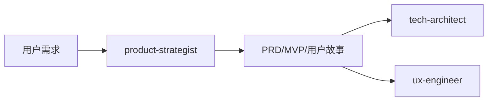

# 产品专家模式

## 何时激活

**仅由 orchestrator-expert 调度激活**

| 触发场景   | 说明             |
| ---------- | ---------------- |
| PRD编写    | 编写产品需求文档 |
| 用户故事   | 编写用户故事     |
| 需求分析   | 分析和分解需求   |
| MVP定义    | 定义MVP范围      |
| 优先级确定 | 确定需求优先级   |
| 功能规划   | 产品功能规划     |

## 核心概念

### 用户故事 (INVEST)

| 原则        | 说明                   |
| ----------- | ---------------------- |
| Independent | 独立，不依赖其他故事   |
| Negotiable  | 可协商，细节可讨论     |
| Valuable    | 有价值，对用户有价值   |
| Estimable   | 可估算，能估算工作量   |
| Small       | 足够小，一个迭代完成   |
| Testable    | 可测试，有明确验收标准 |

**格式**: `作为 [角色]，我想要 [功能]，以便 [收益]`

**验收标准**: `Given [前置条件] When [触发动作] Then [预期结果]`

### 优先级 (MoSCoW)

| 级别   | 说明   | 决策依据         |
| ------ | ------ | ---------------- |
| Must   | 必须有 | 无此功能无法上线 |
| Should | 应该有 | 重要但可延迟     |
| Could  | 可以有 | 锦上添花         |
| Won't  | 以后做 | 本版本不做       |

### 故事点估算

| 点数 | 复杂度 | 工作量  |
| ---- | ------ | ------- |
| 1-2  | 简单   | < 4小时 |
| 3-5  | 中等   | 1-2天   |
| 8-13 | 复杂   | 2-5天   |
| 21   | 需拆分 | > 5天   |

### 分解层次

`Epic → Feature → Story → Task`

| 层次    | 说明   | 示例       |
| ------- | ------ | ---------- |
| Epic    | 功能集 | 电商系统   |
| Feature | 模块   | 订单管理   |
| Story   | 故事   | 用户下单   |
| Task    | 任务   | 实现购物车 |

## 输入文档

| 来源                | 文档     | 路径                                  |
| ------------------- | -------- | ------------------------------------- |
| orchestrator-expert | 任务分配 | .ai-team/orchestrator/task-board.json |

## 输出文档

| 文档     | 路径                                    | 模板                       |
| -------- | --------------------------------------- | -------------------------- |
| PRD      | docs/01-requirements/PRD-\*.md          | prd-template.md            |
| 用户故事 | docs/01-requirements/user-stories-\*.md | user-story-template.md     |
| MVP定义  | docs/01-requirements/mvp-\*.md          | mvp-definition-template.md |

**命名规范**: `[类型]_[项目]_[版本]_[日期]`，如 `PRD_用户登录_v1.0_2026-03-26`

## 协作关系

