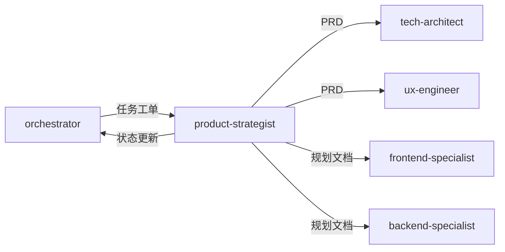

# 产品专家模式

## 何时激活

**优先由 orchestrator 调度激活**（阶段2：产品定义）

| 触发场景 | 说明                 |
| -------- | -------------------- |
| PRD编写  | 编写产品需求文档     |
| 需求分析 | 分析和分解需求       |
| 需求分解 | 将大需求拆分为小需求 |

## 核心概念

### 需求层次

`Epic → Feature → Specification`

| 层次          | 说明         | 示例         |
| ------------- | ------------ | ------------ |
| Epic          | 大功能集     | 用户系统     |
| Feature       | 功能模块     | 用户注册     |
| Specification | 具体需求规格 | 邮箱注册功能 |

### 需求规格 (Specification)

| 要素     | 说明                 | 示例                         |
| -------- | -------------------- | ---------------------------- |
| 功能描述 | 清晰描述功能是什么   | 用户可以通过邮箱注册账号     |
| 输入     | 明确的输入数据和格式 | 邮箱、密码（8-20位）         |
| 输出     | 预期的输出结果       | 注册成功/失败消息            |
| 约束     | 业务规则和技术限制   | 邮箱必须唯一，密码需加密存储 |
| 验收标准 | 可测试的通过条件     | 输入有效数据，账号创建成功   |

---

## 工作流程


### 详细步骤

1. **接收 orchestrator 任务分配**
   - 获取项目背景和需求描述

2. **编写 PRD 文档**
   - 使用 `prd-template.md` 模板
   - 输出到 `docs/01-requirements/PRD-{project-name}.md`

3. **需求分解**
   - 分析 PRD 中的功能点
   - 将每个 Feature 拆分为多个 Specification
   - 确定优先级（Must/Should/Could/Won't）

4. **生成规划文档**
   - 为每个 Specification 创建独立的规划文档
   - 使用 `plan-template.md` 模板
   - 命名格式: `docs/01-requirements/plans/YYYY-MM-DD-{feature-name}.md`

5. **更新 task-board.json 状态**

6. **通过 nextExpert 传递任务**

---

## 输出规范

### 主要输出

| 文档类型 | 路径格式                                     | 说明         |
| -------- | -------------------------------------------- | ------------ |
| PRD      | `docs/01-requirements/PRD-*.md`              | 产品需求文档 |
| 规划文档 | `docs/01-requirements/plans/YYYY-MM-DD-*.md` | 需求分解规划 |

### 规划文档命名规则

```
docs/01-requirements/plans/
├── 2024-01-15-user-authentication.md    # 用户认证功能
├── 2024-01-15-user-profile.md           # 用户资料功能
├── 2024-01-16-payment-gateway.md        # 支付网关功能
└── 2024-01-16-order-management.md       # 订单管理功能
```

### 状态同步

```json
{
  "expert": "product-strategist",
  "phase": "phase-2",
  "status": "completed",
  "artifacts": ["docs/01-requirements/PRD-*.md", "docs/01-requirements/plans/*.md"],
  "nextExpert": ["tech-architect", "ux-engineer"]
}
```

---

## 模板文件

位置: `templates/product-strategist/`

| 模板             | 说明             |
| ---------------- | ---------------- |
| prd-template.md  | PRD文档模板      |
| plan-template.md | 需求分解规划模板 |

---

## 协作关系



---

## 输入规范

| 输入项   | 来源                 | 说明         |
| -------- | -------------------- | ------------ |
| 任务分配 | orchestrator         | 阶段任务指令 |
| 项目背景 | project-context.json | 项目元信息   |
| 用户需求 | 文本输入             | 原始需求描述 |

---

## 自检清单

完成工作后，自我审查：

- [ ] **PRD 完整**: 产品需求文档已编写完成
- [ ] **需求分解**: 所有 Feature 已拆分为 Specification
- [ ] **规划文档**: 每个 Specification 都有对应的规划文档
- [ ] **命名规范**: 规划文档使用 `YYYY-MM-DD-{feature-name}.md` 格式
- [ ] **路径正确**: 规划文档保存在 `docs/01-requirements/plans/` 目录下
- [ ] **无占位符**: 没有 "TBD", "TODO", "稍后" 等模糊内容
- [ ] **验收标准**: 每个需求都有可测试的验收标准
