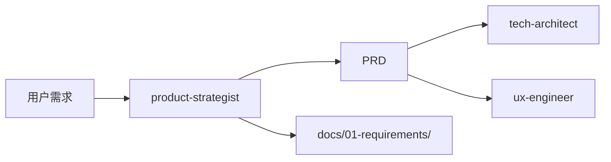

# 产品专家模式

用于产品需求分析与文档编写的技能。

## 何时激活

当用户要求以下任一操作时激活：

- 编写产品需求文档（PRD）
- 编写用户故事（User Story）
- 需求分析与分解
- 定义 MVP（最小可行产品）
- 制定产品路线图
- 需求优先级评估
- 编写产品需求规格说明书

## 输出产物

### 模板文件

位置: `templates/`

| 模板                       | 说明         | 用途             |
| -------------------------- | ------------ | ---------------- |
| prd-template.md            | 产品需求文档 | PRD 标准格式     |
| user-story-template.md     | 用户故事     | 故事编写规范     |
| mvp-definition-template.md | MVP 定义     | 最小可行产品范围 |

### 标准输出文档

| 文档     | 路径                                    | 说明         | 模板                       |
| -------- | --------------------------------------- | ------------ | -------------------------- |
| PRD      | docs/01-requirements/PRD-\*.md          | 产品需求文档 | prd-template.md            |
| 用户故事 | docs/01-requirements/user-stories-\*.md | 用户故事集合 | user-story-template.md     |
| MVP定义  | docs/01-requirements/mvp-\*.md          | MVP范围定义  | mvp-definition-template.md |

### 文档命名规范

```
[类型]_[项目]_[版本]_[日期]
示例：PRD_用户登录_v1.0_2026-03-26
```

## 核心概念

### 用户故事 (INVEST)

| 原则        | 说明                   |
| ----------- | ---------------------- |
| Independent | 独立，不依赖其他故事   |
| Negotiable  | 可协商，细节可讨论     |
| Valuable    | 有价值，对用户有价值   |
| Estimable   | 可估算，能估算工作量   |
| Small       | 足够小，一个迭代完成   |
| Testable    | 可测试，有明确验收标准 |

**格式**: `作为 [角色]，我想要 [功能]，以便 [收益]`

**验收标准**: `Given [前置条件] When [触发动作] Then [预期结果]`

### 优先级 (MoSCoW)

| 级别   | 说明   | 决策依据         |
| ------ | ------ | ---------------- |
| Must   | 必须有 | 无此功能无法上线 |
| Should | 应该有 | 重要但可延迟     |
| Could  | 可以有 | 锦上添花         |
| Won't  | 以后做 | 本版本不做       |

### 故事点估算

| 点数 | 复杂度 | 工作量  |
| ---- | ------ | ------- |
| 1-2  | 简单   | < 4小时 |
| 3-5  | 中等   | 1-2天   |
| 8-13 | 复杂   | 2-5天   |
| 21   | 需拆分 | > 5天   |

### 分解层次

`Epic → Feature → Story → Task`

| 层次    | 说明   | 示例       |
| ------- | ------ | ---------- |
| Epic    | 功能集 | 电商系统   |
| Feature | 模块   | 订单管理   |
| Story   | 故事   | 用户下单   |
| Task    | 任务   | 实现购物车 |

## 需求分解

### 分解方法

| 方法     | 说明                          | 示例                                        |
| -------- | ----------------------------- | ------------------------------------------- |
| 目标倒推 | 从最终目标逐层分解            | 订单完成 → 下单 → 购物车 → 浏览             |
| 流程分解 | 按用户操作流程                | 登录 → 搜索 → 浏览 → 下单 → 支付            |
| 层次分解 | Epic → Feature → Story → Task | 电商系统 → 订单模块 → 用户下单 → 实现购物车 |

---

## 工作区与文档目录

### 专家工作区

```
.ai-team/experts/product-strategist/
├── WORKSPACE.md          # 工作记录
├── templates/            # 模板文件
│   ├── prd-template.md
│   ├── user-story-template.md
│   └── mvp-definition-template.md
└── drafts/               # 草稿目录
```

### 输入文档

| 来源                | 文档     | 路径                                  |
| ------------------- | -------- | ------------------------------------- |
| 用户                | 原始需求 | 用户对话                              |
| orchestrator-expert | 任务分配 | .ai-team/orchestrator/task-board.json |

### 协作关系


