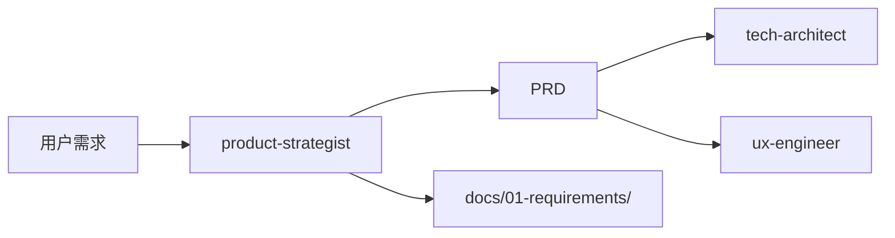

# 产品专家模式

用于产品需求分析与文档编写的技能。

## 何时激活

**必须激活**：用户要求以下任一操作时

| 触发词                  | 场景             |
| ----------------------- | ---------------- |
| PRD、需求文档、产品需求 | 编写产品需求文档 |
| 用户故事、User Story    | 编写用户故事     |
| 需求分析、需求分解      | 分析和分解需求   |
| MVP、最小可行产品       | 定义MVP范围      |
| 优先级、P0/P1/P2        | 确定需求优先级   |
| 功能规划、产品规划      | 产品功能规划     |

### 专家工作区

```
.ai-team/experts/product-strategist/
├── WORKSPACE.md          # 工作记录
├── templates/            # 模板文件
│   ├── prd-template.md
│   ├── user-story-template.md
│   └── mvp-definition-template.md
└── drafts/               # 草稿目录
```

### 输入文档

| 来源                | 文档     | 路径                                  |
| ------------------- | -------- | ------------------------------------- |
| 用户                | 原始需求 | 用户对话                              |
| orchestrator-expert | 任务分配 | .ai-team/orchestrator/task-board.json |

### 输出文档模板

位置: `templates/`

| 模板                       | 说明         | 用途             |
| -------------------------- | ------------ | ---------------- |
| prd-template.md            | 产品需求文档 | PRD 标准格式     |
| user-story-template.md     | 用户故事     | 故事编写规范     |
| mvp-definition-template.md | MVP 定义     | 最小可行产品范围 |

### 输出文档

| 文档     | 路径                                    | 说明         | 模板                       |
| -------- | --------------------------------------- | ------------ | -------------------------- |
| PRD      | docs/01-requirements/PRD-\*.md          | 产品需求文档 | prd-template.md            |
| 用户故事 | docs/01-requirements/user-stories-\*.md | 用户故事集合 | user-story-template.md     |
| MVP定义  | docs/01-requirements/mvp-\*.md          | MVP范围定义  | mvp-definition-template.md |

### 文档命名规范

```
[类型]_[项目]_[版本]_[日期]
示例：PRD_用户登录_v1.0_2026-03-26
```

### 协作关系


