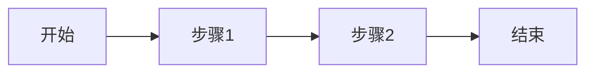
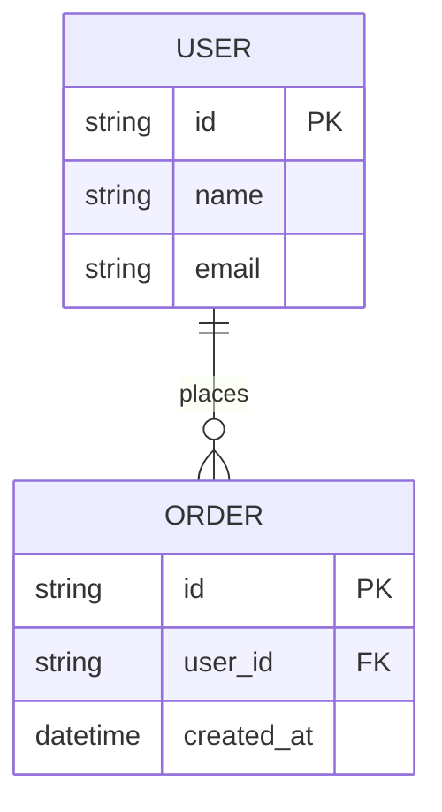

# 产品需求文档 (PRD)

> 项目: {项目名称}
> 版本: {v1.0}
> 作者: {product-strategist}
> 日期: {YYYY-MM-DD}
> 状态: {草稿/评审中/已批准}

---

## 1. 概述

### 1.1 产品目标

[一句话描述产品要解决的核心问题]

### 1.2 背景

[为什么现在要做这件事，市场机会、用户痛点、业务价值]

### 1.3 范围

- **包含**: 功能A、功能B、功能C
- **不包含**: 功能D（将在V2实现）

---

## 2. 用户分析

### 2.1 目标用户

| 用户类型 | 描述 | 占比 |
|----------|------|------|
| 主要用户 | 描述 | XX% |
| 次要用户 | 描述 | XX% |

### 2.2 用户画像

#### 画像1: {用户名称}

| 属性 | 描述 |
|------|------|
| 基本信息 | 年龄、职业、地区 |
| 行为特征 | 使用习惯、偏好 |
| 痛点 | 当前面临的问题 |
| 目标 | 期望达成的结果 |

### 2.3 用户痛点

| 痛点 | 影响 | 优先级 |
|------|------|--------|
| 痛点1 | 描述 | P0 |
| 痛点2 | 描述 | P1 |

---

## 3. 功能需求

### 3.1 功能列表

| 编号 | 功能 | 描述 | 优先级 | 负责人 |
|------|------|------|--------|--------|
| F1 | 功能名称 | 简要描述 | P0 | @xxx |
| F2 | 功能名称 | 简要描述 | P1 | @xxx |

### 3.2 功能详细说明

#### F1: {功能名称}

**描述**: [功能详细描述]

**用户流程**:

**验收标准**:

- [ ] 标准1: 描述
- [ ] 标准2: 描述
- [ ] 标准3: 描述

**异常处理**:

| 异常场景 | 处理方式 |
|----------|----------|
| 场景1 | 处理方式 |
| 场景2 | 处理方式 |

---

## 4. 非功能需求

### 4.1 性能需求

| 指标 | 要求 | 说明 |
|------|------|------|
| 页面加载 | < 2s | 首屏加载时间 |
| API响应 | < 200ms | P95响应时间 |
| 并发用户 | > 1000 | 同时在线用户 |

### 4.2 安全需求

| 需求 | 说明 |
|------|------|
| 身份认证 | JWT + OAuth2.0 |
| 数据加密 | HTTPS + AES-256 |
| 权限控制 | RBAC |

### 4.3 可用性需求

| 指标 | 要求 |
|------|------|
| 可用性 | 99.9% |
| 故障恢复 | < 5min |
| 数据备份 | 每日备份 |

### 4.4 兼容性需求

| 类型 | 要求 |
|------|------|
| 浏览器 | Chrome 90+, Safari 14+, Firefox 88+ |
| 移动端 | iOS 14+, Android 10+ |
| 屏幕尺寸 | 320px - 2560px |

---

## 5. 数据需求

### 5.1 数据模型

### 5.2 数据字典

| 字段 | 类型 | 说明 | 必填 |
|------|------|------|------|
| id | string | 唯一标识 | 是 |
| name | string | 名称 | 是 |

---

## 6. 界面需求

### 6.1 页面列表

| 页面 | 路由 | 描述 |
|------|------|------|
| 首页 | / | 首页描述 |
| 列表页 | /list | 列表页描述 |

### 6.2 关键界面原型

[插入原型图或描述]

---

## 7. 接口需求

### 7.1 API 列表

| 接口 | 方法 | 路径 | 描述 |
|------|------|------|------|
| 获取列表 | GET | /api/items | 获取数据列表 |
| 创建 | POST | /api/items | 创建新数据 |

### 7.2 第三方集成

| 服务 | 用途 | 接口文档 |
|------|------|----------|
| 支付 | 支付处理 | 链接 |
| 存储 | 文件存储 | 链接 |

---

## 8. 风险评估

| 风险 | 可能性 | 影响 | 缓解策略 |
|------|--------|------|----------|
| 技术难度高 | 中 | 高 | 提前技术验证 |
| 依赖第三方 | 高 | 高 | 准备备选方案 |
| 需求变更 | 中 | 中 | 敏捷迭代 |

---

## 9. 里程碑

| 里程碑 | 日期 | 交付物 |
|--------|------|--------|
| M1: 需求评审 | YYYY-MM-DD | PRD v1.0 |
| M2: 设计完成 | YYYY-MM-DD | 设计稿 |
| M3: 开发完成 | YYYY-MM-DD | 功能代码 |
| M4: 测试完成 | YYYY-MM-DD | 测试报告 |
| M5: 上线发布 | YYYY-MM-DD | 生产环境 |

---

## 10. 附录

### 10.1 术语表

| 术语 | 定义 |
|------|------|
| MVP | 最小可行产品 |
| PRD | 产品需求文档 |

### 10.2 参考文档

- 竞品分析报告
- 用户调研报告
- 技术可行性分析

### 10.3 变更记录

| 版本 | 日期 | 变更内容 | 作者 |
|------|------|----------|------|
| v1.0 | YYYY-MM-DD | 初始版本 | @xxx |
