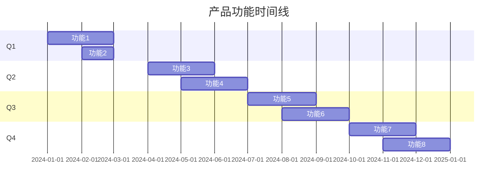

# 产品路线图

> 产品: {产品名称}
> 版本: {v1.0}
> 规划周期: {年份}
> 更新日期: {YYYY-MM-DD}

---

## 产品愿景

[一句话描述产品的长期目标]

---

## 年度目标

| 目标 | 关键结果 | 负责人 |
|------|----------|--------|
| 目标1 | KR1: 具体指标 | @xxx |
| 目标2 | KR2: 具体指标 | @xxx |

---

## 季度规划

### Q1 - {主题}

**核心目标**: [本季度核心目标]

| 功能 | 优先级 | 状态 | 负责人 | 预计上线 |
|------|--------|------|--------|----------|
| 功能1 | P0 | 规划中 | @xxx | YYYY-MM |
| 功能2 | P1 | 规划中 | @xxx | YYYY-MM |

**里程碑**:

- [ ] M1: 里程碑1 (YYYY-MM-DD)
- [ ] M2: 里程碑2 (YYYY-MM-DD)

---

### Q2 - {主题}

**核心目标**: [本季度核心目标]

| 功能 | 优先级 | 状态 | 负责人 | 预计上线 |
|------|--------|------|--------|----------|
| 功能3 | P0 | 规划中 | @xxx | YYYY-MM |
| 功能4 | P1 | 规划中 | @xxx | YYYY-MM |

**里程碑**:

- [ ] M1: 里程碑1 (YYYY-MM-DD)
- [ ] M2: 里程碑2 (YYYY-MM-DD)

---

### Q3 - {主题}

**核心目标**: [本季度核心目标]

| 功能 | 优先级 | 状态 | 负责人 | 预计上线 |
|------|--------|------|--------|----------|
| 功能5 | P0 | 规划中 | @xxx | YYYY-MM |
| 功能6 | P1 | 规划中 | @xxx | YYYY-MM |

**里程碑**:

- [ ] M1: 里程碑1 (YYYY-MM-DD)
- [ ] M2: 里程碑2 (YYYY-MM-DD)

---

### Q4 - {主题}

**核心目标**: [本季度核心目标]

| 功能 | 优先级 | 状态 | 负责人 | 预计上线 |
|------|--------|------|--------|----------|
| 功能7 | P0 | 规划中 | @xxx | YYYY-MM |
| 功能8 | P1 | 规划中 | @xxx | YYYY-MM |

**里程碑**:

- [ ] M1: 里程碑1 (YYYY-MM-DD)
- [ ] M2: 里程碑2 (YYYY-MM-DD)

---

## 功能路线图

---

## 版本规划

| 版本 | 发布日期 | 核心功能 | 目标用户 |
|------|----------|----------|----------|
| v1.0 | YYYY-MM | MVP核心功能 | 种子用户 |
| v1.5 | YYYY-MM | 功能增强 | 早期用户 |
| v2.0 | YYYY-MM | 重大更新 | 全量用户 |

---

## 资源需求

### 团队配置

| 角色 | 人数 | 职责 |
|------|------|------|
| 产品经理 | X | 产品规划、需求管理 |
| 设计师 | X | UI/UX设计 |
| 前端开发 | X | 前端实现 |
| 后端开发 | X | 后端实现 |
| 测试工程师 | X | 质量保障 |

### 技术依赖

| 依赖 | 用途 | 状态 |
|------|------|------|
| 技术组件1 | 描述 | 已就绪 |
| 技术组件2 | 描述 | 待准备 |

---

## 风险评估

| 风险 | 可能性 | 影响 | 缓解策略 |
|------|--------|------|----------|
| 技术风险 | 中 | 高 | 提前技术预研 |
| 资源风险 | 低 | 高 | 储备人力 |
| 市场风险 | 中 | 中 | 持续市场调研 |

---

## 成功指标

| 指标 | 当前值 | 目标值 | 衡量周期 |
|------|--------|--------|----------|
| 日活用户 | X | Y | 月度 |
| 留存率 | X% | Y% | 月度 |
| 收入 | ¥X | ¥Y | 季度 |
| NPS | X | Y | 季度 |

---

## 变更记录

| 版本 | 日期 | 变更内容 | 作者 |
|------|------|----------|------|
| v1.0 | YYYY-MM-DD | 初始版本 | @xxx |
