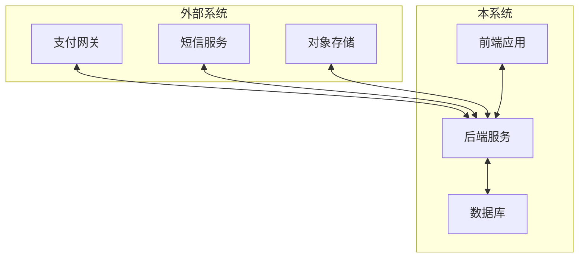
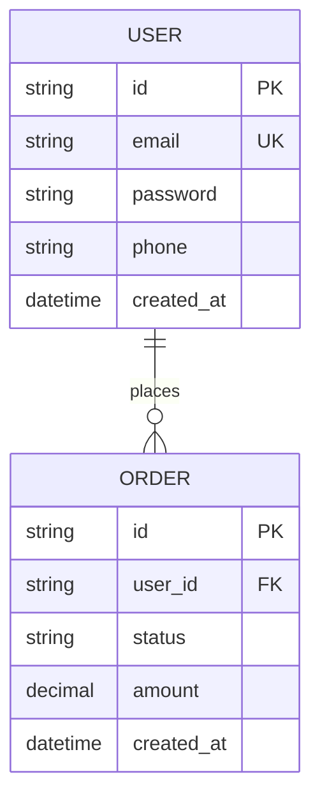
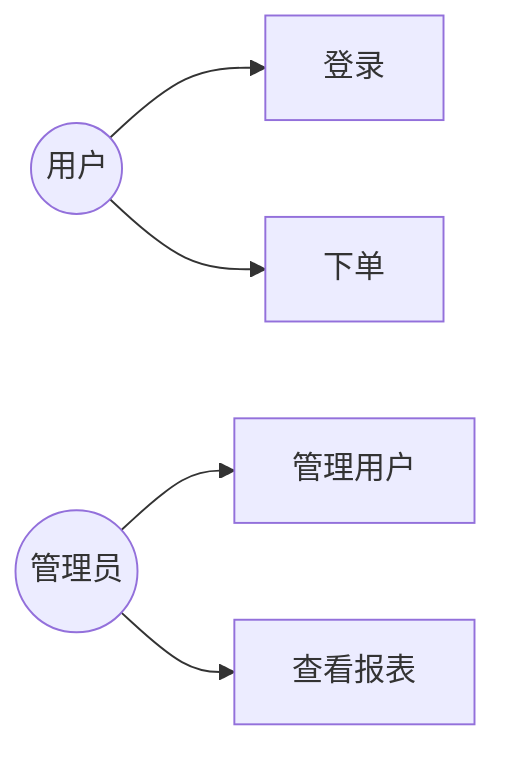
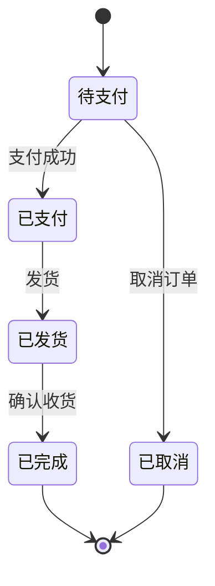

# 软件需求规格说明书 (SRS)

> 项目: {项目名称}
> 文档编号: {SRS-YYYY-XXX}
> 版本: {v1.0}
> 状态: {草稿/评审中/已批准}
> 编写日期: {YYYY-MM-DD}

---

## 文档修订历史

| 版本 | 日期 | 修订内容 | 作者 | 审核人 |
|------|------|----------|------|--------|
| v1.0 | YYYY-MM-DD | 初始版本 | @xxx | @xxx |

---

## 1. 引言

### 1.1 目的

[说明本文档的目的，预期的读者范围]

### 1.2 范围

| 项目 | 说明 |
|------|------|
| 项目名称 | {项目名称} |
| 产品范围 | [描述产品包含的功能范围] |
| 不包含 | [明确排除的功能] |

### 1.3 定义与缩略语

| 术语 | 定义 |
|------|------|
| API | Application Programming Interface |
| MVP | Minimum Viable Product |

### 1.4 参考资料

| 文档 | 来源 | 链接 |
|------|------|------|
| PRD | 产品部门 | [链接] |
| 技术方案 | 技术部门 | [链接] |

---

## 2. 总体描述

### 2.1 产品视角

#### 2.1.1 系统环境

#### 2.1.2 用户特征

| 用户类型 | 描述 | 技术水平 | 使用频率 |
|----------|------|----------|----------|
| 管理员 | 系统管理人员 | 高 | 每日 |
| 普通用户 | 终端用户 | 中 | 每日 |
| 访客 | 未登录用户 | 低 | 偶尔 |

### 2.2 功能概述

| 功能模块 | 描述 | 优先级 |
|----------|------|--------|
| 用户管理 | 用户注册、登录、权限管理 | P0 |
| 核心业务 | [核心业务功能描述] | P0 |
| 数据统计 | 数据分析与报表 | P1 |

### 2.3 用户特征

| 特征 | 说明 |
|------|------|
| 目标用户群 | [用户群体描述] |
| 用户规模 | 预计用户数量 |
| 使用场景 | [典型使用场景] |

### 2.4 约束条件

| 约束类型 | 说明 |
|----------|------|
| 技术约束 | 技术栈限制、平台要求 |
| 业务约束 | 业务规则、合规要求 |
| 时间约束 | 交付时间节点 |
| 资源约束 | 人力、预算限制 |

### 2.5 假设与依赖

| 类型 | 说明 |
|------|------|
| 假设 | [项目假设条件] |
| 依赖 | [外部依赖项] |

---

## 3. 功能需求

### 3.1 用户管理模块

#### 3.1.1 用户注册 (FR-001)

| 属性 | 内容 |
|------|------|
| 需求编号 | FR-001 |
| 需求名称 | 用户注册 |
| 优先级 | P0 |
| 来源 | 业务需求 |

**功能描述**:

用户可以通过邮箱或手机号注册账号。

**输入**:

| 字段 | 类型 | 必填 | 验证规则 |
|------|------|------|----------|
| email | string | 是 | 邮箱格式 |
| password | string | 是 | 8-20位，含大小写和数字 |
| phone | string | 否 | 手机号格式 |

**处理流程**:

1. 用户填写注册信息
2. 系统验证输入格式
3. 系统检查账号是否已存在
4. 系统发送验证码
5. 用户输入验证码
6. 系统创建账号

**输出**:

| 字段 | 类型 | 说明 |
|------|------|------|
| success | boolean | 是否成功 |
| userId | string | 用户ID |
| message | string | 提示信息 |

**异常处理**:

| 异常 | 处理方式 |
|------|----------|
| 邮箱已存在 | 提示"邮箱已被注册" |
| 验证码错误 | 提示"验证码错误，请重试" |

---

#### 3.1.2 用户登录 (FR-002)

| 属性 | 内容 |
|------|------|
| 需求编号 | FR-002 |
| 需求名称 | 用户登录 |
| 优先级 | P0 |

**功能描述**:

已注册用户可以通过账号密码登录系统。

**输入**:

| 字段 | 类型 | 必填 | 说明 |
|------|------|------|------|
| account | string | 是 | 邮箱或手机号 |
| password | string | 是 | 用户密码 |

**处理流程**:

1. 用户输入账号密码
2. 系统验证账号存在性
3. 系统验证密码正确性
4. 系统生成Token
5. 返回登录结果

**输出**:

| 字段 | 类型 | 说明 |
|------|------|------|
| token | string | JWT Token |
| refreshToken | string | 刷新Token |
| expiresIn | number | 过期时间(秒) |

---

### 3.2 核心业务模块

#### 3.2.1 {功能名称} (FR-XXX)

| 属性 | 内容 |
|------|------|
| 需求编号 | FR-XXX |
| 需求名称 | {功能名称} |
| 优先级 | P0/P1/P2 |

**功能描述**:

[功能详细描述]

**输入**:

| 字段 | 类型 | 必填 | 验证规则 |
|------|------|------|----------|
| field1 | type | 是/否 | 规则 |

**处理流程**:

1. 步骤1
2. 步骤2
3. 步骤3

**输出**:

| 字段 | 类型 | 说明 |
|------|------|------|
| field | type | 说明 |

**异常处理**:

| 异常 | 处理方式 |
|------|----------|
| 异常1 | 处理方式 |

---

## 4. 非功能需求

### 4.1 性能需求

| 指标 | 要求 | 说明 |
|------|------|------|
| 响应时间 | < 200ms | API P95响应时间 |
| 并发用户 | > 1000 | 同时在线用户数 |
| 吞吐量 | > 100 TPS | 每秒事务数 |
| 页面加载 | < 2s | 首屏加载时间 |

### 4.2 安全需求

| 需求 | 说明 |
|------|------|
| 身份认证 | JWT Token认证 |
| 权限控制 | RBAC权限模型 |
| 数据加密 | HTTPS + AES-256 |
| 密码存储 | bcrypt加密 |
| SQL注入防护 | 参数化查询 |
| XSS防护 | 输入过滤 + CSP |

### 4.3 可用性需求

| 指标 | 要求 |
|------|------|
| 系统可用性 | ≥ 99.9% |
| 故障恢复时间 | < 5分钟 |
| 数据备份 | 每日备份 |

### 4.4 兼容性需求

| 类型 | 要求 |
|------|------|
| 浏览器 | Chrome 90+, Safari 14+, Firefox 88+ |
| 移动端 | iOS 14+, Android 10+ |
| 屏幕尺寸 | 320px - 2560px |

### 4.5 可维护性需求

| 需求 | 说明 |
|------|------|
| 代码规范 | ESLint + Prettier |
| 测试覆盖率 | ≥ 80% |
| 文档完整性 | API文档、部署文档 |

### 4.6 可扩展性需求

| 需求 | 说明 |
|------|------|
| 架构设计 | 微服务架构，支持水平扩展 |
| 数据库 | 支持读写分离 |
| 缓存 | Redis缓存层 |

---

## 5. 接口需求

### 5.1 用户接口

| 接口 | 方法 | 路径 | 说明 |
|------|------|------|------|
| 用户注册 | POST | /api/auth/register | 注册新用户 |
| 用户登录 | POST | /api/auth/login | 用户登录 |
| 获取用户信息 | GET | /api/users/:id | 获取用户详情 |

### 5.2 外部接口

| 系统 | 接口 | 用途 |
|------|------|------|
| 支付网关 | /payment/* | 支付处理 |
| 短信服务 | /sms/* | 发送验证码 |
| 对象存储 | /storage/* | 文件上传 |

---

## 6. 数据需求

### 6.1 数据模型

### 6.2 数据字典

| 表名 | 字段 | 类型 | 说明 |
|------|------|------|------|
| users | id | UUID | 用户唯一标识 |
| users | email | VARCHAR(255) | 用户邮箱 |
| users | password | VARCHAR(255) | 加密密码 |

### 6.3 数据迁移

| 版本 | 迁移脚本 | 说明 |
|------|----------|------|
| v1.0 | 001_init.sql | 初始化表结构 |

---

## 7. 质量属性

### 7.1 可靠性

| 属性 | 要求 |
|------|------|
| MTBF | > 1000小时 |
| MTTR | < 30分钟 |
| 数据一致性 | 强一致性 |

### 7.2 可测试性

| 要求 | 说明 |
|------|------|
| 单元测试 | 覆盖率 ≥ 80% |
| 集成测试 | 覆盖核心流程 |
| E2E测试 | 覆盖关键场景 |

---

## 8. 附录

### 8.1 用例图

### 8.2 状态转换图

### 8.3 术语表

| 术语 | 定义 |
|------|------|
| JWT | JSON Web Token，用于身份认证 |
| RBAC | Role-Based Access Control，基于角色的访问控制 |

---

## 审批签字

| 角色 | 姓名 | 签字 | 日期 |
|------|------|------|------|
| 产品经理 | | | |
| 技术负责人 | | | |
| 项目经理 | | | |
