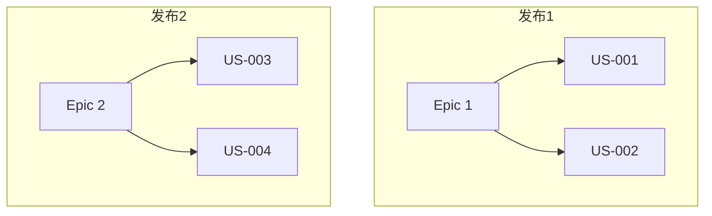

# 用户故事

> 项目: {项目名称}
> 迭代: {迭代编号}
> 创建日期: {YYYY-MM-DD}

---

## 用户故事格式

```
作为 <用户角色>
我想要 <完成的目标>
以便于 <获得的价值>
```

---

## 故事列表

### US-001: {故事标题}

| 属性 | 内容 |
|------|------|
| 编号 | US-001 |
| 作为 | 用户角色 |
| 我想要 | 完成的目标 |
| 以便于 | 获得的价值 |
| 优先级 | P0/P1/P2/P3 |
| 故事点 | X |
| Epic | 关联Epic |

**验收标准**:

- [ ] Given: 前置条件
- [ ] When: 触发动作
- [ ] Then: 预期结果

**备注**: 

---

### US-002: {故事标题}

| 属性 | 内容 |
|------|------|
| 编号 | US-002 |
| 作为 | 用户角色 |
| 我想要 | 完成的目标 |
| 以便于 | 获得的价值 |
| 优先级 | P1 |
| 故事点 | X |

**验收标准**:

- [ ] Given: 前置条件
- [ ] When: 触发动作
- [ ] Then: 预期结果

---

## 故事映射



---

## 优先级矩阵

| 优先级 | 描述 | 故事数量 |
|--------|------|----------|
| P0 | 必须完成 | X |
| P1 | 应该完成 | X |
| P2 | 可以完成 | X |
| P3 | 以后完成 | X |

---

## INVEST 检查清单

每个用户故事应满足 INVEST 原则:

| 原则 | 说明 | 检查 |
|------|------|------|
| I - Independent | 独立，不依赖其他故事 | [ ] |
| N - Negotiable | 可协商，细节可讨论 | [ ] |
| V - Valuable | 有价值，对用户有价值 | [ ] |
| E - Estimable | 可估算，能估算工作量 | [ ] |
| S - Small | 足够小，一个迭代完成 | [ ] |
| T - Testable | 可测试，有明确验收标准 | [ ] |

---

## 附录

### 故事点估算参考

| 故事点 | 复杂度 | 工作量 |
|--------|--------|--------|
| 1 | 简单 | < 2小时 |
| 2 | 简单 | 2-4小时 |
| 3 | 中等 | 4-8小时 |
| 5 | 中等 | 1-2天 |
| 8 | 复杂 | 2-3天 |
| 13 | 复杂 | 3-5天 |
| 21 | 需拆分 | > 5天 |

### 变更记录

| 日期 | 故事 | 变更内容 |
|------|------|----------|
| YYYY-MM-DD | US-001 | 新增 |
